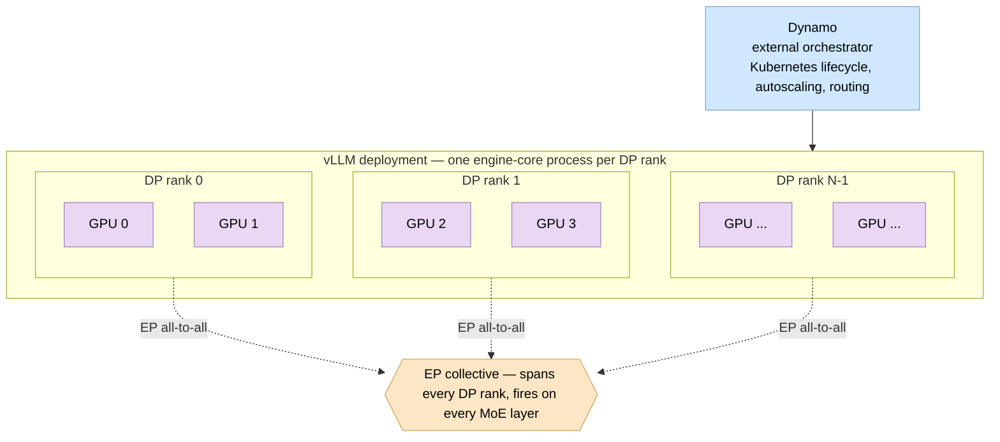
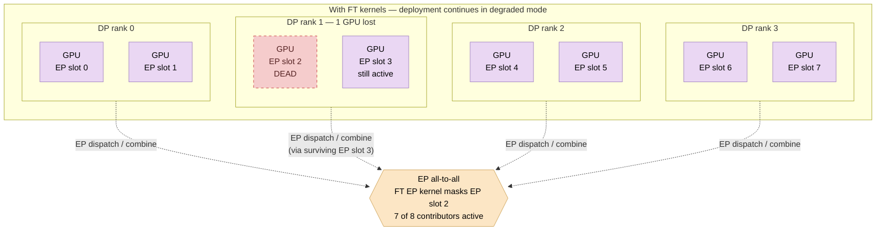
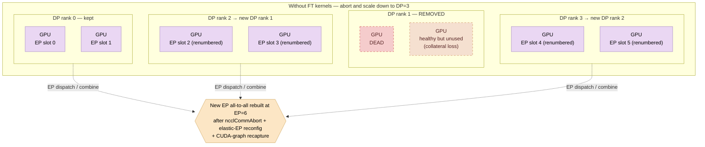

# Fault tolerance in vLLM — what happens when a GPU fails

## Table of contents

1. [TL;DR](#tldr)
2. [The deployment picture](#the-deployment-picture)
   1. [Parallelism primer](#parallelism-primer)
   2. [The vLLM deployment shape](#the-vllm-deployment-shape)
   3. [The EP collective](#the-ep-collective)
3. [The five pieces and what each protects](#the-five-pieces-and-what-each-protects)
   1. [Fault-tolerant NCCL (FT NCCL)](#fault-tolerant-nccl-ft-nccl)
   2. [Fault-tolerant EP kernels (DeepEP / NIXL EP)](#fault-tolerant-ep-kernels-deepep--nixl-ep)
   3. [Fault tolerance framework](#fault-tolerance-framework)
   4. [Elastic EP with Dynamo as external orchestrator](#elastic-ep-with-dynamo-as-external-orchestrator)
   5. [Fault-tolerant EP recovery (FT-EP)](#fault-tolerant-ep-recovery-ft-ep)
4. [What happens when a rank fails — three scenarios](#what-happens-when-a-rank-fails--three-scenarios)
   1. [Best case — a single GPU dies inside one DP rank's TP group](#best-case--a-single-gpu-dies-inside-one-dp-ranks-tp-group)
   2. [Middle case — a whole DP rank's process dies](#middle-case--a-whole-dp-ranks-process-dies)
   3. [Worst case — correlated failure](#worst-case--correlated-failure)
5. [TP=2, DP=4, EP=8 — same GPU failure, two outcomes](#tp2-dp4-ep8--same-gpu-failure-two-outcomes)
6. [Step-by-step: a single GPU hangs](#step-by-step-a-single-gpu-hangs)
7. [No-rebuild recovery: when every collective is fault-tolerant](#no-rebuild-recovery-when-every-collective-is-fault-tolerant)
8. [Recovery flow — getting back to full capacity](#recovery-flow--getting-back-to-full-capacity)
9. [Performance cost — the price of always-on fault tolerance](#performance-cost--the-price-of-always-on-fault-tolerance)
10. [Open questions](#open-questions)

## TL;DR

A production vLLM deployment running a large Mixture-of-Experts (MoE) model at scale has to assume that GPU failures will happen. Today, a single failed GPU is enough to bring the whole deployment down. Once the five fault-tolerance pieces described below ship, the same failure becomes invisible to end users: inference continues in a degraded but correct mode, and the external orchestrator (Dynamo) decides whether and when to clean up. This document walks through what those five pieces are, what failure each protects against, what the end state looks like in three concrete failure scenarios, and what the residual costs and open questions are.

## The deployment picture

A production vLLM MoE deployment is sharded along three axes at once: DP, TP, and EP. This section defines the axes, then shows how they compose into the concrete topology this document reasons about.

### Parallelism primer


How to read the figure: each gray rectangle is one batch of input data, and the dark-and-light pixel pattern inside it represents the individual data samples in that batch. Each model box above the data shows the model's storage layout across the available GPUs. The four panels show four different ways of distributing a single forward pass.

In **Single GPU**, one full data batch and one complete copy of the model live on one GPU; that GPU processes everything end-to-end.

In **Data Parallelism (DP)** the gray batch is sliced into colored pieces (blue, orange, green, red), and each GPU gets a different slice. Every GPU still holds a complete copy of the model, but each only processes its slice of the data — replicas in parallel.

In **Tensor Parallelism (TP)** every GPU receives the *same* full gray batch. What is split here is the model itself, at the layer level — the colored vertical stripes inside the model box represent different shards of each layer's weights living on different GPUs. Because each GPU only owns a fraction of a layer, all GPUs must process the same input batch simultaneously and exchange intermediate results through synchronized collective communication on every layer.

In **Pipeline Parallelism (PP)** the model is split by *layer ranges* — one range per GPU, color-coded — and a single gray batch enters the GPU that holds the first range, gets partially processed, then hands its intermediate activations to the GPU holding the next range, and so on down the pipeline. vLLM supports PP, but it is not central to this document.

### The vLLM deployment shape



Mapping the primer figure onto the diagram above: each box is one DP rank running one engine-core process, and the GPUs inside that box *are* one TP group. Attention's `o_proj` all-reduce, MLP's `down_proj` all-reduce, and similar dense-layer collectives all live on that TP group.

Above vLLM, **Dynamo** is NVIDIA's external orchestrator. It owns the Kubernetes lifecycle, decides when worker pods come and go, routes requests across the deployment, and drives elastic scale-up and scale-down decisions.

### The EP collective

**Expert Parallelism (EP)** is the third axis and is MoE-specific: the expert sub-modules inside each MoE layer are distributed across GPUs, the EP group spans every DP rank, and when an MoE layer fires every DP rank must call into the EP all-to-all on the same iteration.

The figure below makes this concrete. Each device holds a subset of experts (FFN₁ on device 1, FFN_E on device E). An **All-to-All Dispatch** routes each token to the device that owns the expert(s) it gated to, the expert FFN runs locally on that device, and an **All-to-All Combine** returns the results to the originating device. The red box marks the per-layer collective pair the rest of this document calls "the EP all-to-all."


This cross-DP-rank shape is exactly what makes fault tolerance especially important for wide-EP deployments. Because every DP rank participates in every EP all-to-all, a single GPU failure anywhere in the EP group stalls the collective on *every* DP rank — not just the rank that owns the dead GPU. The wider EP is (i.e., the more GPUs participate in each dispatch / combine), the larger the blast radius of a single failure under standard collectives, and the more value FT EP kernels add by masking the dead participant rather than deadlocking the rest.

## The five pieces and what each protects

### Fault-tolerant NCCL (FT NCCL)

NCCL is NVIDIA's library for GPU-to-GPU collective communication — it is what every TP all-reduce, every DP wave-sync, and every non-MoE collective in vLLM is actually built on. Standard NCCL has one operational rule: every participating GPU must show up to every collective. If one GPU silently dies mid-call, the others wait for it forever; eventually NCCL's built-in safety timer gives up, crashes the process, and the whole deployment goes down with it.

**FT NCCL** ([`tstamler/nccl` MR !2](https://gitlab-master.nvidia.com/tstamler/nccl/-/merge_requests/2), shipped as the `FTProcessGroup` PyTorch backend in [`contrib/fault_tolerant_collectives/`](https://gitlab-master.nvidia.com/tstamler/nccl/-/tree/158f9036a6995d275549981dd9791b172d1e664f/contrib/fault_tolerant_collectives)) replaces that rule with a per-collective timeout enforced on the GPU itself. Every rank polls its peers; any peer that doesn't respond within the timeout is recorded as missing in a `result_mask`, and the call returns to the survivors with whatever data did arrive. Subsequent collectives automatically skip those masked peers until the caller explicitly clears the mask.

The current FT NCCL implementation covers `AllReduce` and `AllGather`. `AllToAll` — the collective MoE needs — is intentionally out of scope; that one is handled by the FT EP kernels in the next section.

**Liveness, not correctness.** This caveat applies to FT NCCL *and* to the FT EP kernels described next; stating it once here. "The call returns cleanly" means the surviving ranks unblock and can run more code — it does **not** mean the value they read is right. The masked collective's result is missing the dead peer's contribution, so any computation that flowed through that step is mathematically wrong. vLLM has to mark every in-flight request whose forward pass went through that broken collective as failed and return an error response for it. The scope depends on which collective broke:

- A **TP all-reduce** (e.g., inside attention's `o_proj`) only invalidates the in-flight requests on that one DP rank.
- A **DP-spanning collective** (the wave-sync all-reduce, or the EP all-to-all from the next section) invalidates *every* in-flight request across the entire deployment for that step.

In either case, the FT framework's pause-and-retry path (described two sections below) is what cleans the engine up so subsequent requests can succeed. Without FT NCCL the deployment would have died on the failed collective and there would be no requests to mark, failed or otherwise — FT NCCL is the prerequisite that makes every later piece in this document possible.

**For the rest of this document we assume FT NCCL is applied to every NCCL collective in the deployment (every TP all-reduce, every DP all-reduce).** The steady-state performance cost of this assumption is discussed in the "Performance cost" section near the end.

### Fault-tolerant EP kernels (DeepEP / NIXL EP)

NCCL does not provide a fault-tolerant `AllToAll`, but `AllToAll` is exactly what MoE dispatch and combine use. Two kernel families fill that gap.

**NIXL EP** is shipped as the `nixl_ep` example in [`ai-dynamo/nixl`](https://github.com/ai-dynamo/nixl). It is built on NVIDIA's NIXL RDMA library and exposes `connect_ranks` / `disconnect_ranks` so the kernel can add or remove peers without rebuilding the whole communicator. It was introduced in [PR #1043](https://github.com/ai-dynamo/nixl/pull/1043); configurable per-collective GPU timeouts followed in [PR #1520](https://github.com/ai-dynamo/nixl/pull/1520), and CUDA-graph preservation across scale events in [PR #1584](https://github.com/ai-dynamo/nixl/pull/1584). The vLLM-side integration lives in [`vllm#29630`](https://github.com/vllm-project/vllm/pull/29630).

**DeepEP** is Meta's expert-parallel kernel with an analogous FT mode. vLLM opts into either kernel via the `--all2all-backend` flag (`deepep_low_latency` or `nixl_ep`).

Mechanically these kernels do the same thing FT NCCL does, applied to `AllToAll`: when a peer doesn't respond within the GPU-side timeout, the dispatch / combine **skips** that peer — it stops sending to it on the dispatch side and stops waiting for it on the combine side — and returns to the survivors. The MoE all-to-all no longer deadlocks. Tokens the router picked to go to experts on the skipped peer get no expert output for that step; tokens the skipped peer would have routed elsewhere are missing from the survivors' combine input.

The liveness-not-correctness caveat from FT NCCL applies here too. One additional failure mode is worth flagging on top of it: if the skipped peer owned the *only* physical replica of some logical expert, the model has lost real capacity for any token gated to that expert, even on the steps *after* the failed one — until expert reassignment (handled in the FT-EP section below) or a replacement rank brings that capacity back.

### Fault tolerance framework

FT NCCL and FT EP kernels keep collectives alive across failures, but they do not by themselves prevent a vLLM engine core process from exiting on the first uncaught Python exception, and they do not give an orchestrator a way to *observe* what is happening at the engine level. The **fault tolerance framework** is the control plane that fills both gaps. It is authored by Yuchu Fang and split across [PR #34833](https://github.com/vllm-project/vllm/pull/34833) (fault reporting), [PR #38534](https://github.com/vllm-project/vllm/pull/38534) (pause-on-error), [PR #40468](https://github.com/vllm-project/vllm/pull/40468) (cleanup-and-retry), with a test simplification in [fork PR #200](https://github.com/fangyuchu/vllm/pull/200).

The framework introduces three coordinated processes — `ClientSentinel`, `EngineCoreSentinel`, and `WorkerSentinel` — that catch engine-core exceptions and hold the engine in a paused state for a configurable recovery window (`engine_recovery_timeout_sec`, defined at `vllm/config/fault_tolerance.py` on the [`feature/fault-report`](https://github.com/fangyuchu/vllm/blob/feature/fault-report/vllm/config/fault_tolerance.py) branch) rather than letting the process die. Per-rank health is exposed through both an HTTP endpoint (`/fault_tolerance/status`) and a ZMQ publish socket, and the framework accepts `pause` / `retry` commands via `/fault_tolerance/apply`.

The retry path rebuilds the DP `cpu_group`, resets the EP all-to-all buffer mask, preempts in-flight requests back into the waiting queue, and lets retried requests reuse already-computed KV via prefix matching.

With the framework in place, Dynamo (or a human operator) can observe which engine cores are healthy / paused / dead and can issue targeted recovery commands. Without it, FT NCCL and FT EP kernels keep collectives alive but the engine itself still exits on the first uncaught error, and there is no way for the orchestrator to know the deployment is in trouble before requests start failing.

### Elastic EP with Dynamo as external orchestrator

The pieces so far react to a failure (mask it, pause the engine, report status). The next piece is what lets the deployment actually change shape in response. **Elastic EP** ([RFC #42515](https://github.com/vllm-project/vllm/issues/42515), implementation at [PR #43202](https://github.com/vllm-project/vllm/pull/43202)) lets a deployment add or remove DP ranks at runtime without restarting from scratch. The new piece compared to vLLM's existing elastic-EP path is *who drives the scaling*. Until now, vLLM owned scale-up and scale-down through Ray actors that vLLM itself created and destroyed. In external-LB mode each DP rank is an independent API-server process, and an external orchestrator — Dynamo — decides when to launch new ranks, when to remove existing ones, and triggers the reconfiguration on each surviving rank via a `POST /scale_elastic_ep` HTTP call.

The cross-rank consensus problem this creates (who owns the EEP barrier, how partial-failure rollback works, how scaling state survives a coordinator crash) is the subject of an open architectural conversation captured in [`rfc-42515-comments.md`](./rfc-42515-comments.md) in this repo.

The result is graceful scaling without downtime, plus a clean separation of concerns — Dynamo owns the cluster, vLLM owns the in-process reconfiguration. This is the substrate the next piece, FT-EP, builds its recovery flow on.

### Fault-tolerant EP recovery (FT-EP)

FT-EP is the production recovery flow that stitches the previous four pieces together. It combines two complementary strategies into one path and picks the right one for the failure at hand: transient → retry, permanent → scale-down with expert reassignment at DP-rank granularity.

**Strategy one — permanent failure, no FT collectives available.** [PR #38862](https://github.com/vllm-project/vllm/pull/38862) (authored by Tzu-Ling Kan) handles the case where a DP engine's process has fully died *and* where some of the collective kernels involved are not fault-tolerant. Without FT on those collectives, the surviving ranks cannot just mask the dead peer and keep going — they have to abort their process groups and rebuild. The strategy aborts the dead engine's communicators on the survivors with `ncclCommAbort`, runs an Elastic-EP scale-down to rebuild EP and DP groups at `dp_size - 1`, reassigns the dead rank's experts onto surviving GPUs (using EPLB-redundant replicas first, falling back to a disk reload of expert weights when redundancy is insufficient), recaptures CUDA graphs, and resumes serving.

The unit of scale in that rebuild is **one DP rank**, regardless of `tensor_parallel_size`. This is wired into main vLLM's Elastic-EP API — [`scale_elastic_ep`](https://github.com/vllm-project/vllm/blob/ccaf5ffaa3e1fb2a081b2c9e403ac0e4dfc142c8/vllm/v1/engine/core_client.py#L207) accepts only `new_data_parallel_size`, and the scale-down implementation at [`vllm/v1/engine/core_client.py:1635-1696`](https://github.com/vllm-project/vllm/blob/ccaf5ffaa3e1fb2a081b2c9e403ac0e4dfc142c8/vllm/v1/engine/core_client.py#L1635-L1696) shuts down whole engine cores whose `cur_dp_rank >= new_data_parallel_size`. In a deployment running `TP = 4` and `DP = 8`, scaling down to `DP = 7` removes 4 GPUs atomically (the TP siblings of one DP engine); surviving DP engines keep their original `TP = 4`.

For the expert reassignment to be correct, **EPLB has to be made aware of the failed rank.** vLLM's EPLB layer normally treats the expert-placement table as static during a wave; PR #38862 changes that by having the recovery flow strip the dead worker's columns from the placement table (`strip_dead_columns`), find which logical experts have lost *all* their physical replicas, and reassign those missing experts into the most-redundant surviving slots (`reassign_missing_experts`). Without this step the surviving ranks would keep routing tokens to experts that are no longer reachable, and the EP all-to-all would keep skipping those tokens indefinitely. Note that this post-fault reassignment is not load-balanced — it only ensures every logical expert has at least one physical replica somewhere; the next regular EPLB cycle restores balanced placement.

**Strategy two — transient failure with FT collectives available.** [PR #40468](https://github.com/vllm-project/vllm/pull/40468) handles the case where the FT EP kernel masks the failure and a `retry` command restores normal operation without changing topology. The retry path is described in detail later, under [Recovery Path A](#path-a--retry-from-a-transient-pause).

The merge of these two strategies is being staged on a branch the originating design document refers to as `feat/ep-fault-tolerance_0507`; that branch is not visible on `vllm-project/vllm` or `fangyuchu/vllm` today, so the exact merge implementation should be treated as design intent rather than verified code.

## What happens when a rank fails — three scenarios

The failures this document scopes are three distinct *causes*, not three severities of the same cause.

- **One — a single GPU dies inside a TP group.** With FT NCCL in place, this does *not* cascade: every other TP sibling on that DP rank continues to run, and the engine-core process stays alive.
- **Two — an entire DP rank's engine-core process dies**, independently of any single-GPU event. Typical causes are an unrecoverable Python exception in the engine loop, an OOM kill, or a single-host failure that takes the one DP rank running on it. By construction this scenario takes every TP worker inside that engine-core process with it.
- **Three — several DP ranks fail in correlation**, for example a multi-host or multi-rack failure that brings down more than one DP rank at once.

Network partitions and orchestrator-side failures are out of scope. All three scenarios below assume the end state from the previous section: FT NCCL covers every NCCL collective; FT EP kernels (DeepEP or NIXL EP) carry the MoE all-to-all; the FT framework provides pause/retry; FT-EP provides the recovery flow; Dynamo provides external orchestration.

### Best case — a single GPU dies inside one DP rank's TP group

One GPU dies inside a single DP rank's TP group. The very next TP all-reduce in attention's `o_proj` fires under FT NCCL; it masks the dead GPU after the per-collective GPU timeout, returns to the surviving TP siblings, and the model forward pass continues. The DP wave-sync all-reduce (the OR-reduce that lets every DP rank decide together whether anyone still has work to do) keeps firing on schedule on the survivors. The dummy run that the engine uses to keep idle DP ranks participating in the MoE all-to-all also keeps firing because every collective it touches is FT.

From the EP collective's point of view, this DP rank is fully present — its surviving TP siblings call into MoE dispatch and combine exactly as expected. Other DP ranks see nothing unusual. Throughput on this DP rank drops because one of its expert shards is gone (work is either re-routed to an EPLB-redundant replica elsewhere or the affected tokens lose those experts' contribution that step), and aggregate throughput across the deployment drops by a small fraction.

The FT framework reports the loss of a TP worker through its existing channels, which lets Dynamo decide whether to bring up a replacement worker asynchronously. **No user-visible downtime, no failed requests, no orchestrator action required to keep serving.** For the full step-by-step choreography of this case, see [Step-by-step: a single GPU hangs](#step-by-step-a-single-gpu-hangs).

### Middle case — a whole DP rank's process dies

The entire process of one DP rank dies — its `1 / dp_size` of work disappears, every TP sibling inside it goes with it. On the surviving DP ranks, FT NCCL's DP wave-sync all-reduce masks the dead DP rank; the FT EP kernel masks it on dispatch and combine. The survivors continue stepping in lockstep, now with one fewer participant per MoE step. Aggregate throughput drops by roughly `1 / dp_size`.

If the dead rank held unique expert replicas with no redundancy, the affected experts are unreachable until either EPLB rebalances them onto survivors or Dynamo brings a replacement up. If EPLB had redundant replicas, capacity drops but correctness is preserved.

The FT framework reports the dead rank as `dead`. Dynamo's orchestration loop can then leave the deployment in degraded mode for a while, call `/scale_elastic_ep` to do a clean scale-down at `dp_size - 1`, or launch a replacement rank and scale back up — without ever taking the deployment down.

### Worst case — correlated failure

Several DP ranks fail in correlation, for example a whole node loss. FT NCCL and FT EP kernels mask them all; the survivors keep stepping. The risk in this regime is no longer liveness but *capacity and correctness*.

If the failures take all replicas of some experts out at once, the MoE layer's outputs on the surviving ranks become semantically wrong because there is no peer to deliver those experts' tokens — the FT EP mask gives the survivors a return value, but not the right one. EPLB-redundant replicas are the buffer that prevents this.

When redundancy is exhausted, Dynamo escalates to an FT-EP-driven scale-down (which uses the disk-reload fallback to repopulate experts whose replicas were all on dead ranks) or, if even that cannot cover the loss, to a full deployment rebuild — better than continuing to serve wrong outputs. The line between "degraded but correct," "scale-down and continue," and "must rebuild" is set by how many redundant expert replicas the deployment was configured with.

## TP=2, DP=4, EP=8 — same GPU failure, two outcomes

The three-scenarios description above is prose; the next two sections make the best case concrete. This section shows the same single-GPU failure side-by-side under two collective assumptions (FT vs no FT). The following section walks through the FT case step-by-step on a timeline.

Consider a deployment with TP=2, DP=4, EP=8: 4 DP ranks, each with a 2-GPU TP group, 8 GPUs total. Every GPU also occupies one EP slot, so EP spans all 8 GPUs. Suppose one GPU on DP rank 1 (the one that holds EP slot 2) dies.

### Case 1 — with FT NCCL on TP/DP and FT EP kernels on MoE all-to-all



**What the diagram shows.** 7 of 8 GPUs still actively participate in every step. DP rank 1's surviving TP sibling (EP slot 3) keeps calling into the EP all-to-all, so DP rank 1 is *not* missing from the EP collective. The FT EP kernel masks only the dead EP slot 2; FT NCCL masks the dead GPU on DP rank 1's TP all-reduce.

All 4 DP ranks remain operational, all 4 still take requests (with DP rank 1 serving at reduced TP capacity). No process group is rebuilt, no CUDA graphs are recaptured, no downtime. Dynamo can later choose to bring up a replacement GPU and reverse the degradation through Recovery Path B, or do nothing if EPLB redundancy is already covering the lost expert.

### Case 2 — without FT kernels: process-group abort and forced scale-down



**What the diagram shows.** Without FT collectives, the surviving TP sibling on DP rank 1 cannot mask its dead peer — every subsequent TP collective on that DP rank hangs. The only escape is `ncclCommAbort`, after which DP rank 1's process is no longer usable.

The orchestrator runs an elastic-EP scale-down from DP=4 to DP=3, rebuilding both the DP and EP groups (now EP=6) without DP rank 1. The previously-healthy GPU on DP rank 1's TP group is **collateral loss** — it was fine, but it cannot stay because the scale-down operates at DP-rank granularity (per the FT-EP section above).

The new EP group recaptures CUDA graphs because the EP-side tensor shapes have changed, adding tens of seconds of unavailability before serving resumes. The deployment continues at 75% of its original DP capacity and lost 2 GPUs to recover from 1 GPU's failure.

**The contrast is the entire argument for FT kernels:** a 1-GPU failure costs 1 GPU of capacity and zero downtime under Case 1, versus 2 GPUs of capacity and a recapture window under Case 2.

## Step-by-step: a single GPU hangs

The previous section showed the topology before and after, in the best case. This section walks through the timeline that gets you there: one GPU in a DP rank's TP group hangs at `t = 0`, all five FT pieces are in place, and Dynamo is subscribed to the FT framework's health channel.

1. **`t = 0` — GPU hardware fault.** A GPU inside DP rank 2's TP group stops servicing CUDA kernel launches. Its in-flight TP all-reduce in attention's `o_proj` never delivers its contribution. The other GPUs in the same TP group are sitting in the FT NCCL kernel polling for peer contributions.
2. **`t ≈ FT_TIMEOUT_US` — FT NCCL masks the dead peer.** The per-collective GPU-side timeout (`FT_TIMEOUT_US` in the FT NCCL launch) expires. Each surviving TP sibling's FT kernel marks the dead GPU as missing in `result_mask`, finishes the all-reduce with whatever did arrive, and returns to the calling worker. The standard NCCL watchdog does *not* fire, because its timeout is configured to be longer than `FT_TIMEOUT_US` (per FT NCCL's two-communicator model documented in `OVERVIEW.md` section 4.2).
3. **Engine workers see the partial result.** Each surviving worker reads `pg.get_result_mask()`, observes that one peer is missing, and forwards the event to the FT framework's `WorkerSentinel` running alongside it.
4. **FT framework escalates the report.** Each `WorkerSentinel` notifies its `EngineCoreSentinel`. The `EngineCoreSentinel` aggregates the per-engine view and publishes a status change for DP rank 2 via the framework's ZMQ publish socket and the `/fault_tolerance/status` HTTP endpoint. The framework's documented status enum today is `healthy / unhealthy / paused / dead` (per PR #34833); "one of my TP workers is missing but my engine-core process is still stepping" is a real condition the framework can carry through `EngineCoreOutputs.health_message`, even if it does not yet have a first-class enum value distinct from `unhealthy` — a clean "degraded but running" status is a small framework extension this scenario motivates.
5. **Dynamo observes the state change.** Dynamo, subscribed through the framework's `ClientSentinel`, sees DP rank 2 transition out of `healthy`. It can immediately use the information to bias request routing (sending fewer or no new requests to DP rank 2) without disturbing in-flight requests.
6. **Inference continues uninterrupted.** Meanwhile, the model forward on DP rank 2 keeps moving. Every subsequent TP all-reduce on that DP rank returns with the dead GPU masked. The DP wave-sync all-reduce continues normally on the DP group (the dead GPU is one of DP rank 2's *internal* TP workers, not the DP rank itself, so DP-level collectives are unaffected). The MoE all-to-all dispatch and combine on the EP group continue normally because DP rank 2's surviving TP siblings still actively call into the EP kernels every step — the FT EP kernel sees a full set of participating DP ranks. Other DP ranks notice nothing different. Users see no failed requests; latency on the affected DP rank may rise because three GPUs are now doing the work of four.
7. **`t = seconds-to-minutes later` — Dynamo chooses a policy.** Dynamo's orchestration loop now has the information it needs to act. Typical choices are: leave the deployment running degraded if EPLB redundancy already covers the lost expert capacity; schedule a replacement DP rank via the Kubernetes operator, wait for it to load the model and capture CUDA graphs, then call `POST /scale_elastic_ep` on a surviving rank to scale back up; or, if the lost expert capacity is critical and a replacement is far away, call `POST /scale_elastic_ep` to do a clean scale-down at `dp_size - 1`. The choice is the orchestrator's, not vLLM's — vLLM exposes the state, Dynamo decides the action.
8. **Recovery completes.** If Dynamo scaled up with a replacement, the new DP rank joins via the existing elastic-EP reconfiguration path, EPLB rebalances experts to use the new capacity, and the deployment returns to its original `dp_size`. If Dynamo scaled down instead, the deployment continues with one fewer DP rank and a slightly smaller aggregate throughput ceiling. Either way, no user request was dropped during the entire sequence.

The "hang" variant of this scenario is identical from step 2 onward — a hung GPU and a dead GPU look the same to FT NCCL's polling loop, both produce the same timeout-and-mask behavior. The "killed mid-collective by an external signal" variant is also identical from step 2 onward. The mechanism is timeout-driven, not failure-mode-driven; that is why a single primitive covers a wide class of failures.

## No-rebuild recovery: when every collective is fault-tolerant

The walkthrough above still leaves the deployment with one less GPU than it started with, and Recovery Paths A / B (below) describe the work of bringing capacity back. This section describes a stronger end-state: if *every* collective the forward pass touches is fault-tolerant, the deployment continues at `dp_size - 1` **without rebuilding any communicator, without recapturing any CUDA graph, and without any orchestrator-driven topology change.** It is the cleanest failure path the five pieces support.

### The principle

Every collective that runs in the forward pass — TP all-reduce, EP all-to-all, DP wave-sync — needs to survive a single peer disappearing, or the surviving ranks hang on that collective and the whole deployment is forced into a rebuild. Conversely, if all of them survive, nothing needs to be rebuilt. There are two paths to "all of them survive," depending on TP size:

- **TP = 1.** Trivial: there is no TP collective on the dead rank's TP group (the "group" has one member). The remaining FT story only needs the FT EP kernel and the FT DP CPU coordination.
- **TP > 1.** The TP all-reduce on the dead rank's TP group needs FT NCCL to mask the dead peer; the FT EP kernel handles the EP all-to-all; FT DP CPU coordination handles wave-sync and DP padding. With all three in place, no collective hangs.

In both cases the dead-rank's *DP rank* (the engine-core process group as a whole) ends up effectively removed from request serving, but for different reasons explained below. The deployment-level outcome is the same: it runs at `dp_size - 1` without any rebuild.

### How the two paths play out

**Path 1 — TP = 1.** Each GPU is its own DP rank, so "one GPU dies" and "one DP rank dies" are the same event. The chain:

1. **FT EP kernel self-masks.** On the next MoE step, the dispatch / combine kernel times out waiting for the dead peer, marks it invalid, and continues. The surviving ranks see no deadlock; the kernel keeps using the same communicator with the dead peer permanently masked. No `disconnect_ranks` call is required (that API is for orchestrator-driven scale-down, not failure handling).
2. **FT DP CPU collectives** (wave-sync, DP padding) tolerate the missing peer — see prerequisites below.
3. **EPLB metadata** is updated to exclude the dead rank — see prerequisites below.
4. **vLLM's internal DP router** marks the dead engine in `_dead_engine_identities` (per PR #38862), stops sending new requests to it, and aborts any in-flight requests that were already routed there.
5. The deployment is at `dp_size - 1` by *omission*, not by reconfiguration. Aggregate throughput drops by roughly `1 / dp_size`; expert placement is either covered by EPLB-redundant replicas or partially lost.

**Path 2 — TP > 1 with FT NCCL on TP.** One GPU dies inside a TP group of `K` (the dead rank's TP group). The chain:

1. **FT NCCL on TP self-masks.** The surviving `K-1` TP siblings' next TP all-reduce times out on the dead peer, marks it missing in `result_mask`, and returns. The TP collective does not hang; the dead-rank's engine-core process stays alive.
2. **But the TP math is now incomplete.** The masked all-reduce result is missing the dead peer's TP shard, which makes that DP rank's model outputs wrong (the "liveness, not correctness" caveat from the FT NCCL section). The dead-rank's engine cannot serve requests correctly.
3. **The dead-rank engine withdraws from the EP collective.** Either it self-terminates (the FT framework catches the unhealthy state and stops the engine loop) or it simply stops calling into the EP all-to-all. Either way, the FT EP kernel sees the DP rank go silent and masks it from subsequent dispatch / combine calls — exactly the same mechanism as Path 1.
4. **From the other DP ranks' perspective**, this looks identical to Path 1: a peer in the EP group disappeared, the FT EP kernel masks it, life goes on.
5. **vLLM's internal DP router** marks the dead rank's engine in `_dead_engine_identities` and stops routing requests there.
6. The `K-1` surviving TP siblings on the dead rank become collateral loss — alive but unused, because the dead TP shard can't be filled in without a rebuild. The deployment still runs at `dp_size - 1` end-to-end.

The difference between the two paths is local to the affected DP rank (TP=1 loses 1 GPU; TP>1 loses `K` GPUs as collateral), not deployment-wide. The deployment-wide property is the same: **no NCCL communicator rebuild, no CUDA-graph recapture, no model reload, no scale-down API call.**

### What does not happen, in both paths

- **No `ncclCommAbort` and no NCCL communicator rebuild.** FT collectives keep using the same communicators with the dead peer permanently masked.
- **No CUDA-graph recapture.** NIXL EP preserves CUDA graphs across scale events (PR #1584), and the same property covers fault-masked steps because the kernel only changes which peer it skips at runtime. FT NCCL's `cudagraph_bench/` demonstrates the analogous property for FT AllReduce.
- **No model reload, no expert reassignment from disk.** Surviving ranks already hold their own experts.
- **No deployment-wide pause, no orchestrator-driven topology change.** The deployment runs at `dp_size - 1` because the dead rank stopped participating, not because anyone called `scale_elastic_ep`.

The orchestrator (Dynamo) observes the FT framework's status event ("DP rank X is dead") and decides the policy — leave the deployment degraded, schedule a replacement for an eventual scale-up, or trigger an explicit scale-down later. It is not on the critical path of keeping the deployment alive.

### Prerequisites — what has to be built before this works today

Three pieces of fault-tolerant infrastructure must be in place. The first applies only to Path 2; the other two apply to both paths.

**1. (Path 2 only) FT NCCL on the TP group.** Path 2 depends on the TP all-reduce being FT NCCL rather than standard NCCL. vLLM's current TP all-reduce uses standard NCCL via `tensor_model_parallel_all_reduce` ([`vllm/distributed/communication_op.py:12`](https://github.com/vllm-project/vllm/blob/ccaf5ffaa3e1fb2a081b2c9e403ac0e4dfc142c8/vllm/distributed/communication_op.py#L12)). Switching it to `FTProcessGroup` is an integration question — see the "Single-TP-peer recovery" item under Open questions.

**2. EPLB metadata must be told the rank is dead.** Even with the FT EP kernel masking the dead peer at the kernel level, vLLM's EPLB layer still holds an expert-placement table that says "logical expert E is on rank X." Without updating the table, the router keeps sending tokens to expert E on rank X, every dispatch keeps skipping them, and every token that would have gated to expert E gets no expert output indefinitely. PR #38862 introduced `strip_dead_columns` + `reassign_missing_experts` to handle this: strip the dead rank's columns from the placement table, and reassign logical experts that lost all replicas into the most-redundant surviving slots. Post-fault reassignment is not load-balanced; the next regular EPLB cycle restores balance. This logic exists in PR #38862 but has not landed on main and has not been wired into a fault-detection trigger from the FT framework.

**3. DP CPU collectives must tolerate a dead peer.** vLLM has several CPU-side cross-DP coordination operations: `coordinate_batch_across_dp` for DP padding ([`vllm/v1/worker/dp_utils.py:164-228`](https://github.com/vllm-project/vllm/blob/ccaf5ffaa3e1fb2a081b2c9e403ac0e4dfc142c8/vllm/v1/worker/dp_utils.py#L164-L228)), `has_unfinished_dp` for wave-sync ([`vllm/config/parallel.py:656-664`](https://github.com/vllm-project/vllm/blob/ccaf5ffaa3e1fb2a081b2c9e403ac0e4dfc142c8/vllm/config/parallel.py#L656-L664)), EPLB's `monitored_barrier` ([`vllm/distributed/eplb/eplb_communicator.py:506`](https://github.com/vllm-project/vllm/blob/ccaf5ffaa3e1fb2a081b2c9e403ac0e4dfc142c8/vllm/distributed/eplb/eplb_communicator.py#L506)), and the EPLB per-epoch load-statistics gather. All of them use NCCL on the DP group by default; NCCL collectives without FT NCCL hang on a dead peer.

The proposed fix is a single primitive, **FT Gloo**, that all of these operations call into. The wrapper is small in scope and pushes policy out to the caller:

- The caller supplies an `active_mask` (which ranks should participate). Sourced from the FT framework's centralized status publishing (PR #34833), which gives every rank the same authoritative view.
- The wrapper rebuilds the underlying Gloo group only when `active_mask` changes. The rebuild uses **abort + stateless reinit** (`stateless_destroy_torch_distributed_process_group` followed by `stateless_init_torch_distributed_process_group`, both already in [`vllm/distributed/utils.py`](https://github.com/vllm-project/vllm/blob/ccaf5ffaa3e1fb2a081b2c9e403ac0e4dfc142c8/vllm/distributed/utils.py)), *not* `dist.new_group`. This is important: `new_group` is itself a collective over the parent world group and would hang waiting for the dead rank to participate. Stateless reinit goes through TCPStore-based rendezvous and only requires the surviving ranks to show up.
- Every collective call accepts a `timeout_ms` and is guaranteed to return within that bound. Returns `(result, valid)` where `valid` is `True` if every rank in the active mask delivered before the timeout. Caller decides what to do on `valid=False` — retry, escalate, mark more ranks dead, etc.
- A monotonically-increasing `generation` counter on the wrapper makes it easy to tag log lines and detect ranks that are operating on stale group versions.

Because the rebuild cost is millisecond-scale CPU-only work that does not touch any NCCL communicator or CUDA graph, calling `FT Gloo` "rebuilds" is categorically different from the NCCL+CUDA-graph rebuild the no-rebuild story avoids. Membership-change rebuilds happen once per failure event (rare); the per-step and per-epoch collective calls themselves are just `dist.all_reduce` / `dist.all_gather` calls on the existing group with a timeout argument.

The same FT Gloo primitive serves both per-step DP collectives and EPLB-epoch coordination, removing the need for two parallel coordination paths (Gloo for some operations, TCPStore for others). This is the second of the three no-rebuild prerequisites.

All three prerequisites are tracked under [Open questions](#open-questions). Until they land, the no-rebuild scenario still works in principle but at the cost of either (a) running FT NCCL on every DP and TP collective (paying the steady-state cost across the whole deployment) or (b) accepting that the first DP-collective or EPLB cycle after a failure stalls.

### When this scenario applies

The no-rebuild property holds when **all** of the following are true:

- For Path 1: `TP = 1`. For Path 2: `TP > 1` *and* FT NCCL is applied to the TP group.
- The FT EP kernel is in **low-latency mode**. NIXL EP's high-throughput-mode timeout is fatal rather than masking, per its own source; vLLM's instantiation mode must be verified per deployment.
- FT DP CPU collectives and FT EPLB metadata are in place per the prerequisites above.
- **EPLB redundancy** is sufficient to cover any unique experts on the dead rank — or the application tolerates the capacity loss for tokens that gated to those experts.

Within those constraints, this is the cleanest recovery story the five pieces support, and the right target end-state for deployments where the cost of running FT collectives across the board is acceptable.

## Recovery flow — getting back to full capacity

Step 7 of the walkthrough above ended with Dynamo "choosing a policy." This section spells out what those policies actually are. Once a deployment is running in degraded mode (one DP rank missing a TP worker, or `dp_size - 1` ranks instead of `dp_size`), Dynamo's next decision is whether and how to restore original capacity. There are two realistic paths depending on whether the underlying failure is transient or permanent, plus a third forward-looking option that is not yet a production pattern.

### Path A — retry from a transient pause

This is the path FT framework PR #40468 implements end-to-end. It applies when an engine core caught an exception but its underlying process and resources are still alive — the FT framework's pause-on-error (PR #38534) parks the engine in a `paused` state, the FT EP kernel's buffer mask records the failed peer, and the deployment waits for instructions instead of dying.

Dynamo (or a human operator) then issues `POST /fault_tolerance/apply {"instruction": "retry"}` against the paused engine. The retry handler rebuilds the DP `cpu_group` (the gloo group used for wave-sync coordination), resets the EP all-to-all buffer mask so the previously-failed peer is no longer excluded at the kernel level, and preempts every in-flight request back into the waiting queue.

Once retry returns, the engine resumes the busy loop. Preempted requests are re-scheduled and reuse their already-computed KV via prefix matching, so the user-visible effect is a short pause followed by normal completion rather than failed requests. Deployment topology (DP size, TP size, EP composition) is unchanged throughout. This is the right path when the failure is a software-level error or a transient network event that can plausibly recur without harm.

### Path B — replace a dead DP rank via elastic scale-up

This is the path Elastic EP (RFC #42515 / PR #43202) provides. It applies when a DP rank is genuinely gone — the engine-core process has exited, the worker pod is unhealthy, or Dynamo has already scaled the deployment down to `dp_size - 1` as part of FT-EP's recovery flow.

Dynamo asks its Kubernetes operator to schedule a fresh worker pod, the new vLLM process starts up and goes through the normal model-load and CUDA-graph capture sequence, and Dynamo then calls `POST /scale_elastic_ep` on a surviving DP rank with the new target `data_parallel_size`. The existing elastic-EP reconfiguration flow takes over from there: the new rank handshakes with existing ranks, expert weights for the slots it will own are transferred from peers (or loaded from the checkpoint when redundancy is insufficient), the EP and DP groups are rebuilt to include the new participant, EPLB rebalances expert placement across the now-larger set of devices, and the deployment is back at original `dp_size`.

Throughout the join, the existing ranks continue serving requests — there is no full-deployment pause. The new rank does pay a cold-start cost (model load + CUDA-graph capture), so this is the right path when the failure is non-recoverable on the original hardware and the orchestrator has spare capacity to launch a replacement.

### Path C — per-GPU re-include without scale-up (forward-looking)

FT NCCL's mask is reversible by design: `ftHandleSetMask` lets the caller re-include a previously-masked peer, and `ftHandleClearError` resets the sticky error flag. So in principle a single GPU that recovers (for example, after a transient hardware reset) could rejoin its TP group without going through Path A or Path B — the surviving TP siblings would call `SetMask` to re-include it, the previously-dead GPU's worker process would resume calling into the same collectives, and the TP group would return to full participation without any scale event.

**This is not yet a production pattern in vLLM.** Two practical hurdles stand in the way. First, in most observed failures the worker process for the dead GPU has already exited, so there is nothing to re-include. Second, vLLM does not yet have engine-side plumbing to drive `SetMask` / `ClearError` against the FT NCCL handle in response to an external "rejoin" command — the hooks exist in FT NCCL itself, but the upper-layer recovery flow that uses them does not.

If this is built later it would let the deployment recover from a wider class of transient failures without paying any cold-start cost. It is listed as an open direction in the final section.

## Performance cost — the price of always-on fault tolerance

Every behavior described so far — the masking, the keep-running-degraded story, the in-place retry, the smooth scale-down — is purchased with a real steady-state cost.

FT NCCL collectives carry per-call overhead that standard NCCL collectives do not: a mask check on every call, GPU-side polling against the timeout budget, and a dedicated FT communicator alongside the standard one (the two-communicator model is described in section 4.2 of FT NCCL's [`OVERVIEW.md`](https://gitlab-master.nvidia.com/tstamler/nccl/-/blob/158f9036a6995d275549981dd9791b172d1e664f/contrib/fault_tolerant_collectives/OVERVIEW.md)). FT EP kernels likewise run a per-collective GPU-side timeout poll on the hot path of every MoE dispatch and combine.

The exact cost depends on tensor sizes, dtypes, and topology, and is the subject of an open conversation with the NCCL team on quantitative expectations. The high-level shape: steady-state throughput in a fully-FT deployment is measurably lower than in a non-FT deployment, and that delta is the operational insurance premium against deployment-wide outages — the deployment trades a small constant cost in normal operation for survival under a class of failures that today are catastrophic.

There is also a one-time cost on recovery. After a single GPU fails and FT NCCL masks it, the deployment continues serving but the dead GPU's TP shard is unavailable. Restoring original capacity requires either Dynamo bringing up a replacement DP rank (which then has to load the model and capture CUDA graphs before it can join — a non-trivial fraction of cold-start time) or an elastic scale-down that rebuilds EP and DP groups at `dp_size - 1`. PR #38862's end-to-end measurements show CUDA-graph recapture dominates the scale-down window; the exact wall time depends on model and batch-size sweep.

## How EPLB redistribute stays consistent without cross-DP coordination

EPLB redistribute on a dead-peer event (`eplb_redistribute_for_dead_peers` in [`gpu_worker.py:160-249`](vllm/v1/worker/gpu_worker.py#L160-L249)) updates every surviving engine's expert placement table without any DP-level collective. The mechanism relies on **deterministic local computation against identical inputs**:

1. **Identical starting state.** At startup, every DP rank's worker constructs its `EPLBState.physical_to_logical_map` from `num_logical_experts`, `num_redundant_experts`, and `policy`. Same inputs on every rank → same table. The table maps `physical slot i → logical expert ID hosted at slot i`. For DeepSeek-V2-Lite with 64 logical experts × 2 redundancy across DP=4 (TP=1), there are 128 physical slots, 32 per rank.

2. **Identical input on death.** The 2-phase ack barrier in `_broadcast_engine_death` delivers the same `dead_dp_rank` (and therefore the same `dead_ep_ranks` set) to every surviving engine.

3. **`mark_dead_columns_inplace`** writes `-1` into every column of the placement table that belongs to a dead EP rank. Same input → same output on every rank.

4. **`reassign_missing_experts_inplace`** runs a deterministic algorithm: iterate logical experts in numerical order; for each that has lost all its replicas (count of physical slots == 0), pick a donor slot using "lowest-physical-slot-index of the most-redundant logical expert" as the tiebreak rule. Every rank with the same input produces the same reassignment list.

5. **`rebuild_derived_maps_inplace`** recomputes the inverse maps from the just-updated `physical_to_logical_map`. Pure local computation.

6. **`reload_experts_from_disk`** is where each rank diverges in *what it does*, but not in *what it knows*: each rank owns a fixed contiguous range of physical slots (e.g., DP0 owns 0-31). For each reassignment `(physical_slot S → logical expert L)`:
   - If `S` is in this rank's range, it reads logical expert `L`'s weights from the shared HF checkpoint and writes them into its local GPU buffer at slot `S`.
   - If `S` is outside this rank's range, ignore — some other rank will load it.

   No rank-to-rank weight transfer happens. The HF checkpoint is the single source of truth and doesn't change; every rank reads only its own slots from it.

After step 5, every rank's placement table is byte-for-byte identical. After step 6, every rank's GPU has the correct weights for the slots it owns. The next dispatch routes tokens based on the placement table — and because every rank agrees on the table, routing is consistent.

### Where this consistency could break

Three preconditions:

- **Same input to every survivor.** If `_broadcast_engine_death` delivered different `dead_dp_rank` arguments to different engines, they'd diverge. The 2-phase ack barrier prevents this by waiting for all phase-1 acks before fanning out phase 2.
- **Same starting table.** If the placement table has been mutated non-deterministically pre-failure (e.g., a load-balancing policy that uses runtime statistics), the deterministic redistribute algorithm produces different outputs on different ranks. The current redistribute assumes `eplb_state` "starts in sync across ranks."
- **Disk reload completes before the next forward pass.** If a rank's disk reload is still running when `step()` is called, the placement table says "slot S hosts logical L" but the GPU buffer still holds logical L_old → wrong tokens get sent to that slot. The engine relies on `commit_engine_death` returning before `step()` is called again. This is also why the 2-phase ack barrier matters: it bounds the *variance* in disk-reload completion across engines so the "this rank is silent on NIXL-EP while still reading from disk" window doesn't trigger the false-positive cascade.

## Cross-engine coordination patterns: 2-phase ack vs. state-machine + non-blocking barrier

There are two viable shapes for forcing all surviving DP engines to apply a reconfiguration at the same step boundary. The DYN-3121 fix ships the first; the elastic-EP scaling path uses the second. Both avoid the kernel-cascade for the same underlying reason: **no engine is silent on the NIXL-EP dispatch kernel while other engines are still launching it**.

### Shape 1 (shipped for DYN-3121): 2-phase ack

`DPLBAsyncMPClient._broadcast_engine_death`:

1. Fans out `prepare_engine_death(dead)` to all surviving engines in parallel via `asyncio.gather` (10s timeout).
2. Each engine's `prepare_engine_death` handler is **trivially fast**: record the rank in `_pending_dead_dp_ranks`, abort in-flight requests, return. The engine immediately returns to its run loop.
3. Once all phase-1 futures resolve, the API server fans out `commit_engine_death(dead)` to whoever acked.
4. Each engine's `commit_engine_death` runs the slow `eplb_redistribute_for_dead_peers` (disk reload).

Because phase 1 is fast, the engine never goes silent on its run loop during phase 1. Because phase 2 arrives at every engine within roughly one zmq round-trip, the slow disk reload starts simultaneously across engines and they're all silent together (no engine is dispatching while another is reloading).

### Shape 2 (used by elastic-EP scaling): state-machine + non-blocking barrier

From [`vllm/distributed/elastic_ep/elastic_state.py`](vllm/distributed/elastic_ep/elastic_state.py):

1. The reconfiguration is modeled as a state machine (`ScaleUpExistingEngineState`, etc.), with each state corresponding to one local step.
2. The engine progresses one state per forward-pass tick: after every normal `step()`, the run loop calls `_progress_existing_engine()` which either advances the state (return True) or stays (return False).
3. State transitions that require cross-DP synchronization use `_staged_barrier` ([elastic_state.py:200-225](vllm/distributed/elastic_ep/elastic_state.py#L200-L225)), which is a **TCPStore-based barrier with a 5s timeout**:
   - If all DP ranks have arrived at the barrier within 5s, the barrier passes and the engine advances its state.
   - If the timeout elapses without all DP ranks arriving, the engine **returns to its run loop and serves another normal forward pass**, then retries the barrier on the next tick.

The "tick" of the cluster is the forward pass. Each engine participates in the per-step DP collectives (`has_unfinished_dp`, `coordinate_batch_across_dp`, NIXL-EP dispatch/combine) on every tick. When an engine is between ticks, it advances its reconfiguration state if possible; if it has to wait on peers, it waits non-blockingly so the next tick can still happen.

### Why blocking-at-the-barrier (without timeout) is the wrong shape

Imagine an engine A reaches the reconfiguration barrier and **blocks indefinitely** waiting for B and C. The cluster doesn't deadlock immediately (B and C can still complete their current forward pass on their own GPUs), but two real costs appear:

1. **Kernel-cascade on B and C's current dispatch.** A blocking means A's CPU stops launching the dispatch kernel for the current step. B and C's dispatch kernels wait for A's atomicAdd sentinel on the GPU side, exceed `timeout_cycles`, and the kernel marks A as dead via `atomicExch`. Step M completes with A's contribution missing -- degraded output for any in-flight requests touching that step.

2. **Step M+1's `has_unfinished_dp` hangs.** After B and C finish step M, they need to call step M+1's `has_unfinished_dp`, which is a CPU-side `torch.distributed.all_reduce` requiring A's CPU participation. A is blocked at the barrier, so the all_reduce hangs. After `VLLM_CPU_DISTRIBUTED_TIMEOUT_SECONDS` (10s default), the all_reduce fails and the cluster errors out.

The 5s barrier-timeout in `_staged_barrier` is calibrated specifically below the 10s CPU-collective timeout, so the engine has time to bail out of the barrier and rejoin the per-step collectives before B and C's step M+1 fails. The `timeout_ms` for the NIXL-EP kernel (5s default) is roughly the same scale, by design.

This is the reason both Shape 1 and Shape 2 work, and "block indefinitely on the barrier" doesn't.

### Why the 2-phase ack alone wasn't enough

Empirical testing of the 2-phase ack (image `sha256:12e8c551e5f5...`) reproduced the cascade. After kill of DP rank 1: AND-reduce across observers was empty (no consensus on the killed rank), DP 0's kernel mask flipped to `[0,1,1,1]` (marks 1 + 2 + 3 dead). The latency dropped slightly (6s → 3.4s) but the kernel-level cascade still fired.

Root cause: phase 1 ack does NOT enforce a step-boundary synchronization. After phase 1, engines proceed independently into their next forward pass. By the time phase 2 commit fires, different engines can be on different forward-pass step counts (one might be on step N+1 while another is on step N+2). When each engine processes commit at the end of its current step, they enter the disk reload at different wall-clock times, reopening the cascade window.

The fix is to enforce a hard synchronization point that uses the forward pass itself as the synchronization beat. Shape 2 (state machine + non-blocking barrier) does this.

### Shape 2 implementation (shipped as `b8df573ef`)

Mirrors elastic-EP's `ElasticEPScalingState` pattern.

- New per-engine state machine `FtDyingPeerState` in `vllm/distributed/elastic_ep/ft_dying_peer_state.py`. States: `ENTER_BARRIER` → `REDISTRIBUTE` → `COMPLETE`.
- `notify_engine_death` on `DPEngineCoreProc` is now trivial: it instantiates `FtDyingPeerState` and returns.
- `DPEngineCoreProc.run_busy_loop` calls `ft_dying_peer_state.progress()` once per tick, in the same loop position as the elastic-EP `eep_scaling_state.progress()`.

In ENTER_BARRIER:

- Each engine increments a TCPStore counter (`ft_dying_peer_count_<key>`) once on first arrival.
- Polls until the counter reaches the survivor count (`dp_world_size - 1`).
- Runs the staged barrier (`_staged_barrier`): 5s first-attempt timeout. If timeout, return False — caller falls back to a normal forward pass, then retries.
- When the barrier passes (every survivor is at the same wall-clock point), the leader cleans up the counter and the state advances to REDISTRIBUTE.

In REDISTRIBUTE:

- The engine runs `eplb_redistribute_for_dead_peers` (including the slow `reload_experts_from_disk`).
- Because every survivor entered this state on the same tick, they all enter the slow disk-bound section simultaneously. None of them goes silent on NIXL EP while peers are still dispatching, so no cascade.
- After redistribute, state advances to COMPLETE.

Differences from elastic-EP's `_staged_barrier`:

- We skip `torch.distributed.barrier(dp_group)` because the existing `dp_group` still includes the dead rank and would hang forever. The TCPStore polling barrier on its own gives wall-clock synchronization for the survivors.
- The "leader rank" for cleanup is the lowest-numbered surviving DP rank (not always 0; if 0 is the dead rank, leader becomes 1).

API-server side: `DPLBAsyncMPClient._broadcast_engine_death` is back to single-fan-out — it sends `notify_engine_death` to every survivor in parallel and returns. The barrier on each engine handles synchronization. No `asyncio.gather`, no 2-phase orchestration.

### What about kernel-mask false positives (no process death)?

Shape 2 closes the cascade that *we* were causing (via the step-skew step-skew through unsynchronized redistribute). The kernel mask can still flip a bit for an alive peer in other scenarios: hardware-level NVLink stalls, transient contention, or — most importantly — **a genuine silent failure / hang on the peer that Ray cannot detect** (the peer's process is alive but its GPU is stuck).

The NIXL EP `Buffer` exposes the right APIs for engine-side control of the mask ([`buffer.py:729-753`](https://github.com/ai-dynamo/nixl/blob/main/examples/device/ep/nixl_ep/buffer.py#L729-L753)):

- `update_mask_buffer(rank, mask=True)` — set bit (skip rank).
- `update_mask_buffer(rank, mask=False)` — clear bit (re-include rank).
- `clean_mask_buffer()` — reset all bits to 0.

**API survey of related implementations:**

- **Mooncake EP** ([`mooncake-ep/src/mooncake_ep_kernel.cu`](https://github.com/kvcache-ai/Mooncake/blob/main/mooncake-ep/src/mooncake_ep_kernel.cu)) — the autonomous-flip behavior is **identical** to NIXL EP. The Mooncake kernel does `active_ranks[src_rank] = 0` on receive timeout, exactly like NIXL EP's `atomicExch(mask[src_rank], 1)`. Documented at [`docs/source/python-api-reference/ep-backend.md`](https://github.com/kvcache-ai/Mooncake/blob/main/docs/source/python-api-reference/ep-backend.md): *"active_ranks: A tensor of shape (num_ranks,) containing values of 0 or 1. The indices of the broken ranks will be set to 0."* The architectural difference is *where the mask lives*, not *who flips it*: Mooncake uses an engine-passed-in `active_ranks` tensor as both input and output (engine writes alive on every call → kernel sees alive → kernel may overwrite to dead on timeout), while NIXL EP keeps it as internal `Buffer` state queried/updated via dedicated methods. Both rely on the engine to override the kernel's autonomous decision; Mooncake's engine does it implicitly every call, NIXL's engine has to call `update_mask_buffer(rank, mask=False)` explicitly.

- **NIXL EP's own elastic test** ([`tests/elastic/elastic.py`](https://github.com/ai-dynamo/nixl/blob/main/examples/device/ep/tests/elastic/elastic.py)) treats kernel-mask flips as terminal: it calls `buffer.disconnect_ranks([failed])` (heavy, tears down connection metadata) rather than `update_mask_buffer(..., False)`. So there's no in-tree reference for "clear a transient false positive without disconnecting the rank."

- **SGLang** doesn't use NIXL EP at all — they use Mooncake EP. SGLang's `_dispatch_core` passes the engine's `ElasticEPStateManager.instance().active_ranks` into every `buffer.dispatch(...)` call, so re-writing `active_ranks[N] = 1` before the next dispatch is effectively their override channel.

### Two-layer safety policy (L1 = correctness, L2 = recovery)

Treat the kernel mask as a **safety signal for the just-completed step's output validity**, not as a recovery trigger. Then treat Ray actor death as the recovery trigger. Two separable layers:

| Layer | Purpose | Trigger | Action |
|---|---|---|---|
| **L1: per-step abort-on-flip** | Correctness — never return invalid output | ANY engine sees a kernel mask bit flip 1→0 during the just-completed step | Mark all running requests on this engine as `FinishReason.ERROR`; return HTTP 500 to the client |
| **L2: cluster recovery** | Capacity / routing | Ray actor death confirmed by the monitor thread | Run `FtDyingPeerState` state machine (barrier + redistribute, see above) |

L1 is microseconds (just a bit-diff against `state.last_active_ranks`), runs every step, per-engine, no consensus needed. L1 catches the silent-failure / hang case automatically — the kernel sees the timeout even though Ray doesn't. After L1 aborts the request, subsequent requests will keep aborting (kernel mask stays sticky) until either Ray detects the death (→ L2 fires) or a human investigates.

L2 is seconds (disk reload), runs only for Ray-confirmed deaths, requires the cross-DP barrier from Shape 2. L2 is what restores cluster capacity by redistributing the dead rank's experts onto survivors.

Concretely, L1 lives in `_maybe_check_ft_mask` and looks roughly like:

```python
new_active = (kernel_mask == 0).to(state.active_ranks.dtype)
was_active = state.last_active_ranks
newly_dropped_ep_slots = ((was_active == 1) & (new_active == 0)).nonzero(...)
if newly_dropped_ep_slots:
    self.scheduler.finish_requests(
        [r.request_id for r in self.scheduler.running],
        RequestStatus.FINISHED_ERROR,
    )
    logger.warning("FT EP: kernel mask flipped EP slot(s) %s; aborted %d req(s).", ...)
apply_kernel_mask(state, kernel_mask)
```

L1 is orthogonal to the consensus discussion (`VLLM_FT_EP_CONSENSUS=AND` etc.). Consensus is about **routing decisions** (should the dispatcher stop sending new requests to a peer); L1 is about **invalidating already-issued requests' outputs**. They don't conflict.

### L3: silent-failure escalation (optional follow-up, see L3 design below)

Sketched separately because the design has subtle cross-engine consensus considerations. See "L3 — silent-failure escalation design" below.

## L3 — silent-failure escalation design

Ray's actor-death detection catches the easy case (process exit, segfault). It does NOT catch **hung-but-alive** failures (the process is up but its GPU is stuck). The kernel mask is the only signal that can detect those — but a single kernel-mask flip is ambiguous (could be transient NVLink stall, could be silent failure).

L3 turns the kernel-mask signal into reliable silent-failure detection without false positives.

### Two-step filter

**Engine side — probe and re-flip detection** (filters transient blips):

```python
# Per-engine state:
self._kernel_mask_suspicion: dict[int, int] = {}   # dp_rank -> consecutive_reflips
self._suspicion_published: set[int] = set()        # dp_ranks we've published

ESCALATION_REFLIP_THRESHOLD = 3
```

On each step:

- For each `kernel_mask[ep_slot] == 1` where the rank isn't in `_confirmed_dead_dp_ranks`:
    - **First observation**: clear the bit via `buffer.update_mask_buffer(ep_slot, mask=False)`, start probing.
    - **Bit re-set on next dispatch**: increment `consecutive_reflips`. If `< threshold`, clear again. If `>= threshold`, add `dp_rank` to `_suspicion_published`.
- For `kernel_mask[ep_slot] == 0` after we cleared it (i.e., the probe succeeded): the symptom was transient. Drop the suspicion entry. **This is reachable only because we actively cleared with `update_mask_buffer` — without active clearing, the kernel mask is sticky and `bit == 0` after a flag never happens.**

The engine publishes `_suspicion_published` ranks in `EngineCoreOutputs.degraded_peers` (alongside any Ray-confirmed ranks).

**Dispatcher side — cross-engine consensus** (filters single-engine view):

We already have `_reported_degraded_per_engine` on `DPLBAsyncMPClient`, which caches per-engine `degraded_peers` reports. Existing `_consensus_dead_set()` reduces them under the configured rule (`VLLM_FT_EP_CONSENSUS=AND` recommended).

When consensus_dead expands by a rank that's NOT yet in `dead_engine_indices`, the dispatcher fires `_broadcast_engine_death(N)` — same broadcast path Ray uses today. Each engine's `notify_engine_death` handler runs, `FtDyingPeerState` activates, the same Shape 2 recovery path executes.

### Why reuse the dispatcher cache instead of a TCPStore-key consensus

An earlier sketch had engines publish suspicion keys directly to the TCPStore that hosts the Shape 2 barrier. That works but adds cleanup complexity (TCPStore has no TTL; stale keys persist; need manual deletion on multiple paths). Using `_reported_degraded_per_engine` instead:

- No new cleanup paths — it's a Python dict on a long-lived object.
- Cross-engine reduction already implemented and tested via the `VLLM_FT_EP_CONSENSUS` knob.
- Single source of truth on the dispatcher; engines don't need to do their own cross-engine bookkeeping.

### What happens when consensus doesn't reach

Three scenarios:

**1. Only one engine sees the rank as dead.** Engine A publishes B in `degraded_peers`; engines C and D don't. Under `AND` consensus the reduction is `{}` — no escalation. A keeps probing in a loop. A's L1 (abort-on-flip) keeps firing, returning HTTP 500 for any in-flight request on A. Other engines keep serving. **Outcome:** ~1/N capacity loss (A is degraded), correctness preserved, no false-positive cluster-wide redistribute. The right call when A's local view disagrees with the cluster.

**2. Engines disagree on which rank is dead.** A says B is dead; C says D is dead. `AND`-reduce is `{}`. Same outcome as (1) — A and C both locally degraded, cluster keeps serving on remaining capacity. Indicates broader cluster-level issues that should be surfaced via metrics for operator attention.

**3. All engines briefly flag a rank but bit doesn't re-set.** Probe succeeds on every engine, all suspicion entries drop, nothing gets published to the dispatcher. Transient blip silently absorbed. Good path.

In all three cases, **no erroneous redistribute is triggered**. The conservative design favors "do nothing wrong" over "fix everything automatically."

### What's NOT handled (deferred)

The scenario-1 case leaves engine A stuck in a probe loop indefinitely. A's requests fail forever (or until process restart). Options for later:

- **Self-quarantine**: after N minutes of unreached consensus, A marks itself dead in `EngineCoreOutputs.degraded_peers` (itself). Dispatcher stops routing to A. A keeps participating in DP collectives for liveness but doesn't serve. Operator can then investigate.
- **Periodic clean-mask retry**: A calls `clean_mask_buffer()` every N minutes and starts fresh. If the issue resolved, A rejoins; if it persists, A keeps reporting.
- **Operator intervention via metrics**: surface the "I'm stuck in suspicion loop" state via Prometheus, page on persistent occurrence.

For DYN-3121's scope we plan to do operator-intervention-via-metrics; the more complex automatic options are out of scope for the initial fix.

### Open dependency on NIXL team

L3's probe step calls `buffer.update_mask_buffer(rank, mask=False)` to actively clear the kernel-mask bit. NIXL's own elastic test doesn't use this API for this purpose — they use `disconnect_ranks` for failure response (heavyweight). We'd be the first to call `update_mask_buffer(..., False)` mid-flight on a kernel-flagged rank with the connection still intact.

The API's documented semantics support this use case (the `connect_ranks(activate=False)` docstring explicitly mentions un-masking via `update_mask_buffer(..., False)`), but we should confirm with the NIXL team:

1. Is `update_mask_buffer(rank, mask=False)` safe to call mid-flight on a rank where the kernel earlier flipped the bit via `atomicExch` on receive timeout? Or does that path break some kernel-side invariant?
2. After unmasking, what does the kernel do on the next dispatch for that rank — does the per-`(warp, src_rank)` timeout state get cleanly re-initialized?

If the answers are positive, L3 ships as designed. If not, we fall back to "treat any kernel-mask flip after elapsed time as persistent" (no transient/persistent discrimination), which is what SGLang effectively does anyway.

## Open questions

**FT-NCCL steady-state overhead.** Routing every TP, DP, and dense-path collective through FT NCCL adds per-call cost. The quantitative shape is the subject of an active conversation with the NCCL team; no published number from us yet.

**FT EP without scale-down.** Whether the FT EP kernel can be used to permanently mask a dead DP rank and let the deployment continue indefinitely without rebuilding the EP group is open with the NCCL / NIXL teams.

**External-LB Elastic EP consensus.** The cross-rank consensus contract for the external-LB Elastic EP path (who owns the EEP barrier, how partial-failure rollback works, how scaling state survives a coordinator crash) is captured in [`rfc-42515-comments.md`](./rfc-42515-comments.md) and is open with the RFC #42515 author.

**Single-TP-peer recovery without FT NCCL.** Whether a single TP-peer death can be recovered without losing the whole DP rank in a world where TP collectives are *not* FT NCCL — short answer today: no. The only realistic option is to make TP also FT NCCL, or to scale the affected DP rank down.

**Per-GPU re-include (Recovery Path C).** vLLM does not yet have the engine-side plumbing to drive FT NCCL's `ftHandleSetMask` / `ftHandleClearError` from an external "rejoin" command, even though FT NCCL itself supports it. Building this would let the deployment recover from a wider class of transient hardware failures without paying any cold-start cost.

**Making EPLB metadata fault-aware (no-rebuild prerequisite).** PR #38862's `strip_dead_columns` + `reassign_missing_experts` logic exists on a branch but has not landed on main and is not yet wired into the FT framework's fault-detection trigger. Without this step, the FT EP kernel masks the dead peer at the kernel level but the surviving ranks keep routing tokens to dead-rank experts forever. Prerequisite for the no-rebuild scenario (both Path 1 and Path 2).

**Making cross-DP CPU coordination fault-aware via FT Gloo (no-rebuild prerequisite).** All of `coordinate_batch_across_dp`, `has_unfinished_dp`, EPLB's `monitored_barrier`, and EPLB's per-epoch load-statistics gather use NCCL on the DP group by default and hang on a dead peer. The proposed unified solution is an **FT Gloo** wrapper that takes an `active_mask` from the caller, rebuilds the underlying Gloo group via `stateless_destroy_torch_distributed_process_group` + `stateless_init_torch_distributed_process_group` when membership changes (not `dist.new_group`, which is itself a parent-world collective and would hang on the dead rank), executes each collective with a bounded `timeout_ms`, and returns `(result, valid)` plus a monotonic `generation` counter. The FT framework's centralized status publishing supplies the authoritative `active_mask`; rebuild port allocation rides on the same status event. Same primitive serves per-step DP collectives and EPLB-epoch coordination — no need for a separate TCPStore key-value path. Prerequisite for the no-rebuild scenario (both Path 1 and Path 2).

## Validation log — what we've empirically tested

Tracks what's been verified in the live `tzulingk-vllm:ft-nixl-ep-demo` deployment (DeepSeek-V2-Lite, DP=4, TP=1, NIXL EP all-to-all, on GB200 single-node NVLink Switch domain).

Every session entry below MUST include a **Commands** sub-section listing the exact commands used. Future-you reading this without conversation history needs them to reproduce or extend the experiment.

### Image build (rebuild for each code change)

Each code commit on the `ft-nixl-ep-demo` branch requires a fresh image. Steps:

```bash
# 1. push the local branch to the fork that the build pod clones from
git push fork ft-nixl-ep-demo:ft-nixl-ep-demo

# 2. clone a new build pod yaml with a unique pod name (so we don't
#    collide with prior build pods that may still be Completed in the
#    namespace)
sed 's/build-vllm-ft-nixl-ep-<prev>/build-vllm-ft-nixl-ep-<new>/' \
    /tmp/build-vllm-ft-nixl-ep-<prev>.yaml \
    > /tmp/build-vllm-ft-nixl-ep-<new>.yaml

# 3. apply (creates the build pod on dynamo-gcp-dev-02 arm64 GB200)
kubectl apply -f /tmp/build-vllm-ft-nixl-ep-<new>.yaml

# 4. wait for completion (~50-55 min build + ~5 min push)
kubectl get pod build-vllm-ft-nixl-ep-<new> -n tzulingk-ft-tests -w
# or use /tmp/wait-build-<tag>.sh in run_in_background

# 5. confirm digest pushed to NVCR
kubectl logs build-vllm-ft-nixl-ep-<new> -n tzulingk-ft-tests -c docker-build --tail 3
# expected: "ft-nixl-ep-demo: digest: sha256:... size: 5993"
```

The pod yaml is at `/tmp/build-vllm-ft-nixl-ep.yaml` (original) and successive renamed copies. Key fields:

```yaml
apiVersion: v1
kind: Pod
metadata:
  name: build-vllm-ft-nixl-ep-<tag>
  namespace: tzulingk-ft-tests
spec:
  nodeSelector: { kubernetes.io/arch: arm64 }   # GB200
  initContainers:
  - name: git-clone
    image: alpine/git
    env:
    - { name: VLLM_REPO_URL, value: https://github.com/tzulingk/vllm.git }
    - { name: VLLM_BRANCH,   value: ft-nixl-ep-demo }
    command: [/bin/sh, -c, "git clone --depth 1 --branch $VLLM_BRANCH $VLLM_REPO_URL /workspace/vllm"]
  - name: inject-dockerfile
    image: busybox
    # no-op unless ConfigMap `vllm-dockerfile` is present (used for
    # Dockerfile overrides during early iteration)
  containers:
  - name: docker-build
    image: docker:cli
    command: [/bin/sh, -c]
    args: ['DOCKER_BUILDKIT=1 docker build --platform linux/arm64 ...']  # see below
    volumeMounts:
    - { name: docker-socket, mountPath: /var/run/docker.sock }   # uses host BuildKit
```

The actual docker build command inside the `docker-build` container:

```bash
# Find the merge-base of our branch with upstream main. This is the SHA
# whose precompiled wheel we'll download. Re-run if the branch rebases
# onto a newer upstream main.
MERGE_BASE=$(git merge-base origin/main ft-nixl-ep-demo)
# Verify a precompiled wheel exists for that SHA on wheels.vllm.ai:
curl -sS -o /dev/null -w "%{http_code}\n" \
    "https://wheels.vllm.ai/${MERGE_BASE}/vllm/metadata.json"
# Expect "200" -- if you get "404", upstream's CI hasn't published a wheel
# for that exact commit; pick a slightly older SHA that does have one.

DOCKER_BUILDKIT=1 docker build \
    --platform linux/arm64 \
    --target vllm-openai \
    --build-arg max_jobs=64 \
    --build-arg VLLM_USE_PRECOMPILED=1 \
    --build-arg VLLM_MERGE_BASE_COMMIT=${MERGE_BASE} \
    --build-arg nvcc_threads=2 \
    --build-arg RUN_WHEEL_CHECK=false \
    --build-arg INSTALL_KV_CONNECTORS=true \
    --build-arg DEADSNAKES_MIRROR_URL="https://ppa.launchpadcontent.net/deadsnakes/ppa/ubuntu" \
    --build-arg DEADSNAKES_GPGKEY_URL="https://keyserver.ubuntu.com/pks/lookup?op=get&search=0xF23C5A6CF475977595C89F51BA6932366A755776" \
    -f /workspace/vllm/docker/Dockerfile \
    -t nvcr.io/nvidian/dynamo-dev/tzulingk-vllm:ft-nixl-ep-demo \
    /workspace/vllm

docker push nvcr.io/nvidian/dynamo-dev/tzulingk-vllm:ft-nixl-ep-demo
```

**How `VLLM_USE_PRECOMPILED=1` works for our fork**:

setup.py's precompile flow ([setup.py:589-650](setup.py#L589-L650)) downloads a precompiled wheel from `https://wheels.vllm.ai/{commit}/{variant}/vllm/metadata.json`. The `{commit}` value comes from `VLLM_PRECOMPILED_WHEEL_COMMIT`, which the Dockerfile sets from `VLLM_MERGE_BASE_COMMIT` ([docker/Dockerfile:345](docker/Dockerfile#L345), [389](docker/Dockerfile#L389), [408](docker/Dockerfile#L408)).

Our fork's commits aren't in the wheels-cache (only upstream `vllm-project/vllm` commits get wheels uploaded by upstream's CI). **But** since our fork's changes are Python-only, we can:

1. Find our branch's merge-base with upstream main (`git merge-base origin/main ft-nixl-ep-demo`) -- that's the upstream commit our work diverged from.
2. Tell setup.py to use the precompiled wheel for THAT commit (`VLLM_MERGE_BASE_COMMIT=<sha>`).
3. The Dockerfile downloads the .so files from that wheel, then overlays our checked-out source's .py files on top.

Net effect: ~15 min build (download wheel + install + apply Python diffs) instead of ~55 min (compile CUDA from scratch). The precompiled CUDA .so works because nothing in our Python diffs depends on changed CUDA signatures.

**Important**: verify the wheel exists at `https://wheels.vllm.ai/${MERGE_BASE}/vllm/metadata.json` before relying on it (200 OK). If our branch rebases past a commit that wasn't built by upstream CI (e.g., the merge-base is now a non-tip commit that didn't run wheel CI), the build will fail with 404 from setup.py. Pick a slightly older SHA that does have a wheel.

**Why the naive `VLLM_USE_PRECOMPILED=1` without `VLLM_MERGE_BASE_COMMIT` fails**: setup.py falls back to "the head commit in the main branch" via `get_base_commit_in_main_branch()` ([setup.py:799](setup.py#L799)), but that lookup is only valid for clones of the actual `vllm-project/vllm` repo's main branch tracking. For our fork's checkout (which the build clones via `git clone --depth 50 --branch ft-nixl-ep-demo tzulingk/vllm`), `get_base_commit_in_main_branch()` returns empty, so the URL becomes malformed and setup.py 404s. Setting `VLLM_MERGE_BASE_COMMIT` explicitly is required.

**Resource budget**: the build pod requests `cpu: 64, memory: 64-128Gi`. The GB200 build nodes have 140 vCPUs / 925 GB RAM, so `max_jobs=64` matches the pod's CPU limit (no need to lower for memory reasons -- the earlier "MAX_JOBS ≤ 8 for <128 GB RAM" heuristic doesn't apply here because we have 128 GB at the pod level and 925 GB at the node level). With `VLLM_USE_PRECOMPILED=1`, `max_jobs` is largely irrelevant because nothing big is compiled locally.

The image tag stays the same (`ft-nixl-ep-demo`) across rebuilds; what changes is the immutable digest (`sha256:...`). To force a pod to pull a new digest, recreate the pod (delete + apply); `imagePullPolicy: Always` ensures the fresh pull.

### Pod manifest (current `vllm-ft-nixl-degraded`)

Created via `kubectl apply -f <manifest>`. Manifest dumped at `/tmp/demo-pod-original.yaml`. Key fields:

```yaml
apiVersion: v1
kind: Pod
metadata:
  name: vllm-ft-nixl-degraded
  namespace: tzulingk-ft-tests
spec:
  containers:
  - name: vllm
    image: nvcr.io/nvidian/dynamo-dev/tzulingk-vllm:ft-nixl-ep-demo
    command: [sleep, infinity]
    env:
    - name: NCCL_NVLS_ENABLE        # = "0"
    - name: VLLM_CPU_DISTRIBUTED_TIMEOUT_SECONDS # = "10"
    - name: VLLM_NIXL_EP_TIMEOUT_MS # = "5000" (overridden per H4 run)
    - name: VLLM_FT_EP_DEBUG        # = "1"
    - name: HF_HOME                 # = /data/hf_cache
    resources:
      requests: { cpu: "32", memory: 256Gi, nvidia.com/gpu: "4" }
    securityContext: { privileged: true, capabilities: { add: [IPC_LOCK] } }
  nodeSelector: { kubernetes.io/arch: arm64 }
  resourceClaims:
  - { name: compute-domain-channel, resourceClaimTemplateName: tzulingk-ft-nixl-channel }
```

### vllm server launch command (inside the pod)

One-time runtime workarounds required after a fresh pod (do not bake into the image):

```bash
pip install --force-reinstall --no-deps nixl-cu13==1.0.1   # 1.1.0 destructor segfaults on arm64
pip install pytest                                          # transitively required by torch custom-op stack
pip install ray                                             # not in image
```

Then launch the server inside the pod:

```bash
vllm serve deepseek-ai/DeepSeek-V2-Lite \
    --tensor-parallel-size 1 \
    --data-parallel-size 4 \
    --data-parallel-backend ray \
    --enable-expert-parallel \
    --all2all-backend nixl_ep \
    --enable-eplb \
    --enable-elastic-ep \
    --eplb-config '{"num_redundant_experts": 64}' \
    --attention-config '{"backend": "TRITON_MLA", "mla_prefill_backend": "TRTLLM_RAGGED"}' \
    --gpu-memory-utilization 0.5 \
    --max-num-seqs 16 \
    --max-model-len 4096 \
    --trust-remote-code \
    --port 8000
```

Required env (set on the pod, see manifest above): `NCCL_NVLS_ENABLE=0`, `VLLM_CPU_DISTRIBUTED_TIMEOUT_SECONDS=10`, `VLLM_FT_EP_DEBUG=1`, `VLLM_NIXL_EP_TIMEOUT_MS` (default 5000, overridden per H4 run).

### Kill command (for cascade reproduction)

The reference test pattern kills the DP rank 1 `DPMoEEngineCoreActor` by selecting the 2nd-lowest PID among the four engine processes:

```bash
VICTIM_PID=$(ps -eo pid,cmd --no-headers | grep "[D]PMoEEngineCoreActor" \
    | sort -k1,1n | awk 'NR==2 {print $1}')
kill -9 "$VICTIM_PID"
```

Then exercise the cascade with an in-flight request:

```bash
curl -sS http://localhost:8000/v1/completions \
    -H 'Content-Type: application/json' \
    -d '{"model":"deepseek-ai/DeepSeek-V2-Lite","prompt":"The capital of France is","max_tokens":16}'
```

The expected first post-kill request latency is ≈ `VLLM_NIXL_EP_TIMEOUT_MS` + ~1s of inference.

### 2026-05-28 — TP=1 kill-of-follower (DP rank 1) on consensus-design rebuild

Image: `nvcr.io/nvidian/dynamo-dev/tzulingk-vllm:ft-nixl-ep-demo @ sha256:ca8ba2d05616...` (built from branch `ft-nixl-ep-demo` at `7d8360756`).

**Kill action**: `kill -9 <worker pid for DP rank 1>` inside the demo pod after a baseline curl.

**What worked**:

- Baseline curl returned `"2+2=4."` — valid model output.
- In-flight curl during the kill returned `hc=200` with `"They are the most popular pet in the world. They are very intelli…"` — valid, not garbled. **No "Assistant: Assistant: …" repeating-token failure observed** (the symptom from earlier sessions when kernel-mask-driven redistribute used inconsistent inputs across engines).
- AsyncLLM dispatcher correctly excluded DP ranks flagged in `degraded_peers` (the existing per-engine kernel-mask report mechanism still functions).
- API server's `_abort_in_flight_for_dead_engine` synthesized `FinishReason.ERROR` for requests that had been routed to the dead rank — `hc=500` returned cleanly within ~1s.
- The defang of `_maybe_check_ft_mask` (no longer triggering EPLB redistribute on kernel-mask change) successfully prevented the cascade-driven garbled output. **The kernel mask cascade is no longer a correctness issue**, only a capacity-loss / cosmetic issue.

**What didn't work**:

- The `notify_engine_death` Ray RPC broadcast from `_broadcast_engine_death` never executed on surviving engines. Root cause: the engine's `run()` method is the Ray actor's entry point and never returns; subsequent `actor.notify_engine_death.remote(…)` calls queue behind it indefinitely. Fix: switch to `_call_utility_async(…)` which uses the engine's zmq input_queue (drained between steps) instead of Ray's actor method queue. See [`_call_utility_async`](python/vllm/v1/engine/core_client.py) — that channel is what `pause_scheduler`, `profile`, `add_lora`, etc. all use.
- Killing the DP **leader** (DP rank 0) cascades into other engines dying (`RayTaskError(DistNetworkError)`). The leader's death tears down shared Ray actor state for the others. The kill-of-follower case is the correct test for the kernel-mask consensus question; the kill-of-leader case is a separate problem about Ray-actor topology.

**Cascade pattern observed** (analyzer at [`/tmp/analyze_cascade.py`](file:///tmp/analyze_cascade.py)):

| Observer | Cascade dead-set | Timeouts | Notes |
|---|---|---|---|
| DP rank 0 | `{1, 2, 3}` | 96 (32 per peer × 3 peers) | Every local_expert receives nothing from every other peer — **complete dispatch failure** at this observer |
| DP rank 2 | `{1}` | 25 of 32 | Mask got set partway through, remaining 7 expert threads skipped via `is_rank_masked` |
| DP rank 3 | none observed | — | No kernel printfs surfaced (logs may have been deduped by Ray) |

**AND-reduce across observers = `{1}`** — exactly matches the killed rank. **OR-reduce = `{1, 2, 3}`** — would falsely mark every survivor dead.

**Leading hypothesis for the cascade**: NIXL transport head-of-line blocking on the send side. Each surviving rank's dispatch kernel issues `nixlPut` to dead rank 1; those requests pile up in NIXL's GPU-side queue waiting for ACKs that never come; subsequent `nixlPut`s to alive peers queue behind, so the alive peers' data never gets delivered in time. This is the only explanation consistent with the analyzer data: kernel mask is per-thread + per-peer (verified at `examples/device/ep/csrc/kernels/nixl_ep_ll.cu:307-327` in `ai-dynamo/nixl@main`), the wait is fresh per peer, and yet **all 32 local experts × 3 peers** time out on rank 0 — meaning data physically does not arrive within 5s for alive peers either. The "shared budget" hypothesis from earlier in the session was wrong; see the per-thread `auto start_time = clock64()` at line 307 of the kernel.

**Design recommendation**: **AND-reduce consensus** of surviving engines' kernel-mask observations is the right operation, NOT trusting any single observer. Implementation requires:

1. Each surviving engine reports its `_maybe_check_ft_mask` observation.
2. API server (single coordinator) aggregates via AND-reduce.
3. Only the consensus dead-set drives EPLB redistribute and dispatcher routing.

This is essentially Option B (quorum) from the SGLang comparison in [`fault-tolerance-overview.md`](#open-questions) above, but simpler because we have a single coordinator.

### 2026-05-27 — Earlier work landed in this branch

Commits already on `ft-nixl-ep-demo`:

- `080af73cf` — Fix `NixlEPAll2AllManager.query_mask()` size to match `buffer.group_size = 32` (was using `cpu_group.size()=4`, silently received zero useful bits).
- `3c8eb9d94` — Call `_maybe_check_ft_mask()` from `step_with_batch_queue` too (the Ray DP backend path that uses async scheduling — the original wiring only hit `step()`).
- `2e86ac0da` — Disk-reload reassigned expert weights after replica-zero peer death.
- `7a9900c07` — Synthesize `FinishReason.ERROR` for in-flight requests on dead engine.
- `f04e0fae8` — FT TP NCCL wiring scaffolding (gated by `VLLM_FT_TP_NCCL=1`, off by default).
- `7e1649b4a` — Coordinator broadcast plumbing (currently non-functional due to Ray RPC starvation; switching to `_call_utility_async`).
- `af310423b` — VLLM_FT_EP_DEBUG instrumentation for cascade investigation.
- `7d8360756` — Defang `_maybe_check_ft_mask` redistribute trigger (moves it to `notify_engine_death`).

### 2026-05-28 — Cascade-consensus rebuild (post-DYN-3121 issue creation)

Two code changes landed locally this session (not yet pushed):

1. **`_broadcast_engine_death` switched to zmq utility channel.** Replaces the Ray-actor RPC (`actor.notify_engine_death.remote(...)`) with `asyncio.run_coroutine_threadsafe(self._call_utility_async("notify_engine_death", dead, engine=...), loop)`. Loop is resolved off `self.resources.output_queue_task.get_loop()` because the call is dispatched from the daemon monitor Thread, not the API server's event loop. Per-future `add_done_callback` logs any failure but does not block the monitor. Engine-side `notify_engine_death` is reachable via the existing utility dispatch in `core.py:1666` because that dispatch resolves the method by `getattr(self, method_name)`.

2. **Selectable cross-engine consensus via `VLLM_FT_EP_CONSENSUS`.** New per-engine cache `_reported_degraded_per_engine: dict[int, frozenset[int]]` on `DPLBAsyncMPClient`, populated from each `EngineCoreOutputs.degraded_peers`. The dispatcher's `process_engine_outputs` no longer unions reports directly; instead `_consensus_dead_set()` reduces the cache under the configured rule:
   - `OR` (default, legacy): union over live engines' reports. Catastrophic on cascade.
   - `AND`: intersection over live engines' reports — every live engine must agree. Correct against the cascade observed in DYN-3121.
   - `FIRST`: report from lowest-indexed live engine.
   - `LAST`: report from highest-indexed live engine.
   Ray-monitor-confirmed deaths are still added directly to `dead_engine_indices` and bypass consensus (authoritative). Once consensus flags a rank dead, the dispatcher's union with `dead_engine_indices` keeps it dead (never narrow).

### Open work

- [ ] End-to-end TP=2 fault-tolerance test using the `tzulingk-vllm:ft-nccl` image (FT NCCL bits baked in).
- [ ] DYN-3121 H4: re-run kill test 3-5 times sequentially with the analyzer to determine whether the cascade pattern is deterministic.
- [ ] DYN-3121 H4: timeout sweep with `VLLM_NIXL_EP_TIMEOUT_MS` ∈ {1000, 5000, 30000}; if cascade severity scales with the timeout, jitter is implicated.
- [ ] DYN-3121 H3: read `src/utils/ucx/` and `src/utils/libfabric/` in `ai-dynamo/nixl` for queue-depth and back-pressure logic.
- [ ] DYN-3121 H1/H2: patch `nixl_ep_ll.cu` with `clock64()` timing around `UNROLLED_WARP_COPY` and printfs around `cg::this_grid().sync()`; rebuild NIXL + redeploy.
