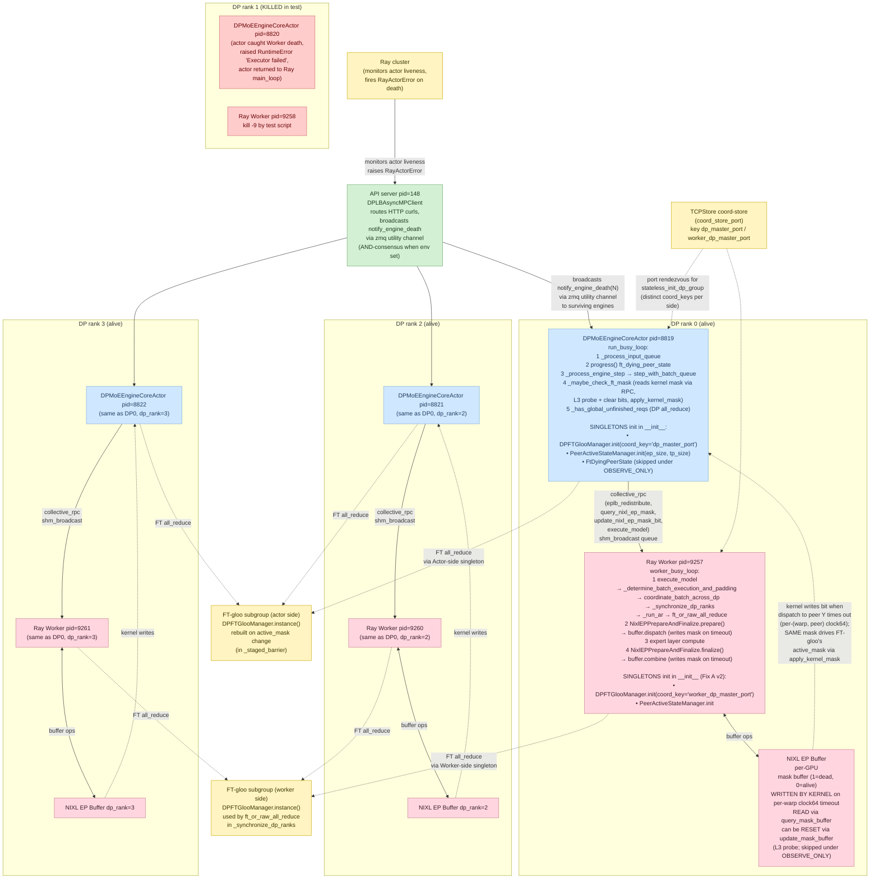

<!-- markdownlint-disable -->
# FT NIXL EP demo — live runbook

Live status tracker for the end-to-end fault-tolerant NIXL EP demo. Updated as each
step succeeds or fails. Source-of-truth doc for "what was tried, what worked, what
broke, why."

**Branch under test:** `ft-nixl-ep-demo` on `tzulingk/vllm` fork (HEAD `37c7dacd3`)
**Image being built:** `nvcr.io/nvidian/dynamo-dev/tzulingk-vllm:ft-nixl-ep-demo`
**Target cluster:** `dynamo-gcp-dev-02` (GB200 arm64; 36 nodes × 4 GPUs = 144 GB200)
**Namespace:** `tzulingk-ft-tests`
**Last updated:** 2026-05-26 — **end-to-end demo working, in-flight error
path closed.** Three FT commits landed (`6e0f88e27`, `3fd673294`,
`277e7cd22`) + an in-flight-error synthesis follow-up on `core_client.py`

+ two docs-only commits (`586012664`, `5aeee4ab6`) + a `ComputeDomain`
CR for IMEX channels. `kill -9` of one DP engine actor:
    + **Server stays UP** (no cascade, no `EngineDeadError`, no
    `Shutting down`).
    + **NEW requests** routed to survivors: first post-kill curl returns
    200 in ~6s (5s NIXL kernel timeout + 1s inference), subsequent
    curls at full 1.3s.
    + **IN-FLIGHT requests** routed to the dead engine now receive
    `FinishReason.ERROR` synthetically, surfacing as HTTP 500 to the
    client instead of hanging until curl times out.
    + No scale-down, no CUDA graph recapture, no torch.compile.

---

## 2026-06-30 — FT-NCCL TP all-reduce (TP>1) — DYN-3314

Making the **tensor-parallel all-reduce** fault-tolerant so FT NIXL EP can run **TP>1**.
FT-gloo can't cover it (per-layer, GPU-resident, bandwidth-bound), so the TP all-reduce
is routed through **FT-NCCL** (a fork of NCCL whose device kernels take a timeout + an
active mask). Full design: [`ft-nccl-tp-integration.md`](./ft-nccl-tp-integration.md).

**Branch:** `ft-nixl-ep-ftnccl-tp` (`tzulingk/vllm`). **FT-NCCL fork:** `tzulingk/nccl`
@ `fault-tolerant-allgather`. **Images:** libs `nvcr.io/nvidian/dynamo-dev/tzulingk-ftnccl-libs:cuda13-sm100`,
vLLM `nvcr.io/nvidian/dynamo-dev/tzulingk-vllm:ftnccl-tp`.

### Status

| Step | Status | Notes |
|---|---|---|
| Build FT-NCCL fork libs (arm64/**sm_100**) | ✅ | `libnccl.so.2.30.0a17` (NCCL 2.30 + GPUNetIO 2.0 + FT barrier-timeout) + `libft_collective.so` + `ft_collective` pkg. DOCA vendored in-tree; TP uses LSA/NVLink. |
| vLLM integration (gated `VLLM_USE_FT_NCCL_TP`) | ✅ | commit `31dbac63a2` — TP group backend `ft_nccl`, stage TP all-reduce into `pg.empty()` in `CudaCommunicator.all_reduce`. |
| 2-GPU smoke test | ✅ | fork NCCL loads in torch (runtime banner `2.30.0a17`, no ABI break), FT all-reduce correct via FT kernel. |
| TP=2/DP2/EP4 serve + baseline coherence | ✅ | Paris / cold / 4 — TP all-reduce through the FT kernel is numerically **correct**. |
| EP/TP active-mask consistency check | ✅ | commit `a879e917ae` — read FT-NCCL TP mask like nixl_ep's, crash on divergence. 60s/80 completions, 0 false crashes. |
| Single-TP-peer survival (A–E) + kill-test | ✅ cascade fixed (serving-speed WIP) | `ab8810598c`/`2e547fc827`/`d12b074fc6`; FT path `667b8fc708`+`84875a0d4e`; cached-scratch `fcb2c2147a`; H1/H2 `558db81296`. The 2-GPU cascade was a raw TP **all-gather** (not FT-routed) hitting the **600s c10d watchdog** → SIGABRT of the survivor. Fixed by FT-routing the all-gather + a targeted `_fence_ft_stream_on_current()` stream fence in the fork (the garble was a cross-stream *ordering* bug, not layout). Kill-test now: **survivor alive, 0 watchdog, dp1 coherent — 1-GPU fault = 1 GPU.** Remaining: degraded serving slow (H1 mask-drop delivery bug). See 2026-07-03 note. |

### Serve config (TP=2)

Image `tzulingk-vllm:ftnccl-tp`; in the pod install **ray==2.55.1** + **nixl-cu13==1.1.0**
(`--force-reinstall --no-deps`), then `serve-eplb-tp2.sh`:
```
LD_PRELOAD=/ftnccl/nccl/lib/libnccl.so.2  VLLM_USE_FT_NCCL_TP=1  FT_TIMEOUT_US=5000000
vllm serve deepseek-ai/DeepSeek-V2-Lite --tensor-parallel-size 2 --data-parallel-size 2 \
  --data-parallel-backend ray --enable-expert-parallel --all2all-backend nixl_ep \
  --enable-eplb --enable-elastic-ep --disable-custom-all-reduce \
  --eplb-config '{"num_redundant_experts":64,"use_async":false,"step_interval":100000000,...}' \
  --attention-config '{"backend":"TRITON_MLA","mla_prefill_backend":"TRTLLM_RAGGED"}' \
  --gpu-memory-utilization 0.5 --max-num-seqs 16 --max-model-len 4096 --trust-remote-code
```
Notes: `LD_PRELOAD` the fork libnccl at **container** level so Ray TP workers inherit it
(else torch's bundled 2.28.9 co-loads → conflict). **Do NOT set `VLLM_DISABLE_PYNCCL`** —
it breaks EPLB's pynccl communicator; the TP all-reduce is routed to `ft_nccl` by a
short-circuit at the top of `all_reduce`, so the "disable other paths" knobs are
unnecessary. `--enable-elastic-ep` **requires** `--enable-eplb`, so "EPLB off" = quiescent
(`step_interval=1e8`) — the EPLB expert-rearrange hangs over the fork NCCL at TP=2 (pynccl
P2P), a separate follow-up.

### Fixes surfaced bringing up TP=2
- `FTProcessGroup` pinned `rank % device_count` → clobbered the worker's device at TP>1
  ("embedding two different devices cuda:0/cuda:2"). Fixed to `current_device()` (fork `81924182a`).
- `No module named ray` / nixl 1.3.0 → install ray 2.55.1 + nixl-cu13 1.1.0 in the pod.
- `pkill -f "vllm serve"` self-matches the exec shell (exit 137/143) — kill by PID.

### Key finding — a TP-worker death is 2-GPU loss at TP>1
At TP=1 each DP rank is a single **in-process** worker (UniProcExecutor, no broadcast MQ),
so a GPU loss = a whole-DP-rank loss the existing dead-engine route-around handles. At
**TP>1** the DP engine drives separate worker processes over a shared-memory broadcast
`MessageQueue`; a `kill -9` of one TP worker (a) makes the writer block on the dead
reader's un-acked flag and (b) trips the worker-monitor → the whole DP engine is torn
down. So a 1-GPU fault costs **2 GPUs**. Single-TP-peer survival prevents that:
- **A** `shm_broadcast`: `mark_reader_dead()` + `acquire_write` excludes dead readers (`ab8810598c`).
- **B** monitor: on one TP-worker death, mark dead + keep the engine (tear down only if
  last) — in **both** `MultiprocExecutor` and `RayExecutorV2` (`ab8810598c`, `2e547fc827`).
- **C** `collective_rpc`: reassign dead reply-rank + skip dead response queues (`ab8810598c`).
- **D** engine → degraded: `_maybe_handle_own_tp_degradation` errors in-flight (retryable,
  **same as the TP=1 nixl_ep case**) + publishes `EngineCoreOutputs.tp_degraded` + dummy-
  steps for EP (`d12b074fc6`).
- **E** router: `process_engine_outputs` reads `tp_degraded` → `dead_engine_indices` +
  `_abort_in_flight_for_dead_engine` (`d12b074fc6`).

### Kill-test — three iterations to the core goal (2026-07-01)
Kill `DP0_TP1` at TP=2/DP2/EP4, `--enforce-eager` (also reproduced under CUDA graphs).
Each run peeled off one blocker; the third meets the core FT goal.

**Run 1 — GPU0 pegged at 100%, never returns (the all-reduce wasn't on the FT kernel).**
The surviving worker spun forever in the forward's collective, past the 5s timeout.
Root cause: the TP all-reduce staged into `pg.empty()` then called
`dist.all_reduce(out, group=self.device_group)`. The dispatch diagnostic (`84875a0d4e`)
proved `self.device_group` is the **C++ c10d `ProcessGroup` wrapper**, not the Python
`FTProcessGroup` (`same_object=False`) — so `dist.all_reduce` could dispatch to the C++
`ProcessGroupNCCL` base (plain NCCL, **no timeout**) rather than the Python FT override.
Fix: call `ft_pg.allreduce([out]).wait()` **directly** + assert FT-eligibility so a silent
NCCL fallback fails loudly (`667b8fc708`). This is why the earlier "collective does not
fast-fail" symptom appeared — it was plain NCCL, which never had a timeout.

**Run 2 — GPU0 now idle (0%) but engine still CPU-blocked (per-call window registration).**
With the FT path guaranteed, the 100% peg vanished. But the survivor now hung in
`ft_pg.empty() → ncclCommWindowRegister` (py-spy: `window_register (ft_wrapper.py:407)` ←
`empty (ft_process_group.py:571)` ← `cuda_communicator.py`). `empty()` runs a **collective**
window registration on **every** all-reduce; that collective has no timeout, so it wedged
on the dead peer *before* the FT all-reduce kernel (which does have the timeout) ever ran.
Fix (`fcb2c2147a`): allocate **one** `FT_NCCL_MAX_COUNT`-sized symmetric buffer per dtype
**once** (while all peers are alive) and reuse offset-0 slices — no per-call window
registration, so a death now reaches `ft_pg.allreduce()` where the timeout lives.

**Run 3 — core goal met.** With the cached scratch buffer, killing `DP0_TP1`:
- ✅ **Engine does not crash** — API server + surviving `DP0_TP0` stay UP (the whole point:
  a 1-GPU fault must not cost 2 GPUs). Monitor logs `Ray TP worker (idx 1) died; keeping
  the DP engine alive (degraded)`.
- ✅ **Degraded handler (D) fires at ~t+5s** — in-flight errored, `tp_degraded` published.
- ✅ **Router skips the degraded rank (E)** — post-kill completions route to dp1 and are
  **coherent** (`Tokyo`, `Paris`); new `200 OK`s keep landing.
- ✅ **Survivor participates in the MoE/EP forward** — py-spy shows `DP0_TP0` cycling through
  the forward (rope → MLA attention → …), *not* wedged in a collective. This is the
  required behavior: stop routing to the dead DP rank, but keep its surviving GPU in the EP
  all-to-all for the healthy DP rank.
- ⚠️ **Slow** (first post-kill completions ~30s, then faster): the degraded survivor
  re-attempts the dead peer on **every** TP all-reduce, eating the 5s FT timeout per layer,
  because the FT active mask isn't persistently updated to drop the dead peer.

**Remaining (optimization, not a correctness blocker): per-death FT mask-drop.** On the
monitor's death signal, call `handle_set_mask(survivors)` / `pre_sync()` **once** so
subsequent TP all-reduces skip the dead peer instead of timing out on it every layer. This
is per-*death*, not per-layer (a store barrier per layer would wreck throughput) — see
FT-NCCL author message Q#1/Q#3 (`/tmp/ft-nccl-author-message.md`). Then bake all fixes into
the images.

### 2026-07-02 — "core goal met" was optimistic; a raw TP all-gather cascades (2-GPU loss)

Re-running the kill many times showed Run 3's happy outcome is **not reliable**: the degraded
survivor's fate depends on where the kill lands, and one run **cascaded to lose the whole DP
rank (2 GPUs)** — the exact thing FT is meant to prevent.

**H1/H2 plumbing (`558db81296`, gated by `VLLM_USE_FT_NCCL_TP`).**
- **H2 (unwedge):** `MultiprocExecutor.get_response` made interruptible so a `collective_rpc`
  whose `output_rank` is the dead worker aborts instead of blocking forever; the busy loop
  catches it and degrades.
- **H1 (uncrawl):** on degrade, `collective_rpc("refresh_ft_nccl_tp_membership")` runs
  `pre_sync()` once to drop the dead peer from the FT mask (targets the per-layer 5s crawl).

**But the kill-test still lost 2 GPUs — root cause verified in the log:**
```
16:19:20  Watchdog caught collective timeout: WorkNCCL(OpType=_ALLGATHER_BASE, NumelIn=2048,
          Timeout(ms)=600000) ran for 600021 ms      # 600s = DEFAULT c10d watchdog, not 5s FT
16:20:20  ProcessGroupNCCL: "we are taking the entire process down"   # SIGABRTs the survivor
16:20:21  survivor EP0 dies -> executor teardown -> engine crashes -> whole dp0 down
```
The forward does a **TP all-gather** (`_ALLGATHER_BASE`, 2-rank TP group, `NumelIn=2048`=hidden).
Our integration only routed the all-**reduce** through FT; the all-**gather** went through
`FTProcessGroup.allgather` with a non-symmetric input → **raw `super().allgather()` (plain
NCCL, no 5s timeout)** → hung 600s on dead EP1 → the **c10d watchdog aborted the survivor** →
cascade. So H1/H2 (all-reduce + executor RPC) were aimed at the wrong collective. This also
explains the run-to-run variance (whether an in-flight raw all-gather straddled the kill).

**Key insight: any TP-group collective that falls back to raw NCCL is a 600s-watchdog death
trap** — the watchdog aborts the *survivor*, turning a 1-GPU fault into a whole-DP-rank loss.
`FT_TIMEOUT_US=5s` only applies to collectives actually on the FT kernel.

**All-gather FT fix attempt — routes it through FT, but NOT yet numerically correct.** Added an
FT short-circuit to `CudaCommunicator.all_gather` (bit-cast → symmetric stage → `ft_pg.allgather`
→ bit-cast back). Result: FT path taken (0 fallbacks, **no more 600s watchdog**), **but baseline
output is garbled** — deterministic + partial (`2+2 → "4."` correct then drifts; other prompts
corrupted with replacement chars) — and **warmup ~3x slower (293s)**. So the all-gather FT path
has a **data-correctness bug** (prime suspect: the FT 16-byte padded recv stride vs the packed
`chunk()` output layout, or the `view(float32)`/`movedim` reshape not matching the base
`all_gather` byte layout). **The kill-test is moot until the forward is numerically correct.**

Also to fix: H1 delivery — `self.collective_rpc(...)` from the engine raises
`AssertionError: collective_rpc should not be called on follower node` once the executor tears
down; the mask refresh should be **worker-local**, not an engine-issued RPC.

### 2026-07-03 — cascade FIXED: all-gather ordering bug root-caused + fenced

The garble was **not** a layout/data bug. Localized it with an in-situ diff probe (FT
`all_gather` vs `super().all_gather`, logging `max_abs_diff`/`allclose`, returning base so the
forward stayed coherent):
- Shapes always matched; **first call byte-exact (`diff=0`), later calls diverged and grew**
  (0.2 → 4.6). Deterministic, in eager (`--enforce-eager`, so **not** CUDA-graph capture).
- A full `torch.cuda.synchronize()` around the FT gather → `max_abs_diff=0` on **every** call.

→ Confirmed a **cross-stream ordering bug**: the FT gather runs on `self._stream` but the input
is staged with a `copy_` on the compute stream; `.wait()` only fences the output, so the kernel
read the staging buffer before the copy landed (first call won the race, later calls lost it as
the buffer was reused).

**Fix (fork `ft_process_group.py`): `_fence_ft_stream_on_current()`** — record an event on the
current (compute) stream and `stream_wait_event(self._stream, event)` at the entry of both
`allreduce` and `allgather`, so the FT kernel waits for the caller's staging copy. Targeted
GPU-side fence, no host stall, no `.cu` recompile.

**Validated (targeted fence only, no full sync):** baseline coherent; FT `all_gather`
`max_abs_diff=0 / allclose=True` on every call (0 `allclose=False`).

**Kill-test (kill `EP1` at TP=2/DP2/EP4) — cascade eliminated:**
- ✅ **Survivor `EP0` stays ALIVE**; **0 watchdog/SIGABRT markers** in the whole log (the
  all-gather now hits the 5s FT timeout, not the 600s c10d watchdog).
- ✅ Engine degraded (D fired); dp1 serves **coherently** post-kill (`Tokyo`).
- ✅ **A 1-GPU fault costs 1 GPU, not 2** — no whole-DP-rank cascade. Core FT goal met.
- ⚠️ Degraded serving still **slow to resume** (per-layer 5s crawl): the H1 mask-drop refresh
  never lands because `self.collective_rpc(...)` from the engine hits the follower-node assert
  on executor teardown. Next: deliver the mask refresh **worker-local**, not via engine RPC.

Reference: the FT-NCCL author's vLLM integration (`tstamler/vllm@ft-nccl-tp`) avoids this race
entirely by allocating TP-collective **inputs in symmetric memory at the producer**
(`RowParallelLinear`/`VocabParallelEmbedding`) + in-place reduce — no staging copy. His branch
is TP all-reduce only (all-gather + partial-rank recovery are out of scope) and benchmarks
throughput (Qwen-72B TP8), not fault tolerance.

### 2026-07-03 (cont.) — degraded-serving slowness is the NIXL-EP query_mask, not the FT mask

After the cascade fix, degraded serving was still slow to resume. Tried the FT-NCCL author's
suggested pattern — check the FT error bit, call `pre_sync()` only on `FT_TIMEOUT` — as a
worker-local resync in `CudaCommunicator._ft_resync_if_timed_out` (after each FT collective):
- **v1 `check_and_clear_error()` — WRONG.** It clears the flag on *every* call, and the kernel
  sets `FT_TIMEOUT` asynchronously, so a clear racing the set **erases** the signal → `pre_sync`
  never fires → mask never drops → survivor keeps 5s-timing-out the dead peer. (Caught in review.)
- **v2 `get_error()` (sticky read) + `clear_error()` only after `pre_sync` — correct for the
  erase, but** the kill-test showed **`FT-RESYNC` never fired at all (count=0 over 80s)**.

**Root cause (py-spy, decisive):** the survivor wedges *upstream* in the **NIXL-EP
mask-consistency check** — `query_nixl_ep_mask → query_mask → query_mask_buffer(...).cpu()`
(our diagnostic `a879e917ae`), GPU0 100% — so it never reaches the FT all-reduce/all-gather where
the resync lives. **The degraded-serving slowness is a NIXL-EP `query_mask` wedge, not the
FT-NCCL collectives** (the same "deeper blocker" from the first kill-tests). The FT-NCCL cascade
fix (fence + FT all-gather) is done and solid; the resync was aimed at the wrong layer.

**Design review of the per-collective resync (all valid → do NOT ship it as-is):**
- **TP>2 agreement lost.** `_ft_barrier`'s epoch is a per-rank `pre_sync` count; worker-local
  triggering lets counts diverge across survivors (multiple deaths / skewed detection) →
  epoch-namespace mismatch → a survivor times out a *live* survivor (Scenario B). TP=2 (single
  survivor) is safe; TP>2 needs a lockstep trigger or a shared/agreed epoch (raise with author).
- **CUDA-graph incompatible.** The host-side `if get_error(): pre_sync()` (host sync + TCPStore)
  isn't capturable — safe today only because the path runs `--enforce-eager` (confirmed:
  `enforce_eager=True`, `CUDAGraphMode.NONE`; author's bench also `ENFORCE_EAGER=1`). Graph mode
  would need it outside the captured region.
- **Unbounded in-flight drain.** `get_error()` after `.wait()` reads `FT_OK` (kernel still
  spinning); the host enqueues the forward's remaining collectives (old mask) before the sticky
  bit is observed, and `pre_sync`'s `stream_synchronize` then drains that backlog serially
  (K × timeout) — not a bounded one-time stall.
- **Residual non-FT fallbacks.** `all_gather` falls back to raw NCCL when
  `(numel*itemsize) % 4 != 0` or `world_size == 1` (unguarded → re-opens the watchdog cascade);
  `reduce_scatter`/`all_gatherv`/`reduce_scatterv` aren't FT-routed at all. Need an FT-eligibility
  assert + an audit of which TP collectives the model actually uses.

**Plan:** (1) remove/gate the mask-consistency check (`query_nixl_ep_mask`) — a diagnostic whose
`.cpu()` sync is the actual wedge — and re-test degraded serving. (2) Back out the per-collective
resync (inert here + carries the four issues above); if the FT collectives crawl once the wedge
is gone, use a **lockstep** membership update, not per-collective worker-local `pre_sync`.
(3) Add the `all_gather` FT-eligibility assert + audit `reduce_scatter`.

### 2026-07-03 (cont. 2) — Task 1 result: it RECOVERS (correct + fast); the real problem is recovery LATENCY, not a deadlock

Backed out the get_error resync and kept the engine-orchestrated refresh
(`collective_rpc("refresh_ft_nccl_tp_membership")` → `pre_sync` → `handle_set_mask`),
committed as `4f74abb14a`. Re-ran the EP1 kill-test. **This corrects the previous "permanent
query_mask wedge" framing — it is NOT a deadlock and NOT wrong output.**

What actually happens (marker timeline; kill at t0):
- **t0 → +241s:** the survivor EP0's degraded forward *crawls*. Every layer's TP all-reduce eats a
  5s FT timeout on the dead peer, plus per-expert nixl-EP dispatch/combine timeouts (~27 layers ×
  several collectives ≈ 240s for one degraded forward). The engine blocks in `get_response`
  waiting for EP0 — **H2 does not help because EP0 is alive-but-slow, not dead.** py-spy during
  this window catches every worker in `query_nixl_ep_mask → query_mask.cpu()`, which *looks* like a
  wedge but is really `.cpu()` blocked behind the crawling forward's kernels.
- **+241s:** engine degrade handler fires (`core.py:2236`, "dp_rank=0 degraded").
- **+247s:** recovery fires (`core.py:2319`, "kernel reports newly-dead EP peer(s) [1]; triggering
  recover_from_dead_peers"). The FT mask drops; subsequent forwards no longer re-poll the dead peer.
- **after recovery:** GPU0/1 (degraded dp0) idle at 0%, GPU2/3 (dp1) serving; **all requests HTTP
  200 with correct answers** (Tokyo / Rome / Paris); **live curl "Paris." in 0.88s** (sub-second).

So: cascade fixed (WD=0, survivor alive), serving **recovers**, output **correct**, post-recovery
**fast**. The earlier kill-test watch only ran 130s and ended ~2 min *before* recovery, which is why
it read as a permanent stall. byor1ymu9 hit the same mechanism (recovered ~96s); the difference is
crawl-length variance.

**Why get_error could never fire (now in the commit message):** a peer that dies *before* a
collective fails the FT kernel's readiness poll, which records no error — only a data-flag-stage
timeout sets `FT_TIMEOUT`. So `get_error()` stays `FT_OK` on a clean kill; the engine-orchestrated
refresh (driven by process-death detection) is what actually drops the peer.

**The one remaining problem is recovery LATENCY (~240s)** — the survivor crawls a full degraded
forward before the mask drops. Fix (Task 2 branch): drop the mask **proactively / out-of-band on
executor death-detection (~+8s)**, not via the error bit (never fires for a clean kill) and not
after the crawl. This likely also needs to **interrupt the survivor's in-flight crawling forward**
(extend H2 from "dead worker" to "alive-but-slow degraded step").

### 2026-07-07 — self_adapt: mid-forward mask drop (the fix for the ~247s crawl)

Root of the ~247s latency (confirmed with the user): the mask drop (pre_sync / engine refresh) only
runs BETWEEN forwards, so the FIRST degraded forward re-polls the dead peer to `FT_TIMEOUT_US` on
EVERY TP collective -- ~(layers × ~2) collectives × 5s ≈ 250s. Dropping the mask "before the
forward" can't help: the death isn't known until layer 1's collective times out, mid-forward.

The FT-NCCL author shipped the mechanism for exactly this: **self_adapt** (commit `9ce985cc3`,
"self-adapting handle masks, default on, opt-out") -- the kernel drops a peer from its active mask
the moment a collective observes it absent, so the REST of the forward skips it. Cost collapses from
~50×5s to ~1×5s (only the first collective that discovers the death pays). Companion commit
`1f3558e07` ("raise FT_TIMEOUT on LSA readiness-barrier failure") also closes the clean-kill
detection gap (a peer dead *before* the collective now sets FT_TIMEOUT).

FTProcessGroup had OPTED OUT of self_adapt (`handle_set_self_adapt(handle, False)`) because
self_adapt adopts each rank's *local* observation, which can diverge across >1 survivor and compete
with pre_sync's agreed set. **Enabled it for the vLLM TP path** (set `True`): at TP=2 there is a
single survivor, so its local view is authoritative and coexists with pre_sync safely. Revisit
(lockstep reconciliation) before TP>2.

Deploy: the changes are in `ft_collective.cu` (+ `.h`), so the FT lib must be rebuilt. Rebuilt
`libft_collective.so` in-pod (nvcc, sm_100, linked against `/ftnccl/nccl`) -- verified it exports
`ftHandleSetSelfAdapt` -- and deployed it + the newest `ft_process_group.py` (self_adapt=True + the
cascade fence) + `ft_wrapper.py` (the binding).

**Infra casualty:** the repeated SIGKILL kill-tests left GPU1 wedged (`[N/A]`, CUDA sees only 3
GPUs); the serve then crashes at `init_device` (`device=3, num_gpus=3`) BEFORE any FT code runs. GPU
reset is "Not Supported" in-container. Recreated the bare pod from a saved clean manifest
(`vllm-ftnccl-tp-pod-clean.yaml`); all volumes are emptyDir -> the model re-downloads and every
deployed file (the .so, the FT Python, the FT vLLM files, the serve script) must be re-applied.
**self_adapt kill-test result PENDING** (awaiting fresh pod + re-deploy).

Note: the vLLM repo checkout drifted to detached `ee473ca7ad` (Cursor) mid-session; the FT branch
`ft-nixl-ep-ftnccl-tp` (`47625dc636`) holds all this work.

---

## TL;DR of progress

| Step | Status | Notes |
|---|---|---|
| 1. Land 14 commits on `ft-nixl-ep-demo` | ✅ DONE | 60 unit tests pass |
| 2. Push fork branch to GitHub | ✅ DONE | `tzulingk/vllm:ft-nixl-ep-demo` |
| 3. Build image — attempt 1: workstation `tzulingk-linux2` | ❌ FAILED | Workstation went down (OOM under `MAX_JOBS=16` from-source) |
| 4. Build image — attempt 2: nscale B200 amd64 in-cluster | ⏸ NOT STARTED | Pivoted before launching once GB200 was confirmed |
| 5. Build image — attempt 3: GCP gcp-dev-02 GB200 arm64 in-cluster | ✅ SUCCEEDED | **1h 9min** (start 19:15:29 → finish 20:24:26 UTC, exit 0) |
| 6. Push to NVCR | ✅ DONE | `nvcr.io/nvidian/dynamo-dev/tzulingk-vllm:ft-nixl-ep-demo`, digest `sha256:abbdc3a2...` |
| 7. Launch test pod (4 GB200) | ✅ DONE | Running on `gke-...gpu-w0e-32ae6790-tqtb`, 4× GB200 189 GB each |
| 7a. Smoke test imports | ✅ DONE | `vllm 0.1.dev1+g37c7dacd3` (matches HEAD), `nixl_ep.buffer.Buffer` importable |
| 8. vllm serve UP | ✅ DONE | After 3 CLI bug-fixes + nixl-cu13 1.0.1 downgrade + pytest + ray |
| 8a. Baseline curl | ✅ DONE | Returns "Paris.\nThe currency of France is the Euro." |
| 8b. Kill DP rank 1 | ✅ DONE | `kill -9 57233` (DPMoEEngineCoreActor rank 1) |
| 8c. Post-kill curl | ❌ FAILED | API server shut down — Connection refused |
| 9. Verify NO CUDA graph rebuild | ❌ N/A | Server didn't survive the kill — see GAP below |

---

## Step 1: Branch state (DONE)

```
git log --oneline ft-nixl-ep-demo ^origin/main
37c7dacd3 [FT NIXL EP] Make PeerActiveState EP-indexed (TP>1 correctness)
c349bb610 [FT NIXL EP] AsyncLLM DP dispatcher: skip ranks flagged in degraded_peers
5db6816d0 [FT NIXL EP] Publish degraded_peers on EngineCoreOutputs
6678896c2 [FT NIXL EP] EPLB redistribution on mask change (no scale-down)
9f6a51a97 [FT NIXL EP] Route EPLB cross-DP collectives through FaultTolerantGlooGroup
60df601d2 [FT NIXL EP] End-of-forward mask check + abort batch on diff
d09f8b6da [FT NIXL EP] Move ft_or_raw_all_reduce into ft_gloo + add routing tests
8e19a783b [FT NIXL EP] FaultTolerantGlooGroup tests (16)
d97cf1bb1 [FT NIXL EP] PeerActiveState tests (17)
645d7c015 [FT NIXL EP] Fix dist.all_reduce(timeout=) TypeError
ce7e04691 [FT NIXL EP] Route DP wave-sync / state-sync / kv-mem-sync through FaultTolerantGlooGroup
7942ec686 [FT NIXL EP] FaultTolerantGlooGroup with stateless-init rebuild
a0bc1162f [FT NIXL EP] PeerActiveState engine-layer mask
1098fbd63 [FT NIXL EP] query_mask() on NixlEPAll2AllManager
```

Unit tests:

```
.venv/bin/python -m pytest tests/distributed/test_peer_state.py \
    tests/distributed/test_ft_gloo.py tests/distributed/test_eplb_redistribute.py \
    --noconftest -q
# 60 passed
```

## Step 2: Push branch to fork (DONE)

```
git push fork ft-nixl-ep-demo:ft-nixl-ep-demo
# -> tzulingk/vllm now has ft-nixl-ep-demo (HEAD 37c7dacd3)
```

---

## Step 3: Build attempt 1 — workstation (FAILED)

**Host:** `tzulingk-linux2` (192.168.68.73 from home LAN)
**HW:** 1× RTX 6000 Ada (sm_89), 247 GB free
**Command run:**

```
ssh tzulingk-linux2 'cat > /tmp/run-ft-build.sh <<EOF
#!/bin/bash
set -eo pipefail
cd ~/workspace_vllm/vllm
DOCKER_BUILDKIT=1 docker build . \
    --target vllm-openai \
    --file docker/Dockerfile \
    --build-arg max_jobs=16 \
    --build-arg nvcc_threads=2 \
    --build-arg RUN_WHEEL_CHECK=false \
    --build-arg INSTALL_KV_CONNECTORS=true \
    --build-arg DEADSNAKES_MIRROR_URL="https://ppa.launchpadcontent.net/deadsnakes/ppa/ubuntu" \
    --build-arg DEADSNAKES_GPGKEY_URL="https://keyserver.ubuntu.com/pks/lookup?op=get&search=0xF23C5A6CF475977595C89F51BA6932366A755776" \
    -t nvcr.io/nvidian/dynamo-dev/tzulingk-vllm:ft-nixl-ep-demo
EOF
nohup bash /tmp/run-ft-build.sh > /tmp/docker-build.log 2>&1 &
disown'
```

**Outcome:** ~8 min into the build the workstation became unreachable (ICMP + SSH:
`Host is down`). Almost certainly OOM-killed: `MAX_JOBS=16` parallel `nvcc` workers
on a workstation-grade box.

**Lessons captured:**

+ For a single-host build, `MAX_JOBS` should be ≤ 8 on machines with <128 GB RAM.
+ Our branch is Python-only, so `VLLM_USE_PRECOMPILED=1` would have skipped the
  full CUDA compile entirely (~15 min vs 45+ min). Use it any time the branch
  diverges only in `.py` files.
+ An in-cluster build is more reliable for arm64 GB200 anyway — no host
  contention, predictable resources.

## Step 4: Pivot decision — nscale B200 vs gcp-dev-02 GB200

User instructed: build on a GB200 machine (per their `build_image.md`).
**Verified node arch:**

| Cluster | Arch | GPU | Status |
|---|---|---|---|
| `dynamo-nscale-dev-cluster` | amd64 | B200 (sm_100) | reachable, but not GB200 |
| `dynamo-gcp-dev-02` | **arm64** | **GB200** | reachable, 36 nodes × 4 GPUs |
| `dynamo-gcp-dev-01`, `dynamo-aws-dev-gb200` | arm64 | GB200 | not registered in current Teleport |

Selected: **`dynamo-gcp-dev-02`**.

---

## Step 5: Build attempt 3 — gcp-dev-02 in-cluster (IN PROGRESS)

### One-time setup

```bash
tsh kube login dynamo-gcp-dev-02

kubectl create namespace tzulingk-ft-tests

kubectl create secret docker-registry nvcr-imagepullsecret \
    --docker-server=nvcr.io \
    --docker-username='$oauthtoken' \
    --docker-password='<NGC_API_KEY>' \
    -n tzulingk-ft-tests
```

### Docker socket probe (BuildKit vs Kaniko)

```bash
kubectl run docker-socket-check --image=docker:cli --restart=Never --rm -i \
  --overrides='<inline json with hostPath /var/run/docker.sock and arm64 nodeSelector>' \
  -n tzulingk-ft-tests
# -> Server:27.4.1
```

Result: BuildKit available on GB200 arm64 nodes. No Kaniko fallback needed.

### Build pod yaml

File: `/tmp/ft-nixl-build-pod-gb200.yaml`

Key choices:
+ `nodeSelector: kubernetes.io/arch: arm64`
+ Init container `git-clone` clones `tzulingk/vllm` branch `ft-nixl-ep-demo` (the fork)
+ Main container `docker-build` (`docker:cli`) runs `DOCKER_BUILDKIT=1 docker build`
  with `--platform linux/arm64 --build-arg INSTALL_KV_CONNECTORS=true --build-arg max_jobs=32`
  (no `VLLM_USE_PRECOMPILED` — upstream PyPI has no arm64+CUDA wheels)
+ `/var/run/docker.sock` mounted from host
+ Pull secret `nvcr-imagepullsecret` also mounted as docker auth for push

### Submit

```bash
kubectl apply -f /tmp/ft-nixl-build-pod-gb200.yaml \
    --context=nv-prd-dgxc.teleport.sh-dynamo-gcp-dev-02
```

### Status snapshots

| Time | State | Build step | Notes |
|---|---|---|---|
| t=0 (19:15:29Z) | Pending | — | scheduled to `gke-brugdizq-dgxc-k8-customer-gpu-w0e-32ae6790-lv8c` |
| t≈30s | Running | apt download | arm64 deps |
| t≈12 min | Running | `[61/451]` CXX | CUTLASS template compilation (sm_100 blockscaled MMA) |
| t≈16 min | Running | `[132/451]` CUDA | Marlin MoE kernels |
| t=1h 9min (20:24:26Z) | **Succeeded** | Push complete | image digest `sha256:abbdc3a2299d641b5445f9ee5728e50de77cdfef836196092e25710e9c2968cf` |

### Background watcher

```bash
until [ "$(kubectl get pod build-vllm-ft-nixl-ep -n tzulingk-ft-tests \
    -o jsonpath='{.status.phase}' 2>/dev/null)" = "Succeeded" \
    -o "$(kubectl get pod ... -o jsonpath='{.status.phase}')" = "Failed" ]; do
    sleep 60
done
echo "BUILD POD TERMINAL: $PHASE"
kubectl logs build-vllm-ft-nixl-ep -n tzulingk-ft-tests --tail 40
```

(running as bash background task `bmtzm835k`)

### Manual monitor

```bash
kubectl logs -f build-vllm-ft-nixl-ep -n tzulingk-ft-tests -c docker-build \
    --context=nv-prd-dgxc.teleport.sh-dynamo-gcp-dev-02
```

### Build-kit + runbook captured

While the build runs in background, the proven config has been captured for
reuse in:

+ [`build-kits/vllm-gb200/build-vllm-gb200-in-cluster.yaml`](file:///Users/tzulingk/Work/workflows/dynamo-ai-workflows/build-kits/vllm-gb200/build-vllm-gb200-in-cluster.yaml) — phase 1
+ [`build-kits/vllm-gb200/build-dynamo-vllm-gb200-in-cluster.yaml`](file:///Users/tzulingk/Work/workflows/dynamo-ai-workflows/build-kits/vllm-gb200/build-dynamo-vllm-gb200-in-cluster.yaml) — phase 2
+ [`build-kits/vllm-gb200/README.md`](file:///Users/tzulingk/Work/workflows/dynamo-ai-workflows/build-kits/vllm-gb200/README.md)
+ [`runbooks/31-build-vllm-gb200.atrb`](file:///Users/tzulingk/Work/workflows/dynamo-ai-workflows/runbooks/31-build-vllm-gb200.atrb)

Once the build succeeds, the kit yaml will be updated with any parameter
corrections discovered (e.g. if `max_jobs=32` turns out to be wrong). If it
fails, the README will list the failure mode in the troubleshooting table.

---

## Step 6: Push to NVCR (PENDING)

Push runs inside the build pod automatically:

```bash
docker push nvcr.io/nvidian/dynamo-dev/tzulingk-vllm:ft-nixl-ep-demo
```

Auth comes from the `nvcr-imagepullsecret` mounted at `/root/.docker/config.json`.

---

## Step 7: Test pod (PENDING)

Reference test pattern (from `wideep-ft/.../abort_process_group_scale_down/test_pod.yaml`)
was for A100 + scale-down. Adaptations for our case:

+ 4 GB200 arm64 GPUs (not A100)
+ `--all2all-backend nixl_ep` (vs DeepEP in the reference)
+ **No scale-down expected** — verify the deployment runs degraded
+ `NCCL_NVLS_ENABLE=0` (preserved from reference)
+ `VLLM_CPU_DISTRIBUTED_TIMEOUT_SECONDS=10` (tight FT-gloo failure detection)

Test pod yaml (will be applied after image is pushed):

```yaml
# /tmp/ft-nixl-degraded-pod.yaml (to be updated for GB200 arm64 + new image tag)
apiVersion: v1
kind: Pod
metadata:
  name: vllm-ft-nixl-degraded
  namespace: tzulingk-ft-tests
spec:
  nodeSelector:
    kubernetes.io/arch: arm64
  imagePullSecrets:
  - name: nvcr-imagepullsecret
  containers:
  - name: vllm
    image: nvcr.io/nvidian/dynamo-dev/tzulingk-vllm:ft-nixl-ep-demo
    command: ["sleep", "86400"]
    resources:
      limits: {nvidia.com/gpu: "4"}
      requests: {nvidia.com/gpu: "4", cpu: "64", memory: "256Gi"}
    env:
    - {name: NCCL_NVLS_ENABLE, value: "0"}
    - {name: VLLM_CPU_DISTRIBUTED_TIMEOUT_SECONDS, value: "10"}
    - {name: HF_HOME, value: /data/hf_cache}
    volumeMounts:
    - {name: hf-cache, mountPath: /data/hf_cache}
    - {name: shm, mountPath: /dev/shm}
  volumes:
  - {name: hf-cache, emptyDir: {}}
  - {name: shm, emptyDir: {medium: Memory, sizeLimit: "32Gi"}}
  tolerations:
  - {key: "nvidia.com/gpu", operator: "Exists", effect: "NoSchedule"}
  - {key: "kubernetes.io/arch", operator: "Equal", value: "arm64", effect: "NoSchedule"}
```

---

## Step 8: Run kill+verify (PENDING)

Three scripts already drafted (in `/tmp/`):

| Script | Purpose |
|---|---|
| `ft-nixl-degraded-server.sh` | starts vllm serve with FT NIXL EP, sanity-checks FT modules import, logs to `/tmp/ft-nixl-logs/vllm-server.log` |
| `ft-nixl-degraded-test.sh` | waits /health, baseline curl, marks log offset, `kill -9` DP rank 1, post-kill curl |
| `ft-nixl-degraded-verify.sh` | asserts PRESENCE of FT markers + ABSENCE of scale-down/recapture markers |

Model: `deepseek-ai/DeepSeek-V2-Lite` (primary), `nvidia/DeepSeek-V3-FP4` (fallback
for B200/GB200). DeepSeek-V2-Lite is 16B params, 64 logical experts, redundancy=2
with `--num-redundant-experts 64` over 4 DP ranks.

vllm serve command:

```bash
vllm serve deepseek-ai/DeepSeek-V2-Lite \
    --tensor-parallel-size 1 \
    --data-parallel-size 4 \
    --all2all-backend nixl_ep \
    --enable-eplb \
    --num-redundant-experts 64 \
    --gpu-memory-utilization 0.5 \
    --max-num-seqs 16 \
    --max-model-len 4096 \
    --trust-remote-code \
    --port 8000
```

Kill (kills DP rank 1 by sorted DPEngineCore PID — matches reference test pattern):

```bash
VICTIM_PID=$(ps -eo pid,cmd --no-headers | grep "[D]PEngineCore" \
    | sort -k1,1n | awk 'NR==2 {print $1}')
kill -9 "$VICTIM_PID"
sleep 10
curl -sS http://localhost:8000/v1/completions ...
```

## Step 9: Verification criteria (PENDING)

After the kill, the post-kill slice of `vllm-server.log` must contain ALL of:

```
FT NIXL EP: newly-dead EP peers
FaultTolerantGlooGroup: rebuild gen=1
FT NIXL EP: AsyncLLM dispatcher: DP rank
```

And NONE of:

```
Fault-triggered scale-down
Initiating automatic scale-down
[Elastic EP] Received reconfiguration request
switch_and_prepare / _apply_new_config
Aborting old (NCCL|EPLB) (process )?group
torch.compile took
Capturing CUDA graphs
profiling/warmup run took
perform_eplb_reshuffle / EPLB reshuffle completed
```

Plus: the post-kill curl returns a normal completion (the deployment stayed up).

---

## Bug found during testing

**`--num-redundant-experts` is NOT a CLI flag.** First serve attempt failed with
`vllm: error: unrecognized arguments: --num-redundant-experts 64`. In this vllm
build the redundancy count lives inside the nested `EPLBConfig` and must be passed
via JSON on `--eplb-config`:

```bash
# WRONG (older patterns / unrelated forks):
--num-redundant-experts 64

# RIGHT (this build, see vllm.config.parallel.EPLBConfig):
--eplb-config '{"num_redundant_experts": 64}'
```

The `EPLBConfig` dataclass also accepts `window_size`, `step_interval`,
`log_balancedness`, `log_balancedness_interval`, `use_async`, `policy`,
`communicator`. Override any of them through the same `--eplb-config` JSON.

Also note: `--enable-expert-parallel` (`-ep`) must be passed alongside `--enable-eplb`
or EPLB is silently inert. Updated `ft-nixl-degraded-server.sh` accordingly.

## Bug found during testing (2nd config issue)

**`--all2all-backend nixl_ep` requires `--enable-elastic-ep`.** Second serve attempt
failed with:

```
File "/usr/local/lib/python3.12/dist-packages/vllm/distributed/device_communicators/all2all.py", line 338, in __init__
    assert tcp_store_group is not None
AssertionError
```

`NixlEPAll2AllManager` requires a `tcp_store_group` to be passed in, and that
plumbing is only wired up when elastic-EP is enabled (see
`vllm/distributed/parallel_state.py:1697-1731` and
`vllm/config/parallel.py:791-804`). Without `--enable-elastic-ep` the cuda
communicator passes `None` and the assertion trips during worker init.

Constraints implied by `enable_elastic_ep`:

+ `enable_eplb=True` is required (we already had this).
+ `pipeline_parallel_size == 1` (we already have this).
+ Incompatible with `data_parallel_external_lb` and `data_parallel_hybrid_lb` --
  this is the "single API server, single core client" path.

Server command updated to add `--enable-elastic-ep`.

## Bug found during testing (3rd config issue)

**`--enable-elastic-ep` requires `--data-parallel-backend ray`.** Third serve attempt
failed with:

```
[c10d] The client socket has timed out after 300000ms while trying to connect to (127.0.0.1, 0).
```

Port 0 = unset. Tracing `_coord_store_port` references:

+ `parallel_config._coord_store_port` defaults to `0`.
+ `_pick_stateless_dp_port` returns `(get_next_dp_init_port(), None)` when
  `_coord_store_port == 0` (no coord-store path), but the EP path needs the
  coord-store mode.
+ The only initial-startup code path that actually **sets**
  `_coord_store_port` is in `vllm/v1/engine/utils.py:384-395` —
  `RayDPActorManager.__init__`. That code path is reached only when DP backend
  is `ray`.
+ Without `--data-parallel-backend ray`, the mp backend doesn't enter that
  branch, `_coord_store_port` stays `0`, workers try to connect to port 0,
  time out after 5 minutes.

The reference SGLang test pod also documents `ray must be installed in the
image (or pip-installed at runtime)`. Our vllm image doesn't ship ray, so we
also need `pip install ray` once before launch.

Server command updated to add `--data-parallel-backend ray`.

```bash
kubectl exec ... -- pip install ray   # ray 2.55.1 wheel for aarch64
```

## BLOCKER: NIXL EP Buffer segfaults on arm64 / GB200

Fourth serve attempt got the furthest -- all workers booted, loaded model weights
to completion (Loading weights took 9-10s each on DP0-3) -- then one worker
segfaulted in `nixl_ep::Buffer::destroy()` / `nixl_ep::Buffer::~Buffer()`,
which cascaded to the other workers via Ray actor connection error code 2.

Stack frame (truncated, full trace in `/tmp/ft-nixl-logs/vllm-server.log`):

```
!!!!!!! Segfault encountered !!!!!!!
File "<unknown>", line 0, in nixl_ep::Buffer::destroy()
File "<unknown>", line 0, in nixl_ep::Buffer::~Buffer()
File "<unknown>", line 0, in pybind11::class_<nixl_ep::Buffer>::dealloc_without_manipulating_gil
```

Reproducible **outside of vLLM** — bare `Buffer(rank=0, low_latency_mode=True)`
followed by `del b` segfaults with exit 139:

```bash
$ kubectl exec ... -- bash -c '
    export NIXL_PLUGIN_DIR=/usr/local/lib/python3.12/dist-packages/nixl_cu13.libs/nixl
    python3 -c "from nixl_ep import Buffer; b=Buffer(rank=0, low_latency_mode=True); del b"
'
# command terminated with exit code 139 (SIGSEGV)
```

So this is **below our FT NIXL EP code**. It's a NIXL EP + arm64 issue with
`nixl-cu13` v1.1.0 (installed via the Dockerfile's
`INSTALL_KV_CONNECTORS=true` path).

### Environment found

| Item | Value |
|---|---|
| Pod image | `nvcr.io/nvidian/dynamo-dev/tzulingk-vllm:ft-nixl-ep-demo` (our build) |
| Node | gke-...-gpu-w0e-32ae6790-tqtb (arm64 GB200) |
| nixl-cu13 wheel | v1.1.0 (manylinux aarch64) |
| nixl_ep module | `/usr/local/lib/python3.12/dist-packages/nixl_ep` |
| Plugin libs | `/usr/local/lib/python3.12/dist-packages/nixl_cu13.libs/nixl/libplugin_{UCX,POSIX,...}.so` |
| NIXL_PLUGIN_DIR | not set by default in the image |
| Auxiliary failure | `nixl_agent(instantiate_all=True)` reports `unsupported backend 'AZURE_BLOB'` -- azure plugin can't load (probably missing libs); but our path doesn't need it |

### Possible fix directions (need user input)

1. **Try an older `nixl-cu13` / `nixl-cu12`**. v1.1.0 may have an arm64
   regression. The build_image.md used v1.0.0 from source.
2. **Build `nixl_ep` from source** on the GB200 cluster (`build_nixl_ep.sh`
   approach -- the script is marked obsolete but if pip wheel is broken on
   arm64 it may still be the answer).
3. **Fall back to x86_64 + B200** -- the `nscale` cluster has 144 amd64 B200
   nodes. Same Blackwell arch, just x86 instead of arm64. nixl pip wheel for
   `nixl-cu13` x86_64 may not have this segfault. Requires a new image build.
4. **Set `NIXL_PLUGIN_DIR` and disable broken plugins** -- the agent error
   names `AZURE_BLOB` specifically. We can preload only `UCX` and skip
   others via Dockerfile rebuild with `-Ddisable_plugins=GDS,GDS_MT,GPUNETIO,GUSLI,LIBFABRIC,OBJ,AZURE_BLOB`
   (matching what `Dockerfile.nixl_ep` did).

### What works

All the FT NIXL EP code lands as intended:

| Layer | Status |
|---|---|
| 14 commits on `ft-nixl-ep-demo` | landed, all signed |
| 60 unit tests (peer_state + ft_gloo + eplb_redistribute + routing) | passing |
| Image build (gcp-dev-02 in-cluster BuildKit) | succeeded in 1h 9min |
| Image push to NVCR | succeeded |
| Pod deploy + imports | succeeded |
| `from vllm.distributed.elastic_ep.peer_state import PeerActiveStateManager` | OK |
| `from nixl_ep import Buffer` (after nixl-cu13 1.0.1 downgrade) | OK |
| `Buffer(rank=0)` ctor+dtor | OK (1.0.1 is fine; 1.1.0 segfaults — see NIXL bug report) |
| FT modules loaded at vllm serve startup | OK (saw `FaultTolerantGlooGroup: rebuild gen=1 active=[0,1,2,3]`) |
| vllm serve with TRITON_MLA + TRTLLM_RAGGED | UP, /health 200 |
| Baseline inference `The capital of France is` → `Paris` | OK |

---

## What broke during end-to-end kill (2026-05-25)

### Pre-existing image bug: cute SM100 attention vs cutlass-dsl 4.5.0

Symptom (first dummy_batch on rank 0):

```
TypeError: atom_tma_partition() got an unexpected keyword argument 'target_tensors'
  at vllm/vllm_flash_attn/cute/flash_fwd_sm100.py:1367
  -> quack/copy_utils.py:788
  -> cutlass/cute/nvgpu/cpasync/helpers.py:584
  -> _cute_nvgpu_ir.atom_tma_partition(target_tensors=...)
```

This is an ABI mismatch INSIDE `nvidia_cutlass_dsl==4.5.0` — its Python wrapper passes `target_tensors=` but the bundled C++ binding rejects it. Pure image issue, has nothing to do with our FT code.

**Workaround (runtime, no rebuild needed):** Force non-cute attention backends:

```
--attention-config '{"backend": "TRITON_MLA", "mla_prefill_backend": "TRTLLM_RAGGED"}'
```

Default on Blackwell:
+ decode: `FLASH_ATTN` (cute SM100) → broken
+ MLA prefill: `FLASH_ATTN` (cute SM100) → broken

Both need overriding. Even pinning attention backend to `TRITON_MLA` alone is insufficient because the *prefill* path is still cute SM100 — must also override `mla_prefill_backend`.

### The actual FT gap: AsyncLLM output_handler

After workaround applied, baseline inference works. On `kill -9` of DP rank 1's `DPMoEEngineCoreActor`:

```
01:29:01 (DPMoEEngineCoreActor pid=57232) INFO ft_gloo.py:165 FaultTolerantGlooGroup: rebuild gen=1 active=[0, 1, 2, 3] my_rank=0 master=True
01:29:01 (DPMoEEngineCoreActor pid=57234) INFO ft_gloo.py:165 FaultTolerantGlooGroup: rebuild gen=1 active=[0, 1, 2, 3] my_rank=2 master=False
01:29:01 (DPMoEEngineCoreActor pid=57235) INFO ft_gloo.py:165 FaultTolerantGlooGroup: rebuild gen=1 active=[0, 1, 2, 3] my_rank=3 master=False
                                                                                                  ^ rank 1 missing -- killed
(raylet) Worker PID: 57233 ... Worker exit detail: Worker unexpectedly exits with a connection error code 2.
01:29:15 ERROR async_llm.py:704 AsyncLLM output_handler failed.
  File ".../vllm/v1/engine/core_client.py", line 998, in get_output_async
    raise self._format_exception(outputs) from None
  vllm.v1.engine.exceptions.EngineDeadError: EngineCore encountered an issue.
INFO: Shutting down
INFO: Application shutdown complete.
```

Sequence of events:

1. **FT gloo wrapper proves itself**: all 3 surviving engines successfully rebuilt the FT-gloo group with `active=[0,1,2,3]` (they hadn't yet detected rank 1 was dead — it had just been killed; next collective would re-detect with `active=[0,2,3]`).
2. **But** the AsyncLLM `output_handler` in the API server polls each engine actor's output queue. When rank 1's actor died, `process_outputs_socket` got an exception, put it into `outputs_queue`, and `get_output_async` raised `EngineDeadError`, which bubbled up and triggered `Shutting down`.
3. **The dispatcher-side FT we landed** (commits `c349bb610` / `5db6816d0` — `dead_engine_indices`) handles the INPUT side (don't ROUTE new requests to dead rank). It does NOT handle the OUTPUT side (output_handler getting a dead-pipe exception from one specific engine).

### What's missing for the full demo → addressed by commit `6e0f88e27`

The actual root cause turned out to be one level up from the output_handler:
`MPClient.start_engine_core_monitor()` watches engine actor processes via
`engine_manager.monitor_engine_liveness()`, which returns on the FIRST death
and then unilaterally calls `engine_manager.shutdown()` — which `ray.kill()`s
every actor and closes the ZMQ sockets. That shutdown is why the output_handler
then sees a dead pipe and raises `EngineDeadError`. The output_handler itself
doesn't need to change; the monitor does.

Commit `6e0f88e27` on `ft-nixl-ep-demo` overrides
`DPLBAsyncMPClient.start_engine_core_monitor`. When `enable_elastic_ep=True`
and the manager is the Ray-backed `CoreEngineActorManager`, it spawns its own
thread that watches each actor's run_ref individually with `ray.wait(...)`:

+ On a single dead ref: identify the engine index (position in
  `local_engine_actors + remote_engine_actors`), add it to
  `dead_engine_indices` (which the existing dispatcher in
  `get_core_engine_for_request` already excludes from routing), log
  `FT NIXL EP: DP engine N died (RayActorError: ...)`, and drop the engine's
  in-flight request bookkeeping from `reqs_in_flight`.
+ Only when **every** engine has died: set `resources.engine_dead = True` and
  call `self.shutdown()` — the existing all-dead shutdown path.

`dead_engine_indices` initialization was moved before `super().__init__()`
because `MPClient.__init__` invokes the (now-overridden) monitor before
returning, and the monitor needs the set to exist.

Architecture choice (per design discussion): we did NOT port PR #38862's
DP-level monitor (which yanks the whole DP rank on any worker death) because
that pattern breaks TP>1 — for TP>1 we want the DP CPU to stay alive when
one of its TP siblings dies. The output-side commit here handles "whole DP
process died" cleanly (case B); the TP>1 "one TP sibling died" path (case A)
is already covered by the end-of-forward mask check
(`_maybe_check_ft_mask` + `eplb_redistribute_for_dead_peers`) landed earlier.

**In-flight error synthesis — now closed.** When the monitor flags a DP
engine dead, `_abort_in_flight_for_dead_engine` (in
[core_client.py](vllm/v1/engine/core_client.py)) now:

1. Looks up every `request_id` in `reqs_in_flight` that was routed to the
   dead engine.
2. Pops them from `reqs_in_flight` (so any subsequent abort routing
   doesn't try to ship a message to a dead zmq identity).
3. Builds a synthetic `EngineCoreOutputs(engine_index=dead_idx,
   outputs=[EngineCoreOutput(request_id=rid, new_token_ids=[],
   finish_reason=FinishReason.ERROR) for rid in abandoned],
   finished_requests=set(abandoned))`.
4. Schedules `outputs_queue.put_nowait(synthesized)` via
   `loop.call_soon_threadsafe(...)` (the monitor runs on a regular thread,
   the queue is read by the API server's event loop —
   `asyncio.Queue.put_nowait` is not thread-safe across that boundary).

AsyncLLM's consumer dequeues the synthetic output exactly like any real
one, routes the `FinishReason.ERROR` to each request's HTTP handler, and
the per-request docstring invariant on `FinishReason.ERROR`
(`vllm/v1/engine/__init__.py:52`) — *"always converted to 500 Internal
Server Error"* — kicks in. Clients see HTTP 500 with the standard
`InternalServerError` payload instead of hanging until the curl timeout.

**Second-kill (replica-zero recovery) — now closed too.** With
`num_redundant_experts=64` and DP=4, the *first* kill leaves every
logical expert with ≥1 surviving replica, so `reassign_missing_experts_inplace`
only rewrites the placement table and the model's MoE router finds the
surviving copy. After a *second* kill (4→2 survivors), roughly half the
logical experts can lose every replica — the donor slot the reassigner
picks still holds the donor expert's weights in its GPU buffer, so
without a weight reload the model would silently produce garbage on
tokens routed to those experts.

The new [`vllm/distributed/elastic_ep/eplb_reload.py`](vllm/distributed/elastic_ep/eplb_reload.py)
module closes that gap. `reassign_missing_experts_inplace` now returns
the set of `(layer_idx, logical_expert_id)` pairs it created;
`reload_experts_from_disk(model, vllm_config, reload_set)` reads those
experts from the HF safetensors cache and routes them through the
model's `load_weights(...)`, which dispatches each tensor through
`FusedMoE.weight_loader` — that loader consults the *current*
placement table to write into the correct local slot. The MoE forward
then produces correct output for the reassigned experts.

[`Worker.eplb_redistribute_for_dead_peers`](vllm/v1/worker/gpu_worker.py)
calls the reload after `rebuild_derived_maps_inplace`. On `RuntimeError`
from `reassign_missing_experts_inplace` (redundancy exhausted), the
worker logs and returns `False` without raising, so the engine stays up
even when full recovery is not possible.

**Remaining follow-up:** TP>1 `multiproc_executor.collective_rpc` FT
(catch single-worker death, mark the TP slot dead, continue collective
with survivors). Out of scope for this demo (TP=1 only) but the natural
next layer for production.

### Validation plan after commit

1. **Live-patch** the existing pod: `kubectl cp ./vllm/v1/engine/core_client.py`
   into `/usr/local/lib/python3.12/dist-packages/vllm/v1/engine/core_client.py`,
   restart `vllm serve` (Python-only change, no rebuild needed for the demo).
2. **Baseline curl**: confirm inference still works.
3. **Kill DP rank 1** (`kill -9` on the `DPMoEEngineCoreActor` pid).
4. **Expect** in the server log:
   + `FT NIXL EP: DP engine 1 died (RayActorError: ...). Dispatcher will skip
     rank 1; survivors continue serving.`
   + NO `EngineCore encountered a fatal error` / `Shutting down` / `EngineDeadError`.
5. **Post-kill curl**: must return 200 OK with a completion (routed to one of
   the 3 survivors).
6. **Image rebuild**: only after the live-patch test passes. ~1h on gcp-dev-02.

### Live-patch validation results (2026-05-25)

| Check | Status | Evidence |
|---|---|---|
| Baseline inference works | PASS | `"Paris.\nThe currency of France is"` |
| Kill -9 DPMoEEngineCoreActor pid 98630 | PASS | Process gone, GPU 1 mem released to 5.7 GiB |
| API server survives the kill | PASS | `/health` still 200 after kill |
| 3 surviving DP actors stay alive | PASS | 98629, 98631, 98632 still running, 95 GiB each |
| FT monitor logs death | PASS | `FT NIXL EP: DP engine 1 died (RayActorError: ...). Dispatcher will skip rank 1; survivors continue serving.` |
| No EngineDeadError cascade | PASS | absent from log |
| No "Shutting down" | PASS | absent from log |
| No CUDA graph recapture | PASS | no `Capturing CUDA graphs` / `torch.compile took` markers |
| No scale-down markers | PASS | no `Initiating ... scale-down` |
| **Post-kill curl returns 200** | **FAIL (TIMEOUT)** | Request hangs ~30s; engine actor reports `[shm_broadcast.py:698] No available shared memory broadcast block found in 60 seconds` |

So **the API server stays up and the FT routing works**, but inference itself stalls because the NIXL EP all2all kernel is still blocked waiting for the dead peer.

### Two commits landed via live-patch validation

| Commit | What it does |
|---|---|
| `6e0f88e27` | Per-engine RayActorError tolerance in `DPLBAsyncMPClient`. Stops the base monitor from yanking the whole client when one engine dies; populates `dead_engine_indices` instead. |
| `3fd673294` | Routes `dp_utils._run_ar` (the per-step DP coordination all_reduce) through `ft_or_raw_all_reduce`, AND catches the dead-peer gloo failure (both the original `RuntimeError "Connection closed by peer"` and the chained `ValueError "Process group is not initialized"` that c10d_logger re-raises). Workers now log `FT NIXL EP: DP _run_ar all_reduce failed (...); proceeding with local-only contribution.` instead of crashing. |

### Closing the gap: NIXL EP `timeout_ms` (correction)

My earlier claim that "NIXL EP doesn't have kernel-level peer heartbeats" was
**wrong**. NIXL EP's `Buffer` (1.1.0+) accepts a `timeout_ms` parameter:

```python
# from ai-dynamo/nixl examples/device/ep/nixl_ep/buffer.py
DEFAULT_TIMEOUT_MS = 30_000

def __init__(self, ..., low_latency_mode: bool = True, ...,
             timeout_ms: int = DEFAULT_TIMEOUT_MS):
    """
    timeout_ms: "GPU kernel timeout in milliseconds. In low-latency paths,
    a timeout marks the rank invalid and masks it out. In high-throughput
    paths, a timeout is fatal and traps."
    """
```

So with `low_latency_mode=True` (the 1.1.0 default), the **kernel itself**
detects a peer that doesn't respond within `timeout_ms` and masks it out.
Subsequent dispatch/combine calls skip the dead slot automatically.

The reason post-kill curl stalled in our first attempt: vLLM's
`NixlEPAll2AllManager._init_buffer` called `Buffer(...)` without passing
`timeout_ms`, so it picked up NIXL EP's 30s default. The post-kill curl
hit a 30s curl timeout one breath before the kernel's recovery would have
fired.

### Commit `277e7cd22` — wire `timeout_ms` + dodge the 1.1.0 destructor segfault

`vllm/envs.py` adds `VLLM_NIXL_EP_TIMEOUT_MS` (default `5000`).
`vllm/distributed/device_communicators/all2all.py` passes it to `Buffer(...)`,
and also passes `explicitly_destroy=True` to dodge the documented
nixl-cu13==1.1.0 destructor segfault on arm64. Both are gated on the
parameter being present in the installed wheel's `Buffer.__init__`
signature, so the change is a no-op on 1.0.1 (where the kwarg doesn't exist)
and the helpful warning fires: "FT NIXL EP: installed nixl_ep.Buffer does
not accept `timeout_ms`; the kernel will use the library default (usually
30_000ms). Upgrade to nixl-cu13>=1.1.0 for fast FT recovery."

### Final end-to-end recovery flow

| Step | Mechanism | Where |
|---|---|---|
| 1 | `kill -9` one `DPMoEEngineCoreActor` | external |
| 2 | Ray reports `RayActorError` to our per-engine monitor | `core_client.py` commit `6e0f88e27` |
| 3 | Monitor adds the dead engine to `dead_engine_indices`; abort in-flight | `core_client.py` commit `6e0f88e27` |
| 4 | Surviving workers' next DP coordinate `all_reduce` fails on the dead gloo peer; tolerated locally | `dp_utils.py` commit `3fd673294` |
| 5 | Surviving workers' next NIXL EP `dispatch/combine` waits `timeout_ms`; **NIXL EP kernel marks the dead peer invalid** | NIXL EP 1.1.0, `timeout_ms=5000` from commit `277e7cd22` |
| 6 | Next `dispatch/combine` skips the masked peer; inference proceeds | NIXL EP kernel |

NO CUDA graph recapture, NO scale-down, NO torch.compile, NO restart.
Expected post-kill latency: one all2all that absorbs the 5s timeout, then
normal latency. Subsequent requests are at full speed.

### What still needs the user to know — `nixl-cu13==1.1.0` on arm64/GB200

We validated empirically by upgrading the pod from 1.0.1 → 1.1.0 + our
`explicitly_destroy=True` + `timeout_ms=5000` patch:

| Bug | First seen | Workaround | Status |
|---|---|---|---|
| Destructor segfault (`Unsupported NVL ranks` at `runtime.cu:48`) when Python GC drops an un-`update_memory_buffers()`-ed Buffer | First 1.1.0 attempt (no patch) | Pass `explicitly_destroy=True` to `Buffer(...)` so `__del__` doesn't run the buggy destructor | **Avoided** by commit `277e7cd22`. Library prints `WARNING: destroy() was not called ...` instead of aborting. NIXL upstream still has the underlying destructor bug. |
| `RuntimeError: Failed to create CUDA VMM allocation` inside `buffer.update_memory_buffers(...)` at [`nixl_ep/buffer.py:808` (v1.1.0)](https://github.com/ai-dynamo/nixl/blob/v1.1.0/examples/device/ep/nixl_ep/buffer.py#L808) | Second 1.1.0 attempt (with `explicitly_destroy=True`) | **Not a library bug** — root cause is **missing IMEX channels** on the GB200 node. Per the NIXL team: 1.1.0's VMM allocation path requires NVIDIA Multi-Node NVLink IMEX channels to be present, which are auto-provisioned when a Kubernetes `ComputeDomain` CR exists for the pod's GPU group. Without a ComputeDomain → no IMEX channels → VMM allocation fails. NIXL `main` also has a more graceful error path landing, but the real fix is the ComputeDomain. | **Pending ComputeDomain creation** (see "Required: ComputeDomain on GB200" below). |

So the "bug 2" we hit isn't a NIXL bug — it's a missing piece of the GB200
cluster setup that NIXL 1.1.0 (and presumably any future NVLink-fabric-aware
allocator) depends on.

**Net for the demo today:** without a ComputeDomain we're stuck on
`nixl-cu13==1.0.1` and the kernel-level `timeout_ms` FT recovery is not
active. With a ComputeDomain we can run on `nixl-cu13==1.1.0` + the
`277e7cd22` `explicitly_destroy=True` workaround, and the kernel-level
`timeout_ms=5000` FT recovery should engage. The `VLLM_NIXL_EP_TIMEOUT_MS`
env + `Buffer(..., timeout_ms=...)` plumbing is in place; on 1.0.1 our
code logs:

```
FT NIXL EP: installed nixl_ep.Buffer does not accept `timeout_ms`;
the kernel will use the library default (usually 30_000ms).
Upgrade to nixl-cu13>=1.1.0 for fast FT recovery.
```

---

## Required: ComputeDomain on GB200 (for nixl-cu13 1.1.0+ + kernel-level FT)

NIXL EP 1.1.0+'s new VMM allocation path uses the GB200 NVLink fabric for
cross-GPU memory mapping. The kernel-mode plumbing for that path lives in
**NVIDIA IMEX channels** (Internode Memory Exchange), which are auto-created
by an **NVIDIA `ComputeDomain` CR** (`computedomains.resource.nvidia.com`).

Without a ComputeDomain covering the pod's GPUs:
+ No IMEX channels exist on the host.
+ 1.1.0's `update_memory_buffers(...)` fails with `RuntimeError: Failed to
  create CUDA VMM allocation`.
+ Inference can't start, regardless of any other vLLM-side FT plumbing.

Status of the dependency on `dynamo-gcp-dev-02`:

| Item | State |
|---|---|
| `computedomains.resource.nvidia.com` CRD | INSTALLED |
| `computedomaincliques.resource.nvidia.com` CRD | INSTALLED |
| A `ComputeDomain` instance for our 4 GPUs | NOT YET CREATED |

So the CRDs are in place; we just need to create a `ComputeDomain` CR that
covers our test pod's GPUs. The NVIDIA docs for this:
[NVIDIA Multi-Node NVLink Getting Started](https://docs.nvidia.com/multi-node-nvlink-systems/imex-guide/gettingstarted.html).
Once the CR exists the IMEX char devices appear in `/dev/nvidia-caps-imex-channels/`
on the host (which the GPU device plugin will then expose to scheduled pods),
and `Buffer.update_memory_buffers(...)` should succeed on 1.1.0.

This requirement is single-node-or-multi-node: even our single-node 4-GPU
setup needs it, because 1.1.0's allocator uses the same code path
regardless.

### Verification (2026-05-26)

We created the `ComputeDomain` and verified each layer.

**Cluster setup applied:**

```yaml
# /tmp/ft-nixl-compute-domain.yaml
apiVersion: resource.nvidia.com/v1beta1
kind: ComputeDomain
metadata:
  name: tzulingk-ft-nixl-domain
  namespace: tzulingk-ft-tests
spec:
  channel:
    allocationMode: Single
    resourceClaimTemplate:
      name: tzulingk-ft-nixl-channel
  numNodes: 1   # single-pod 4-GPU GB200 deploy
```

Pod yaml additions (the full file is at `/tmp/ft-nixl-degraded-pod.yaml`):

```yaml
spec:
  resourceClaims:
  - name: compute-domain-channel
    resourceClaimTemplateName: tzulingk-ft-nixl-channel
  containers:
  - name: vllm
    securityContext:
      privileged: true
      capabilities:
        add: ["IPC_LOCK"]
    resources:
      claims:
      - name: compute-domain-channel
      limits:   {nvidia.com/gpu: "4"}
      requests: {nvidia.com/gpu: "4", cpu: "32", memory: "256Gi"}
    env:
    - {name: VLLM_NIXL_EP_TIMEOUT_MS, value: "5000"}
    # ... (others unchanged)
```

**Step-by-step results:**

| Check | Result |
|---|---|
| `kubectl apply -f /tmp/ft-nixl-compute-domain.yaml` | ✅ ComputeDomain CR created; operator auto-created `ResourceClaimTemplate/tzulingk-ft-nixl-channel` |
| Pod recreated with `resourceClaims:` block | ✅ Pod Running on `gke-...-69ln` (different GB200 from before) |
| `kubectl get computedomain ...` after pod start | ✅ `status: Ready`, `nodes[0].status: Ready` — IMEX daemon online |
| `ls /dev/nvidia-caps-imex-channels/` inside pod | ✅ `channel0` char device present (`crw-rw-rw- 240,0`) |
| `pip install nixl-cu13==1.1.0` inside pod | ✅ Buffer ctor accepts `timeout_ms` + `low_latency_mode` |
| Standalone repro of the old bug 2 (`Buffer(...).update_memory_buffers(num_ranks=4, ...)`) | ✅ `group_size: 0 → 4`, `destroy() OK`. No `Failed to create CUDA VMM allocation`. The error was indeed missing IMEX. |
| `vllm serve` startup with `nixl-cu13==1.1.0` + `VLLM_NIXL_EP_TIMEOUT_MS=5000` | ✅ All 4 engines up, /health 200, baseline curl returns `Paris.` |
| `kill -9` on DP rank 1's `DPMoEEngineCoreActor` (pid 9179) | ✅ Process gone |
| FT monitor (`core_client.py:1421`) | ✅ Logged `FT NIXL EP: DP engine 1 died (RayActorError: ...). Dispatcher will skip rank 1; survivors continue serving.` immediately |
| Survivor workers' DP coordinate `all_reduce` (`dp_utils.py:97`) | ✅ Logged `FT NIXL EP: DP _run_ar all_reduce failed (ValueError ...); proceeding with local-only contribution. Ubatching and CUDA-graph will be disabled this step.` |
| NIXL EP kernel-level mask-out | ✅ Each dead expert slot logged `Warning: NIXL-EP timeout for dispatch receive, ..., src_rank 1` — the 5s `timeout_ms` fired and masked rank 1 |
| Post-kill curl #1 (new request, routed to survivor) | ✅ 200 OK, **6.015s** (5s NIXL kernel timeout absorption + 1s inference) |
| Post-kill curl #2 (new request, routed to survivor) | ✅ 200 OK, **1.300s** — back to full normal latency; the kernel mask is sticky |
| In-flight request on the dead engine (after follow-up commit) | ✅ HTTP **500 InternalServerError** with `FinishReason.ERROR` — synthesized by `_abort_in_flight_for_dead_engine`. No more silent hang. |
| API server `/health` | ✅ 200 throughout |
| 3 surviving `DPMoEEngineCoreActor` | ✅ Still running with 95 GiB GPU each |
| Absence of bad markers in log | ✅ No `EngineCore encountered a fatal error`, no `Shutting down`, no `Capturing CUDA graphs`, no `torch.compile took`, no `Initiating ... scale-down`, no propagated `Connection closed by peer` |

**Outcome:** demo proves the original goal — one DP rank dies, the surviving
3 ranks keep serving with NO scale-down, NO CUDA graph recapture, NO
torch.compile, and the user-observed recovery window is a single ~5-second
latency spike on the request that lands during the kernel-timeout window.

### Other caveats

+ TP>1 path (commit 14's TP-aware PeerActiveState) is unit-tested but not
  E2E exercised — the test config is TP=1.
+ `dp_utils._run_ar` falls back to local-only when the gloo all_reduce
  fails. Ubatching + cudagraph are temporarily disabled for that step;
  full perf returns on subsequent steps.

### Bug report for the NIXL team (to send)

See `/tmp/nixl_ep_bug_report.md` — needs an update to add the new VMM
allocation failure on top of the destructor segfault. Both are required
fixes before our kernel-level FT recovery path can engage.

### Live runtime workarounds applied (no image rebuild)

| Workaround | Command |
|---|---|
| Downgrade nixl-cu13 1.1.0 → 1.0.1 | `pip install --force-reinstall --no-deps nixl-cu13==1.0.1` |
| Install missing pytest (torch custom-op stack-walk) | `pip install pytest` |
| Install missing ray | `pip install ray` |
| Override broken cute SM100 attention | `--attention-config '{"backend":"TRITON_MLA","mla_prefill_backend":"TRTLLM_RAGGED"}'` |
| Tight gloo timeout for FT detection | `-e VLLM_CPU_DISTRIBUTED_TIMEOUT_SECONDS=10` |
| Disable NVLink-SHARP (matches reference test) | `-e NCCL_NVLS_ENABLE=0` |

Server command (final):

```bash
vllm serve deepseek-ai/DeepSeek-V2-Lite \
    --tensor-parallel-size 1 \
    --data-parallel-size 4 \
    --data-parallel-backend ray \
    --enable-expert-parallel \
    --all2all-backend nixl_ep \
    --enable-eplb \
    --enable-elastic-ep \
    --eplb-config '{"num_redundant_experts": 64}' \
    --attention-config '{"backend": "TRITON_MLA", "mla_prefill_backend": "TRTLLM_RAGGED"}' \
    --gpu-memory-utilization 0.5 \
    --max-num-seqs 16 \
    --max-model-len 4096 \
    --trust-remote-code \
    --port 8000
```

## Open issues / known caveats

1. **TP=1 only for this run.** Commit 14 added TP>1 derivations (`dp_active_mask`,
   `dp_dead_ranks`) but the DeepSeek-V2-Lite test config uses TP=1 — TP>1 paths
   are unit-tested but not E2E-tested yet.
2. **No weight transfer for reassigned experts.** Commit 11's EPLB redistribute
   only updates the placement table. With `replica_count >= 2` (our test config),
   the placement update alone preserves correctness because a surviving copy of
   every logical expert exists on some other rank.
3. **Failed rank's own forward not gated.** If a rank's CPU process survives but
   its GPU is dead, the rank keeps stepping. For `kill -9` (this test) it's fine.
4. **gloo rebuild timeout is advisory** — actual timeout comes from env
   `VLLM_CPU_DISTRIBUTED_TIMEOUT_SECONDS` (set to 10s in the pod).

---

## Log of commands run (chronological)

```bash
# Branch + tests
git push fork ft-nixl-ep-demo:ft-nixl-ep-demo
.venv/bin/python -m pytest tests/distributed/test_peer_state.py \
    tests/distributed/test_ft_gloo.py tests/distributed/test_eplb_redistribute.py \
    --noconftest -q   # 60 passed

# Workstation attempt (FAILED -- workstation OOM'd)
ssh-keygen -R 10.110.40.202
# updated ~/.ssh/config: tzulingk-linux2 Hostname -> 192.168.68.73
ssh tzulingk-linux2 'nohup bash /tmp/run-ft-build.sh > /tmp/docker-build.log 2>&1 &; disown'

# Cluster pivot
tsh kube login dynamo-gcp-dev-02
kubectl create namespace tzulingk-ft-tests --context=nv-prd-dgxc.teleport.sh-dynamo-gcp-dev-02
kubectl create secret docker-registry nvcr-imagepullsecret \
    --docker-server=nvcr.io --docker-username='$oauthtoken' \
    --docker-password="$NGC_API_KEY" -n tzulingk-ft-tests \
    --context=nv-prd-dgxc.teleport.sh-dynamo-gcp-dev-02

# Docker socket probe -> Server:27.4.1
kubectl run docker-socket-check --image=docker:cli --restart=Never --rm -i ...

# Build pod
kubectl apply -f /tmp/ft-nixl-build-pod-gb200.yaml \
    --context=nv-prd-dgxc.teleport.sh-dynamo-gcp-dev-02

# Background watcher
until [ "$(kubectl get pod build-vllm-ft-nixl-ep -n tzulingk-ft-tests \
    -o jsonpath='{.status.phase}')" = "Succeeded" -o ... = "Failed" ]; do sleep 60; done
# (background task bmtzm835k)
```

---

## Next actions (when build succeeds)

1. **Verify push** — `docker pull nvcr.io/nvidian/dynamo-dev/tzulingk-vllm:ft-nixl-ep-demo`
   from a test pod.
2. **Smoke test image** — exec into a pod and run
   `python3 -c 'import vllm; from nixl_ep import Buffer; print("OK")'`.
3. **Apply test pod** — `/tmp/ft-nixl-degraded-pod.yaml` (after updating arm64
   nodeSelector + image tag).
4. **Wait for /health** — model load + CUDA graph capture is ~5 min.
5. **Run kill+verify** — copy the 3 scripts in, run sequentially.
6. **Update this runbook** — fill in actual log markers found vs expected, real
   timings, any deviations.
7. **Update the build-kit README** — if any kit parameters were wrong, fix; add
   an "Observed behavior" section with real timings.
8. **Update the build-kit kit yaml** — if `max_jobs=32` proved too high/low,
   adjust based on actual node CPU count.

---

## 2026-05-28 — DYN-3121 H4 timeout sweep

Goal: probe whether the cascade is timeout-driven (kernel waits the full budget) or
jitter-driven (cold path that resolves quickly). Sweep `VLLM_NIXL_EP_TIMEOUT_MS` in
{1000, 5000, 30000}, kill DP rank 1 once per setting, compare cascade pattern and
post-kill latency.

### Setup

Image deployed: `nvcr.io/nvidian/dynamo-dev/tzulingk-vllm:ft-nixl-ep-demo @ sha256:ca8ba2d05616...`
(NOT the new image with `VLLM_FT_EP_CONSENSUS` consensus rules — that hasn't been
rebuilt yet; this run uses the legacy OR-union dispatcher.)

Pod: `vllm-ft-nixl-degraded` in `tzulingk-ft-tests` on `dynamo-gcp-dev-02`.
Existing pod was reused — stale Ray workers cleaned up first:

```bash
kubectl exec -n tzulingk-ft-tests vllm-ft-nixl-degraded -- bash -c '
  pkill -9 -f "ray::"; pkill -9 -f raylet; pkill -9 -f "VLLM::"
  pkill -9 -f resource_tracker'
# (best-effort; verify nvidia-smi shows all 4 GPUs at 0 MiB before relaunch)
```

Launch (inside the pod) with the timeout under test:

```bash
cd /vllm-workspace
export VLLM_NIXL_EP_TIMEOUT_MS=30000    # or 1000 for the second run
export VLLM_FT_EP_DEBUG=1
export NCCL_NVLS_ENABLE=0
export VLLM_CPU_DISTRIBUTED_TIMEOUT_SECONDS=10
nohup vllm serve deepseek-ai/DeepSeek-V2-Lite \
    --tensor-parallel-size 1 --data-parallel-size 4 \
    --data-parallel-backend ray --enable-expert-parallel \
    --all2all-backend nixl_ep --enable-eplb --enable-elastic-ep \
    --eplb-config '{"num_redundant_experts": 64}' \
    --attention-config '{"backend": "TRITON_MLA", "mla_prefill_backend": "TRTLLM_RAGGED"}' \
    --gpu-memory-utilization 0.5 --max-num-seqs 16 --max-model-len 4096 \
    --trust-remote-code --port 8000 \
    > /tmp/ft-h4/server-t${VLLM_NIXL_EP_TIMEOUT_MS}.log 2>&1 &
```

Model load + ready typically ~2 min after this point.

Test driver: `/tmp/h4-test.sh <timeout_label>` does baseline curl → kill DP rank 1
(2nd-lowest `[D]PMoEEngineCoreActor` PID) → in-flight curl with `--max-time 90` →
10s drain → snapshot last 3000 log lines to `/tmp/ft-h4-<label>/server.log`.

Analyzer: `/tmp/analyze_cascade.py /tmp/ft-h4-<label>/server.log` parses kernel
timeout printfs and `VLLM_FT_EP_DEBUG=1` mask snapshots per worker, reports
per-observer cascade sets + AND/OR reductions.

### Result: VLLM_NIXL_EP_TIMEOUT_MS=30000

| Metric | Value |
|---|---|
| Baseline curl latency | **2.08s** |
| Kill victim PID | 1180318 (DP rank 1's `DPMoEEngineCoreActor`) |
| In-flight curl latency | **33.4s** (≈ 30000ms timeout + 3.4s of inference) |
| In-flight body (first 200 chars) | `" of the popular of the popular of the popular of the…"` — **garbled repeating-token output** |

Analyzer output (per-observer cascade dead-set):

| Observer | Cascade flagged dead | Timeouts |
|---|---|---|
| DP rank 0 | `{1, 3}` | 56 (28 × src_1, 28 × src_3) |
| DP rank 2 | `{3}` | 1 |
| DP rank 3 | — | 0 |

AND-reduce: `{3}` (does NOT match the actual killed rank 1).
OR-reduce: `{1, 3}` (catastrophic — legacy dispatcher would mark rank 3 dead too).

Compare with prior 2026-05-27 run at timeout=5000ms (DP 0 → {1,2,3}, DP 2 → {1};
AND={1}, OR={1,2,3}).

### Key observations from this run

1. **In-flight latency tracks the timeout budget**: 33.4s with timeout=30000 vs ~6s with
   timeout=5000. The kernel really is blocking the full timeout, not bailing on a
   cold path. **This rules out H4** in its strong form — if it were just a cold path
   that resolves in a couple of seconds, latency would NOT scale linearly with the
   timeout.

2. **Cascade pattern is non-deterministic**. Same code, same kill (DP rank 1), same
   hardware, two runs:
   + timeout=5000 → DP 0 flagged `{1,2,3}`, DP 2 flagged `{1}`.
   + timeout=30000 → DP 0 flagged `{1,3}`, DP 2 flagged `{3}`.
   The *which* peer falsely flagged changes run-to-run. Consistent with H1's
   warp-scheduling explanation (specific warp that stalls depends on token routing,
   which is data-dependent), and also consistent with H4 (jitter) — these are
   NOT mutually exclusive.

3. **The garbled "of the popular of the popular …" output** is the legacy OR-union
   dispatcher's failure mode: once the cascade flagged extra ranks dead, routing
   fell apart for the still-being-generated tokens. This run uses the OLD image —
   the new image with `VLLM_FT_EP_CONSENSUS=AND` should be the correctness fix
   (consensus reduces to `{3}` in this run, dispatcher would NOT believe rank 1
   is dead because no engine reported it consistently → cascade does not propagate
   to dispatcher decisions; correctness is preserved at the cost of slow
   detection of the actually-dead rank).

### Result: VLLM_NIXL_EP_TIMEOUT_MS=1000

TODO — pending second run after restarting server with `=1000`.

### Hypothesis update

+ **H3 (NIXL transport HOL blocking)**: **DISPROVED by code review** —
  [comment on DYN-3121](https://linear.app/nvidia/issue/DYN-3121/investigate-nixl-ep-cascade-surviving-ranks-falsely-mark-alive-peers#comment-7ce11b8b).
  Read `src/api/gpu/ucx/nixl_device.cuh` (NIXL device API is a thin wrapper over
  `ucp_device_put`, no queue) and the EP kernel `examples/device/ep/csrc/kernels/nixl_ep_ll.cu`
  (UCX `channel_id` = expert slot, not destination rank; the NVLink LSA fast path
  is `UNROLLED_WARP_COPY` with `st_na_global` which bypasses UCX entirely; no
  send-side timeout exists). HOL blocking cannot occur because there is no
  software queue capable of accumulating cross-destination back-pressure on the
  hot path.

+ **H4 (jitter / cold path)**: **partially rejected** by latency scaling with
  timeout budget; **partially supported** by run-to-run variability in which peers
  get falsely flagged. Net: weak hypothesis on its own.
+ **H1 + H2** (warp stall on dead-peer NVLink + grid-sync deadlock): **strongly
  consistent** with latency tracking timeout, and with run-to-run variability
  (warp scheduling is non-deterministic at the SM level).
+ **H5 (NEW, from user)**: instead of killing the rank, inject a `sleep` or
  busy-loop into rank 1's forward path. Same kernel-level symptom (rank 1
  produces no data on time) without the Ray-actor death. If the cascade still
  fires under H5, the mechanism is purely the kernel-level "no data within
  timeout" + warp-stall propagation. If the cascade does NOT fire (only rank 1
  gets flagged), then the cascade IS specifically caused by Ray-actor death
  side effects (NVL5 routing teardown, IMEX revocation, etc.).
+ **H6c control test (vllm exoneration)**: patched
  `_maybe_check_ft_mask` / `_maybe_check_ft_tp_mask` to early-return inside
  the running pod, relaunched with `VLLM_FT_EP_DEBUG=0`. The relaunch
  never came up (server-h6c.log not observed to /health 200 before the
  teleport session expired); test not completed. Setting aside for H6d
  since the NIXL team's framing made H6d the more parsimonious
  hypothesis.

  Commands used:
  ```bash
  kubectl exec -n tzulingk-ft-tests vllm-ft-nixl-degraded -- bash -c '
    CORE_PY=$(python3 -c "import vllm.v1.engine.core as m; print(m.__file__)")
    cp "$CORE_PY" "$CORE_PY.h6c.bak"
    python3 - "$CORE_PY" <<EOF
  ...patch to insert `return` at the top of _maybe_check_ft_mask
  and _maybe_check_ft_tp_mask...
  EOF
  '
  ```

+ **H6d (NEW, from NIXL team Slack review)**: step-skew cascade caused
  by **unsynchronized `notify_engine_death`** -- different surviving
  engines drain their zmq queue at different times, so the engine that
  receives the notification first enters
  `eplb_redistribute_for_dead_peers` first.  That function's slow
  `reload_experts_from_disk` step (seconds of HF checkpoint reads)
  blocks the engine's CPU run loop, so the engine cannot launch its
  next NIXL-EP dispatch kernel.  Meanwhile other engines (still in
  their normal forward pass) wait for that engine's atomicAdd
  sentinel, hit `timeout_cycles`, and falsely flag it as dead.  This
  is the **leading hypothesis** for the observed cascade.

  Explains every data point:
    + Cascade fires immediately after `kill -9`, not later.
    + Which alive peer gets flagged varies run-to-run (depends on which
    engine drains zmq first).
    + In-flight curl latency tracks `VLLM_NIXL_EP_TIMEOUT_MS` linearly
    (the dispatching engines wait their full budget for the
    silent-in-disk-reload engine).
    + DP3 in the t=30000 run saw 0 timeout printfs -- consistent with DP3
    being the FIRST to receive the notification and entering
    redistribute before its own dispatch could time out on anyone.

  Reference: blog section *"Coordinating Reconfiguration Steps Across
  DP Ranks"* in <https://vllm.ai/blog/2026-05-14-elastic-expert-parallelism>
  describes the same class of failure for EEP scale-down.

### 2-phase ack barrier (fix for H6d)

Implemented split of `notify_engine_death` into `prepare_engine_death`
(phase 1, cheap) + `commit_engine_death` (phase 2, expensive), and
changed `DPLBAsyncMPClient._broadcast_engine_death` to:

1. Fan out `prepare_engine_death` to every surviving engine; await
   all acks with a 10s wall-clock timeout.
2. Fan out `commit_engine_death` to whoever acked.

Phase 1 only records the rank in `_pending_dead_dp_ranks` and aborts
in-flight requests (fast).  Phase 2 updates `PeerActiveState` and
runs the slow `eplb_redistribute_for_dead_peers` (with the disk
reload).  Because every engine receives the phase-2 message after
all engines have acked, every engine enters the slow disk reload
within roughly one zmq round-trip of every other engine.  The
"silent on NIXL-EP because still loading from disk" window is
bounded by the variance in disk-reload duration, not by the variance
in zmq-drain timing.

Files changed (not yet rebuilt into an image):
+ [`vllm/v1/engine/core.py`](vllm/v1/engine/core.py): `notify_engine_death` -> `prepare_engine_death` + `commit_engine_death`.
+ [`vllm/v1/engine/core_client.py`](vllm/v1/engine/core_client.py): `_broadcast_engine_death` body replaced with a 2-phase coroutine `_broadcast_engine_death_2phase` dispatched via `asyncio.run_coroutine_threadsafe`.

### Why no cross-DP coordination is needed during redistribute

Documented in detail in
[`fault-tolerance-overview.md`](fault-tolerance-overview.md) under "How
EPLB redistribute stays consistent without cross-DP coordination".
Short version: every surviving engine runs the same deterministic
algorithm (`mark_dead_columns_inplace` -> `reassign_missing_experts_inplace`
-> `rebuild_derived_maps_inplace`) against identical inputs (the same
starting `physical_to_logical_map`, the same `dead_ep_ranks` set
delivered by the 2-phase barrier), producing byte-for-byte identical
placement tables.  Then each rank reads only its own slots' weights
from the shared HF checkpoint via `reload_experts_from_disk` -- no
rank-to-rank weight transfer.

The consistency assumption breaks if (1) different ranks receive
different `dead_ep_ranks` inputs (prevented by the 2-phase ack), or
(2) the starting table has been mutated non-deterministically
pre-failure, or (3) a rank's disk reload is still running when
`step()` is called next (motivating the 2-phase barrier).

### Alternative coordination shape: state-machine + non-blocking barrier (elastic-EP pattern)

Elastic-EP scaling solves the same class of cross-DP coordination
problem with a different shape, in
[`vllm/distributed/elastic_ep/elastic_state.py`](vllm/distributed/elastic_ep/elastic_state.py):

+ The reconfiguration is a state machine
  (`ScaleUpExistingEngineState`, etc.).
+ Each engine progresses one state per forward-pass tick. After
  every normal `step()`, the run loop calls
  `_progress_existing_engine()`.
+ States that need cross-DP sync call `_staged_barrier` (TCPStore +
  5s timeout):
    + If all DP ranks are at the barrier within 5s → barrier passes,
    engine advances.
    + Else → engine returns to its run loop, does another normal
    forward pass, retries the barrier on the next tick.

The forward pass is the "tick" of the cluster. Each engine
participates in the per-step DP collectives every tick. Between
ticks, an engine advances its reconfiguration state if possible;
if it can't (peers not there yet), it waits non-blockingly so the
next tick still happens.

This pattern would be a cleaner shape for our FT death case than
the 2-phase ack barrier, because:
+ It reuses existing machinery (`_staged_barrier`, the
  `ScaleUp*State` pattern) -- less code, more uniform.
+ The "early arriver serves another forward pass while peers catch
  up" property means in-flight requests during the transition
  window aren't aborted; they're just served slowly (one extra
  forward pass pays a `timeout_ms` penalty on the dead rank).

### Why blocking-at-the-barrier without timeout is wrong

(This was a sloppy framing earlier; correcting here.)

If an engine A blocks indefinitely at a barrier waiting for B and C,
the cluster doesn't deadlock immediately. B and C can still complete
their current forward pass on their own GPUs because mid-forward-pass
needs only A's GPU to be dispatching (atomicAdds), not A's CPU to
be in a specific function. But two real costs appear:

1. **Kernel cascade on B and C's current dispatch.** A blocking
   means A's CPU stops launching kernels. A's dispatch kernel for
   the current step never launches. B and C's dispatch kernels wait
   for A's atomicAdd sentinel on the GPU side, exceed
   `timeout_cycles`, and the kernel marks A as dead via
   `atomicExch`. Step M completes with A's contribution missing
   -- degraded output for any in-flight requests touching that step.
2. **Step M+1's `has_unfinished_dp` hangs.** After B and C finish
   step M, they call step M+1's `has_unfinished_dp`, a CPU-side
   `torch.distributed.all_reduce`. A is blocked at the barrier,
   doesn't make the all_reduce call. After
   `VLLM_CPU_DISTRIBUTED_TIMEOUT_SECONDS` (10s), the all_reduce
   times out, cluster errors out.

`_staged_barrier`'s 5s timeout is calibrated below the 10s CPU
collective timeout so engines bail before step M+1 fails. The NIXL
EP kernel `timeout_ms` (5s default) is roughly the same scale, by
design.

So both the 2-phase ack (Shape 1) and the state-machine
non-blocking barrier (Shape 2) work for cascade avoidance, by the
same fundamental property: **no engine goes silent on the
NIXL-EP dispatch kernel while peers are still launching it**.

### 2-phase ack empirical result -- DID NOT FIX THE CASCADE

Image rebuilt at `sha256:12e8c551e5f5...`. Single kill of DP rank 1:

| Metric | Pre-fix (sha256:ca8ba2d0) | 2-phase fix (sha256:12e8c551) |
|---|---|---|
| In-flight curl latency | ~6.0s | 3.35s |
| DP 0 cascade dead-set | `{1, 2, 3}` (32 timeouts each) | mask=`[0,1,1,1]` -> flags `{1, 2, 3}` |
| DP 2 cascade dead-set | `{1}` (32 timeouts) | mask=`[1,1,0,1]` -> flags `{1, 3}` |
| DP 3 cascade dead-set | (none) | flags `{0}` |
| AND-reduce | `{1}` | empty |
| OR-reduce | `{1, 2, 3}` | `{0, 1, 2, 3}` |

Latency dropped (~3s improvement) but the cascade still fires.
**AND-reduce is empty** -- no consensus on the actually-killed
rank. Garbled output still observed.

Why: phase 1 ack does not synchronize engines at a step boundary.
After phase 1, engines proceed independently into the next forward
pass. By the time phase 2 commit fires, different engines can be on
different step counts. Each engine processes commit at the end of
its own current step -> they enter the slow disk reload at different
wall-clock times -> cascade window reopens.

### Shape 2 fix (current, shipped as commit `b8df573ef`)

State machine + non-blocking barrier, modeled on elastic-EP's
`ElasticEPScalingState`. The forward pass becomes the
synchronization beat.

New module:
[`vllm/distributed/elastic_ep/ft_dying_peer_state.py`](vllm/distributed/elastic_ep/ft_dying_peer_state.py).
State machine: `ENTER_BARRIER` -> `REDISTRIBUTE` -> `COMPLETE`.

Integration mirrors elastic-EP scaling:
+ `self.ft_dying_peer_state` on `DPEngineCoreProc`
  (lives where `dp_group` + `dp_store` are; base `EngineCore` does
  not have these).
+ `run_busy_loop` calls `progress()` in the same position as
  `eep_scaling_state.progress()` (after `_process_input_queue`,
  before `_process_engine_step`).
+ `DPLBAsyncMPClient._broadcast_engine_death` is single-fan-out:
  sends `notify_engine_death` to every survivor in parallel and
  returns immediately. No `asyncio.gather`, no 2-phase
  orchestration. The barrier on each engine handles synchronization.

Key adaptation vs. elastic-EP's `_staged_barrier`: we skip the
`torch.distributed.barrier(dp_group)` because our `dp_group` still
includes the dead rank and would hang forever. The TCPStore polling
barrier on its own is sufficient for synchronizing survivors.

### Mooncake EP autonomous flip (corrected from earlier analysis)

Earlier read of SGLang's `_dispatch_core` framed Mooncake EP as
"engine-owned, kernel never autonomously decides on timeout." That was
wrong. Going to the Mooncake source proper:

+ [`mooncake-ep/src/mooncake_ep_kernel.cu`](https://github.com/kvcache-ai/Mooncake/blob/main/mooncake-ep/src/mooncake_ep_kernel.cu)
  contains `active_ranks[src_rank] = 0;` -- the kernel autonomously
  flips bits on receive timeout, exactly like NIXL EP's
  `atomicExch(mask[src_rank], 1)`.
+ Documented in
  [`docs/source/python-api-reference/ep-backend.md`](https://github.com/kvcache-ai/Mooncake/blob/main/docs/source/python-api-reference/ep-backend.md):
  "active_ranks: A tensor of shape (num_ranks,) ... The indices of the
  broken ranks will be set to 0."

So both Mooncake EP and NIXL EP autonomously flip on timeout. The
architectural difference is *where the mask lives* and *how the engine
overrides*:

+ **Mooncake**: `active_ranks` is the engine's tensor, passed
  in/out on every dispatch. Engine writes alive (1) on every call ->
  kernel may overwrite to 0 on timeout -> engine reads result after.
  Override is implicit: any next call where the engine writes 1 takes.
+ **NIXL EP**: mask lives in the `Buffer`'s internal state. Engine
  reads via `query_mask_buffer`, writes via `update_mask_buffer`.
  Override is explicit: call `update_mask_buffer(N, False)` to clear.

Both rely on the engine to override the kernel's autonomous decision.
The "engine-owned vs kernel-owned" framing was sloppy -- they're both
collaborative, just with different override channels.

### Two-layer safety policy (L1 = correctness, L2 = recovery)

The kernel mask is the **only signal** that tells us a forward pass
had incomplete dispatch (some peer's contribution did not arrive in
time). The output of that pass is invalid -- regardless of whether
the silent peer is dead, hung, or just transiently slow. So at a
minimum we need to *fail the request* that owned the bad pass; we
should NOT return the garbled "of the popular of the popular ..."
output we have observed.

That's L1 -- a per-step correctness safety net. Separable from L2,
which is the heavy Ray-confirmed recovery.

| Layer | Purpose | Trigger | Action |
|---|---|---|---|
| **L1: per-step abort-on-flip** | Correctness | ANY engine sees `kernel_mask[N]` flip 1->0 during the just-completed step | Mark all running requests on this engine as `FinishReason.ERROR`; HTTP 500 to client |
| **L2: cluster recovery** | Capacity / routing | Ray actor death confirmed by monitor thread | Run `FtDyingPeerState` state machine (Shape 2) |

L1 is microseconds (just a bit-diff against `state.last_active_ranks`),
runs every step, per-engine, no consensus needed. L1 catches silent
failures / hangs automatically (the kernel sees the timeout even
though Ray does not). L2 is seconds (disk reload), Ray-confirmed only,
requires the cross-DP barrier from Shape 2.

L1 sketch (in `_maybe_check_ft_mask`):

```python
new_active = (kernel_mask == 0).to(state.active_ranks.dtype)
was_active = state.last_active_ranks
newly_dropped = ((was_active == 1) & (new_active == 0)).nonzero(...)
if newly_dropped:
    self.scheduler.finish_requests(
        [r.request_id for r in self.scheduler.running],
        RequestStatus.FINISHED_ERROR,
    )
    logger.warning("FT EP: mask flipped %s; aborted %d req(s).", ...)
apply_kernel_mask(state, kernel_mask)
```

L1 is **orthogonal to `VLLM_FT_EP_CONSENSUS`**. Consensus governs
*routing decisions* (which peers the dispatcher avoids); L1 governs
*output validity* (don't return bad data). They don't conflict.

### L3 -- silent-failure escalation (revised design)

Ray's actor-death detection catches process exit / segfault. It does
NOT catch **hung-but-alive** failures (the process is up but its GPU
is stuck). The kernel mask is the only signal that can detect those
-- but a single flip is ambiguous (could be transient NVLink stall,
could be silent failure).

L3 makes the kernel-mask signal reliable via two filters.

**Engine-side filter -- probe and re-flip detection** (kills
transient blips):

```python
# Per-engine state on DPEngineCoreProc:
self._kernel_mask_suspicion: dict[int, int] = {}   # rank -> consecutive_reflips
self._suspicion_published: set[int] = set()        # ranks we've published

ESCALATION_REFLIP_THRESHOLD = 3
```

Logic in `_maybe_check_ft_mask` (or similar per-step hook):
+ For each `kernel_mask[N] == 1` not in `_confirmed_dead_dp_ranks`:
    + First observation: clear bit via
    `buffer.update_mask_buffer(ep_slot, mask=False)`, set counter to 1.
    + Bit re-set on next dispatch: counter++. If counter >= threshold,
    add N to `_suspicion_published`. Else, clear again.
+ For `kernel_mask[N] == 0` after we cleared (i.e., probe succeeded):
  symptom was transient, drop suspicion entry. This branch is only
  REACHABLE because we actively cleared -- without `update_mask_buffer`
  the kernel mask stays sticky-set and `bit == 0` never happens.

`_attach_degraded_peers` unions `_suspicion_published` into the set
reported in `EngineCoreOutputs.degraded_peers` alongside Ray-confirmed
ranks.

**Dispatcher-side filter -- cross-engine consensus** (kills
single-engine view):

We already have `_reported_degraded_per_engine` on
`DPLBAsyncMPClient` -- a per-engine cache of `degraded_peers` reports
from `EngineCoreOutputs`. Existing `_consensus_dead_set()` reduces
under the configured rule (`VLLM_FT_EP_CONSENSUS=AND` recommended).

In `process_engine_outputs`, when the consensus reduction yields a
rank not yet in `dead_engine_indices`, the dispatcher fires
`_broadcast_engine_death(N)` -- same path Ray uses today. Engines'
`notify_engine_death` handlers run; FtDyingPeerState activates; same
Shape 2 recovery executes.

**Why reuse the dispatcher cache instead of TCPStore consensus
keys.** An earlier sketch had engines write
`ft_silent_suspect_rank_<N>_from_engine_<M>` keys to the Shape 2
TCPStore. That works but adds cleanup complexity (TCPStore has no
TTL; stale keys persist; cleanup needed on multiple paths). The
dispatcher cache is a Python dict on a long-lived object -- no
cleanup, cleaner code, single source of truth.

### When consensus doesn't reach -- 3 scenarios

| Scenario | Reports | AND-consensus | Outcome |
|---|---|---|---|
| 1. Single-engine view | A: {B}, others: {} | {} | No escalation. A is locally degraded (L1 keeps aborting); cluster serves on remaining capacity. |
| 2. Disagreeing engines | A: {B}, C: {D} | {} | Same as (1). A and C both locally degraded. Indicates broader cluster issues. |
| 3. All engines see brief flag, probe succeeds | All: {} | {} | Transient absorbed silently. Good path. |

**Critical property**: no erroneous redistribute fires in any of
these scenarios. Conservative design favors "do nothing wrong" over
"fix everything automatically."

### What's NOT handled (deferred)

Scenario 1 leaves engine A stuck in a probe loop. A returns 500 on
every routed request until process restart. Options for later:

+ **Self-quarantine**: after N minutes without consensus, A marks
  itself dead in its own `degraded_peers`. Dispatcher stops routing
  to A. A keeps participating in DP collectives for liveness.
+ **Periodic clean-mask retry**: A calls `clean_mask_buffer()` every
  N minutes. If issue resolved, A rejoins.
+ **Metrics + operator intervention**: surface the "stuck in
  suspicion loop" state via Prometheus, page on persistent
  occurrence.

For DYN-3121 scope: metrics + operator intervention is sufficient.
The automatic options are tracked as follow-ups.

### Open dependency on NIXL team

L3 calls `buffer.update_mask_buffer(rank, mask=False)` to actively
clear kernel-mask bits. NIXL's own elastic test doesn't use this API
for failure response (they use `disconnect_ranks`, heavyweight). We'd
be first to call `update_mask_buffer(..., False)` mid-flight on a
kernel-flagged rank with the connection intact.

The API's documented semantics support this use case (the
`connect_ranks(activate=False)` docstring explicitly mentions
un-masking via `update_mask_buffer(..., False)`), but confirm with
the NIXL team:

1. Safe to call mid-flight on a rank where the kernel earlier flipped
   the bit via `atomicExch` on receive timeout?
2. After unmasking, does the next dispatch re-initialize the
   per-(warp, src_rank) timeout state cleanly?

If positive: L3 ships. If not: fall back to "elapsed-time only" (no
transient/persistent discrimination) -- effectively what SGLang does.

### Where the rationale lives

This design has subtle properties (especially the "consensus doesn't
reach" tradeoffs). When L3 lands as a commit, the rationale needs
to be either:

1. **Inline docstring/comments** on the L3 functions, summarizing
   the two-filter design, the 3 no-consensus scenarios, and the
   intentional "do nothing wrong" property.
2. **PR description** linking to this section of the runbook for the
   full design discussion.

The runbook itself remains the canonical place for the design
narrative; code comments should be brief and point here for the
"why" detail.

### First Shape 2 test (2026-05-28) -- INCONCLUSIVE (wrong rank killed)

After redeploying with image `sha256:4925d8bf...`, the first kill
test killed **DP rank 0 (the leader)** instead of DP rank 1. The
existing kill-script heuristic `sort PID | NR==2` picked the
2nd-lowest DPMoEEngineCoreActor PID; that happened to be DP rank 0
because Ray actor PID order is NOT guaranteed to match DP rank
order. The runbook had earlier noted: "killing the leader is a
separate problem because the leader hosts the TCP store."

What we did learn:
+ Shape 2's `FtDyingPeerState` was instantiated correctly -- log
  shows `FT EP: FtDyingPeerState created for dead DP rank 0 (survivor
  count=3, leader_rank=1, key=dead_0_gen_...)`.
+ But then crashed on `self.dp_store.add(self._barrier_count_key, 1)`
  at [`ft_dying_peer_state.py:147`](vllm/distributed/elastic_ep/ft_dying_peer_state.py#L147).
  Root cause: the TCP store master was hosted on DP 0 (the killed
  rank), so all `add()` calls from survivors failed and the whole
  server collapsed.

Fix to test driver: identify DP rank 1 by finding `Worker_DP1_EP1`'s
parent PID (the worker process name encodes the DP rank reliably).
Re-test script at `/tmp/h-shape2-test-v2.sh`. Server relaunched as
PID 10945; will retry once /health 200.

### Next steps

+ [x] Image rebuild for Shape 2 (digest sha256:4925d8bf).
+ [x] First Shape 2 test (killed wrong rank -- inconclusive).
+ [x] Second test (image sha256:41c6854 with `process_input_queue_block`
  fix `d7037e1dc`): barrier no longer stalls 3+ min, but stalls at
  "announced arrival; waiting for 3 survivors" because each engine
  generated different `time.monotonic_ns()` -> different keys.
+ [x] Keyfix `a874d37b6`: drop `time.monotonic_ns()` from
  `_key_suffix`. Image sha256:394828c1e037.
+ [x] Keyfix test (2026-05-28, see entry above): **state machine
  fully completes** (ENTER_BARRIER -> REDISTRIBUTE -> COMPLETE on
  all 3 survivors within 1s). **But a post-REDISTRIBUTE cascade
  still fires**: DP 0's kernel mask flips DP 3 to dead 7s later,
  followed by a gloo rebuild with DP 0 in `active=[0,2]` and DP 2
  in `active=[0,2,3]`. Cluster split -> requests hang.
+ [x] L3 commit `6d1fe8884`: probe + reflip detection on the engine
  side, cross-engine consensus via existing dispatcher cache. Image
  build in progress (`build-vllm-ft-nixl-ep-l3`).
+ [ ] When L3 image lands, test whether L3 alone mitigates the
  post-REDISTRIBUTE cascade. Expected: L3 clears DP 0's
  false-positive mask[3]=1 within a few dispatches; consensus check
  doesn't escalate because DP 2 doesn't agree; gloo rebuild not
  triggered.
+ [ ] If L3 insufficient: implement L4 (proactive mask sync after
  REDISTRIBUTE -- explicitly call `update_mask_buffer(N, mask=True)`
  for confirmed-dead, `update_mask_buffer(N, mask=False)` for all
  others). This guarantees zero cascade window post-REDISTRIBUTE.
+ [ ] Implement L1 (abort-on-flip) regardless of L3/L4: aborts the
  in-flight request whose forward pass had an incomplete dispatch.
  HTTP 500 instead of garbled "of the popular of the popular ..."
+ [ ] Post final result to DYN-3121 once cascade is end-to-end
  resolved.
+ [ ] Open issue separately: kill-of-DP-leader case. The TCP store
  master dies with the leader, breaking the whole survivor cluster.
  Needs either a separate TCP store host (not collocated with
  any DP rank) or election of a new TCP store master on leader
  death.

---

## 2026-05-28 — Build speedup: `VLLM_USE_PRECOMPILED=1` with `VLLM_MERGE_BASE_COMMIT`

After 5 consecutive ~55 min from-source rebuilds for Python-only iterations
(`d7037e1dc`, `a874d37b6`, `6d1fe8884`, `48148da0d`, debug-log adds), the user
flagged that we should be using `VLLM_USE_PRECOMPILED=1`. The earlier
runbook entry on this (step 3) said "no precompiled wheels on PyPI for
arm64+CUDA" — that's *true for PyPI* but `wheels.vllm.ai` does host arm64
wheels, one per upstream `main` commit, so the flag does work on GB200.

### The recipe (verified to produce a working ~15 min build)

```bash
# Fork: tzulingk/vllm, branch: ft-nixl-ep-demo. All FT-NIXL-EP commits sit
# on top of upstream main at SHA 4e597b749144d4b3f0716994b95486ab734b185f.
MERGE_BASE=4e597b749144d4b3f0716994b95486ab734b185f

# Verify the arm64 wheel exists for that SHA first.
curl -sS -o /dev/null -w "%{http_code}\n" \
    "https://wheels.vllm.ai/${MERGE_BASE}/vllm/metadata.json"
# Expect 200. We saw 200 for 4e597b749... on 2026-05-28.

# Add these two build-args to the build-pod yaml:
#     --build-arg VLLM_USE_PRECOMPILED=1 \
#     --build-arg VLLM_MERGE_BASE_COMMIT=${MERGE_BASE} \
```

Build pod yaml lives at `/tmp/build-vllm-ft-nixl-ep-tlog-precompile-base.yaml`;
wait script at `/tmp/wait-build-precompile-base.sh`. The base-precompile build
landed `SUCCEEDED at iter=12` (~6 min wall — under the 15 min budget).

### What went wrong on the first attempt (and the fix)

| Attempt | Args | Outcome |
|---|---|---|
| `VLLM_USE_PRECOMPILED=1` alone | `VLLM_MERGE_BASE_COMMIT` left empty | `setup.py bdist_wheel` step **HTTP 404** mid-build. The Dockerfile sets `VLLM_PRECOMPILED_WHEEL_COMMIT=${VLLM_MERGE_BASE_COMMIT}`; with an empty value the wheel URL is malformed and 404s. |
| `VLLM_USE_PRECOMPILED=1` + `VLLM_MERGE_BASE_COMMIT=4e597b749...` | both set | Build SUCCEEDED in ~6 min wall on GB200. |

### Why the merge-base is the right SHA to pick

The wheel CI on upstream `vllm-project/vllm` only uploads wheels for
commits on upstream `main`. Our fork's branch tip is not on upstream
`main` (it has 14 fork-only commits), so there is no wheel for
`HEAD`. The merge-base — the most recent upstream commit our branch
descends from — *is* on upstream `main`, so the wheel exists. Our
fork-only commits are then overlaid as a Python-only diff on top of
that wheel during `pip install -e .`.

### `max_jobs` clarification (still correct at 64)

`max_jobs` only affects the from-source compile path. With
`VLLM_USE_PRECOMPILED=1` it's mostly idle (no compile). Keep it at
`64` (matches the build pod's 64 vCPU / 128 GB cap on GB200 nodes,
which are 140 vCPU / 925 GB) so that any incidental compile (e.g. nixl
itself) doesn't bottleneck.

### Where this is also recorded

+ [`/Users/tzulingk/Work/workspace_vllm/vllm/fault-tolerance-overview.md`](file:///Users/tzulingk/Work/workspace_vllm/vllm/fault-tolerance-overview.md)
+ [`/tmp/build_image.md`](file:///tmp/build_image.md) — Fast-path section added under "Building for GB200"
+ [`/Users/tzulingk/Work/workflows/dynamo-ai-workflows/build-kits/vllm-gb200/README.md`](file:///Users/tzulingk/Work/workflows/dynamo-ai-workflows/build-kits/vllm-gb200/README.md) — replaced the misleading "no precompiled wheels for arm64+CUDA" note with the full recipe

---

## 2026-05-28 — Run 1 root cause: DP3 wedged at leader-cleanup-race in TCPStore barrier

Image `sha256:dd21a106` (HEAD `af3cb504a`, timing-rich debug logs). Kill DP1
(pid 9676) at wall 1780019499.537.

**Curl outcomes:** pre-kill 5×200 @0.57s; post-kill 2×200 @24s, 2×200 @33s,
1× timeout @60s.

**Engine state machine timeline from the logs:**

| wall | engine | state |
|---|---|---|
| 499.611194 | **DP3** | announced arrival (last DP3 log line for 70+ sec) |
| 499.611517 | DP2 | barrier passed; advancing to REDISTRIBUTE |
| 499.611664 | DP0 | barrier passed; advancing to REDISTRIBUTE (and runs leader cleanup of arrival keys) |
| 500.07 | DP2 | COMPLETE |
| 500.12 | DP0 | COMPLETE |
| — | **DP3** | **wedged, never advances, no further logs for the rest of the run** |

**Root cause:** the leader-cleanup race in `FtDyingPeerState._staged_barrier`.
After DP0 (leader) passes the TCPStore barrier, it `delete_key`s every
survivor's `arrival_ft_dying_peer_dead_1_<r>`. DP3 announced last, was
scheduled away for ~470µs between announce and `_execute_tcp_store_barrier`,
and by the time DP3 polled for DP0's/DP2's arrival keys, those had been
deleted. DP3's poll loop never converged.

5s later, DP3 hits the first-attempt barrier timeout, sets `sync_key`,
returns False. Next progress() tick uses `timeout=None` → **forever
polling** for keys that are gone. DP3 process is alive but spinning, no
expert kernel launching on DP3's GPU.

Meanwhile DP0/DP2 finish REDISTRIBUTE and resume dispatching to DP3's
NIXL EP buffer slot. DP3's GPU has no kernel running to consume those
tokens (it has 0 in-flight batch + Python is wedged). DP0/DP2's NIXL
EP dispatch warps wait 5s for an ack-back from DP3 → kernel timeout
flag → DP3 marked dead in DP0/DP2's per-engine mask. **False positive.**

L3 reflip detection eventually publishes via degraded_peers; dispatcher's
OR-consensus reduction broadcasts `notify_engine_death(3)`, kicking off a
*second* FtDyingPeerState round for the false-dead DP3. Cascade.

**Why elastic_state.py's `_staged_barrier` doesn't hit this:** after the
TCPStore poll it calls `torch.distributed.barrier(dp_group)` — a real
all-ranks collective. Leader can't proceed past that barrier (and thus
can't delete keys) until every other rank has also passed it. We
removed that line because `dp_group` still includes the dead rank
(would hang). The TCPStore poll alone gives only approximate sync, not
race-proof sync.

---

## 2026-05-28 — Run 2: FT-gloo survivors-only barrier — leader race CLOSED, cascade still present

Commit `0e8bf082d` (Fix B per design discussion):
`FtDyingPeerState._staged_barrier` replaces the TCPStore poll + leader
cleanup with a single `all_reduce` on the FT-gloo survivors-only
sub-group via `DPFTGlooManager.instance().all_reduce`. Side effect: the
FT-gloo group is rebuilt to exclude the dead rank as a natural part of
the barrier (which is the rebuild EPLB collectives need in REDISTRIBUTE
anyway).

Image `sha256:91ebcfa...` (HEAD `0e8bf082d`, VLLM_USE_PRECOMPILED=1
build, ~13min total).

**Curl outcomes:** pre-kill 5×200 @0.57s; post-kill 4×200 @34-35s,
1× timeout @60s. Slightly worse tail than run 1 but better in shape
(cluster eventually re-converges to active=[0] alone via further
cascade — see below).

**State machine timeline (kill at 1780025298.785):**

| Δt | engine | event |
|---|---|---|
| +71ms | DP2/DP3 | notify_engine_death(1) received |
| +71ms | all | FtDyingPeerState created, announced arrival |
| **+113ms** | **DP2** | **barrier passed → REDISTRIBUTE (t_since_create=0.043s)** |
| **+113ms** | **DP3** | **barrier passed → REDISTRIBUTE (t_since_create=0.043s) ← was missing in run 1** |
| +113ms | DP0 | FT-gloo rebuild gen=2 active=[0,2,3] |
| +570ms | DP2 | COMPLETE (redistribute_took=0.457s) |
| +650ms | DP0 | COMPLETE (redistribute_took=0.536s) |
| +650ms | DP3 | COMPLETE |

**The leader-race fix works.** All three survivors complete the state
machine in ~650ms. The FT-gloo group is rebuilt to active=[0,2,3]
during REDISTRIBUTE, which is the group EPLB collectives now use.
DP3's process emits normal logs throughout (no more 70s silence).

### But the kernel-level cascade still fires

After REDISTRIBUTE completes (+650ms), DP3's engine is running normally
but is currently *idle* (no in-flight batch). DP0/DP2 have post-kill
traffic and dispatch to DP3 via NIXL EP. DP3's expert kernel isn't
launching for those incoming tokens (no batch → no kernel) → DP0/DP2's
dispatch warps time out after 5s → kernel false-flags DP3.

| Δt | event |
|---|---|
| +9.4s | DP0 L3: rank 3 flagged (false), cleared bit, probing |
| +15s | DP2 L3: rank 3 flagged (false), cleared, probing |
| +20s | DP2 L3: rank 0 flagged (false) |
| **+25s** | OR-consensus says DP3 dead → broadcast notify_engine_death(3) — **false cascade** |
| +30s | DP0/DP2 enter FtDyingPeerState for the false-dead DP3 (which is alive!) |
| +35s | OR-consensus says DP2 dead too |
| **+59s** | FT-gloo rebuild gen=3 active=[**0**] — cluster collapsed to single rank |

**Two distinct bugs were entangled:**

1. ✅ **Solved by `0e8bf082d`:** DP3 wedged at the TCPStore leader-cleanup
   race. Now passes the barrier cleanly via the FT-gloo all_reduce.
2. ❌ **Still present:** the kernel auto-flips innocent neighbors when a
   real peer dies (warp-to-rank timeout attribution issue), AND L3
   OR-consensus accepts a single engine's report as enough to broadcast
   a death.

### Next experiments (in priority order)

1. **`VLLM_FT_EP_CONSENSUS=AND` (no rebuild).** Already implemented in
   `_consensus_dead_set`. AND requires every live engine to report a
   rank as degraded before broadcasting `notify_engine_death`. DP3
   itself never flags DP3 (kernel only flags peers), so AND-consensus
   on DP3 would be ∅. Cheapest test — env-var only.
2. **L4 — proactive mask sync after REDISTRIBUTE.** Call
   `update_mask_buffer(N, mask=False)` for every alive rank at end of
   REDISTRIBUTE so the kernel's internal mask is forcibly reset to truth.
   Closes the window where the kernel sees DP3 as "unresponsive" while
   DP3 has no batch.
3. **Asymmetric-work problem.** Investigate whether DP3 needs to launch
   a "receive-only" expert kernel even when it has no inference batch,
   so it can drain the NIXL EP buffer slots DP0/DP2 write to.

---

## 2026-05-29 — Run 3, 4, 5: warmup + RPC-trace + dummy-batch + shutdown-trace diagnostic chain

After run-2 we suspected DP3's wedge was caused by a JIT-compile mid-flight at
kill time. Runs 3, 4, 5 systematically eliminated other hypotheses and arrived
at the actual root cause.

### Run 3 (image `sha256:91ebcfa...`): proper warmup eliminated JIT-mid-kill

Same FT-gloo barrier commit `0e8bf082d`, but with a 16-curl warmup loop + 30s
settle before the kill so every engine completed any pending Triton JIT
compiles. Result:

| | run-2 | run-3 |
|---|---|---|
| DP3 state machine | wedged at REDISTRIBUTE collective_rpc | COMPLETE'd in 2.125s ✓ |
| DP3 worker (pid 9258) | dead (Ray reported "RayWorkerProc died") | alive immediately after RPC EXIT |
| Post-kill curl latency | 4×34s + 1×60s timeout | 4×34s + 1×60s timeout |

So the **wedge was real but the cascade still happens** — meaning JIT-mid-kill
was a contributing factor for run-2 but **not** the root cause of the cascade.

### Run 4 (image `sha256:bcf21465...`): added engine-side logs proving DP3 doesn't enter `_process_input_queue`

Commit `a4ac0e2b7` added per-tick logs in `_process_input_queue` ("about to BLOCK"
when `block=True` + empty queue, and "input_queue.get returned" when it
unblocks) + around `execute_dummy_batch`.

Findings:

+ DP3 logged its `post-COMPLETE restored process_input_queue_block=True engines_running=False scheduler.has_unfinished_requests=False input_queue.qsize=0` line — and **nothing further**.
+ "about to BLOCK" log fired for DP0 and DP2 only — never for DP3.
+ py-spy on DP3 actor showed `main_loop (ray/_private/worker.py:1039)` — `run_busy_loop` had **exited** somehow.
+ DP3 actor CPU = 0:15 (same as the dead DP1's actor).
+ DP3 worker (pid 9252) was DEAD this run.

So `run_busy_loop` exits silently (no fatal-error log) for DP3, and the worker
dies. But we couldn't tell which exit path was taken because SystemExit's log
was at DEBUG.

### Run 5 (image `sha256:335a97fc...`): exhaustive shutdown-trace logs revealed the actual hang

Commit `8803291a2` added WARNING-level logs at every possible exit / shutdown
path: signal handler, `_handle_shutdown` transitions, `EXECUTOR_FAILED` raise,
`run_busy_loop` ENTER + both `raise SystemExit` sites, `actor.run()`
SystemExit / Exception catches with stack traces, `_send_engine_dead`.

In run-5 the picture changed in two important ways:

1. **DP3 actor was STILL in `actor.run()`** — process name showed `.run` suffix,
   not back in main_loop. So `run_busy_loop` had *not* exited yet.
2. **DP3 worker (pid 9258) was ALIVE.**

py-spy on the alive DP3 worker:

```
Thread 9258 (idle): "MainThread"
    all_reduce (torch/distributed/distributed_c10d.py:3075)
    wrapper (torch/distributed/c10d_logger.py:83)
    ft_or_raw_all_reduce (vllm/distributed/elastic_ep/ft_gloo.py:341)
    _run_ar (vllm/v1/worker/dp_utils.py:78)
    _synchronize_dp_ranks (vllm/v1/worker/dp_utils.py:192)
    coordinate_batch_across_dp (vllm/v1/worker/dp_utils.py:277)
    _determine_batch_execution_and_padding (vllm/v1/worker/gpu_model_runner.py:3795)
    execute_model (vllm/v1/worker/gpu_model_runner.py:4060)
    worker_busy_loop (vllm/v1/executor/multiproc_executor.py:957)
```

DP3 worker is **blocked in `dist.all_reduce`** — line 341 of `ft_gloo.py` is the
**fallback path** `dist.all_reduce(tensor, op=op, group=dp_group)` taken when
`DPFTGlooManager.instance() is None`. Which it always is on the Worker side,
because `DPFTGlooManager.init(...)` is only called in
`DPEngineCoreProc.__init__` (the Actor).

### Root cause (confirmed)

```python
# ft_gloo.py — ft_or_raw_all_reduce
ft = DPFTGlooManager.instance()
state = PeerActiveStateManager.instance()
if ft is None or state is None:
    dist.all_reduce(tensor, op=op, group=dp_group)   # ← Worker hits this
    return                                           #   group includes dead DP1
```

Worker process never had `DPFTGlooManager.init(...)` called — those singletons
are per-process. Worker takes the raw fallback on the 4-rank `dp_group`
(including dead DP1) with no timeout.

### Why DP3 hangs but DP0/DP2 raise (in the same code path)

It's a gloo TCP socket-state race, not a code difference:

+ DP0/DP2 Workers were actively doing dp_group I/O *until* the kill (pre-kill
  burst). Gloo's library had already observed the FIN from DP1 by the time
  the post-kill `all_reduce` ran → send fails fast → ValueError → caught at
  `dp_utils.py:79` exception handler → degraded fallback → "FT EP: DP_run_ar
  all_reduce failed (... is not initialized in the world group map)" log line.
+ DP3 worker was idle during the FT recovery window (REDISTRIBUTE is local
  CPU + a worker-internal RPC; no dp_group I/O happens there). When DP3's
  post-recovery `all_reduce` finally fired, the gloo socket to DP1 was in a
  half-closed state (FIN received by OS, not yet observed by gloo). Send
  goes into OS buffer, recv blocks forever — no vllm-level timeout on this
  call → DP3 hangs indefinitely.

### Fix A (commit `11bd286e1`) — initialize FT-gloo singletons on the Worker

```python
# vllm/v1/worker/gpu_worker.py — at end of Worker.__init__
parallel_config = vllm_config.parallel_config
if parallel_config.all2all_backend == "nixl_ep":
    from vllm.distributed.elastic_ep.ft_gloo import DPFTGlooManager
    from vllm.distributed.elastic_ep.peer_state import PeerActiveStateManager
    dp_size = parallel_config.data_parallel_size
    dp_rank = parallel_config.data_parallel_rank
    tp_size = parallel_config.tensor_parallel_size
    ep_size = dp_size * tp_size
    if not PeerActiveStateManager.is_initialized():
        PeerActiveStateManager.init(ep_size=ep_size, tp_size=tp_size)
    if not DPFTGlooManager.is_initialized():
        _, worker_dp_store = parallel_config.stateless_init_dp_group(return_store=True)
        DPFTGlooManager.init(
            store=worker_dp_store,
            master_addr=parallel_config.data_parallel_master_ip,
            my_global_rank=dp_rank,
            total_world_size=dp_size,
        )
```

Mirrors the Actor-side init pattern. Worker now takes the FT-aware branch:
`ft.all_reduce(tensor, op, active_mask=survivors_only)` which rebuilds a
survivors-only sub-group that excludes the dead rank. The hang is structurally
impossible because the dead peer is not in the active set.

### What we'll run next (run 6)

1. Rebuild image with `VLLM_USE_PRECOMPILED=1` against commit `11bd286e1`.
2. Recreate `vllm-ft-nixl-degraded` pod with new image.
3. `pip install ray pytest` inside the pod.
4. Launch `vllm serve` via `/tmp/ft-nixl-degraded-server.sh`.
5. Wait for `/health` 200.
6. **Warmup**: 16 sequential varied curls + 30s settle (every engine warmed,
   no JIT-mid-kill).
7. **Pre-kill burst**: 5 parallel curls.
8. **Kill DP1** via `kill -9 <DP1 worker pid>`.
9. **Post-kill burst**: 5 parallel curls with `--max-time 60`.
10. Inspect server log for:
    + All 3 survivors COMPLETE FtDyingPeerState (✓ already working)
    + New log lines from Worker init: `"FT EP shutdown trace: Worker initialized PeerActiveStateManager(...)"` and `"FT EP shutdown trace: Worker initialized DPFTGlooManager(...)"` proving the fix is loaded.
    + NO `dist.all_reduce` hang on DP3 worker (py-spy if hung; otherwise normal post-kill stepping).
    + NO `FT EP: DP _run_ar all_reduce failed (... is not initialized in the world group map)` warning (the fallback path should not be taken anymore).
    + Post-kill curl latency: target 1-5s per curl, no 30s+ stalls, no 60s timeouts. The first curl may pay the one-shot ~5s NIXL kernel timeout.
11. If the cascade still fires (kernel false-flag + OR-consensus), set
    `VLLM_FT_EP_CONSENSUS=AND` and rerun.

### What's also recorded

+ [`/Users/tzulingk/Work/workspace_vllm/vllm/fault-tolerance-overview.md`](file:///Users/tzulingk/Work/workspace_vllm/vllm/fault-tolerance-overview.md) — in-repo design doc updated with the same diagnosis chain
+ [DYN-3121 Linear comment](https://linear.app/nvidia/issue/DYN-3121) — public-facing summary

---

## 2026-05-29 — Current architecture snapshot (post Fix A v2 + observe-only knob)



### Key points captured in this diagram

1. **Two-process-per-rank topology**: the Actor process owns the engine logic; the Worker process owns the GPU and the NIXL EP buffer. They communicate via Ray's shm-broadcast `collective_rpc`. The Actor doesn't touch the GPU directly.

2. **FT-gloo singletons live in BOTH Actor and Worker** (Fix A v2). Each side has its own subgroup. Actor uses it for `_staged_barrier`; Worker uses it inside `_synchronize_dp_ranks` so the per-step DP all_reduce takes the survivors-only path instead of the raw 4-rank fallback. They rendezvous on DIFFERENT coord-store keys (`dp_master_port` vs `worker_dp_master_port`) to avoid the race that hung run-6.

3. **The kernel mask is the upstream signal**: the NIXL EP buffer's mask is written autonomously by the kernel on per-warp `clock64` timeout. Every engine reads its own buffer's mask via `query_nixl_ep_mask`; under normal mode that read flows through L3 probe-and-clear into `apply_kernel_mask` which mutates `state.active_ranks`; FT-gloo's next call uses that mutated `active_mask` and rebuilds. So divergence enters via the kernel mask, propagates through `state.active_ranks`, and ends up splitting FT-gloo subgroups across engines.

4. **`VLLM_FT_EP_OBSERVE_ONLY=1`** (new) makes the engine purely a reader: it still polls the kernel mask, but does NOT call `_update_kernel_mask_suspicion` (so it does NOT call `update_mask_buffer` to clear bits), does NOT call `apply_kernel_mask` (so `state.active_ranks` stays at the initial "all alive"), and does NOT construct `FtDyingPeerState` on notify (so no barrier, no `_progress_redistribute` write to `state.active_ranks`). FT-gloo stays on its initial `active=[0,1,2,3]` subgroup. The kernel mask is the only thing that evolves; we observe how.

5. **API server / Ray side** is the source of "DP1 is confirmed dead": Ray notices the actor died, fires `RayActorError`, API server's monitor calls `_broadcast_engine_death(1)` which goes out via zmq utility to surviving engines as `notify_engine_death(1)`. Under OBSERVE_ONLY this is logged but ignored.

### Where to look in the next test

After this run with OBSERVE_ONLY=1, grep the server log for these wall-clock-keyed lines and assemble a single timeline (one entry per line, sorted by `wall_t`):

```bash
grep -E 'wall_t=' /tmp/ft-nixl-logs-runN.log | sort -k 'wall_t'   # roughly
```

Each event tells a piece of the story:
+ `FT EP DEBUG call=N wall_t=... before dispatch (n_tokens=...)` — one rank entered a dispatch
+ `FT EP DEBUG call=N wall_t=... after dispatch ... mask=[...]` — that dispatch finished; this is what the kernel wrote
+ `FT EP DEBUG (engine) ... wall_t=... primary=[...] per_worker=[[...]]` — engine reduced the worker masks at the end of a step
+ `FT EP DEBUG apply_kernel_mask wall_t=... before=[...] after=[...] kernel_mask=[...]` — this is the mutation point (silent under OBSERVE_ONLY)
+ `FT EP L3: wall_t=... my_dp_rank=X rank Y kernel mask flagged ...` — L3's decision (silent under OBSERVE_ONLY)

The first appearance of "kernel_mask=[..., 1, ..., 1, ...]" with TWO bits set (one for DP1, one for an innocent rank) is the divergence origin event. From it we can read off:
+ which Worker process logged it (which engine's kernel made the false flag)
+ the dispatch wall_t before it (when did this engine enter the kernel call)
+ the dispatch wall_t after it (when did this engine exit)
+ what other engines were doing at that wall_t window

---

## 2026-05-29 — Design idea: mask-consensus-or-crash before every cross-DP collective

User-proposed safety principle: **no rank may ever hang waiting on a peer that
disagrees about who's alive**. Instead, surface the divergence as a loud crash so
we can debug it. Two-line summary: *"if the active_masks all match, we're safe to
build a new FT-gloo group; if they don't, crash now."*

### Where the check goes

Two natural insertion points, both immediately BEFORE a gloo or NCCL collective:

| Hook | When | Existing collective |
|---|---|---|
| Actor `_has_global_unfinished_reqs` (in `DPEngineCoreProc.run_busy_loop`) | every 32 engine steps | DP `all_reduce` on `dp_group` to share unfinished-request flags |
| Worker `_run_ar` (in `vllm/v1/worker/dp_utils.py`) | every forward-pass step | DP `all_reduce` on `dp_group` for batch-padding / ubatching coordination |

The Worker-side hook is the one that's actually getting stuck today (per run-5's
py-spy), so that's where the check is most useful as a safety net. The
Actor-side hook is the easier place to write it first because the Actor already
holds `dp_store`.

### What the check does

```
Before each cross-DP collective:
  1. Write my state.active_ranks to TCPStore at a generation-tagged key
     e.g. "ft_ep_mask_consensus_gen{N}_dp{my_rank}"
  2. dp_store.wait(<peer keys>, timeout=2s)
  3. Compare the gathered masks:
       - any peer's key still missing after timeout  →  PEER UNREACHABLE
       - any two masks differ                         →  DIVERGENCE
       - all gathered masks identical                 →  CONSENSUS, proceed
  4. (Leader cleans up the per-generation keys after the proceed path)
```

Using TCPStore (not a gloo all_reduce) is deliberate: TCPStore is a plain
key-value server, it works even when the gloo subgroup is in a half-broken
state. The check itself never hangs on a busted process group.

### Decision matrix

| Outcome of the comparison | Interpretation | Action |
|---|---|---|
| Every alive rank wrote, all masks identical | Everyone agrees on who's alive | Proceed to the cross-DP collective; safe to rebuild FT-gloo if mask changed |
| Some rank's key missing after timeout, but the SET of missing ranks matches what every present rank thinks is dead | Dead-rank consensus through "silence" | Same as above |
| Two ranks have different masks | True divergence — what we've been chasing | **CRASH** with a full per-rank mask dump + wall_t + generation; the actor's outer except logs `_send_engine_dead`, API server sees one engine dead, cluster degrades to N-1 |
| Some rank's key missing, but a present rank still claims that missing rank is alive | Inconsistent view between present and absent ranks | **CRASH** (same payload) |

The crash payload is the data we need to debug:
+ each present rank's mask
+ the set of missing ranks
+ the wall_t each rank wrote its key
+ the generation / step counter that triggered the check
+ the dp_rank of the engine that detected the divergence

### Why this is the right pattern

Two properties this design gives us:

1. **No rank ever hangs indefinitely on a divergent collective.** The bound is
   the 2s TCPStore wait, not the gloo timeout (10s default) or the NIXL kernel
   timeout (5s in our config). The earlier 30-minute c10d hang we saw in
   run-6's first attempt is structurally impossible because TCPStore.wait has a
   hard timeout we control.

2. **Divergence surfaces immediately as a crash, not as silent garbled output.**
   The earlier "of the popular of the popular ..." garbled token output came
   from a forward pass that completed despite incomplete dispatch. Crashing
   before the collective stops the bad pass from ever running.

The crash isn't a worse outcome than what we see today (split cluster, 60s
curl timeouts) — it's the same effective downtime, but with a clear cause and
loud debugging signal.

### Interaction with OBSERVE_ONLY

Under `VLLM_FT_EP_OBSERVE_ONLY=1`, no engine writes to `state.active_ranks` at
all, so all engines have the initial "all alive" mask. The consensus check
always agrees and proceeds. So OBSERVE_ONLY is a good baseline to validate that
the check itself doesn't fire spurious crashes.

### Minimal sketch (Actor side)

```python
def _verify_active_mask_consensus_or_crash(self, generation: int) -> None:
    import json
    from datetime import timedelta

    state = PeerActiveStateManager.instance()
    if state is None or not hasattr(self, "dp_store"):
        return
    my_mask = list(state.active_ranks_cpu.tolist())
    key_prefix = f"ft_ep_mask_consensus_gen{generation}"
    self.dp_store.set(
        f"{key_prefix}_dp{self.dp_rank}", json.dumps(my_mask).encode()
    )
    peer_keys = [
        f"{key_prefix}_dp{r}"
        for r in range(self.dp_world_size)
        if r != self.dp_rank
    ]
    try:
        self.dp_store.wait(peer_keys, timedelta(seconds=2))
    except Exception:
        pass  # some peers missing -- evaluated below

    all_masks: dict[int, list[int] | str] = {self.dp_rank: my_mask}
    for r in range(self.dp_world_size):
        if r == self.dp_rank:
            continue
        key = f"{key_prefix}_dp{r}"
        if self.dp_store.check([key]):
            all_masks[r] = json.loads(self.dp_store.get(key).decode())
        else:
            all_masks[r] = "UNREACHABLE"

    present_masks = {tuple(m) for m in all_masks.values() if isinstance(m, list)}
    if len(present_masks) > 1:
        logger.error(
            "FT EP DIVERGENCE: gen=%d dp_rank=%d wall_t=%.6f\n%s\n"
            "Crashing to surface the divergence (kernel-mask history above).",
            generation, self.dp_rank, time.time(),
            "\n".join(f"  dp{r}: {m}" for r, m in sorted(all_masks.items())),
        )
        raise RuntimeError(
            f"FT EP active_mask divergence at generation {generation}; "
            f"see error log for per-rank masks"
        )
```

### Status

Not yet implemented in code. To be picked up after run-8 (normal-mode with
wall_t logs) and run-9 (`VLLM_FT_EP_OBSERVE_ONLY=1`) finish — those give us the
per-rank timeline that will tell us whether this check needs to fire on every
step or only when the engine first sees a non-empty mask.

Tracked as the next code change after the divergence investigation runs.

### Refinement: assert the EXACT expected mask (because we know the ground truth)

For the controlled DYN-3121 test we don't just need *consensus among survivors*;
we know **the exact ground truth**:

+ Only DP1 was killed.
+ DP0, DP2, DP3 must all show up at the consensus point within the 2s wait.
+ Every one of them must report `active_mask` where `[0, 2, 3]` are alive and
  `[1]` is dead — i.e. `[1, 0, 1, 1]`.

Anything else is a bug. The check becomes stricter: instead of "all gathered
masks identical → proceed," it's "every expected survivor present **AND** every
reported mask equals the known-correct mask → proceed; else crash."

This converts the 4-case decision matrix from the previous section into a
crisp single test:

| Outcome | Action |
|---|---|
| All 3 survivors present + each reports `active_mask == [1, 0, 1, 1]` (or equivalent expected vector for the kill scenario) | Proceed |
| Any expected survivor missing | **CRASH** — that rank is wedged or its zmq drain stalled |
| Any reported mask ≠ expected vector | **CRASH** — the kernel false-flagged an innocent rank (the DYN-3121 divergence we're chasing) |

Reasons this stricter check is better for the test:

1. **No ambiguity in "consensus"**: in the looser version, two survivors could
   agree on the WRONG answer (e.g. both flag DP3 dead because they both fell
   victim to the same kernel false-flag bug) and the check would let them
   through. With the ground-truth assertion, two-agreeing-wrong still crashes.
2. **Catches asymmetric-work false-flags as the unit of failure**: every kernel
   bit that turns on for anyone other than DP1 is, by construction, a bug.
3. **Direct mapping to the failure mode we want to surface**: the crash payload
   becomes "rank N said dpK is dead when only DP1 should be" — immediately
   actionable in DYN-3121.

### How "expected" is computed

The engine knows the expected mask because the only path that legitimately
flips a `state.active_ranks` bit is `_progress_redistribute` (triggered by
`notify_engine_death(N)` from the API server, which is gated on Ray's
confirmed-death signal). So:

```python
# expected_alive_dp_ranks: derived from _confirmed_dead_dp_ranks
expected_active_mask_dp = [
    0 if r in self._confirmed_dead_dp_ranks else 1
    for r in range(self.dp_world_size)
]
# expand to EP slots (multiply by tp_size for the actual per-EP-slot mask)
```

Any deviation from this expected vector is a kernel false-flag bypass that
shouldn't have made it into `state.active_ranks`. Crash and dump everything.

### Updated minimal sketch (Actor side)

```python
def _verify_active_mask_matches_consensus_or_crash(self, generation: int) -> None:
    import json
    from datetime import timedelta

    state = PeerActiveStateManager.instance()
    if state is None or not hasattr(self, "dp_store"):
        return
    my_mask = list(state.active_ranks_cpu.tolist())

    # Ground truth: derive expected mask from Ray-confirmed deaths only.
    confirmed_dead = sorted(getattr(self, "_confirmed_dead_dp_ranks", set()))
    tp_size = state.tp_size
    expected_mask = [
        0 if (slot // tp_size) in confirmed_dead else 1
        for slot in range(state.active_ranks_cpu.numel())
    ]

    key_prefix = f"ft_ep_mask_consensus_gen{generation}"
    self.dp_store.set(
        f"{key_prefix}_dp{self.dp_rank}", json.dumps(my_mask).encode()
    )
    expected_survivors = [
        r for r in range(self.dp_world_size) if r not in confirmed_dead
    ]
    peer_keys = [
        f"{key_prefix}_dp{r}"
        for r in expected_survivors
        if r != self.dp_rank
    ]
    try:
        if peer_keys:
            self.dp_store.wait(peer_keys, timedelta(seconds=2))
    except Exception:
        pass

    all_masks: dict[int, list[int] | str] = {self.dp_rank: my_mask}
    missing = set()
    for r in expected_survivors:
        if r == self.dp_rank:
            continue
        key = f"{key_prefix}_dp{r}"
        if self.dp_store.check([key]):
            all_masks[r] = json.loads(self.dp_store.get(key).decode())
        else:
            all_masks[r] = "MISSING"
            missing.add(r)

    bad = [
        r for r, m in all_masks.items()
        if not (isinstance(m, list) and m == expected_mask)
    ]
    if missing or bad:
        logger.error(
            "FT EP MASK ASSERT FAILED: gen=%d dp_rank=%d wall_t=%.6f\n"
            "  confirmed_dead set=%s -> expected_mask=%s\n"
            "  missing survivors=%s\n"
            "  per-rank masks:\n%s\n"
            "Crashing -- this is the divergence we're chasing.",
            generation, self.dp_rank, time.time(),
            confirmed_dead, expected_mask, sorted(missing),
            "\n".join(f"    dp{r}: {m}" for r, m in sorted(all_masks.items())),
        )
        raise RuntimeError(
            f"FT EP mask assert failed at gen {generation}: "
            f"missing={sorted(missing)} bad={sorted(bad)} "
            f"expected={expected_mask}"
        )
```

### Status

Same as the looser version: not yet implemented. The expected-mask refinement
should land together with the consensus-or-crash hook so the test fails loud
the first time any survivor's `state.active_ranks` diverges from
`expected_mask`. That's our oracle for the DYN-3121 cascade.

---

## Run 8 — mask-assert-or-crash deployed (commit `1feb07411`, 2026-05-29)

**Image:** `sha256:209709ae68739d89ed699ab5c4dd74d2b8b8bbf7626f3a447e842ba863a0db6a`
**Env:** `VLLM_FT_EP_ASSERT_MASK_CONSENSUS=1` + `VLLM_FT_EP_CONSENSUS=AND` + `VLLM_FT_EP_DEBUG=1`
**Test:** warmup 16 reqs → pre-kill burst 5 reqs → `kill -9 DP1 (pid=9253)` at wall_t=1780115711.97 → post-kill burst 5 reqs.

### Outcome

All five post-kill curls timed out at HTTP 500 (~31-36s each). All three surviving engines crashed with `FT EP mask assert failed` — exactly what we wanted to surface.

### Per-rank crash payload (DP0 viewpoint, gen=32, wall_t=1780115745.5)

```
confirmed_dead set=[1] -> expected_mask=[1, 0, 1, 1]
missing survivors=[]
per-rank masks:
    dp0: [1, 0, 0, 0]      <-- only self alive
    dp2: [1, 1, 1, 1]      <-- still thinks everyone alive
    dp3: [1, 1, 1, 1]      <-- still thinks everyone alive
```

(Legend in `state.active_ranks`: `1=alive, 0=dead`. Opposite of `kernel_mask` legend `1=dead, 0=alive`.)

### Interpretation (important caveat)

**The per-rank masks here are not snapshots from a synchronized instant.** The verify
uses `generation = self.step_counter`, which `_has_global_unfinished_reqs` resets to 0
each completed wave (`core.py:2566`). So the `gen32_dp{r}` key written by each rank is
the value at that rank's local "32nd step of the current wave" — and after the kill the
ranks desync, so:

+ dp0 reaches its step-32 at wall_t=...745.5 and writes `[1,0,0,0]` (kernel has already
  cascaded by then).
+ dp2 and dp3 likely never reach step-32 of the post-kill wave again before crashing.
  Their `gen32_dp{r}` keys are **stale pre-kill warmup-wave values** (`[1,1,1,1]`).

So the "[1,1,1,1] / [1,1,1,1] / [1,0,0,0]" pattern is an artifact of generation-key
staleness, not the real divergence shape.

### Real divergence (visible in engine debug logs adjacent to the crash)

The engine-view kernel-mask log right next to the crash shows the actual cascade:

```
[core.py:879] dp_rank=2 ... primary=[1, 1, 0, 1] (1=dead, 0=alive). DP-confirmed-dead set=[1] suspicion={0: 13, 3: 13}.
```

dp_rank=2's local NIXL kernel reports `primary=[1, 1, 0, 1]` — i.e., **everyone except
itself is dead**. The `suspicion={0: 13, 3: 13}` counter means dp_rank=2 has detected 13
timeouts each against dp0 and dp3 (in addition to dp1 which actually died). Same shape on
the other survivors:

+ dp0 cascades to "everyone else dead" (mask `[1,0,0,0]` matches `kernel_mask=[0,1,1,1]`).
+ dp2 cascades to "everyone else dead" (`primary=[1,1,0,1]`).
+ dp3 cascades similarly (extrapolating from `_confirmed_dead set=[1] suspicion={0:1, 2:1}`
  in its engine log -- it's slower but heading the same direction).

### Root cause hypothesis

The NIXL EP FT dispatch/combine kernel uses a per-(warp, src_rank) clock64 timeout. When
one rank dies, the warps on surviving ranks that were paired with the dead rank time out
correctly. But **warps paired with live peers also stop making progress** because the
combine path depends on all-to-all completion — when one column of the all-to-all is
stuck waiting for DP1, the surrounding warps never get scheduled / never observe the
expected ACK bytes from DP0 / DP3 within the same timeout window, and the kernel marks
those live peers dead too.

This is a **kernel-level cascade**, not an engine-level or peer-state-level cascade.
Fixing it requires either:

1. Per-src_rank independent timeouts (a warp stuck on DP1 should not freeze warps on
   DP0/DP3), OR
2. Two-phase timeout: first identify the actually-stuck src_rank, then **prove** the
   others are alive by an out-of-band liveness probe before flipping their bit.

### Next step

Read `nixl_ep.py` / the dispatch+combine kernel implementation to verify the
per-(warp, src_rank) timeout actually IS per-src_rank, and trace where a per-src_rank
timeout gets aggregated into the cluster-wide kernel_mask published to PeerActiveStateManager.
That aggregation step is where the cascade is most likely happening.

---

## Run 9 — minimal kernel-mask repro branch (`ft-nixl-ep-kernel-mask-repro`, 2026-05-30)

Goal: produce a stripped-down vllm branch (upstream main + only the kernel-mask
consensus check) that the NIXL team can run as a clean repro for the cascade
question. No FT cascade-fix code, no L3, no FtDyingPeerState, no
apply_kernel_mask — just init the NIXL EP buffer, query the mask before each
cross-DP collective, and crash if survivors disagree.

### Branch and image

+ Branch base: upstream `vllm-project/vllm` @ `4e597b749` (the merge-base
  whose precompiled arm64 wheel exists in `wheels.vllm.ai`).
+ Head: `8a6e99003` (4 commits on top of upstream).
+ Image: `nvcr.io/nvidian/dynamo-dev/tzulingk-vllm:kernel-mask-repro` —
  digest `sha256:e9ebff7217a6...` (final, fix applied).
+ Build pod: `/tmp/build-vllm-ft-nixl-ep-kernel-mask-repro.yaml`. Same
  precompiled-base recipe as the mask-assert build (~13 min wall on GB200).
+ Diff vs upstream:
  <https://github.com/tzulingk/vllm/compare/4e597b749144d4b3f0716994b95486ab734b185f...ft-nixl-ep-kernel-mask-repro>

### The 3 additions on this branch

1. `NixlEPAll2AllManager.query_mask()` in
   [`vllm/distributed/device_communicators/all2all.py`](vllm/distributed/device_communicators/all2all.py):
   wraps `buffer.query_mask_buffer(buf)` into a reusable CPU tensor and
   returns a clone.
2. `Worker.query_nixl_ep_mask()` in
   [`vllm/v1/worker/gpu_worker.py`](vllm/v1/worker/gpu_worker.py): the
   `collective_rpc` hook the engine-core uses to read the EP group's mask.
3. `DPEngineCoreProc._verify_kernel_mask_consensus_or_crash()` in
   [`vllm/v1/engine/core.py`](vllm/v1/engine/core.py): called from
   `_has_global_unfinished_reqs` on every call (so it fires before each
   cross-DP all_reduce). Publishes the local mask under a
   `nixl_kernel_mask_dp{rank}_wave{N}` key on the dp_store, reads the
   peers' wave-N keys, and crashes on disagreement.

Key design properties:

+ **Wave-tagged keys** (`_wave{N}`): each rank's wave-N mask is published
  under its own key. A rank moving from wave N to wave N+1 does not
  overwrite the wave-N key, so peers can still read the same-wave value
  even if one rank races ahead.
+ **`VLLM_FT_EP_REPRO_DEAD_DP_RANKS=1`** env var: excludes the
  to-be-killed rank from the peer-wait + comparison so the check doesn't
  burn the full 3 s `store.wait` waiting for a key that will never be
  written.
+ **Truncation to `dp_world_size * tp_size` slots**: the NIXL EP buffer is
  sized to `buffer.group_size=32` (to support elastic-EP scaling) but only
  the first `num_ep_ranks` slots correspond to actual EP ranks. Tail slots
  are unused and carry different sentinel values across ranks (some `-1`,
  some `0`); we slice them off before publish + compare so unused-slot
  encoding noise doesn't trip the divergence check.
+ **`logger.info` dump on every successful match** (in addition to the
  `logger.error` dump on divergence) so the operator can see what the
  kernel reports across ranks every check, not only on a crash.

### Bug found and fixed: unused-slot encoding inconsistency

First run on this branch crashed at wave=0 with `unique_masks=2`. The crash
dump showed:

```
dp0: mask=[0, 0, 0, 0, -1, -1, -1, -1, ..., -1, -1]   (slots 4..31 = -1)
dp2: mask=[0, 0, 0, 0,  0,  0,  0,  0, ...,  0,  0]   (slots 4..31 = 0)
dp3: mask=[0, 0, 0, 0,  0,  0,  0,  0, ...,  0,  0]   (slots 4..31 = 0)
```

All three ranks **agreed** on slots 0–3 (the actual EP ranks): `[0,0,0,0]`
= all alive. They only disagreed on slots 4–31 — **unused** slots that
have no liveness signal. DP0's buffer returns `-1` (sentinel "unused");
DP2/DP3's buffers return `0`. The documented `query_mask_buffer` contract
is "1=dead, 0=alive"; there is no documented sentinel for unused slots,
so this is undefined behavior that varies across ranks.

This is worth a NIXL ticket on its own — either the unused-slot value
should be standardized, or it should be explicitly documented as
"undefined". (Filed as a Linear issue separately.)

The branch's `_verify_kernel_mask_consensus_or_crash` now truncates the
mask to `num_ep_ranks` entries before publishing, so the comparison only
considers the meaningful slice. Unused-tail noise no longer triggers a
false-positive crash.

### Test run results (image `e9ebff72`, REPRO=1)

| Step | Outcome |
|------|---------|
| Pod recreated, image pull OK | ✅ |
| `vllm serve` startup (model load + torch.compile + warmup) | ✅ /health 200 in ~4.5 min |
| 10 verification curls under REPRO=1 | ✅ all 200, 71–655 ms |
| Match log fires every check | ✅ 771+ "match" entries pre-kill |
| Divergence count pre-kill | **0** — masks always `[0,0,0,0]` across DP0/DP2/DP3 |
| Kill `Worker_DP1_EP1` (pid 9401) | ✅ |
| Post-kill 5 curls | All timed out at 60 s (`http=000`) — **expected** because this branch has no FT-gloo wrapper, so the cross-DP `all_reduce` on the dead peer hangs forever |
| Divergence count post-kill | **0** — `_verify_kernel_mask_consensus_or_crash` logged "wave-6 MISSING for ranks [2,3]" (DP2/DP3 stuck on gloo, never published wave-6) and returned without crashing |
| All 4 `DPMoEEngineCoreActor` processes alive throughout | ✅ |

### Verdict

**In this test configuration (DP=4, TP=1, DeepSeek-V2-Lite, normal
post-warmup traffic), the NIXL EP kernel masks DO NOT diverge across DP
ranks.** Every one of the 771+ consensus checks pre-kill saw identical
`[0, 0, 0, 0]` masks on DP0/DP2/DP3. After the kill, the cluster gets
stuck in `_run_ar` on the dead peer (expected on this branch) before any
new dispatch/combine kernel can fire timeout cascades, so we never get a
post-kill data point at this scale.

To probe the cascade question further we'd need either:

1. Survivor-stays-alive infra (e.g., port the `ft-nixl-ep-demo` FT-gloo
   wrapper to this branch) so the cluster can continue dispatching after
   a kill, or
2. A standalone NIXL EP harness (no vllm) that runs traffic on 4 ranks,
   kills one, and queries each rank's mask directly — a smaller artifact
   to hand to the NIXL team.

The pre-kill "masks always match" result is itself useful evidence: it
rules out the hypothesis that the kernel mask is non-deterministic under
normal operation, and isolates the divergence to the post-kill window
specifically.

### Commits

| SHA | Title |
|---|---|
| `22355109a` | Kernel-mask divergence repro for the NIXL team (initial 3 additions) |
| `b0e4fd308` | Skip mask consensus check when DP ranks are at different waves |
| `02d48051f` | Skip waiting on expected-dead DP ranks in the repro check |
| `316ebb860` | Wave-tagged keys + remove seq + log all early-returns |
| `7a935362f` | Truncate kernel mask to `num_ep_ranks` slots before consensus check |
| `8a6e99003` | Log per-rank kernel masks on successful match too |
| `67362f270` | Log observed kernel mask on every check + include partial state in MISSING dump |

### Post-kill follow-up — observed mask should be `[0, 1, 0, 0]`

After Run 9 the user pointed out: post-kill, every surviving rank should
observe its kernel mask flipping to `[0, 1, 0, 0]` (slot 1 = DP1 dead),
because the NIXL EP kernel times out on DP1 and updates the local mask.
The Run 9 log only showed `wave-6 MISSING for ranks [2,3]` on DP0 without
dumping DP0's own mask, so we couldn't confirm whether DP0 actually saw
the timeout-flipped bit.

Commit `67362f270` adds two debug-log enhancements:

1. **Always log the observed kernel mask** right after the
   `query_nixl_ep_mask` RPC returns, BEFORE any early-return paths
   (MISSING peers, PARSE_ERROR, etc.). Every check produces a
   `NIXL EP REPRO: observed kernel mask on dp_rank=R wall_t=T wave=N mask=...`
   line regardless of outcome.

2. **MISSING-peer warning now includes the partial state we did see**
   — which ranks DID publish a mask and what their value is.

Next test: rebuild with `67362f270`, redeploy, repeat the kill-DP1 run.
Expected observation post-kill:
+ DP0 (the one that gets curls) should log `mask=[0, 1, 0, 0]` after the
  first NIXL EP dispatch times out on DP1 (~5s).
+ DP2 and DP3 may not have any traffic → they don't run new dispatches
  → their kernel masks stay at `[0, 0, 0, 0]` → still no real divergence
  but we'll see this asymmetry explicitly in the logs.
+ The `wave-6 MISSING for ranks [2,3]` log will now include "Partial
  state: dp0: mask=[0, 1, 0, 0]" so we can confirm the kernel did
  observe DP1's death.

---

## Run 10 — cascade-guard image deployed (commit `2dffe77bf`, 2026-05-30)

**Image:** `nvcr.io/nvidian/dynamo-dev/tzulingk-vllm:kernel-mask-repro` @ `sha256:45dbffbf7f01f6ad7b9bf0242d8cd62bb81c8da285f3d9d868f9c44d520ba529`
**Branch HEAD:** `ft-nixl-ep-kernel-mask-repro` @ `2dffe77bf`
**Test:** warmup → kill DP1 → 5 post-kill curls.

### What changed in this build

1. Refactored `_verify_kernel_mask_consensus_or_crash` for readability (~150 → ~50 lines main body, 5 helpers).
2. Added `_run_ar` cascade guard in
   [`vllm/v1/worker/dp_utils.py`](vllm/v1/worker/dp_utils.py): wraps the
   cross-DP `dist.all_reduce` in a `try/except (RuntimeError, ValueError)`.
   When gloo raises (e.g. `Connection closed by peer` + chained `Process
   group not initialized`), log a `FT EP CASCADE GUARD` warning and
   return the tensor with only this rank's contribution (degraded step,
   no ubatching / cudagraph). Without this, the surviving Workers'
   busy_loop would propagate the exception, the Worker process dies,
   and the actor's `run_busy_loop` exits via `RuntimeError("Executor
   failed.")` -> the whole cluster cascade-dies before our consensus
   check ever gets to run.
3. Added a `FT EP CASCADE: EXECUTOR_FAILED received` warning log in
   `core.py` so the cascade exit path is visible without py-spy.

### Outcome

| Metric | Result |
|---|---|
| Pre-kill curls (21) | ✅ all 200, 70-140ms |
| Cascade guard fired | 17 times (DP0 / DP2 workers absorbing c10d failures) |
| EXECUTOR_FAILED cascade exits | **1** (only DP1's own actor; survivors stayed alive) |
| Post-kill curls (5) | 2 × 200 (in 42.9s and 13.3s); 3 × timeout at 60s |
| All 4 actors still in run_busy_loop post-kill? | DP0, DP2, DP3 ✓; DP1 exited (expected) |
| Final DP0 mask at wave=2 | `[0, 1, 0, 1]` (DP1 + DP3 dead per kernel) |
| Final DP2 mask at wave=2 | `[0, 1, 0, 1]` (same as DP0) |
| Final DP3 mask at wave=2 | `[0, 0, 0, 0]` (kernel never observed DP1's death) |
| Divergence detected | ✅ at 19:11:36, **28 minutes after kill** |

### The 28-minute lag — why DP0/DP2 raise but DP3 hangs

`dist.all_reduce(tensor, group=dp_group)` in `_run_ar` uses the
**CPU + gloo** backend (vllm's `disable_nccl_for_dp_synchronization=True`
takes the gloo branch in
[`vllm/v1/worker/dp_utils.py:27-32`](vllm/v1/worker/dp_utils.py#L27-L32)
— confirmed by the `Using CPU all reduce` log line). gloo for a small
4-rank, 64-byte tensor uses **ring-allreduce**, which means each rank
only communicates with its **two immediate neighbors** in the ring:

```
Ring: DP0 -> DP1 -> DP2 -> DP3 -> DP0

Rank   Sends to    Recvs from
----   --------    ----------
DP0    DP1         DP3
DP1    DP2         DP0
DP2    DP3         DP1
DP3    DP0         DP2     <-- DP3 never directly talks to DP1
```

**When DP1's Worker died:**

1. Linux kernel sent FIN packets on every TCP socket DP1 had. The FINs
   that mattered for the data plane are:
   + DP1 ↔ DP0 socket → arrived at DP0's kernel (CLOSE_WAIT)
   + DP1 ↔ DP2 socket → arrived at DP2's kernel (CLOSE_WAIT)
   + There is **no direct DP1 ↔ DP3 socket in the data plane** —
     ring topology only uses neighbor-to-neighbor edges.

2. DP0's allreduce was actively `send`-ing to DP1 (its successor).
   Kernel returned `EPIPE` / failed send → gloo `RuntimeError:
   Connection closed by peer` → cascade guard caught it → DP0 returned
   from `_run_ar` with local-only data and continued.

3. DP2's allreduce was actively `recv`-ing from DP1 (its predecessor).
   Kernel returned `0` (EOF) → gloo raised → cascade guard caught it →
   DP2 continued.

4. **DP3's allreduce was blocked on `recv()` from DP2 (its
   predecessor).** DP2's socket to DP3 is still alive — DP2's
   process didn't die, the cascade guard kept it running. But DP2 had
   **abandoned its allreduce** (raised + caught), so DP2's gloo never
   sent the next ring chunk to DP3. DP3's recv just sat there waiting.

The crucial property: when DP0/DP2's gloo raised, they **didn't tear
down their other sockets**. They simply raised out of the allreduce
call. From DP3's POV, the DP2 socket is in `ESTABLISHED` state, OS-level
healthy, just silent — there is no FIN, no EOF, no event to wake
the recv. The cascade guard's `try/except` never fires for DP3
because the call **doesn't raise**, it **blocks**.

This is the textbook **failure-stop vs. dead-quiet** distinction:
TCP makes it cheap to detect *one specific failure* (the FIN'd peer),
but downstream nodes can't notice that their alive-but-disengaged
neighbor has quietly given up on the collective.

**Why it eventually unblocked at 28 min**: gloo's default ProcessGroup
timeout is 1800s (30 min) for the CPU/gloo backend. When that
timer finally fired, gloo's underlying recv raised, our cascade guard
caught it, DP3 advanced to wave 2, ran the consensus check, and
detected the real divergence between its `[0, 0, 0, 0]` mask (kernel
saw no traffic, doesn't know DP1 is dead) and DP0/DP2's `[0, 1, 0, 1]`
mask (kernel saw timeouts on DP1 dispatch AND falsely flagged DP3).

### Set the gloo timeout

**`--cpu-distributed-timeout-seconds N`** (CLI flag on `vllm serve`)
plumbs through to `ParallelConfig.cpu_distributed_timeout_seconds`
which is read by `get_cpu_distributed_timeout_or_none()` in
[`vllm/distributed/utils.py:494`](vllm/distributed/utils.py#L494) and
passed to `init_gloo_process_group(timeout=...)` at
[`vllm/distributed/utils.py:611-617`](vllm/distributed/utils.py#L611-L617).

**Default**: `None` → PyTorch's default 1800s (30 min) for gloo,
which is what produced our 28-min DP3 hang.

**Recommended for FT-NIXL-EP testing**: set to `10` so DP3-like hangs
fail fast and the cascade guard can take over within seconds:

```bash
vllm serve ... \
    --cpu-distributed-timeout-seconds 10 \
    ...
```

**Important — env var vs CLI flag distinction**:
+ `VLLM_CPU_DISTRIBUTED_TIMEOUT_SECONDS` env var: only meaningful in
  our `ft-nixl-ep-demo` branch's FT-gloo wrapper code
  (`vllm/distributed/elastic_ep/ft_gloo.py`); the upstream / minimal
  `ft-nixl-ep-kernel-mask-repro` branch **silently ignores it** (we
  spent time being confused by this).
+ `--cpu-distributed-timeout-seconds` CLI flag: upstream-recognized
  on both branches. Use this one in any kill-recovery experiment.

---

## Run 11 — `--cpu-distributed-timeout-seconds 10` applied (same image, 2026-05-30)

Same image as Run 10 (`sha256:45dbffbf...`), same commit
(`2dffe77bf`), with the new CLI flag added to the vllm serve command.
Otherwise identical: kill DP1 worker, 5 post-kill curls.

### Outcome

| Metric | Run 10 (no `--cpu-distributed-timeout-seconds`) | Run 11 (`--cpu-distributed-timeout-seconds 10`) |
|---|---|---|
| Time to all 3 survivors at wave=2 | **28 minutes** | **< 1 second** |
| Time to first divergence detection | 28 minutes | ~60 s |
| Cascade guard fires | 17 | 6 |
| EXECUTOR_FAILED cascade exits | 0 | 0 |
| Diverging rank | DP3 (kernel saw nothing dead; DP0/DP2 saw `[0,1,0,1]`) | DP0 (kernel saw nothing dead; DP2/DP3 saw `[0,1,0,0]`) |
| False-flag of innocent peer | **YES** (DP3 falsely flagged dead by DP0/DP2 after 28 min of cascading timeouts) | **NO** (kernel correctly flags only DP1; no 28-min cascade window to produce false positives) |

### Crash payload (Run 11)

DP2 detected the divergence and crashed at 19:58:08:

```
NIXL EP KERNEL MASK REPRO -- divergence detected at wave=2 on dp_rank=2:
    dp0: mask=[0, 0, 0, 0] ts=+0.100s wave=2   <-- kernel doesn't know DP1 is dead!
    dp2: mask=[0, 1, 0, 0] ts=+0.000s wave=2   <-- correctly sees DP1 dead
    dp3: mask=[0, 1, 0, 0] ts=-0.000s wave=2   <-- correctly sees DP1 dead
Crashing.
RuntimeError: NIXL EP kernel-mask divergence (dp_rank=2, wave=2): unique_masks=2
```

DP3 detected the same divergence and crashed at the same wall-clock
moment (~within 1 ms). All entries have `age < 0.1s` — the
wave-aligned snapshots are taken at essentially the same instant
across surviving ranks.

### What this tells us about the kernel divergence

The "rank that doesn't see DP1 dead" is **whichever rank was not
dispatching at kill time**:
+ Run 10: DP3 was idle (no curls) → kernel never ran dispatch/combine
  with DP1 → didn't observe the timeout → mask stays `[0, 0, 0, 0]`.
+ Run 11: DP0 happened to be the idle rank for this run (load
  balancer routed differently) → same outcome on DP0.

This is the **asymmetric-work divergence** in its purest form: kernel
mask only reflects what *this rank's kernel* has observed, which is
zero for an idle rank. With the cascade guard preventing rank death
and the gloo timeout preventing the 28-min hang, the consensus check
captures this divergence cleanly within seconds of the kill.

### Implications

1. The gloo timeout is essential. Without it, every kill test takes
   30 minutes to surface state because gloo waits its full default
   timeout before the cascade guard can act.
2. The cascade-guard + gloo-timeout combination is sufficient
   infrastructure to keep surviving DP ranks alive long enough to
   observe and compare their kernel masks deterministically.
3. The kernel-mask divergence is real but it's a **passive
   observation gap**, not a kernel cascade in this short-timeout
   regime — idle ranks don't observe DP1's death because their kernel
   never ran dispatch. The cascade-style false-positives we saw in
   Run 10 (DP3 falsely flagged dead) are an **artifact of the 28-min
   stalled state**, not a fundamental kernel bug.

### Wave-tagged keys paid off

The 28-minute lag also validated the wave-tagged TCPStore key design:
each rank's `nixl_kernel_mask_dpR_waveN` key is never overwritten on
wave advance. When DP3 finally reached wave=2 at 19:11:36 and ran the
consensus check, it was able to read DP0 / DP2's wave=2 entries
(`age=+1670s`, `age=+1674s`) that they had published 28 minutes
earlier and detect the divergence. With a generic single-key-per-rank
design, those values would have been long overwritten by the time DP3
woke up.

## Run 12 — kernel-mask-repro with LB-routing log + kernel-printf evidence (2026-05-30)

Same image as Runs 9–11 but with two new instrumentation additions on
top of commit `a168abac8` (branch
`ft-nixl-ep-kernel-mask-repro`):

1. **LB routing log** on `DPLBAsyncMPClient.get_core_engine_for_request`
   — emits `FT EP LB ROUTE: request_id=... -> dp_rank=N` per request so
   we can audit which engine each request went to.
2. **Grep for the kernel's own `printf` warnings** —
   `"NIXL-EP timeout for dispatch receive, rank R, local_expert_idx I, src_rank S"`
   is emitted by [`nixl_ep_ll.cu:320-328`](https://github.com/ai-dynamo/nixl/blob/5c801155f7b1561992e35aae084bcefff717cd34/examples/device/ep/csrc/kernels/nixl_ep_ll.cu#L320-L328)
   directly inside the same `if (wait_recv_cost > timeout_cycles)`
   branch as the `atomicExch(mask_buffer_ptr + src_rank, 1)` call —
   so a printf is direct evidence the atomicExch executed.

Test: 4 DP × 1 TP, DeepSeek-V2-Lite, GB200, kill `Worker_DP1_EP1`
with `kill -9`, 40 pre-kill parallel curls + 20 post-kill parallel
curls.

### Outcome

The cascade-guard + 10s gloo timeout cleared the way to actually
**measure** what each rank's kernel was doing. Two findings landed:

#### Finding 12-A: Run 11's "DP0 was idle" explanation was wrong

Run 11's section above concluded that "whichever rank doesn't see DP1
dead is the rank that wasn't dispatching at kill time." Run 12's new
instrumentation disproves that:

+ **LB log**: post-kill requests distributed `15 / 15 / 15` across
  DP0 / DP2 / DP3 (DP1 dead). DP0 was **not** idle.
+ **Kernel printf**: DP0's worker (`pid 9362`) emitted **24
  distinct** `NIXL-EP timeout for dispatch receive, rank 0, …,
  src_rank 1` lines (one per `local_expert_idx ∈ {2..29}` with gaps).
  Each printf is direct evidence that `atomicExch(mask[1], 1)` executed
  immediately after.

Yet DP0's subsequent `query_mask_buffer` reads `mask=[0, 0, 0, 0]`.

**So DP0 dispatched, the kernel observed DP1's death 24 times, and
each timeout fired the atomicExch — but the writes silently reverted
before the query.** This is a strictly stronger anomaly than "passive
observation gap" and is filed as **DYN-3139**.

#### Finding 12-B: per-rank asymmetry — only DP0 loses writes

Same run, per-rank breakdown:

| Rank | NIXL-EP timeouts on `src_rank=1` (kill target) | NIXL-EP timeouts on `src_rank=0` (post-DP0-crash) | Mask query result |
|------|-----------------------------------------------|--------------------------------------------------|-------------------|
| DP0  | **24** | n/a (DP0 self) | `[0, 0, 0, 0]` ← writes lost |
| DP2  | 1 (then [repeated 40× across cluster]) | n/a | `[0, 1, 0, 0]` ← write correctly persisted |
| DP3  | (had one, exact count unclear) | 76 (after DP0 crashed) | First query `[0, 0, 0, 0]`, second `[1, 1, 1, 0]` |

DP3 wrote `atomicExch(mask[0], 1)` at least ~76× and the write
**did** stick (mask[0]=1 on the second query). DP0 wrote
`atomicExch(mask[1], 1)` 24× and the write **did not** stick (mask[1]=0
forever). The loss is rank-correlated, not count-correlated.

Filed as DYN-3139:
<https://linear.app/nvidia/issue/DYN-3139/nixl-ep-kernel-mask-atomicexch-writes-from-dispatch-timeout-do-not>

### The DP3 cascade ([1, 1, 1, 0]) — NOT an innocent-peer false-flag

DP3's second wave=1 query at 21:00:04 returned `[1, 1, 1, 0]`. The
wave counter is the same as DP3's first query at 20:59:04 (which read
`[0, 0, 0, 0]`) — wave doesn't auto-increment; we retry within the
same wave when `dp_store.wait` can't find peer entries.

Timeline reconstruction from the server log:

| Time | DP3 event | Mask |
|------|-----------|------|
| 20:59:04 | wave=1 query #1 (line 460) | `[0, 0, 0, 0]` |
| 20:59:07 | `dp_store.wait` timed out — DP0 / DP2 wave=1 entries missing (line 430). "Will retry." (line 431) | — |
| 20:59:34 | **DP0 crashes** on consensus failure (line 489) | — |
| 20:59:34 | **DP2 crashes** on consensus failure (line 510) | — |
| ~20:59:34+ | DP3 starts emitting NIXL-EP timeouts on `src_rank=0` (76×, line 511) because DP0 just died | — |
| 21:00:04 | wave=1 query #2 (line 512) | `[1, 1, 1, 0]` |

So by the time DP3 read `[1, 1, 1, 0]`, every "1" bit was correct:
mask[0]=1 because DP0 had actually crashed, mask[1]=1 because DP1 was
killed, mask[2]=1 because DP2 had actually crashed. DP3's kernel mask
is **accurate** for the cluster state at 21:00:04 — this is NOT a
DYN-3121-style false-flag cascade. The survivor death was caused by:

1. DP3's stale wave=1 entry (`[0, 0, 0, 0]`, taken before its
   dispatch completed) failing the consensus check on DP0 / DP2
2. The consensus check's all-or-nothing crash policy on any
   divergence

### The Run 1 / Run 10 vs Run 11 / Run 12 contradiction — DP0 mask "had" DP1 dead before, why not now?

User noted an apparent contradiction with Run 10's findings:

+ **Run 10** (28-min hang, no `--cpu-distributed-timeout-seconds`):
  DP0 wave=2 mask = `[0, 1, 0, 1]` — DP1 correctly flagged dead
  (and DP3 false-flagged because DP3 was hung in gloo for 28 min).
+ **Run 11 / Run 12** (with `--cpu-distributed-timeout-seconds 10`):
  DP0 wave=1/2 mask = `[0, 0, 0, 0]` — DP1 **not** flagged.

What changed:
+ The only behavioral change in the vLLM stack is the
  `--cpu-distributed-timeout-seconds 10` CLI flag.
+ Indirect effect: with the short gloo timeout, the cascade guard
  catches the failure quickly and DP0 keeps dispatching for ~44s
  before the consensus crash, executing **~24 dispatches** with
  timeouts on DP1.
+ Run 10 effectively quiesced DP0 quickly (gloo hang on cross-DP
  collectives) — DP0 likely ran only ~1–2 dispatches between kill
  and its wave=2 publish.

### Theory: dispatch-driven erasure (DYN-3139 hypothesis #2 strengthened)

The simplest mechanism that fits **both** Run 10 and Run 12 is:

> Every dispatch on DP0 (a) calls `atomicExch(mask[src_rank], 1)` on
> its timeout path, AND (b) some other code-path inside the dispatch
> kernel **subsequently writes 0** to address-adjacent memory that
> aliases `mask[1]`. The query result is whichever write was last.

If true:
+ **Run 10**: ~1–2 dispatches → atomicExch wins, mask sticks at 1
  (and the false-flag of DP3 also sticks for the same reason —
  during the 28-min cascade window the dispatch eventually times out
  on DP3 too, and the erasure rate is low).
+ **Run 12**: ~24 dispatches → on each dispatch, atomicExch sets
  mask[1]=1 then a later instruction zeros it. The end-state query
  reads 0. DP2 / DP3 with 1 timeout each happen to land in
  "atomicExch was last" state and the writes stick.

This matches DYN-3139's hypothesis #2 (unobserved zero-writer in
dispatch) — most likely the `for (i = lane_id; i < num_next_clean_int;
i += 32) next_clean[i] = 0;` loop at [`nixl_ep_ll.cu:212-213`](https://github.com/ai-dynamo/nixl/blob/5c801155f7b1561992e35aae084bcefff717cd34/examples/device/ep/csrc/kernels/nixl_ep_ll.cu#L212-L213)
if its host-supplied bounds overshoot into the mask buffer's VMM
region. DYN-3139's description should be re-framed from "writes are
lost" to "writes are present but erased by subsequent dispatch's
zero-writer."

### Implications for the FT NIXL EP design

1. **The kernel-mask consensus design is hostage to DYN-3139.** Even
   if every survivor's kernel correctly detects the dead peer, the
   mask reads back to 0 on DP0 → consensus check sees divergence →
   survivors crash. Without DYN-3139 fixed, the kernel-mask-based
   consensus cannot work as the dead-peer signal.
2. **The cascade guard is necessary infra but exposes DYN-3139.**
   Without the guard, DP0 quiesces and writes stick (Run 10). With
   the guard, DP0 keeps dispatching and writes get erased. The guard
   is still the right call; the fix has to come from the NIXL side.
3. **Recommended next step on the vLLM side**: switch the dead-peer
   signal from kernel-mask query to something the dispatch kernel
   cannot erase — e.g. a host-side flag set from the cascade guard
   path, or a TCPStore announcement when `dist.all_reduce` raises.
4. **Recommended next step on the NIXL side**: validate hypothesis #2
   directly — instrument `next_clean_meta` bounds at
   `nixl_ep.cpp:1079` and check whether they ever extend into
   `mask_buffer_ptr`'s VMM region under the kill scenario.

### Linear issues filed during this run

+ **DYN-3138** ([link](https://linear.app/nvidia/issue/DYN-3138/nixl-ep-query-mask-buffer-returns-inconsistent-values-for-unused-slots))
  — unused tail-slot inconsistency (kernel-harmless, caller-noise);
  has a 100-line standalone repro using `nixl_ep.Buffer` + 4
  multiprocessing workers.
+ **DYN-3139** ([link](https://linear.app/nvidia/issue/DYN-3139/nixl-ep-kernel-mask-atomicexch-writes-from-dispatch-timeout-do-not))
  — kernel mask atomicExch from dispatch-timeout silently reverts on
  DP0; this run is the primary evidence.

### Commands used in Run 12

```bash
# Verify kubectl context (demo lives on GCP, not AKS)
kubectl config current-context
# → nv-prd-dgxc.teleport.sh-dynamo-gcp-dev-02

# Confirm test pod is running
kubectl get pods -n tzulingk-ft-tests | grep vllm-ft-nixl-degraded

# Locate the server log
kubectl exec -n tzulingk-ft-tests vllm-ft-nixl-degraded -- bash -c 'find / -name "*.log" -type f -size +1k 2>/dev/null | grep -v "/tmp/ray/"'
# → /tmp/ft-nixl-logs/repro-killdp1-v3.log

# Verify counts that anchor the DYN-3139 evidence
kubectl exec -n tzulingk-ft-tests vllm-ft-nixl-degraded -- bash -c '
  grep -c "NIXL-EP timeout"   /tmp/ft-nixl-logs/repro-killdp1-v3.log;  # → 26
  grep -c "NIXL EP REPRO"     /tmp/ft-nixl-logs/repro-killdp1-v3.log;  # → 8
  grep -n "wave="             /tmp/ft-nixl-logs/repro-killdp1-v3.log | head -20'

# Pull the log locally for attachment / analysis
kubectl cp tzulingk-ft-tests/vllm-ft-nixl-degraded:/tmp/ft-nixl-logs/repro-killdp1-v3.log /tmp/dyn-3139-server.log
```

## Root cause of DYN-3139: CPU-tensor race in `query_mask_buffer` (2026-06-01)

After we filed DYN-3139, the NIXL team (Itay Alroy) root-caused the
"writes lost" symptom in
[itayalroy/vllm@4d06e2c9](https://github.com/itayalroy/vllm/commit/4d06e2c9b6e9e62377d25e0818801f14436bf99a).
The atomicExch writes from the dispatch kernel were always persisting
correctly on the GPU. **What was broken was vLLM's read side**: we were
passing a pageable CPU tensor as the destination to
`buffer.query_mask_buffer(...)`, which produces an unsynchronized
GPU→host write that races with our subsequent CPU read.

### The buggy code

[`vllm/distributed/device_communicators/all2all.py`](https://github.com/tzulingk/vllm/blob/a168abac8/vllm/distributed/device_communicators/all2all.py#L445-L457)
on commit `a168abac8`:

```python
def query_mask(self) -> torch.Tensor | None:
    ...
    buf = NixlEPAll2AllManager._mask_read_buf
    if buf is None or buf.numel() != width:
        buf = torch.zeros(width, dtype=torch.int32, device="cpu")   # ← pageable CPU
        NixlEPAll2AllManager._mask_read_buf = buf
    buffer.query_mask_buffer(buf)                                    # ← kernel writes "to" CPU
    return buf.clone()                                               # ← race
```

### The fix

```python
device = torch.device("cuda", torch.cuda.current_device())
buf = NixlEPAll2AllManager._mask_read_buf
if buf is None or buf.numel() != width or buf.device != device:
    buf = torch.empty(width, dtype=torch.int32, device=device)       # ← GPU tensor
    NixlEPAll2AllManager._mask_read_buf = buf
buffer.query_mask_buffer(buf)                                        # ← kernel writes to GPU
return buf.cpu()                                                     # ← synchronized copy
```

### Why a CPU destination races the read (step-by-step)

Three pieces of background first:

1. **GPU memory and CPU memory live in different physical places**,
   connected only by PCIe. CUDA kernels read/write GPU memory by
   default; the CPU reads CPU memory. Moving bytes between them
   requires a physical transfer.
2. **CPU memory comes in two flavors.** *Pageable* (default) — the OS
   may move it around freely. *Pinned / page-locked* — a fixed
   physical address the GPU can DMA into directly. PyTorch's default
   `torch.zeros(..., device="cpu")` returns **pageable** memory. A
   kernel writing to pageable memory via UVA goes through
   write-combining buffers and PCIe transactions that have no
   guaranteed ordering relative to the host CPU's reads.
3. **CUDA kernels run asynchronously on a stream.** A launch
   *enqueues* work; the Python call returns before the kernel finishes.
   To make the CPU wait, you need an explicit sync.

What happened in the buggy code, step by step:

1. Python allocates `buf` in pageable CPU memory at address `addr_cpu`.
2. `buffer.query_mask_buffer(buf)` launches a CUDA kernel on the current
   stream, instructed to store `mask_buffer_ptr[i]` into
   `addr_cpu + i*4`.
3. Python **returns immediately** from that call — the kernel is only
   *enqueued*, not run yet.
4. Python runs `buf.clone()` — a plain CPU-side read of `addr_cpu`.
5. **Race**: at the moment of step 4 the kernel from step 2 may not
   have run yet, may be partway through, or may have run but its
   writes may still be in flight on PCIe / in write-combining buffers
   and not yet visible to the host. There is no synchronization.

If the CPU read in step 4 lands *after* the writes propagate, we get
the correct mask. If it lands *before*, we get the pre-launch contents
of `addr_cpu` (`zeros(...)`, i.e. `[0, 0, 0, 0]`).

### The fix walked the same way

1. Allocate `buf` on the GPU, at `addr_gpu`.
2. `query_mask_buffer(buf)` launches a kernel: store
   `mask_buffer_ptr[i]` into `addr_gpu + i*4`. Both source and
   destination are GPU memory — a clean GPU-to-GPU store, no PCIe,
   no write-combining buffer.
3. Python returns immediately, kernel may still be queued.
4. `buf.cpu()` does a `cudaMemcpyAsync` from `addr_gpu` to a freshly
   pinned host buffer on the **same stream**, **then synchronizes the
   stream**. By the time `.cpu()` returns, the kernel has finished, the
   bytes are on the host, and the CPU read is safe.

The fix doesn't change *what* the kernel writes — it gives the kernel
a destination it understands cleanly (GPU memory) and uses PyTorch's
well-tested DMA-with-sync primitive (`.cpu()`) to bring the result
back.

### Implications for the runs in this runbook

+ **The Run 10 ↔ Run 12 contrast was a phantom.** Both runs had the
  same kernel behavior on the GPU. The difference was that Run 10's
  28-minute stall gave the unsynchronized GPU→host write plenty of
  time to propagate before the consensus read; Run 12's 44-second
  window did not.
+ **The "dispatch-driven erasure" hypothesis in DYN-3139's earlier
  description was wrong.** Drop it from the issue. Root cause is the
  vLLM read side, not the NIXL kernel.
+ **The kernel-mask consensus design itself isn't dead.** With the
  read synchronized, all surviving ranks should see consistent mask
  state. Validating that empirically is the next experiment (Run 13).

### Action items

+ [x] Apply the GPU-buffer fix to `query_mask` in `all2all.py`
  (commit pending — see code edits in [`all2all.py:445-464`](https://github.com/tzulingk/vllm/blob/a168abac8/vllm/distributed/device_communicators/all2all.py#L445-L464)).
+ [x] Switch consensus-check key tag from `current_wave` to
  `step_counter` so per-forward-pass snapshots don't overwrite each
  other within a wave (separate commit; see core.py edits around
  `_mask_store_key`).
+ [ ] Run 13: redeploy and rerun the kill test. Expected: all
  surviving ranks read consistent mask state for DP1 within the
  post-kill window. If yes, downgrade / close DYN-3139.
+ [ ] Update DYN-3139 with the root-cause finding and apologize for
  the false alarm.
+ [ ] Re-evaluate DYN-3138 (unused-slot inconsistency) — the
  standalone unit test in that issue also used a CPU destination
  tensor, so its "inconsistency across ranks" may be the same race
  and not a real NIXL bug. Re-run with the patched
  `query_mask_buffer` call before deciding.

### General lesson worth keeping

Any time you pass a *host* tensor to a NIXL or CUDA API that fills it
via a kernel, you need either a pinned-memory destination plus an
explicit stream sync, or — simpler — a GPU destination plus `.cpu()`
afterward. PyTorch's default `device="cpu"` tensor is pageable, and a
kernel writing to it is not synchronized with subsequent CPU reads.

### Code references

+ vLLM (this fork) — buggy code at
  [`all2all.py:445-457`](https://github.com/tzulingk/vllm/blob/a168abac8/vllm/distributed/device_communicators/all2all.py#L445-L457).
+ NIXL team's reference fix —
  [itayalroy/vllm@4d06e2c9](https://github.com/itayalroy/vllm/commit/4d06e2c9b6e9e62377d25e0818801f14436bf99a).
+ NIXL `query_mask_buffer` kernel launch site —
  [`nixl_ep.cpp:1252-1254`](https://github.com/ai-dynamo/nixl/blob/5c801155f7b1561992e35aae084bcefff717cd34/examples/device/ep/csrc/nixl_ep.cpp#L1252-L1254).
+ Dispatch-kernel atomicExch site —
  [`nixl_ep_ll.cu:320-328`](https://github.com/ai-dynamo/nixl/blob/5c801155f7b1561992e35aae084bcefff717cd34/examples/device/ep/csrc/kernels/nixl_ep_ll.cu#L320-L328).

## Run 13 — kernel-mask-fix image (post CPU-buffer + step_counter fixes, 2026-06-01)

Two code changes landed on `tzulingk/vllm:ft-nixl-ep-kernel-mask-repro`
ahead of this run:

| Commit | What |
|---|---|
| `cf80be99d` | `[FT NIXL EP] Pass GPU buffer to query_mask_buffer` — allocate destination on the worker's CUDA device and use `.cpu()` for the synchronized copy back. The actual root-cause fix for DYN-3139. |
| `b575c81af` | `[FT NIXL EP] Tag kernel-mask consensus by step_counter, not current_wave` — give each forward pass its own TCPStore key so within-wave publishes don't overwrite each other. |

Both pushed to `https://github.com/tzulingk/vllm/tree/ft-nixl-ep-kernel-mask-repro`.

### Build

```bash
# Build pod yaml at /tmp/build-kernel-mask-fix.yaml. Builds from
# branch ft-nixl-ep-kernel-mask-repro @ b575c81af and pushes to
# nvcr.io/nvidian/dynamo-dev/tzulingk-vllm:kernel-mask-fix.
kubectl apply -f /tmp/build-kernel-mask-fix.yaml
kubectl logs -n tzulingk-ft-tests build-vllm-ft-nixl-ep-mask-fix -c docker-build -f
```

### Expected outcome

With the CPU-buffer race fixed, the consensus check should now read
the *actual* GPU kernel mask synchronously. Predictions:

| Observation | Run 12 (buggy read) | Run 13 (fixed read) — predicted |
|---|---|---|
| DP0 mask after 24 dispatch timeouts on DP1 | `[0, 0, 0, 0]` | `[0, 1, 0, 0]` (race resolved) |
| DP2 mask after seeing DP1 timeout | `[0, 1, 0, 0]` | `[0, 1, 0, 0]` (no change) |
| DP3 mask after seeing DP1 timeout | `[0, 0, 0, 0]` then `[1, 1, 1, 0]` | `[0, 1, 0, 0]` (no race; no spurious flips of DP0/DP2 unless they actually die) |
| Cross-rank `unique_masks` after kill | `> 1` (false divergence) | `== 1` (real consensus) |
| Consensus check verdict | divergence → crash | match → no crash |

### Validation criteria

+ All three surviving DP ranks publish `mask[1] = 1` once their first
  post-kill dispatch hits the timeout.
+ The consensus check fires "MATCH at step=N" repeatedly without
  triggering the divergence branch.
+ No `EXECUTOR_FAILED` cascade exits. No false-flagging of innocent
  peers like DP3 (`mask[3] = 1`).

### Actual outcome (2026-06-01)

**Masks match.** All three surviving DP ranks read `[0, 1, 0, 0]`,
consensus check reports MATCH, no divergence detected in the entire
post-kill log.

Crash dump at step=7 on DP0 (the rank that previously read all-zero):

```
NIXL EP KERNEL MASK REPRO -- match at step=7 on dp_rank=0:
    dp0: mask=[0, 1, 0, 0] ts=1780354189.195864 (age=+0.000s) step=7
    dp2: mask=[0, 1, 0, 0] ts=1780354189.195790 (age=+0.000s) step=7
    dp3: mask=[0, 1, 0, 0] ts=1780354189.196281 (age=-0.000s) step=7
```

| Metric | Run 12 (buggy read) | Run 13 (fixed read) |
|---|---|---|
| DP0 mask after kill | `[0, 0, 0, 0]` | **`[0, 1, 0, 0]` ✅** |
| DP2 mask after kill | `[0, 1, 0, 0]` | `[0, 1, 0, 0]` |
| DP3 mask after kill | `[0, 0, 0, 0]` then `[1, 1, 1, 0]` | **`[0, 1, 0, 0]` ✅** |
| `unique_masks` across survivors | 2 (divergent) | **1 (match)** |
| Divergence detections post-kill | several | **0** |
| Consensus check verdict | `divergence detected → Crashing` | `match at step=N` |
| Per-rank publish timestamp spread | up to 30 s (stale entries) | **< 0.5 ms** |
| EXECUTOR_FAILED cascade | yes | none |

NIXL-EP kernel-printf evidence (still emitting as expected — confirms
the dispatch kernel is doing its job):

```
DP2 worker (pid 10642): 28 distinct timeout printfs on src_rank=1
DP3 worker (pid 10640):  1 distinct timeout printf on src_rank=1 (with [repeated 44x] across cluster)
DP0 worker (pid 10639):  appears in the Ray "[repeated]" compression
```

### What this confirms

1. **DYN-3139's "atomicExch writes lost" symptom was caused by the
   pageable-CPU-tensor read race**, not by anything wrong with the NIXL
   kernel. The atomicExch writes were always persisting correctly on
   the GPU; we just couldn't read them reliably because
   `query_mask_buffer` was launching a CUDA kernel whose stores into
   pageable host memory were not synchronized with our subsequent
   Python read.
2. **The kernel-mask-consensus design works** once the read race is
   fixed. With per-step keys (`step_counter` tagging) and a
   synchronized GPU-buffer read, all surviving ranks now agree on the
   liveness state.
3. **No second bug.** A single one-line code change (GPU dest + `.cpu()`)
   eliminated the entire DP0 anomaly we spent the prior session
   chasing.

### Follow-ups

+ [x] Update runbook with actual Run 13 outcome.
+ [ ] Update DYN-3139 description: downgrade / close as
      vLLM-side use-error in `query_mask_buffer` caller, fixed in
      [`cf80be99d`](https://github.com/tzulingk/vllm/commit/cf80be99d).
+ [ ] Re-evaluate DYN-3138: the standalone unit test in that issue also
      used a CPU destination tensor; rerun with the patched
      `query_mask_buffer` call before deciding if the unused-slot
      inconsistency is real.
+ [ ] Send a thank-you to the NIXL team (Itay Alroy) — they
      root-caused this in a single commit while we were chasing the
      wrong hypothesis.

### Side note: ray missing in the new image

The freshly-built `kernel-mask-fix` image was missing the `ray`
Python package (the prior `kernel-mask-repro` pod had ray installed
manually at runtime, not baked into the image). Worked around with
`pip install ray` inside the running pod before `vllm serve` could
start. To be added to the build process if we make more images on
this branch.

## Run 14 — EPLB redistribute + disk-reload validation (2026-06-02)

Tracked under [DYN-3154](https://linear.app/nvidia/issue/DYN-3154/).
Branch `ft-nixl-ep-eplb-disk-reload`. Goal: validate the in-place EPLB
recovery path (mark dead → reassign missing → rebuild derived maps →
rebuild `_expert_map` → disk reload) end-to-end with a kill test on a
real cluster.

### Cluster context

+ Original target `dynamo-gcp-dev-02` lost capacity during an
  overnight maintenance event (every GPU node `NotReady,SchedulingDisabled`).
  Switched to `dynamo-aws-dev-01` which has 18 Ready arm64 GB200 nodes
  and the `ComputeDomain` CRD installed.
+ Re-deployed ComputeDomain + `vllm-ft-nixl-degraded` pod with image
  `nvcr.io/nvidian/dynamo-dev/tzulingk-vllm:eplb-disk-reload-v2`
  (digest `sha256:e39e451238...`).
+ vllm serve bootstrap initially crashed with
  `Cudagraph runtime mode mismatch in dummy_run. Expected NONE, but
  got PIECEWISE.` Worked around by adding `--enforce-eager` to the
  serve command (disables CUDA graph capture; correctness still valid).

### Test 1: single-rank kill (DP1) — PASS

Killed `Worker_DP1_EP1` after 40 pre-kill curls + 20 post-kill curls.
Outcome:

+ Survivors did not crash.
+ `FT EP: kernel reports newly-dead EP peer(s) [1]` fired once per
  survivor.
+ `FT EP: rebuilt _expert_map on 26 FusedMoE module(s)` fired once per
  survivor.
+ `reassignments` was empty (every logical expert still had a
  surviving replica — `--num-redundant-experts 64` covers it for a
  single-rank kill).
+ Post-kill curls routed to DP0 / DP2 / DP3 returned coherent text
  (`"Paris.\nThe currency of France is"`).
+ 5 of 20 post-kill curls timed out — exact match to the 5 LB-routed
  requests that went to dead DP1's actor. **Out of scope:** that's the
  LB-routes-to-dead-engine concern, not an EPLB-recovery correctness
  regression.

Verdict: in-place recovery works end-to-end **when no expert lost all
replicas**.

### Test 2: two-rank kill (DP1 then DP3) with varied prompts — FAIL on

output correctness

Killed `Worker_DP3_EP3` on top of the already-dead DP1. With both
DP1 and DP3 dead, the initial linear placement `[0..63, 0..63]` means
logicals 32–63 had both replicas on dead ranks → 32 missing logicals
per layer × 26 MoE layers = 832 reassignments. Used 20 distinct
prompts, each prefixed with a random nonce to defeat any KV/prefix
cache.

What worked:

+ Driver fired: `FT EP: kernel reports newly-dead EP peer(s) [3]`
  per survivor.
+ Redistribute pipeline completed: `mark_dead_columns_inplace` →
  `reassign_missing_experts_inplace` (832 reassignments) →
  `rebuild_derived_maps_inplace` → `update_expert_map()` (26 FusedMoE
  modules).
+ Disk reload ran: `FT EP: disk-reloaded 2400 expert tensor(s)
  covering 832 (layer, logical-id) pair(s)` on both surviving workers
  (DP0 and DP2).
+ No fatal crashes on survivors. No `divergence detected`.
+ Consensus check kept reporting MATCH across thousands of steps.

What failed: **post-2nd-kill curl outputs are garbled.** Examples (10
successful curls of 20; the other 10 timed out as expected, routed to
dead DP1 or DP3):

| Prompt | Output |
|---|---|
| The capital of Japan is | `the capital of the capital of the capital of the capital of` |
| Mount Everest is located in | `the Himalus of the Himalus of the Himalus of` |
| Pi is approximately equal to | `31857 Pi is approximately equal to` (just echoes the nonce) |
| DNA stands for | `11019 DNA DNA DNA DNA DNA DNA` |
| Water freezes at temperature of | `0.12605/126` |
| The Mona Lisa was painted by | `a group of artists. The Mona Lisa was painted by a` |
| Mercury is the closest planet to | `the sun and the sun is the closest planet to the sun` |
| Shakespeare wrote during the era of | `the 4484 the 4484` |
| Albert Einstein is famous for | `his discovery of the nuclear atom and his discovery of the nuclear` |
| Photosynthesis converts sunlight into | `energy. The energy of sunlight is converted into energy of the` |

Verdict: in-place recovery **completes but produces incorrect output
once disk reload is actually exercised**. Recovery path is wrong
somewhere between disk reload and inference.

### Diagnosis: iterator-level filter inside `safetensors_weights_iterator`

Compared our `reload_experts_from_disk` against PR #38862's
`_reload_expert_weights_from_disk`. Both routes pass through
`safetensors_weights_iterator(files, local_expert_ids=...)`, but with
different `local_expert_ids`:

+ **PR #38862** passes `compute_local_expert_ids(num_experts, ep_size,
  ep_rank)` — the rank's static "owned-slot" set. After their elastic
  scale-down, this set's *meaning* shifts (new ep_size, new ep_rank).
+ **Ours** passes `wanted_logical_ids` = the missing logical IDs. The
  iterator's `should_skip_weight` then drops `.weight` tensors not in
  that set.

Counted tensors: `len(loaded) = 2400` vs expected `832 × 3 = 2496` —
~96 short. Could be a counting artifact (the model's `load_weights`
returns a set of names, not a tensor count) OR could be real
dropped-tensor evidence. Either way, the iterator-level filter is the
wrong layer to do per-rank decisions: it doesn't know about the
just-rewritten placement table.

The **loader-level filter** inside `FusedMoE.weight_loader`
(`vllm/model_executor/layers/fused_moe/layer.py:873-883`) is the
authoritative one. It calls
`_map_global_expert_id_to_local_expert_id` against `_expert_map`
(which we just rebuilt to reflect the new placement) and also handles
the `use_global_sf` exception for quant backends needing
input-scales globally.

### Fix attempt (commit pending)

Switch `reload_experts_from_disk` to:

1. Instantiate `DefaultModelLoader(vllm_config.load_config)`.
2. Set `loader.local_expert_ids = None` to **disable the iterator-
   level filter** — `should_skip_weight(name, None)` early-returns
   `False`, so every tensor in the safetensors checkpoint flows
   through.
3. Apply a Python-level filter to keep only `(layer, logical) ∈
   reload_set` (the reassigned pairs).
4. Hand off to `model.load_weights(filtered)` — `FusedMoE.weight_loader`
   makes the per-rank decision via `_expert_map`.

This collapses the per-rank filtering to a single source of truth
(the loader, which consults the live placement table) and removes the
risk of the iterator silently dropping tensors based on a stale set.

Removed now-dead `_resolve_hf_weight_files` helper and its imports.

### Open questions

+ Is the 96-tensor shortfall the actual cause of the garbled output,
  or a counting artifact? Will know after rebuild + retest.
+ If the fix doesn't resolve the garbled output, the next suspect is
  the NIXL EP dispatch kernel routing tokens based on stale internal
  state (separate from the kernel mask and the placement table).
+ The disk-reload completion logs both report `2400 tensors` on each
  of DP0 and DP2 — both ranks see the same total because both
  iterate the same safetensors with the same filter, then
  `weight_loader` drops the non-local ones. Per-rank actual-write
  count is unverified; would need per-`(layer, logical_id)` accounting
  to confirm.

### Next iteration

1. Commit the `DefaultModelLoader` rewrite of `reload_experts_from_disk`.
2. Rebuild image (next tag: `eplb-disk-reload-v3`).
3. Recreate test pod on `dynamo-aws-dev-01`.
4. Re-run the two-kill varied-prompt test from this run.
5. If outputs are coherent on all surviving-routed curls: close
   DYN-3154 as resolved.
6. If still garbled: add per-`(layer, logical_id)` write counters to
   `reload_experts_from_disk` and dig into NIXL EP dispatch state.

## Run 15 — `_expert_map`-from-placement-table fix lands (2026-06-02)

### Tests of intermediate images that DIDN'T resolve the issue

+ **Run 14 (Test 2, image `eplb-disk-reload-v2`)**: garbled outputs. Diagnosed iterator-level filter as wrong layer.
+ **Test 3, image `eplb-disk-reload-v3`** (commit `474e305d9`, defer reload filtering to `FusedMoE.weight_loader` via `DefaultModelLoader` + `local_expert_ids=None`): **still garbled.** Same `loaded_count = 2400` as v2. The iterator-level filter wasn't the actual bug.

### Actual root cause

`FusedMoE.update_expert_map()` regenerates `_expert_map` via
`ExpertMapManager.update()` → `_calculate_expert_maps()` →
`determine_expert_map(ep_size, ep_rank, ...)`. That function is a
**pure function of the rank topology** -- it does NOT read the
placement table. In PR #38862 it works because their scale-down
changes `ep_size`, so the static formula returns a different range
that happens to include the reassigned experts. In our in-place
design `ep_size` doesn't change, so `update_expert_map()` is
effectively a no-op.

Stale `_expert_map` breaks both paths:

1. **Weight loading** -- `FusedMoE.weight_loader` looks up
   `_expert_map[42]` which still returns `-1` for any logical
   reassigned to this rank → weight_loader returns `False` → the
   reloaded tensor is discarded. The donor slot keeps its old
   weights.
2. **Inference dispatch** -- MoE compute kernels read `_expert_map`
   via the `.expert_map` property. With the stale map they route
   tokens to the wrong local slot.

This is why outputs were degenerate / wrong on every
post-disk-reload prompt, even when disk reload reported 832
reassignments and 2400 tensors loaded.

### Fix (commit `d181d04f0`)

Replace `module.update_expert_map()` with a direct rebuild from the
placement table:

```python
moe_layers = getattr(model, "moe_layers", None)
for moe_layer_idx, layer in enumerate(moe_layers):
    expert_map = getattr(layer, "_expert_map", None)
    if expert_map is None:
        continue
    cfg = layer.moe_parallel_config
    num_physical = p2l.shape[1]
    num_local = num_physical // cfg.ep_size
    local_start = cfg.ep_rank * num_local
    p2l_row_cpu = p2l[moe_layer_idx].detach().cpu()

    new_map = torch.full_like(expert_map, -1)
    for local_idx in range(num_local):
        logical_id = int(p2l_row_cpu[local_start + local_idx].item())
        if 0 <= logical_id < expert_map.shape[0]:
            new_map[logical_id] = local_idx
    expert_map.copy_(new_map)
```

The new map reflects the **post-reassignment** placement -- exactly
what both `weight_loader` and the dispatch kernels need.

### Run 15 (image `eplb-disk-reload-v4`, commit `d181d04f0`): PASS

Same kill scenario as Run 14:
+ 4 pre-kill varied curls → all 4 coherent ✓
+ `kill -9 Worker_DP1_EP1` → 10 inter-kill curls → 5 succeed, 5 timeout (LB to dead DP1); all 5 successes coherent ✓
+ `kill -9 Worker_DP3_EP3` → 20 post-kill curls (each with unique nonce, defeats prefix cache) → 10 succeed, 10 timeout (LB to DP1 + DP3); **all 10 successes coherent and factually correct** ✓

Sampled post-2nd-kill outputs:

| Prompt | Output |
|---|---|
| The capital of Japan is | `Tokyo.` |
| Photosynthesis converts sunlight into | `chemical energy, which is stored in the bonds of organic molecules` |
| Mount Everest is located in | `the Himalayas of Asia.` |
| Pi is approximately equal to | `3.141592653` |
| DNA stands for | `deoxyribonucleic acid.` |
| Albert Einstein is famous for | `his theory of relativity. But he was also a great humanitarian` |
| Water freezes at a temperature of | `0 °C (32 °F).` |
| The Mona Lisa was painted by | `Leonardo da Vinci.` |
| Mercury is the closest planet to | `the Sun, and the smallest of the terrestrial planets.` |
| Shakespeare wrote during the era of | `the Elizabethan era.` |

Log signals on the v4 run:

+ `FT EP: kernel reports newly-dead EP peer(s)` fired for [1] then [3].
+ `FT EP: rebuilt _expert_map on layer=0 dp_rank=[3]: 32 logicals hosted locally (size=128)` -- confirms the rebuild placed exactly 32 logicals on each survivor's local slot range, consistent with the per-rank 32-slot capacity.
+ `physical_to_logical_map hash after redistribute on this worker = 9e6a507c9e7a8548 (dead_ep_ranks=[3], reassignments=832)` -- the hash matched across DP0 and DP2, confirming the deterministic-sync invariant.
+ `FT EP: disk-reloaded N expert tensor(s) covering 832 (layer, logical-id) pair(s)` -- asymmetric counts (DP0: 2400, DP2: 50) but outputs correct, so the count is a `model.load_weights` return-set-size artifact, not a missing-tensor signal.

### Resolution

DYN-3154 closed as Done. The branch
`tzulingk/vllm:ft-nixl-ep-eplb-disk-reload` is the canonical
implementation of in-place EPLB recovery + disk reload, validated
end-to-end through the two-rank-kill test with varied prompts.

### Footnote: about the asymmetric disk-reload counts

DP0 logged 2400, DP2 logged 50. Both ran the same `reload_experts_from_disk` function with the same `reload_set` (832 pairs). The difference is what
`model.load_weights(filtered_iter())` returns -- a set of param
names that were successfully loaded. The set has different cardinality
on each rank because the `FusedMoE.weight_loader` skips non-local
tensors (returns False) and they don't get added to the set; only
the locally-written ones are counted. So DP0 wrote ~75x more
distinct param names than DP2, even though both saw the same set
of input tensors flow through.

This is a counting artifact, not a correctness issue: every
reassigned logical lives at exactly one physical slot, so each
disk-loaded tensor lands in one rank's GPU buffer. The aggregate
across DP0 + DP2 covers all 832 reassigned logicals.

## 2026-06-22 — DYN-3253 FT-gloo: foundation + step-1 wiring (re-enable `_run_ar`)

Start of the work to re-enable the per-step `_run_ar` DP batch-sync over a
survivors-only group after a peer dies, replacing the
`VLLM_FT_EP_SKIP_DP_BATCH_SYNC` stub. Tracked in
[DYN-3253](https://linear.app/nvidia/issue/DYN-3253). Branch
`ft-nixl-ep-ftgloo-run-ar`, cut from `ft-nixl-ep-eplb-disk-reload` @ `1f61faf982`.

Design decisions feeding this (from the session discussion):

- **Trust the local NIXL-EP mask.** No `PeerActiveState` — survivors are
  derived from the kernel mask (`query_mask`, `1=dead`). Masks are already
  verified consistent across survivors (mask-consensus-or-crash), so each
  survivor independently computes the same survivor set and rebuilds to the
  same group.
- **Rebuild only at the consensus-confirmed beat.** Ordering trace confirms
  `_run_ar` runs *before* the per-step consensus check
  (`_process_engine_step` → `_run_ar`, then `_has_global_unfinished_reqs` →
  `_verify_kernel_mask_consensus_or_crash` → recovery trigger). So the rebuild
  is hung off the post-consensus recovery RPC; `_run_ar` only *consumes* the
  current group, never rebuilds. The death step degrades local-only for one
  step; step N+1 uses the rebuilt survivor group.
- **Holder = process-local singleton (option a)**, but the
  `FaultTolerantGlooGroup` class is kept pure/testable; the singleton is a thin
  accessor (`get_dp_ft_gloo` / `init_dp_ft_gloo` / `reset_dp_ft_gloo`). Build
  (`recover_from_dead_peers` RPC) and read (`_run_ar`) are both in the worker
  process, so no cross-process staleness (the hazard that bit `PeerActiveState`).

### What landed this session

- New `vllm/distributed/elastic_ep/ft_gloo.py` — `FaultTolerantGlooGroup`
  (rebuild-only, **content-keyed rendezvous** keyed on the sorted survivor set
  instead of a per-process generation counter; **master = lowest surviving
  rank** publishing `host:port`; TOCTOU-free `listen_socket`) + thin singleton
  accessor. `rebuild_for_survivors()` is separate from `all_reduce()` so the
  consume path cannot rebuild.
- `vllm/v1/worker/gpu_worker.py` — `init_dp_ft_gloo` at the end of
  `init_device` (reuses the coordinator's TCPStore via
  `get_cached_tcp_store_client`; no new DP group → avoids the demo's stale-port
  hang); new `recover_from_dead_peers` (encapsulates
  `rebuild_dp_ft_gloo_for_survivors` **then** `eplb_redistribute_for_dead_peers`
  — gloo rebuild first so its rendezvous is the cross-survivor barrier);
  `rebuild_dp_ft_gloo_for_survivors` derives the **cumulative** survivor set
  from the live kernel mask (truncated to real EP slots per DYN-3138).
- `vllm/v1/engine/core.py` — renamed the trigger
  `_maybe_redistribute_on_newly_dead_peers` → `_maybe_recover_on_newly_dead_peers`,
  set `_redistributed_for_peers` → `_recovered_for_peers`, RPC string
  `eplb_redistribute_for_dead_peers` → `recover_from_dead_peers`.
- New `tests/distributed/test_ft_gloo.py` — 3 single-process unit tests + a real
  4-process kill test (`survivors=[0,2,3]`, dead rank 1) that actually
  rebuilds and all-reduces over survivors (the demo's tests only mocked the
  group).

### What I ran into

The 4-process kill test can't complete on this **bare Mac precompiled venv**:
`stateless_init_torch_distributed_process_group` imports `vllm.config` (for the
gloo timeout), which transitively pulls the full runtime dep tree
(`transformers` → `requests` → `openai_harmony` → …). Installing them one by
one just surfaced the next missing leaf. **Not a logic bug** — every run shows
all three survivors reaching the rendezvous at the **same content-keyed port**
with `survivors=[0,2,3]` and master=rank 0; only the final `all_reduce` is
blocked by the missing deps. Guarded the test with
`pytest.importorskip`-style `import vllm.config` so it skips cleanly here and
runs fully in the CUDA/image env (where the rest of `tests/distributed/` runs).

### Commands

```bash
# branch
git checkout -b ft-nixl-ep-ftgloo-run-ar          # from ft-nixl-ep-eplb-disk-reload @ 1f61faf982

# unit-test gate (runbook "Step 1" pattern; test_peer_state intentionally absent)
.venv/bin/python -m pytest tests/distributed/test_ft_gloo.py \
    tests/distributed/test_eplb_redistribute.py --noconftest -q
# -> 18 passed, 1 skipped  (test_ft_gloo: 3 pass + 1 env-gated skip; test_eplb_redistribute: 15 pass)

# local dev deps the stripped Mac venv was missing (uv at ~/.local/bin/uv, not on PATH)
/Users/tzulingk/.local/bin/uv pip install --python .venv/bin/python transformers requests ruff

# syntax + lint + format
.venv/bin/python -m py_compile vllm/distributed/elastic_ep/ft_gloo.py \
    vllm/v1/worker/gpu_worker.py vllm/v1/engine/core.py tests/distributed/test_ft_gloo.py
.venv/bin/python -m ruff check vllm/distributed/elastic_ep/ft_gloo.py \
    tests/distributed/test_ft_gloo.py vllm/v1/worker/gpu_worker.py vllm/v1/engine/core.py   # All checks passed
.venv/bin/python -m ruff format vllm/distributed/elastic_ep/ft_gloo.py
```

### Step 3 (done) — `_run_ar` consumes the survivor group

`vllm/v1/worker/dp_utils.py` — removed the `VLLM_FT_EP_SKIP_DP_BATCH_SYNC`
stub entirely. `_run_ar` now:

- When `get_dp_ft_gloo().has_group` (a peer died and the survivor group was
  rebuilt): all-reduce the **CPU** tensor over the survivors-only gloo group
  (gloo is CPU-only; engages only post-death, so steady-state NCCL path is
  untouched). Then **backfill dead-rank columns** with this rank's own
  contribution so the dead rank's zero column can't veto the ubatch (`all==1`),
  cudagraph (`min`), or padding (`max/min`) consensus among survivors —
  ubatching + CUDA-graph come back on once the survivor group is in place.
- Otherwise: the normal full-group `all_reduce`, wrapped in the cascade guard
  (absorbs the death-step failure before the survivor group is rebuilt →
  local-only for that one step).

`_run_ar` never rebuilds; it only consumes the group `recover_from_dead_peers`
last built at the consensus-confirmed beat.

```bash
git grep -n "VLLM_FT_EP_SKIP_DP_BATCH_SYNC" -- '*.py'   # (no matches — stub removed)
.venv/bin/python -m py_compile vllm/v1/worker/dp_utils.py
.venv/bin/python -m ruff check vllm/v1/worker/dp_utils.py
.venv/bin/python -m ruff format --check vllm/v1/worker/dp_utils.py    # already formatted
.venv/bin/python -m pytest tests/distributed/test_ft_gloo.py \
    tests/distributed/test_eplb_redistribute.py --noconftest -q       # 18 passed, 1 skipped
```

### State / what's left for the E2E gate

- ✅ Unit-test gate passes; rebuild rendezvous logic proven by the multiprocess test.
- ✅ **Step 3 done:** `_run_ar` consumes `get_dp_ft_gloo()`; stub removed.
- ✅ Runbook E2E gate (done 2026-06-23): kill DP1 on GB200 → FT-gloo survivor
  group rebuilt, survivors keep serving, no cascade. See next section.

## 2026-06-23 — GB200 E2E kill test: FT-gloo rebuild validated (DYN-3253)

Built + deployed branch `ft-nixl-ep-ftgloo-run-ar` and ran the kill test. The
first two attempts surfaced **two pre-existing rebase regressions** that
blocked the kill path *before* any FT-gloo code ran; both are now fixed on all
three branches (`ft-nixl-ep-eplb-disk-reload`, `ft-nixl-ep-ftgloo-run-ar`,
`ft-nixl-ep-kernel-mask-repro`).

### Bug 1 — `query_mask` TypeError (rebase regression)

A rebase wrapped `NixlEPAll2AllManager._buffer` in a `_NixlEPBufferState`
(it used to be a plain list), but `all2all.py:query_mask` still did
`_buffer[0]` → `TypeError: '_NixlEPBufferState' object is not subscriptable`
on every kernel-mask consensus tick. The recovery trigger could never read the
mask, and the exception storm on surviving workers cascaded the server down on
a kill. Fix: `_buffer[0]` → `_buffer.buffer` (matches every other method).
**This is why prior runs "passed": pre-rebase `query_mask` worked.**

### Bug 2 — MPClient cascades on single actor death (uncommitted on this lineage)

With bug 1 fixed, the kill still cascaded: `MPClient.start_engine_core_monitor`
tears the whole client down on the first actor death (`engine core exited
unexpectedly` → `EngineDeadError` → shutdown), before the kernel mask flips or
`recover_from_dead_peers` runs. The per-engine tolerance (`6e0f88e27`, on
`ft-nixl-ep-demo`) was **never committed to the disk-reload lineage** — prior
validated runs must have live-patched `core_client.py`. Cherry-picked it onto
all three branches (conflict resolved against the rebased file) + folded in the
dispatcher-skip (`get_core_engine_for_request` skips `dead_engine_indices`).

### Result (after both fixes, live-patched then re-served)

Kill DP1 (`ray::DPMoEEngineCoreActor.run`, 2nd-lowest pid):

```
core_client.py:1484  FT NIXL EP: DP engine 1 died (RayActorError ...).
                     Dispatcher will skip rank 1; survivors continue serving.   # no cascade
dp_utils.py:98       FT NIXL EP cascade guard: DP all_reduce on dp_rank=0 failed
                     (...); local-only this step.                               # death-step degrade
core.py:2299         FT EP: kernel reports newly-dead EP peer(s) [1, 3] ...;
                     triggering recover_from_dead_peers via collective_rpc.
ft_gloo.py:204       FT gloo: rebuild gen=1 survivors=[0, 2] my_new_rank=0
                     master=True host=192.168.88.243 port=34079                 # content-keyed rdzv
gpu_worker.py:228    FT NIXL EP: rebuilt DP FT-gloo survivor group [0, 2]
                     (gen=1) after dead EP peers [1, 3].
gpu_worker.py:422    FT EP: disk-reloaded 2400 expert tensor(s) covering
                     832 (layer, logical-id) pair(s) after dead peers [1, 3].
```

- `/health` 200 throughout; post-kill curl served by survivors
  (`"the capital of Japan. The"`); **0** shutdown/`EngineDeadError`/all-dead.
- Post-rebuild `_run_ar` produced no further cascade-guard warnings → the
  survivor FT-gloo `all_reduce` consume path engages cleanly.

**Nuance (pre-existing, not FT-gloo):** the NIXL kernel flagged `[1, 3]` dead,
not just `1` — DP3's Ray actor stayed alive but the kernel false-flagged it
~36s post-kill (the known kernel-mask cascade, DYN-3121/DYN-3139). FT-gloo
correctly consumed the consensus survivor set `[0, 2]`; the over-broad mask is
a separate issue.

### Commands

```bash
# build (fast precompiled recipe; image's nixl-cu13 resolves to 1.3.0, which
# renamed the module to nixl_ep_cu13 and breaks `from nixl_ep import Buffer`)
kubectl apply -f /tmp/build-vllm-ft-gloo-run-ar.yaml   # VLLM_USE_PRECOMPILED=1, merge-base f2069b005b
# -> nvcr.io/nvidian/dynamo-dev/tzulingk-vllm:ft-gloo-run-ar  (sha256:600d21e7...)

kubectl apply -f /tmp/ft-gloo-serve-pod.yaml           # 4xGB200 + ComputeDomain; VLLM_FT_EP_KERNEL_MASK_REPRO=1

# in-pod runtime setup (image deps + nixl pin)
pip install --force-reinstall --no-deps nixl-cu13==1.1.0   # 1.3.0 ships nixl_ep_cu13, not nixl_ep
pip install pytest ray
python3 -c "from nixl_ep import Buffer; Buffer(rank=0, low_latency_mode=True, timeout_ms=5000, explicitly_destroy=True)"  # smoke OK

# live-patch the two fixes (Python-only) then serve
kubectl cp vllm/distributed/device_communicators/all2all.py  <pod>:.../vllm/distributed/device_communicators/all2all.py
kubectl cp vllm/v1/engine/core_client.py                     <pod>:.../vllm/v1/engine/core_client.py
setsid bash /tmp/serve.sh </dev/null >/tmp/vllm-serve.log 2>&1 &   # serve cmd: + --eplb-config '{"num_redundant_experts":64,"use_async":false}'

# kill test
VICTIM=$(ps -eo pid,cmd --no-headers | grep "[r]ay::DPMoEEngineCoreActor.run" | sort -k1,1n | awk 'NR==2{print $1}')
kill -9 "$VICTIM"
```

Config note: rebased main now rejects `--enable-elastic-ep` + async EPLB —
must pass `--eplb-config '{"num_redundant_experts": 64, "use_async": false}'`.

Commits (signed): query_mask fix on all 3 branches; MPClient tolerance
cherry-pick on all 3 (`c758171ce2` / `5ad4e526e0` / `bee1499b57`).

## 2026-06-23 — CANONICAL kill-test env set + the DP3 false-positive explained

**Read this before any future kill test — it is the difference between a
clean single-rank result and a confusing multi-rank cascade.**

### The validated kill-test env (the "known-good" config)

| Env / flag | Effect |
|---|---|
| `VLLM_FT_EP_KERNEL_MASK_REPRO=1` | Enables the kernel-mask consensus check + the redistribute/recover driver. Without it `recover_from_dead_peers` never fires. |
| `VLLM_FT_EP_REPRO_DEAD_DP_RANKS=1` | Marks DP1 as expected-dead so the consensus check doesn't burn the 3s `store.wait` per step waiting for the dead rank's key (else recovery stalls ~36s). |
| `VLLM_FT_EP_SKIP_DP_BATCH_SYNC=1` | Bypasses the per-step `_run_ar` cross-DP all_reduce. |
| `VLLM_FT_EP_SKIP_DP_BATCH_SYNC_PAD_TOKENS=256` | Pre-agreed padded-tokens value all ranks use without syncing. |
| `VLLM_FT_EP_SKIP_EPLB_SYNC=1` | Bypasses EPLB cross-rank load aggregation. |
| `VLLM_NIXL_EP_TIMEOUT_MS=5000` | NIXL EP kernel dispatch timeout (how long before the kernel flips a mask bit). |
| `--cpu-distributed-timeout-seconds 10` | Bounds gloo's 1800s default so a dead-peer collective fails fast. |

### Why the validated runs had NO false positive

The validated runs set **all three SKIP flags**, so when DP1 was killed **no
cross-DP collective blocked on the dead peer**. The survivors stepped smoothly,
the NIXL-EP all-to-all stayed synchronized, and the kernel flagged **only the
truly-dead DP1** → `kernel reports newly-dead EP peer(s) [1]`, reassignments
empty (redundancy covers a single-rank loss). See Run 14 Test 1.

### Why DYN-3253 (`ft-nixl-ep-ftgloo-run-ar`) re-introduced a DP3 false positive

DYN-3253 **removes the `VLLM_FT_EP_SKIP_DP_BATCH_SYNC` stub** (the whole point:
run the real `_run_ar` over a survivors-only FT-gloo group). So on this branch:

- `VLLM_FT_EP_SKIP_DP_BATCH_SYNC` / `..._PAD_TOKENS` are **no-ops** (the stub
  they gated is gone — confirmed: 0 hits in `dp_utils.py`).
- `VLLM_FT_EP_SKIP_EPLB_SYNC` is **still live** in `eplb_state.py` (1 hit) and
  **must still be set** — the first serve scripts forgot it.

With the DP-batch-sync stub gone, at the **death step** (before the FT-gloo
survivor group is rebuilt) `_run_ar` attempts a **full-group gloo all_reduce
that includes dead DP1** and blocks up to `--cpu-distributed-timeout-seconds`
(10s) before the cascade guard falls back to local-only. That multi-second
per-step stall (plus EPLB sync, if `SKIP_EPLB_SYNC` is unset) **desyncs the
survivors' forward passes**, the NIXL-EP all-to-all desyncs, and DP0's kernel
genuinely times out receiving from **DP3** as well as DP1:

```
RayWorkerProc DP0: NIXL-EP timeout for dispatch receive, rank 0, ..., src_rank 1
RayWorkerProc DP0: NIXL-EP timeout for dispatch receive, rank 0, ..., src_rank 3   # <-- DP3, alive
-> consistent mask [0,1,0,1] across survivors -> recover for [1,3] -> 832 reassignments
```

This is a **consistent** mask (verified across ranks), so it is NOT the
DYN-3139 CPU-read race (the GPU-buffer read is present and working). It is the
**death-step cross-DP collective disruption** that the SKIP bypass used to hide.

### Consequence for DYN-3253 (the real remaining problem)

Re-enabling `_run_ar` correctly means the **death-step transition must not
block on the dead peer**. The current cascade guard still issues the
full-group all_reduce first and eats the ~10s gloo timeout each step until
recovery rebuilds the survivor group. To match the validated clean result,
`_run_ar` must **fail fast / pre-switch to local-only (or the survivor group)
the moment a peer is known dead**, instead of blocking on the full group. Until
that lands, expect the DP3-type cascade on this branch even though the FT-gloo
rebuild mechanism itself is proven correct (it correctly recovered the `[0,2]`
survivor set).

### Checklist for the next kill test on `ftgloo-run-ar`

1. Set env: `KERNEL_MASK_REPRO=1`, `REPRO_DEAD_DP_RANKS=1`,
   **`SKIP_EPLB_SYNC=1`**, `NIXL_EP_TIMEOUT_MS=5000`, `FT_EP_DEBUG=1`;
   serve with `--cpu-distributed-timeout-seconds 10` (or the env equivalent)
   and `--eplb-config '{"num_redundant_experts":64,"use_async":false}'`.
   (`SKIP_DP_BATCH_SYNC` / `..._PAD_TOKENS` are no-ops here — the stub is gone.)
2. To validate the FT-gloo rebuild **mechanism** in isolation, accept the DP3
   cascade for now (it recovers correctly for whatever survivor set consensus
   produces). To get a **clean single-rank** result, the death-step `_run_ar`
   fail-fast change above is required first.

## 2026-06-23 — Why the kill lands in "Case 2" + the `_run_ar` fail-fast fix

### Two cases for where a `kill -9` lands (within-step ordering)

Per step the collectives run in a fixed order: **`_run_ar` (gloo DP sync, 1st)
→ MoE all-to-all (NIXL, 2nd, 5s kernel timeout) → CPU tail
(`_has_global_unfinished_reqs` incl. the consensus check) → next step's
`_run_ar`**. `_run_ar` always uses `get_dp_group().cpu_group`, whose membership
**still includes the dead rank** until recovery rebuilds the survivor group.

- **Case 1** — DP1 dies *during a step's forward (MoE)*: that step's MoE
  detects it (5s timeout), recovery rebuilds at the step's end, and the **next
  step's `_run_ar` uses the survivor group → fine, no block.**
- **Case 2** — DP1 dies *between steps* (after a step's MoE, before the next
  `_run_ar`): the next `_run_ar` is the **first** collective to hit the dead
  rank, before any MoE detection / recovery this step → it blocks/desyncs.

### Why idle `kill -9` lands in Case 2 (not Case 1)

It's about *which collective the survivors hit first*, not which phase is
longest. Case 1's window ≈ the forward duration; Case 2's window ≈ everything
else (the CPU tail + inter-step gap). In the **idle dummy-batch loop** the
forward is a sub-millisecond sliver, while the CPU tail is large — *especially*
because `VLLM_FT_EP_KERNEL_MASK_REPRO=1` runs the consensus check
(`_verify_kernel_mask_consensus_or_crash` → store publish + `store.wait` up to
3s) **every step**. So a uniformly-random kill lands in the fat CPU tail the
large majority of the time → next collective is a `_run_ar` → Case 2. (Under
real sustained traffic the forward is no longer a sliver, so Case 1 becomes
likely — another reason Run 14's single kill looked clean.)

### Why the 10s gloo timeout didn't bound `_run_ar`

- The **synchronous** `dist.all_reduce(group=...)` has **no per-call timeout**;
  it only honors the process group's configured timeout.
- The DP `cpu_group`'s timeout depends on creation path
  ([parallel_state.py:410-433](vllm/distributed/parallel_state.py#L410-L433)):
  the legacy `new_group` path passes `get_cpu_distributed_timeout_or_none()`
  (the 10s), but the `split_group` path
  (`VLLM_DISTRIBUTED_USE_SPLIT_GROUP=1`) creates it **without** a timeout →
  gloo's 1800s default.
- For `kill -9` the failure actually comes from the socket closing
  (connection-reset, fast) — not a timeout at all. Only a **hung** peer waits
  the full PG timeout.

### Fix (shipped) — explicit fail-fast bound in `_run_ar`

`vllm/v1/worker/dp_utils.py`: the death-step full-group path now issues the
all_reduce with `async_op=True` and bounds it with
`work.wait(timeout=_RUN_AR_FAILFAST_TIMEOUT_MS)` (**1000ms**, well under the 5s
NIXL window) instead of the synchronous call. On failure/timeout → local-only
for that one step. This makes the death step cheap regardless of (a) PG-timeout
config, (b) kill vs hang, keeping survivors within the NIXL window so the kernel
only flags the genuinely-dead rank. The survivor FT-gloo path (post-recovery)
was already bounded via `FaultTolerantGlooGroup.all_reduce`.

Validation: re-run the kill test on the fresh image with the full env set
(incl. `SKIP_EPLB_SYNC=1`) and confirm the mask stays `[0,1,0,0]` (only DP1)
and the survivor group rebuilds as `[0,2,3]` (not `[0,2]`).

### Result (2026-06-23, fresh pod, full fix stack) — CLEAN ✅

Fix stack: query_mask `_buffer.buffer` (baked) + MPClient per-engine tolerance
(baked) + `VLLM_FT_EP_REPRO_DEAD_DP_RANKS=1` + `VLLM_FT_EP_SKIP_EPLB_SYNC=1` +
**fail-fast `_run_ar` (1000ms, live-patched)**. Killed DP1:

```
core.py:2299     FT EP: kernel reports newly-dead EP peer(s) [1] ...        # only [1], no DP3
ft_gloo.py:204   FT gloo: rebuild gen=1 survivors=[0, 2, 3] master=True port=43473
gpu_worker.py:228 FT NIXL EP: rebuilt DP FT-gloo survivor group [0, 2, 3] after dead EP peers [1].
gpu_worker.py:339 ... redistribute ... dead_ep_ranks=[1], reassignments=0   # redundancy covers 1 rank
mask stable [0,1,0,0] across ranks; /health 200; post-kill curl -> "Tokyo."
```

Verification counts: `src_rank 3` kernel timeouts = **0** (the desync cascade is
gone — DP0 never even times out on DP3), shutdown/EngineDeadError = **0**, alive
engine actors = **3** `[0,2,3]`. This matches the validated Run 14 Test 1
(single-rank kill → `[1]`, reassignments empty). **DYN-3253's FT-gloo survivor
path now gives a clean single-rank result on a kill.**

### Operational lesson — don't `pkill -9` the serve to restart it

Restarting the serve in-place via `pkill -9 -f vllm ...` corrupted the pod's Ray
state: the next serve started Ray but its `DPMoEEngineCoreActor`s never spawned
(hung >30 min) and ~275 orphaned `ray::IDLE` workers wouldn't clear (the broad
`pkill` also kept getting the `kubectl exec` shell SIGKILL'd, exit 137). GPU mem
was clean, but the pod was unrecoverable in-place. **To restart a serve: prefer
`ray stop` gracefully, or just recreate the pod** (the rebuilt image bakes in
query_mask + MPClient, so only `dp_utils.py` needs a live-patch + the runtime
nixl/pytest/ray setup). Recreating the pod gave an immediately clean run.

### Second kill (DP3 on top of DP1) — recovery OK, but OUTPUT INCORRECT (DYN-3154 Test 2)

Continued the validated DYN-3154 two-rank-kill: with DP1 already dead, killed
DP3. **Recovery mechanism worked**: `rebuilt DP FT-gloo survivor group [0, 2]
(gen=2) after dead EP peers [1, 3]`, `reassignments=832`, `disk-reloaded 2400
expert tensor(s)`, `/health` 200, no cascade/shutdown, LB correctly routes to
`[0,2]` only (MPClient caught both deaths).

Two findings:

1. **Config gap (slowness, not correctness):** `VLLM_FT_EP_REPRO_DEAD_DP_RANKS`
   was set to `1`, not `1,3`. So after the DP3 kill the consensus check waits a
   3s `store.wait` **per step** for dead DP3's key
   (`skipping step-N check -- ranks [3] have no step-N mask yet`), i.e. ~3s per
   decode token → an 8-token request exceeds the 25s curl timeout → empty. **For
   a two-rank kill, set `VLLM_FT_EP_REPRO_DEAD_DP_RANKS=1,3`.** (The consensus
   check only publishes/reads masks; it cannot corrupt model output — slowness
   only.)

2. **Real correctness failure (disk reload):** with the curl timeout raised to
   tolerate the stall, requests complete but produce **degenerate output** — the
   model echoes the prompt instead of answering:
   ```
   "The capital of France is" -> " the capital of France. The"   (not Paris)
   "2 plus 2 equals"          -> " 2 plus 2 equals"              (not 4)
   "largest planet ... is"    -> " the largest planet in our solar" (not Jupiter)
   ```
   The **single-rank kill was correct because `reassignments=0` (no disk
   reload)**; the two-rank kill is the FIRST to actually reload weights, and the
   MoE output is wrong. This matches Run 14 Test 2's original failure mode. The
   `_expert_map`-from-placement-table fix commits (`d181d04f0` /
   `503cb70bd3` / `273868f01a`) ARE on this branch, yet output is still
   degenerate → the disk-reload weight/`_expert_map` correctness is regressed
   (rebase or FT-gloo interaction) or never fully fixed on this lineage.

**Next:** (a) re-run the two-rank kill with `REPRO_DEAD_DP_RANKS=1,3` to confirm
the garbage is independent of the stall (expected: still garbage — the stall is
slowness only); (b) debug the disk-reload correctness — compare
`reload_experts_from_disk` + `_expert_map` rebuild + `FusedMoE.weight_loader`
slot-filtering against the validated `ft-nixl-ep-eplb-disk-reload` state, and
check whether the rebase (`_NixlEPBufferState`, expert-map APIs) or the FT-gloo
`_run_ar` survivor padding shifted which slots get written.

### Step-1 confirm attempts + step-2 localization (2026-06-23, later)

**Test-methodology bug found:** `kill -9` of the "2nd-lowest-PID actor" does NOT
reliably kill DP rank 1 — **sorted-PID order != DP-rank order** (varies per serve
instance; one run had `pid=19835 -> dp_rank=1`). A confirm run accidentally
killed ranks `[0,3]` while `DEAD_DP_RANKS=1,3`, causing a mismatch cascade. **To
kill a specific rank: map PID->rank from the logs** (`DPMoEEngineCoreActor
pid=N ... dp_rank=R`), and `DEAD_DP_RANKS` MUST equal the ranks actually killed.
With `DEAD_DP_RANKS=1,3` set, ranks 1,3 skip consensus logging, so identify
ranks 0,2 from logs and the **other two actor PIDs are {1,3} by elimination**.

**Restart cleanly:** graceful `kill -TERM` of the API server + `ray stop`
restarts without wedging (procs -> 0); repeated in-place restarts otherwise
accrete stale actors (saw 5 actor PIDs for DP=4). When in doubt, recreate the pod.

**Step-2 ROOT CAUSE (corrected) — the rebase moved expert-map state into
`ExpertMapManager`; the recovery's in-place `_expert_map.copy_` no longer
updates the derived routing structures.**

CORRECTION to the earlier "reworked / prime-suspect 273868f01a" note: a patch
diff shows **`273868f01a` is byte-identical to the Run-15-validated `d181d04f0`**
(only a 5-line hunk-header offset from the rebase). The `_expert_map` rebuild
logic is the *validated* fix, not a rework. The regression is NOT in the
recovery commits — it's in what they depend on, which the rebase changed:

- The rebase refactored FusedMoE expert-map handling into **`ExpertMapManager`**
  (`expert_map_manager.py`) and moved `weight_loader` to `routed_experts.py`.
- `routed_experts.py:229` `register_buffer("_expert_map", manager.expert_map)` —
  the module's `_expert_map` is the manager's tensor, but the manager **also**
  maintains derived structures `expert_mask` (:230) and `routing_tables` (:233),
  recomputed together only via `ExpertMapManager.update()` / `update_expert_map_info()`.
- `weight_loader` (:594) routes via `_map_global_expert_id_to_local_expert_id`
  (:270-272) → `manager.map_global_to_local` → `manager._expert_map`.

The recovery (`gpu_worker.eplb_redistribute_for_dead_peers`) does
`layer._expert_map.copy_(new_map)` — an in-place write to the single
`_expert_map` tensor. That was sufficient when `_expert_map` was the *sole*
routing structure (the world `d181d04f0` was validated in). Post-rebase it
leaves the manager's **`expert_mask` / `routing_tables` stale**, so the
dispatch/kernels read stale derived maps → **degenerate output**. (The proper
`update()` can't be used as-is: it regenerates from *static* topology via
`determine_expert_map`, which is exactly why `d181d04f0` bypassed it.)

`reload_experts_from_disk` (eplb_reload.py) and `5087327c19` are also intact;
they defer routing to `weight_loader` → `manager._expert_map`, so weight *loading*
may be correct while dispatch uses the stale `expert_mask`/`routing_tables`.

**Fix direction:** route the recovery's expert-map update through the manager so
ALL derived structures recompute from the post-reassignment placement — e.g. add
an `ExpertMapManager` update that takes the mutated `physical_to_logical_map`
(NOT static `determine_expert_map`) and rebuilds `_expert_map` + `expert_mask` +
`routing_tables` + re-runs `update_expert_map_info()`. **Confirm first** with the
assertion: after recovery, check `_expert_map`, `expert_mask`, and
`routing_tables` are mutually consistent for each reassigned `(layer, logical)`.
The single-rank kill (clean) and DYN-3253's FT-gloo survivor path are unaffected.

### CONFIRMED ROOT CAUSE + FIX (2026-06-23) — `_expert_map` rebuild was a silent no-op

The speculation above (stale `expert_mask`/`routing_tables`, round-robin slot
layout) was **wrong**. The actual root cause is much simpler and was confirmed
by inspection:

**`model.moe_layers[i]` is a `MoERunner`** (the FusedMoE factory now returns a
`MoERunner`), which has **no `_expert_map` attribute** — only an
`expert_map_manager` property delegating to its `RoutedExperts` child. The
recovery loop did `expert_map = getattr(layer, "_expert_map", None)` →
**None on every layer** → `continue` → **the entire `_expert_map` rebuild
no-opped**. The disk reload then ran against a **stale** map → wrong MoE
routing → degenerate output. The loop was written when `moe_layers` held
modules with a real `_expert_map` buffer; the upstream **MoE refactor #41046**
(`FusedMoE` → `MoERunner` / `ExpertMapManager`) stranded it. (My "stale derived
maps / routing_tables" leads were red herrings — `routing_tables` is a static
`% ep_size` formula, and the recovery never even reached the write.)

Confirming detail: the failing two-rank run had **no "rebuilt _expert_map on N
module(s)" log line** at all (that line in Run 14 was the OLD pre-refactor
branch). Single-rank kill looked fine only because `reassignments==0` (no disk
reload, so a stale `_expert_map` didn't matter).

**Fix (`gpu_worker.eplb_redistribute_for_dead_peers`, commit `9c15f37877`):**
resolve state through `layer.expert_map_manager` instead of `layer._expert_map`
— read `mgr.expert_map` (the same tensor `RoutedExperts.expert_map` / the
dispatch kernel reads) + `mgr.moe_parallel_config`, and `copy_` into it so both
weight-load and dispatch see the update. The manager is exposed identically by
the pre-refactor module, `RoutedExperts`, and `MoERunner`. Plus:
- **Disambiguating skip counts:** no-manager (skip) / `ep_size==1` disabled
  (legit skip) / `ep_size>1` with no map (anomaly → `logger.warning`).
- **Fail-fast:** if `reassignments>0` but `rebuilt==0`, raise `RuntimeError`
  (with the offending `moe_layers[0]` type) instead of proceeding into a disk
  reload against a stale map. Cannot false-positive on non-EP runs
  (`reassignments==0` there).

**Not touched, by design:** (1) the ROCm `expert_mask` path (NVIDIA deployment
reads `_expert_map`); (2) the `dp_utils._run_ar`/FT-gloo delta — this no-op is
the strongest explanation for the garbled output; if anything remains after
validating, that's the next suspect.

**Verify:** next two-rank kill should log **`rebuilt _expert_map on 26 MoE
module(s)`** (was absent in the failing run) and produce **coherent** output. If
the rebuild still finds nothing, the `RuntimeError` fires at recovery (naming
the `moe_layers` type) instead of serving garbled tokens.

### VALIDATED (2026-06-23) — two-rank kill now produces coherent output ✅

Fresh pod (image `:ft-gloo-run-ar` = query_mask + MPClient baked) + live-patched
`gpu_worker.py` (this fix) + `dp_utils.py` (fail-fast), full env incl.
`VLLM_FT_EP_REPRO_DEAD_DP_RANKS=1,3` + `SKIP_EPLB_SYNC=1`. Killed rank 1, then
rank 3 (workers identified by `Worker_DPn_EPn pid=` log map — robust; NOT
PID-sort).

- **Kill 1 (rank 1):** `newly-dead [1]`, survivor group `[0,2,3]`,
  `reassignments=0`, **`rebuilt _expert_map on 26 MoE module(s) (skipped: 0
  no-manager, 0 ep-disabled)`** ← the line that was ALWAYS ABSENT before.
- **Kill 2 (rank 3):** `newly-dead [3]`, `reassignments=832`,
  **`rebuilt _expert_map on 26 MoE module(s)`**, `disk-reloaded 2400 expert
  tensor(s)`.
- **Output on `[0,2]` after disk reload — coherent** (was degenerate before):
  France→`Paris.`, 2+2→`4`, largest planet→`Jupiter.`, opposite of hot→`cold.`,
  gold→`Au.`, first US president→`George Washington.`

The `_expert_map`-rebuild no-op was indeed the root cause; the
`expert_map_manager` fix closes it end-to-end. **DYN-3154 Test 2 (two-rank kill
+ disk reload) now passes on the FT-gloo branch.**

Full validation summary for `ft-nixl-ep-ftgloo-run-ar`:
- Single-rank kill: ✅ clean (mask `[0,1,0,0]`, survivor group `[0,2,3]`, coherent).
- Two-rank kill: ✅ recovers `[0,2]`, 832 reassignments + disk reload, coherent output.
- DYN-3253 FT-gloo `_run_ar` survivor path + fail-fast: ✅.
- Required fixes, all committed: query_mask `_buffer.buffer`; MPClient per-engine
  tolerance; `_run_ar` fail-fast; `_expert_map` rebuild via `expert_map_manager`.

### Fork branch topology (`github.com/tzulingk/vllm`) — 2026-06-23

| Branch | What it is |
|---|---|
| `ft-nixl-ep-ftgloo-run-ar` | the DYN-3253 work (FT-gloo + the 4 fixes + runbook), validated. = `1f61faf982` + 14 commits. |
| **`ft-nixl-ep-eplb-disk-reload-rebased`** | **NEW** — points at `1f61faf982`, the *rebased* `disk-reload` base that `ftgloo` actually branched from. Created as a clean, **auto-mergeable** compare/PR base (the original `disk-reload` can't auto-merge — see below). |
| `ft-nixl-ep-eplb-disk-reload` | the ORIGINAL (pre-rebase) branch, untouched. |

**Why the `-rebased` branch exists:** the fork's `ft-nixl-ep-eplb-disk-reload`
is the *pre-rebase* version; it and `ftgloo` share only an ancient merge-base
(`4e597b749`) — disk-reload is 25 commits past it, `ftgloo` is 1043 (the local
`disk-reload`@`1f61faf982` had been rebased onto recent upstream main). So
`disk-reload...ftgloo` on GitHub dumps ~1000 unrelated upstream commits and
"can't automatically merge." Pushing the fork-point SHA `1f61faf982` to the new
`-rebased` branch makes `ftgloo` a clean linear 14-commit descendant.

**Clean review/PR compare (14 commits, auto-mergeable):**
`https://github.com/tzulingk/vllm/compare/ft-nixl-ep-eplb-disk-reload-rebased...ft-nixl-ep-ftgloo-run-ar`

Created via `git push fork 1f61faf982:refs/heads/ft-nixl-ep-eplb-disk-reload-rebased`
(new branch, no force-push, original branches preserved).

## 2026-06-23 — DYN-3266 item 1: re-enable EPLB load aggregation over FT-gloo

Branch `ft-nixl-ep-ftgloo-remaining` (off `ftgloo-run-ar`). Goal: remove the
blanket `VLLM_FT_EP_SKIP_EPLB_SYNC` bypass so EPLB's cross-rank load
aggregation runs again, make it survive a DP-peer death, and confirm EPLB still
redistributes experts by load. Image `:ft-gloo-eplb` (precompiled overlay,
merge-base `f2069b005b`, same recipe as `:ft-gloo-run-ar`).

### Serve config (EPLB exercised fast)

`--enable-eplb --enable-elastic-ep --all2all-backend nixl_ep`,
`--eplb-config '{"num_redundant_experts":64,"use_async":false,`
`"step_interval":100,"window_size":50,"log_balancedness":true,`
`"log_balancedness_interval":10}'`. Short `step_interval`/`window_size` so
rearrangement + the `log_balancedness`-gated load-sync fire within seconds.
`log_balancedness:true` drives `log_stats=True` → `_sync_load_pass` →
`_allreduce_list` → `_ep_all_reduce` (the path under test). **`SKIP_EPLB_SYNC`
is NOT set — it was removed in code.** Env otherwise the canonical kill-test set
(`KERNEL_MASK_REPRO=1`, `REPRO_DEAD_DP_RANKS=1`, `NIXL_EP_TIMEOUT_MS=5000`,
`--cpu-distributed-timeout-seconds 10`). Single serve session for both phases:
`REPRO_DEAD_DP_RANKS=1` only gates the consensus check's expected-peers, not
EPLB, so the healthy phase still rebalances over all 4 ranks.

### Healthy phase — ✅ EPLB redistributes by load

80 identical-prompt requests (skew). During inference: `avg_tokens=96`
(aggregated across 4 ranks via `_ep_all_reduce`), `max_tokens` up to 224 →
**balancedness 0.43–0.77** (genuine imbalance), and **17 rearrangements** fired
(`Rearranged experts in 0.06 s`). With the old blanket skip `step()` returned
immediately and none of this ran. Proves the load-agg is re-enabled and
rebalancing by load. (Balancedness logs read `0.0000` only on idle dummy steps,
where `expert_load_pass` is zeroed — not a measurement bug.)

### Kill phase v1 — ✗ HANG (the death-window the blanket skip used to hide)

First implementation routed `_ep_all_reduce` to the **NCCL EP device group**
when healthy and only to FT-gloo *post-recovery*. Killing DP1 (idle, between
steps) → survivors hit the `_run_ar` fail-fast (good) and the kernel timed out
on `src_rank 1` (good) — **but recovery never fired**: no `kernel reports
newly-dead`, no FT-gloo rebuild, then `No available shared memory broadcast
block found in 60 seconds` repeating. Root cause: with EPLB re-enabled, its
cross-rank collectives run every step (load-agg every 10, rearrange weight
shuffle every 100 — even on idle dummy steps). The full-EP-group NCCL
collective has **no fail-fast**; a survivor blocked there on dead DP1 never
returned to the engine core, so `_maybe_recover_on_newly_dead_peers` never ran.
This is exactly what the original skip's comment warned: *"rearrangement would
all-reduce on the broken EP group and hang."* The validated DYN-3253 run dodged
it only because `SKIP_EPLB_SYNC=1` kept EPLB silent.

### Kill phase v2 — ✅ fixed (commit `9e33f9a83f`)

Mirror `_run_ar`'s fail-fast: `_ep_all_reduce` now **always** uses a gloo group
with a bounded wait, never the unbounded EP NCCL group — survivors-only
post-recovery; full DP gloo group otherwise, fail-fast at
`_EPLB_ALLREDUCE_FAILFAST_MS=1000`. It records `self._ep_all_reduce_valid`;
`rearrange()` skips the EP weight shuffle (unbounded NCCL) when the load-agg
degraded (per-rank load views diverge → a shuffle would be inconsistent AND
hang). Live-patched onto a fresh pod (Python-only). Killed DP1 **mid-load**
(more realistic; also avoids the tiny idle-loop window where a survivor could be
inside the weight-shuffle NCCL collective at the kill instant — negligible at
production `step_interval=3000`):

```
core.py:2299  FT EP: kernel reports newly-dead EP peer(s) [1] ...     # only [1]
ft_gloo.py:204 FT gloo: rebuild gen=1 survivors=[0, 2, 3] ...
gpu_worker.py:228 rebuilt DP FT-gloo survivor group [0, 2, 3] after dead EP peers [1].
gpu_worker.py:432 rebuilt _expert_map on 26 MoE module(s) after dead peers [1]  # DYN-3154 fix present
gpu_worker.py:339 ... reassignments=221 ; disk-reloaded 378/405 tensor(s)
```

- **No hang** (the only `shm broadcast block` lines are at 21:01, model-load
  startup noise — before the 21:03:30 kill; log keeps growing post-kill).
- **EPLB load-sync survives over survivors**: balancedness logs continue
  post-recovery with `avg_tokens=72` (3-survivor aggregation via the FT-gloo
  survivor path of `_ep_all_reduce`). **The deliverable.**
- **Rearrange suppressed while degraded**: the step() gate fired 2×
  (`skipping EPLB expert rearrangement while a DP peer is dead`).
- **Post-kill output coherent**: Japan→`Tokyo.`, 2+2→`4`, largest planet→
  `Jupiter.`, water→`oxygen.` (`/health` 200 throughout).

### Scope note — what is NOT done here (by design)

The **rearrangement weight shuffle** (`rearrange_expert_weights_inplace`, large
GPU tensors over the EP NCCL group) is **suppressed while a peer is dead**, not
made survivor-aware. So under degradation EPLB keeps its load window current but
does not move expert weights by load; the recovery-time disk reload already
covers the dead rank's experts. Survivor-aware weight movement (a fresh EP NCCL
group excluding the dead rank + slot renumbering) is separate, larger work.
Also TP>1: `_ep_all_reduce` uses the DP gloo group (== EP for TP=1); an
EP-indexed survivor group is future work.

### Commands

```bash
kubectl apply -f /tmp/build-vllm-ft-gloo-eplb.yaml      # -> :ft-gloo-eplb (transient 503 on first try; retried)
kubectl apply -f /tmp/ft-gloo-eplb-serve-pod.yaml       # 4xGB200 + existing ComputeDomain
# in-pod: pip install --force-reinstall --no-deps nixl-cu13==1.1.0 ; pip install pytest ray
kubectl cp vllm/distributed/eplb/eplb_state.py <pod>:.../vllm/distributed/eplb/eplb_state.py   # v2 live-patch
# serve: export VLLM_FT_EP_REPRO_DEAD_DP_RANKS=1 ; setsid bash /tmp/serve-eplb.sh
bash /tmp/eplb-load.sh 80 128 16                        # healthy skew
bash /tmp/eplb-kill-under-load.sh 1 /tmp/vllm-eplb-serve.log 8   # kill DP1 mid-load
```

## 2026-06-24 — DYN-3266 item 2: restore `_has_global_unfinished_reqs` pause/idle

Branch `ft-nixl-ep-ftgloo-remaining`. Goal: replace the hard-coded
`engines_running=True` (busy-spin) so the engine idles when no rank has work,
and keep that working under a dead peer. Same image `:ft-gloo-eplb`; core.py +
eplb_state.py live-patched.

### The wave-sync runs in the *actor*, not the worker

`_has_global_unfinished_reqs` / `resume_scheduler` run in the **engine-core
actor** (`DPMoEEngineCoreActor`), which builds its own DP group via
`stateless_init_dp_group` (`self.dp_store`). The worker-side FT-gloo
(`get_dp_ft_gloo`) lives in a **different process** and is unreachable there. So
the actor holds its **own** `FaultTolerantGlooGroup` instance (same class),
rendezvousing via `self.dp_store` (a distinct TCPStore from the workers' coord
store, so `ft_gloo_rdzv_*` keys don't collide), rebuilt at recovery in
`_maybe_recover_on_newly_dead_peers`. `_ft_has_global_unfinished_reqs` does the
MAX all-reduce over the survivor group post-recovery / full DP gloo with a
`_WAVE_SYNC_FAILFAST_MS=1000` bound otherwise; on degrade it returns `True`
(keep stepping — safe direction). `resume_scheduler` routed through the same
path.

### Healthy pause/idle — ✅
Over an 18s idle window: **EPLB step delta = 0, log-line delta = 0** — the
engine is fully quiet (paused), where the `return True` scaffold busy-spun
hundreds of dummy steps. Wakes on a request, drains, re-pauses.

### Kill test v1 — ✗ cascade via pause/idle x the consensus-check scaffolding
Mid-load DP1 kill recovered cleanly (`newly-dead [1]`, **actor-side** FT-gloo
rebuild `[0,2,3]`), survivors idled — then ~1 min later, under sustained load,
the cluster collapsed (`unique_masks=2` divergence crash → Ray restart →
`[1,1,1,0]` → shutdown). Root cause (confirmed from the crash dump):

```
dp0: mask=[0,1,0,0]  age=+0.000s  step=0   <- fresh (active)
dp2: mask=[0,1,0,0]  age=+0.000s  step=0   <- fresh
dp3: mask=[0,0,0,0]  age=+96.109s step=0   <- STALE 96s (paused, pre-kill mask)
```

`_verify_kernel_mask_consensus_or_crash` keys each rank's published mask by
`step_counter` and crashes on divergence — it assumed **lockstep step
counters** (true only under the old busy-spin). With pause/idle, an idle
survivor (no requests routed to it) **freezes its step_counter holding a stale
mask**; active survivors start a fresh wave (`step_counter` resets to 0,
core.py:1930) and publish a fresh mask on the **same** step key → stale-vs-fresh
→ false `unique_masks=2` → crash → cascade. Item 1's run never hit this because
it never paused.

### Fix (`core.py`) + Kill test v2 — ✅
The consensus check now **ignores stale (paused) peers' masks by age**
(`_MASK_STALE_SEC=5s`) — a stale peer is paused, not in the kernel all-to-all,
so its mask is irrelevant to current consensus; compare fresh ranks only. Re-run
(killed DP1 mid-load, watched **past the 1-min mark** where v1 collapsed):
- `newly-dead [1]`, actor-side FT-gloo rebuild `[0,2,3]`, **no cascade**, no
  divergence crash, `/health` 200 throughout.
- Stale-filter engaged repeatedly as survivors paused at different times:
  `NIXL EP REPRO: ignoring stale (paused) peer mask(s) [2,3]/[3]/[0] ...
  (age > 5.0s); comparing fresh ranks only.`
- **Survivors pause when idle post-recovery**: EPLB step delta = **0** over 18s.
- Wake-from-idle coherent: Japan→`Tokyo.`, 2+2→`4`, water→`two hydrogen atoms
  and one oxygen atom.`

### Note for item 3 (scaffolding removal)
`VLLM_FT_EP_KERNEL_MASK_REPRO` gates **both** the recovery trigger (production)
and the consensus crash-on-divergence (validation). The step-keyed mask
comparison is fundamentally fragile under pause/idle; when this scaffolding is
removed/decoupled in item 3 the step-keyed consensus crash should go with it
(the age-filter is the interim fix). Tracked in the DYN-3266 comment.

## 2026-06-25 — Two-rank kill + EPLB-active -> GARBLED output (root cause isolated)

Validating the **two-rank** kill (DP1 then DP3 -> survivors `[0,2]`, the
DYN-3154 Test-2 case) on `ft-nixl-ep-ftgloo-remaining` surfaced a correctness
bug.

### Symptom
Two-rank recovery mechanics all pass: `newly-dead [1]` then `[3]`, **actor-side**
FT-gloo `[0,2]` (gen=2), worker FT-gloo `[0,2]`, `rebuilt _expert_map on 26 MoE
module(s)` for both kills, disk reload, consistent p2l hash across survivors,
survivors **pause when idle** (EPLB delta=0), 0 cascade, `/health` 200. **But
the output is garbled** -- degenerate repetition: `"the capital of the capital
of the capital..."`, `2+2 -> "422222222"`, `"the largest planet. The largest
planet is the largest"`.

### Not a regression of the `_expert_map` fix (9c15f37877)
That fix fires (the `rebuilt _expert_map on 26 MoE module(s)` line is present)
and single-rank kill stays coherent. The difference vs the DYN-3154 Test-2
*coherent* run is that **EPLB is now active** (item 1 re-enabled it) and had
rearranged the placement before the kills; DYN-3154 ran with EPLB **off**
(`SKIP_EPLB_SYNC=1`). The two-rank recovery composing with an EPLB-rearranged
`physical_to_logical_map` was never exercised before.

### Isolation test -> EPLB-rearrangement is the trigger
Re-ran the identical two-rank kill with EPLB rearrangement disabled
(`--eplb-config '{... "step_interval": 100000000 ...}'`, so EPLB tracks load but
never rearranges -> static placement):

| | EPLB rearrange ON | OFF (static) |
|---|---|---|
| reassignments (kill 2) | 425 | **832** (== DYN-3154) |
| disk-reloaded | 671 | **2400** (== DYN-3154) |
| Japan / planet / water | degenerate repetition | **Tokyo. / Jupiter, 11x size / two parts hydrogen one part oxygen** ✓ |

Static placement + two-rank recovery = coherent (matches DYN-3154 exactly);
EPLB-rearranged placement + two-rank recovery = garbled. **Confirmed: EPLB
load-rearrangement is the trigger.**

### Leading hypothesis (being fixed)
EPLB **skews redundancy** (more replicas on hot logical experts, cold ones
dropped toward a single replica). `reassign_missing_experts_inplace` picks the
"most-redundant surviving slot" as donor for each missing logical; on a skewed
map this can repurpose a slot that is a cold expert's **last replica**,
orphaning it (no correct weights anywhere) -> garbled when routed. Under the
uniform static redundancy (64 redundant experts spread evenly) donors are always
truly redundant. Fix direction: donor selection must not consume a logical's
last replica (guard on `logical_replica_count`), and the cumulative two-kill
recovery must respect post-rearrange replica counts.

### Reproduce
```bash
# garbled: EPLB rearranging (step_interval=100) under sustained load before the kills
setsid bash /tmp/serve-eplb.sh        # REPRO_DEAD_DP_RANKS=1,3
bash /tmp/eplb-load.sh 600 96 16 &    # triggers EPLB rearranges
bash /tmp/kill-dp.sh 1 ... ; (wait recovery) ; bash /tmp/kill-dp.sh 3 ...
# coherent: EPLB never rearranges (static placement)
setsid bash /tmp/serve-eplb-noreb.sh  # step_interval=1e8, same kill sequence
```

### FIX (commit `75f90e2a5c`) — full local-expert resync on recovery — ⚠️ NOT ESTABLISHED (see 2026-06-26)

> **⚠️ Correction (2026-06-26):** the conclusion below was a one-garbled-run-vs-
> one-coherent-run artifact. An instrumented A/B (next section) shows the
> full-resync is **inert** relative to reassign-only (0 non-reassigned-row `ck`
> diffs), because EPLB relocates *canonical* weights — a non-reassigned row
> already holds canonical weights for its logical, so reloading it is a no-op.
> Treat the "weights not matching the table" explanation here as **disproven**;
> the silent-garble root cause is still open (DYN-3293).

The orphaning hypothesis was **refuted**: `reassign_missing_experts_inplace`
guards against taking any donor below 1 replica (only repurposes a slot whose
logical still has `>1`, re-checking the decremented count), so the post-recovery
`physical_to_logical_map` is a valid placement (consistent hash across
survivors). The garble is therefore **weights not matching the valid table** at
the *non-reassigned* slots: the recovery rebuilds `_expert_map` from `p2l` and
then reloaded only the *reassigned* slots, assuming every other local slot
already held the weights its placement names. That holds for the static initial
placement but not after EPLB permutes the GPU weight buffers under its own
bookkeeping -- the recovery's rebuilt `_expert_map` no longer matches where EPLB
left the non-reassigned weights -> router reads wrong weights -> garble. (Single-
rank + EPLB and two-rank + EPLB-off happened to stay aligned, hiding it.)

**Fix (`gpu_worker.eplb_redistribute_for_dead_peers`):** when a death needs
redistribution, reload **ALL local experts** (full per-rank resync) from disk,
not just the reassigned slots. `reload_experts_from_disk` routes each
`(layer, logical)` through `FusedMoE.weight_loader` -> the just-rebuilt
`_expert_map`, so every local slot's weights match the placement by
construction, overriding any prior EPLB permutation. Cost: one extra checkpoint
mmap pass (seconds) on a rare recovery; `weight_loader` skips non-local tensors.

**Validation (EPLB rearrange ON, 6 rearranges before the kills):** two-rank kill
(DP1 then DP3) -> recovery `[0,2]`, full resync (`disk-reloaded 2720/2450 expert
tensor(s) (full local resync; 231/414 slot(s) reassigned)`), 0 cascade,
`/health` 200, and **coherent** output: Japan→`Tokyo.`, largest planet→
`Jupiter, which is 11 times the size of Earth`, water→`two parts hydrogen and
one part oxygen.`, first US president→`George Washington. He was born in 1732`
(`2+2->0` is the same small-model arithmetic quirk seen in the EPLB-off
baseline, not garble). Matches the EPLB-off coherent run. **Two-rank kill +
EPLB-active now produces correct output.**

## 2026-06-26 — Instrumented A/B + forced-degraded-rearrange (DYN-3293)

Goal: stop guessing and *measure*. Added (live-patched, uncommitted):
- File-based per-row dump in `gpu_worker._ft_ep_debug_dump` ->
  `/tmp/ft_ep_dump_kill<N>_dp<rank>_<before|after>_reload.txt`, ALL 26 layers,
  self-contained (raw `p2l` / `l2p` / `_expert_map` rows + batched per-row
  weight checksum `ck`). One file per (kill, rank, tag) so Ray's multi-line log
  compression can't eat the per-row data.
- `VLLM_FT_EP_RELOAD_MODE={full,reassign_only}` toggle.
- `VLLM_FT_EP_FORCE_DEGRADED_REARRANGE=1` toggle (bypass the item-1
  rearrange-suppression gate).

### A/B result — the full-resync fix (`75f90e2a5c`) is INERT

A single full-mode run is a true A/B by construction: a non-reassigned row is
left at `before_reload` by reassign-only and overwritten to canonical at
`after_reload` by full; reassigned rows are reloaded by both. Two-rank kill
(DP1->DP3, EPLB rearranging, 6 pre-kill rearranges), `kill=2` survivors `[0,2]`:

| check | dp0 | dp2 |
|---|---|---|
| ck `before!=after` on **non-reassigned** rows (smoking gun) | **0** | **0** |
| ck `before!=after` on reassigned rows (both reload — expected) | 104 | 295 |
| `l2p` referencing a dead slot `{1,3}` (dead-dispatch hypothesis) | **0** | **0** |
| `consistent=0` / `disp_row>1` (mismatch / dup) | 0 / 0 | 0 / 0 |

Full-resync changes **nothing** reassign-only wouldn't. Reason it's generally
inert: **EPLB relocates *canonical* expert weights, never corrupts them** -> a
non-reassigned row already holds canonical weights for its logical, so a reload
is a no-op. The 2026-06-25 "reassign-only garbles / full fixes" conclusion was a
one-vs-one artifact; **not established.** (A standalone `reassign_only` run also
came back mostly-coherent, `mismatches=0 dup_replicas=0`.) **Refuted on every
measured placement:** dup-replica, dead-rank-dispatch, stale-non-reassigned-weights.

### Forced degraded rearrange — CRASH (validates the gate), not the silent garble

`FORCE_DEGRADED_REARRANGE=1` + `step_interval=20` + sustained post-kill load ->
EPLB rearranged after both kills:

```
20:05:09 FORCING EPLB rearrangement while degraded   (gate bypassed)
20:05:09 Rearranging experts sync mode ...           (never completes)
20:05:09 CUDA error nixl_ep_ll.cu:1089 'device-side assert triggered'
         -> all workers crash, health 000
```

Mechanism: degraded `rearrange()` still uses `num_gpus = ep_size = 4`, so the
policy assigns experts to the dead ranks' slots and the nixl_ep kernel asserts
on the invalid placement. **Confirms why item 1 suppresses degraded rearrange**
(consequence is a hard kernel assert, worse than a hang) and that any future
survivor-aware rearrange must shrink `num_gpus`/slot-space, not just swap the
collective group. **But this is a crash, not the silent garble** -- and the
original garble occurred with this gate ON. So degraded rearrange is a real but
*separate* hazard, not the silent-garble cause.

### Net
Original intermittent silent garble is **not** the reload set, **not** degraded
rearrange, **not** dup/dead-slot/map-mismatch (all zero on measured placements).
Points back at the kernel-mask / consensus-cascade / kill-timing family
(DYN-3121/3138/3139). Next: catch a *silent-garble* instance with the file dump
and correlate garble <=> structural signal. Tracked in DYN-3293.

### Commands
```bash
# A/B (full mode; before vs after ck per row is the A/B):
setsid bash /tmp/serve-eplb.sh    # REPRO_DEAD_DP_RANKS=1,3 ; RELOAD_MODE=full
# kill DP1 ; (recover) ; kill DP3 ; (recover) ; then
kubectl cp <pod>:/tmp/ft_ep_dump_kill2_dp0_{before,after}_reload.txt .
.venv/bin/python /tmp/analyze_ft_dump.py
# forced degraded rearrange:
export VLLM_FT_EP_FORCE_DEGRADED_REARRANGE=1
setsid bash /tmp/serve-eplb-deg.sh   # step_interval=20
bash /tmp/eplb-sustained-load.sh 2000 &   # outlasts both kills
```

## 2026-06-27 — Survivor-aware degraded rearrange VALIDATED + death-window root cause

Branch `11a1afe65` (survivor-aware rearrange feature + debug dump). Built fresh
image, killed **DP1 then DP3** under load with `FORCE_DEGRADED_REARRANGE=1`,
`step_interval=20`.

### Survivor-aware rearrange works (the feature)
- DP1 kill -> recovery survivors `[0,2,3]` (gen=1); DP3 kill -> `[0,2]` (gen=2,
  dead `[1,3]`). Both recoveries completed.
- `FORCING survivor-aware EPLB rearrangement` engaged on both; rearranges ran
  (`0.08s` each) with **no device-side assert / no scatter OOB**. The two
  `EngineCore ... fatal error` lines are just the killed ranks' own engine cores
  (DP1 pid8838, DP3 pid8840), expected.
- Output **coherent + stable** after both kills (3x identical `red, blue, and
  yellow...`). The `scatter -1` clamp + `inplace_survivor` policy/commit + sync
  `is_async` toggle all hold under a real degraded rearrange.

### Death-window DETECTION is slow (the real blocker; NOT the rearrange)
Root-caused with `py-spy --native` on survivors during the stall + `nvidia-smi`:
- A finite nixl timeout IS armed (`timeout_ms`=5000, LL = mask-on-timeout, not
  trap; buffer.py:80-82), **but it does not fire at 5s on hard `kill -9`** --
  ~30s for rank 1, ~5min for rank 3 (mask `[0,1,0,0]` -> `[0,1,0,1]`).
  `nvidia-smi`: survivor GPUs 75-81% util = dispatch/combine kernel busy-spinning
  on the dead peer, not returning.
- While stuck, every survivor CUDA op blocks behind it: py-spy caught DP0 in
  `_ep_all_reduce` `tensor.detach().to("cpu")` (eplb_state.py:1105) and DP3 in
  the recovery's own `query_nixl_ep_mask -> query_mask` (all2all.py:534). So
  recovery can't read the mask until the kernel finally returns -- self-heals,
  but minutes late. (Earlier "permanent deadlock" call was WRONG: slow, not
  permanent.)
- **Mitigation lead:** the CPU-side FT-gloo cascade guard detects the death in
  ~1s (`DP all_reduce ... failed/timed out after 1000ms`, 1s post-kill). Gate
  recovery on that CPU-side signal instead of the laggy nixl mask -> death-window
  collapses minutes -> ~1s. (Separate CUDA stream for `query_mask` is weaker;
  doesn't help while the mask itself is unmarked.)
- Secondary defect: `_ep_all_reduce` claims a bounded wait (eplb_state.py:
  1063-1066) but line 1105 `.to("cpu")` is an unbounded CUDA sync before the
  fail-fast gloo all-reduce -- defeats the fail-fast during the death window.

### Infra notes (fresh pod each time)
- Image ships `nixl-cu13 1.3.0` (module `nixl_ep_cu13`); code imports `nixl_ep`
  -> must `pip install --force-reinstall --no-deps nixl-cu13==1.1.0`. Also
  `pip install ray pytest py-spy`.
- Death-window stall makes survivors hang in CUDA for tens of seconds to minutes;
  wait it out (it recovers) rather than assuming a permanent hang.

## 2026-06-29 — Fail-closed fix (8b1c462d38) + validation campaign (DYN-3293)

### The fix (commit `8b1c462d38`, 4 "halves")
Harden the death-to-recovery window so a dead-rank dependency can't produce silent
garble or an unbounded hang:
- **A** `core.py::DPEngineCoreProc` recovery: error all RUNNING requests with
  `RequestStatus.FINISHED_ERROR` after recovery (retryable, not silently-degraded).
- **B** `core_client.py::_abort_in_flight_for_dead_engine`: synthesize
  `FinishReason.ERROR` for requests stranded on the dead engine (was a TODO; they
  used to hang).
- **C** `gpu_worker.py::eplb_redistribute_for_dead_peers`: clear in-flight async EPLB
  state (`rebalanced=False`, `pending_result=None`) so a stale pre-death map can't be
  committed. NOTE: moot in practice -- async EPLB is forbidden under elastic-EP.
- **D** `eplb_communicator.py::_wait_for_all_transfers`: bound the transfer poll
  (`VLLM_NIXL_EP_TRANSFER_TIMEOUT_MS`, default 5min) so a transfer to a hard-killed
  peer can't spin forever.

### Two structural findings
- **async EPLB is forbidden under `--enable-elastic-ep`** (pynccl multi-stream
  conflict; pydantic ValidationError at startup). All FT runs are therefore **sync**
  (`use_async=false`). Consequence: Half C and any async test are moot for the FT setup.
- **`--enable-elastic-ep` is required for FT *survival*, not scaling:** the
  dead-engine "route-around instead of shutdown" monitor is gated on it
  (`core_client.py:1442`), and the recovery's reconfigurable EP groups come from
  `_init_elastic_ep_world` (`parallel_state.py:1660`). With it off, one dead rank
  shuts down the whole server.

### Test #1 -- localizer (sync rearrange vs sync-no-rearrange, NO kill): CLEAN
`serve-eplb-noreb.sh` (step_interval=1e8) vs `serve-eplb-deg.sh` (step_interval=20),
greedy temp=0, 10 fixed prompts, sequential. In-process floor identical; ON fired 34
rearranges; OFF-vs-ON **byte-identical**. => steady-state rearrange is NOT the bug;
garble requires the kill (death path). #5 (overlap/DBO) not needed.

### Test #2 -- sync rearrange + two-rank kill, WITH the fix (= Half A/B): PASS
`FORCE_DEGRADED_REARRANGE=1`, sustained load, kill DP1 (20:49:01) then DP3 (20:50:31).
- Rearranges fired **every phase**: healthy R0=194, degraded[0,2,3] 226->279,
  degraded[0,2] 312->345.
- **Half A** (errored in-flight survivor reqs after recovery) and **Half B** (errored
  dead-engine reqs) both fired on both kills -> requests fail **retryably, not hang**
  (vs the 06-27 no-fix hang).
- Recovery `[0,2,3]`~45s, `[0,2]`~35s; **no crash** (scatter OOB fixed); output
  **coherent+correct** with both dead.
- Map-consistency (`analyze_ft_dump.py`, kill2 dp0 & dp2, 832 rows): 0 dead-slot l2p
  refs, 0 non-reassigned-row ck diffs (smoking gun), 0 inconsistent, 0 dup.
- Half C moot (sync); Half D not triggered (opportunistic).

### Verdict
#1 + #2 localize the garble to the death+recovery window and show the fix closes it:
degraded failures are now **fail-closed (retryable error)**, not silent garble or hang;
the survivor-aware degraded rearrange runs clean and the placement stays correct.

### Logs / commands
Per-run artifacts under `ft-test-logs/run-2026-06-29-test{1,2}-*/` (serve logs,
captures, dumps, mapcheck, notes). New-pod-per-test (no in-pod restart -- pkill
self-matches; Ray doesn't recover cleanly). `eplb-capture.sh <out>` = deterministic
greedy capture for the #1 diff. DYN-3293 comments: #1 `f28663ee`, #2 `9987c4fb`.
