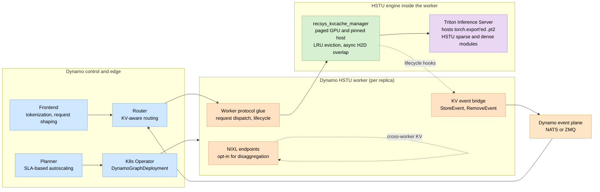
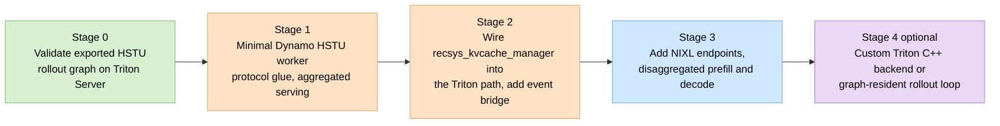
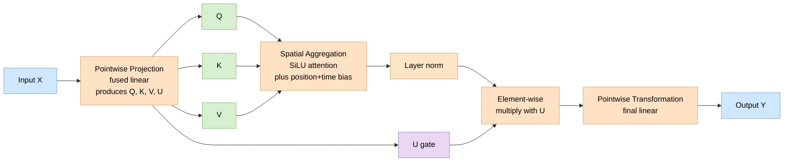
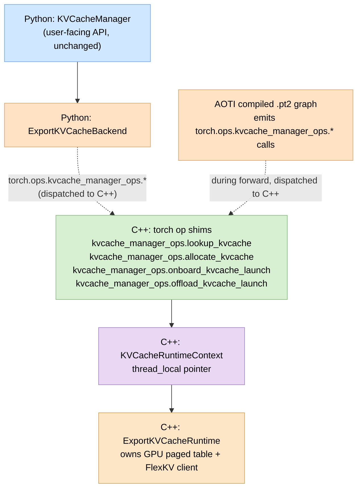

# Dynamo team position: HSTU on Dynamo

Author: Dynamo team
Audience: Shopify HSTU team, internal Dynamo team, anyone evaluating the [HSTU Inference Engine RFC](file:///Users/tzulingk/Downloads/_RFC%20_%20HSTU%20Inference%20Engine.pdf)

## TL;DR

We do not recommend serving HSTU on vLLM. The engine for HSTU should be NVIDIA Triton Inference Server hosting a `torch.export`-ed HSTU model, reusing NVIDIA's existing [`recsys_kvcache_manager`](https://github.com/NVIDIA/recsys-examples/pull/251) for KV cache management. Dynamo's role is the production runtime layer above that engine — request routing, autoscaling, Kubernetes lifecycle, cross-worker KV transfer, observability, and fault tolerance. Dynamo does not run the model, does not manage the KV cache, and does not provide HSTU-shaped orchestration. The engine layer keeps full ownership of those concerns; Dynamo plugs in above it.

## Table of contents

1. [TL;DR](#tldr)
2. [Context](#context)
3. [Why not vLLM](#why-not-vllm)
4. [What 1000 rollouts would look like in vLLM](#what-1000-rollouts-would-look-like-in-vllm)
5. [What it would cost to support HSTU in vLLM](#what-it-would-cost-to-support-hstu-in-vllm)
6. [Why Triton Inference Server is the right engine](#why-triton-inference-server-is-the-right-engine)
7. [Where Dynamo adds value](#where-dynamo-adds-value)
8. [Where Dynamo does not add value](#where-dynamo-does-not-add-value)
9. [Recommended architecture](#recommended-architecture)
10. [KVBM is deferred](#kvbm-is-deferred)
11. [Staging](#staging)
12. [Open questions before Stage 1](#open-questions-before-stage-1)
13. [What we ask of the HSTU team](#what-we-ask-of-the-hstu-team)
14. [Appendix A: ZMQ vs gRPC and why both appear in this stack](#appendix-a-zmq-vs-grpc-and-why-both-appear-in-this-stack)
15. [Appendix B: HSTU architecture and design rationale](#appendix-b-hstu-architecture-and-design-rationale)
16. [Appendix C: How the custom-op bridge works (PR #400)](#appendix-c-how-the-custom-op-bridge-works-pr-400)

## Context

[Meta's HSTU](https://arxiv.org/abs/2402.17152) is a sequence model for recommendation systems. It uses pointwise SiLU attention (not softmax), a learned relative attention bias over both position and time, gated feedforward via element-wise multiplication, and an autoregressive generation pattern over `(item, action)` token pairs rather than text. It is not a language model. The Shopify RFC describes a serving engine for an offline batch workload at scale, producing many autoregressive rollouts per user with a shared prefix KV cache.

NVIDIA's [`recsys-examples`](https://github.com/NVIDIA/recsys-examples) already provides most of the engine pieces. The HSTU model code and the custom attention kernel are there. The `recsys_kvcache_manager` package implements paged GPU plus pinned-host KV with LRU eviction, async layer-wise transfer, and optional nvcomp compression. The model is packaged for AOT-compiled C++ execution via `torch.export` and AOTInductor, producing a self-contained `.pt2` archive.

NVIDIA actually ships several ways to run inference today, and they differ in how they treat KV cache. The Triton Inference Server path uses Triton's Python backend — Triton Server loads the model, and a Python handler in `examples/hstu/inference/triton/hstu_model/model.py` receives each request and invokes the model. The standalone C++ path loads the same `.pt2` directly via AOTInductor's C++ runtime (`inference_hstu_gr_ranking_exported_model` from `examples/hstu/inference/GUIDE_TO_RUN_CPP_INFERENCE_DEMO.md`). And there are Python benchmark paths in `examples/hstu/inference/benchmark/` that drive the paged HSTU layer directly via `recsys_kvcache_manager`.

KV cache integration lives only in the Python benchmark paths today, not in either of the deployable paths. The C++ AOTI demo currently exports the *ranking* variant of HSTU with a fixed-signature input list of `(features.values(), features.lengths(), num_candidates)` — no KV tensors in the model signature, no autoregressive loop, no KV manager involvement. The Triton Server Python-backend handler likewise invokes the dense module with `use_kvcache=False`. The "KV cache enabled" speedups reported in NVIDIA's benchmark README (1.3x–2.6x end to end) are measured in Python benchmarks against the paged HSTU layer, not against either deployable runtime.

For HSTU's *retrieval / rollout* workload — which the Shopify RFC needs — the integration work is real but the right architectural shape is becoming clearer because NVIDIA is actively building the abstraction. The path NVIDIA is implementing in [PR #400 (draft)](https://github.com/NVIDIA/recsys-examples/pull/400), with the design captured in [`EXPORT_KVCACHE_DESIGN.md`](https://github.com/geoffreyQiu/recsys-examples/blob/c633495998983ba331fc23fb2fd32aef0522ea36/corelib/recsys_kvcache_manager/EXPORT_KVCACHE_DESIGN.md), exposes the KV cache lifecycle (lookup, allocate, onboard, offload) as torch custom ops. The actual stateful runtime (`ExportKVCacheRuntime`) lives in C++ outside the AOTI graph. The graph emits calls to these ops at the appropriate points during the forward pass; each op's C++ implementation locates the runtime via a thread-local context (`KVCacheRuntimeContext`) and delegates to it. State management — paging via the GPU table, host-tier offload via FlexKV, async lifecycle — all stays in the C++ runtime; the graph just makes opaque function calls into it. The Python `KVCacheManager` facade in `recsys_kvcache_manager` gets a new `ExportKVCacheBackend` that selects this path during model load.

This is strictly better than the alternative shapes for HSTU on Triton Server. Other options on paper — KV passed as additional input/output tensors with the host wrapper shuttling them in and out per call, or KV state literally compiled into the graph as a static tensor — either force the host wrapper to drive every KV lifecycle step or sacrifice paging, multi-tier storage, and dynamic sizing. The custom-op bridge keeps everything `recsys_kvcache_manager` already provides ([PR #251](https://github.com/NVIDIA/recsys-examples/pull/251): paged GPU and pinned host, LRU eviction, nvcomp compression, async H2D overlap) and adds FlexKV integration on top, without forcing the host to know about any of it. As noted by the PR author, "Triton Server AOTI backend should have very little (maybe none) changes to support this aoti hstu model with kvcache ops." The integration work moves into NVIDIA's `recsys_kvcache_manager` package, where it naturally belongs, instead of into the Triton handler.

PR #400 is currently a draft. Its landing schedule is the relevant gating dependency for the staging plan below.

Dynamo provides distributed-runtime concerns above an engine: a request-aware router, an SLA-based planner, a Kubernetes operator, NIXL-based KV transfer across workers, an event plane for KV lifecycle visibility, and a set of fault-tolerance primitives. It is engine-agnostic by design; today it integrates with vLLM, TensorRT-LLM, and SGLang.

## Why not vLLM

HSTU is not LLM-shaped, and vLLM's primitives are LLM-shaped. The mismatches are concrete and live in several places at once.

**Attention kernel.** vLLM's attention backends in `vllm/v1/attention/backends/` all bake softmax into the kernel; HSTU needs SiLU plus the relative position-and-time bias. This is where the contrast with a compiled-model deployment is sharpest: when HSTU is packaged via `torch.export` and AOTInductor, the kernel ships inside the `.pt2` artifact, the serving runtime never sees it, and NVIDIA has already written it for both L20 and B200. In vLLM, by contrast, the attention kernel lives in the engine, so a new vLLM backend would have to be written and NVIDIA's existing kernel would have to be re-ported into vLLM's backend API.

**Sampler.** vLLM's v1 sampler in `vllm/v1/sample/sampler.py` runs a fixed text-generation pipeline of top-k, top-p, and repetition penalties, none of which map to HSTU's beam-over-item-sub-tokens.

**Beam search.** vLLM's v1 engine does not have native beam search at all. The beam search at `vllm/entrypoints/openai/engine/serving.py:160` is a Python outer loop on top of the per-token generate API, issuing one `engine.generate()` call per beam at every decode step. The outer `for _ in range(max_tokens)` at line 208 is decode steps; the inner `for i, beam in enumerate(all_beams)` at line 212 is beams; each iteration creates an independent `asyncio.create_task` around `engine_client.generate(...)`. In the typical multi-process vLLM topology, that `engine_client.generate(...)` call goes from the API server through `AsyncLLM` to `EngineCoreClient`, which talks to the engine core process over ZMQ (per `vllm/v1/engine/core_client.py:19-20` and `vllm/v1/engine/async_llm.py:146`).

The cost structure of that pattern is the heart of the argument. Each call carries Python interpreter overhead, asyncio dispatch, msgpack serialization, a ZMQ round-trip, and per-request bookkeeping in the engine core's scheduler. For HSTU's workload — B beams × 1000 decode steps × 1000 rollouts × 50M users per day — that per-call overhead becomes the dominant cost, orders of magnitude more expensive than letting the engine batch all beams into a single forward pass at each step. A native engine-side beam search would do exactly that batching; vLLM's API-server-side beam search cannot, because each beam is an independent `generate()` call from the engine's point of view.

**Scheduler and KV layout.** vLLM's scheduler assumes one prefill followed by continuous decode; HSTU's workload is one prefill plus many parallel rollouts sharing that prefix. The KV cache layout in `vllm/v1/kv_cache_interface.py` is compatible for K and V, but the attention kernel that consumes it is not, and the per-token metadata for HSTU's time bias has no home in vLLM's scheduler.

These are not independently fixable items. They are interlocking assumptions: the registry expects a Hugging Face causal-LM shape, the scheduler expects a streaming decode loop, the sampler expects text tokens, the attention backend expects softmax. Replacing one piece means replacing all of them, at which point the result is not vLLM extended for HSTU; it is a new engine built next to vLLM. The RFC's own conclusion that "Language model serving engines such as vllm and sglang are highly optimized for language models and can't easily be extended to support HSTU required output" is accurate.

In fairness, vLLM's model registry has categories beyond text generation, including pooling, embedding, and classification. So vLLM is not exclusively a text-generation engine. The deeper engine assumptions — attention shape, scheduler shape, sampler shape — are what make HSTU not fit, not the registry surface.

## What 1000 rollouts would look like in vLLM

To make the decode-pattern mismatch concrete, consider how HSTU's "one prefix expanded into many coordinated rollouts" would actually be encoded against vLLM's API. The only realistic encoding is to treat each rollout as its own vLLM request, all sharing the same prompt prefix. vLLM's prefix-caching layer deduplicates the prefix KV blocks via reference counting, so prefix memory is shared across the rollouts. Nothing else is shared: each rollout has its own request ID, scheduler entry, and response stream. The scheduler has no notion that these 1000 belong together; continuous batching mixes them with other users' requests and may starve some users by batching too many rollouts from another. At the RFC's scale of 50M users with 1000 rollouts each, this is tens of billions of scheduler entries per day, a ratio that vLLM's request-management code was not designed for.

The underlying issue is that vLLM's API assumes each request is an independent completion. HSTU's rollouts are coordinated, structured, multi-algorithm generations that share a prefix and feed a downstream pipeline as a group. The API surface required to express them does not exist in vLLM.

## What it would cost to support HSTU in vLLM

If the team chose to invest in vLLM anyway, the scope would not be small. A new attention backend in `vllm/v1/attention/backends/` is needed for SiLU plus the position-and-time bias, which means porting NVIDIA's HSTU attention kernel into vLLM's backend API and CUDA-graph plumbing. The scheduler in `vllm/v1/core/sched/scheduler.py` would need to carry per-token timestamps and to model the 1000-rollout fan-out as a first-class request shape — today it would have to be 1000 separate requests per user, with the request-management limits described above. The v1 sampler in `vllm/v1/sample/sampler.py` would need to be replaced by a beam-over-item-sub-tokens primitive, since the current sampler is hard-coded for text generation. HSTU itself would need a new model class in vLLM's registry, with the sparse and dense modules mapped onto vLLM's model-layer abstractions. KV management would have to be reimplemented against vLLM's paged-KV contract, which means setting aside NVIDIA's `recsys_kvcache_manager` (PR #251, with paged GPU and host tiering, nvcomp compression, async H2D overlap, and LRU eviction) and rebuilding equivalent logic inside vLLM.

The result is effectively a new engine living inside vLLM, with no reuse of NVIDIA's existing HSTU code. The kernel and the KV manager would need to be re-ported. And the result is a permanent fork from both vLLM mainline and `NVIDIA/recsys-examples` mainline — every upstream change in either would need manual reconciliation. This is the cost we are recommending against.

## Why Triton Inference Server is the right engine

Triton Server is a generic model server. It has no opinion about the shape of the model — it loads an artifact, exposes inference endpoints, and runs forward calls. Anything the model needs (custom attention, custom inputs like per-token timestamps, custom KV management around forward calls) is the responsibility of the model artifact and the surrounding handler, not Triton Server.

When HSTU is packaged via `torch.export` and AOTInductor into a `.pt2` archive, the custom attention kernel, the relative attention bias lookup, and the read-and-write of paged KV all ship inside the compiled graph. Triton Server treats the model as opaque. NVIDIA already does this for HSTU's ranking variant; extending to retrieval-style rollout is the same machinery applied to a different graph shape.

The autoregressive rollout loop itself is best placed either inside the AOT-compiled graph (using `torch.while_loop`, eliminating all per-step orchestration overhead) or inside a custom Triton Server C++ backend that wraps the AOTInductor model and the KV manager. Implementing the loop in Python or Rust in a Dynamo worker process would mean one gRPC round-trip per decode step, which at 1000 × 1000 tokens per user becomes the dominant cost. Whichever of the two viable options the team picks, Dynamo above it does not change.

## Where Dynamo adds value

Dynamo's contribution is at the layer above the engine. The pieces that map cleanly to the RFC's design follow.

The Dynamo router consumes KV lifecycle events from the event plane and routes new requests toward workers that already hold matching prefix KV. For the HSTU workload, this means same-user or same-shop requests stay sticky to a worker that already has the prefix warm, reducing prefill recomputation across the batch. This is cross-request prefix reuse — distinct from the intra-request shared-prefix optimization that happens inside one Triton call.

The Dynamo planner provides SLA-based autoscaling that can scale prefill and decode worker pools independently. The RFC's design assumes a topology where drivers and engines scale separately; the planner is what implements that operationally. The Kubernetes operator reconciles `DynamoGraphDeployment` resources, manages worker liveness, and integrates with Grove for multinode placement. The RFC otherwise requires designing equivalents.

NIXL provides RDMA-capable, layout-aware KV transfer between workers. For disaggregated prefill and decode, this is what moves KV state from a prefill worker to a decode worker. The RFC describes a gRPC data plane for this; NIXL is the higher-performance substitute that Dynamo already provides.

The event plane (NATS or ZMQ) carries KV lifecycle events for routing, observability, and any third-party storage advisor that wants to subscribe. The same channel feeds metrics, dashboards, and the planner.

Dynamo's fault-tolerance primitives — health checks, graceful shutdown, draining, request cancellation, load shedding — are documented in [`docs/design-docs/architecture.md`](https://github.com/ai-dynamo/dynamo/blob/main/docs/design-docs/architecture.md) and implemented across the existing backends. An HSTU worker that conforms to Dynamo's worker contract inherits them.

Finally, if Shopify later adds another model — an embedding service, a content classifier, a different recsys architecture — Dynamo's frontend, router, planner, and operator are reused. A standalone HSTU stack would require building parallel infrastructure for any second engine.

The shape of the value is: Dynamo turns an HSTU engine into an HSTU service that operates at scale, fails gracefully, and shares operational infrastructure with anything else the team runs. Most of what is HSTU-specific stays in the engine; most of what is not is delegated to Dynamo rather than rebuilt.

## Where Dynamo does not add value

Being explicit about the other half is important for setting expectations. Dynamo does not execute the model — that is Triton Server. Dynamo does not provide an attention kernel — that is NVIDIA's recsys-examples. Dynamo does not provide a KV cache manager — that is `recsys_kvcache_manager`. Dynamo does not provide HSTU-specific orchestration like rollout fan-out, beam search over item sub-tokens, or shared-prefix logic — those live in the engine layer, ideally inside the AOT-compiled graph. Dynamo does not provide tokenization, the sparse embedding module, or the model checkpoints.

The boundary is clean by design. HSTU-specific code stays in the engine and a thin worker shim. Generic distributed-runtime code lives in Dynamo.

## Recommended architecture



The HSTU worker is the only HSTU-specific component in the picture. Everything to its left is generic Dynamo. Inside the worker, the engine layer — `recsys_kvcache_manager` and the Triton Server hosting the `.pt2` archive — is NVIDIA's existing code. The worker protocol glue, the KV event bridge, and the NIXL endpoints are the integration shim that we write.

## KVBM is deferred

Dynamo's KV Block Manager (KVBM) is its multi-tier KV memory abstraction with G1 device, G2 pinned host, G3 local SSD, and G4 remote storage. We do not propose using it for HSTU on day one. The SGLang Dynamo backend ships with [KVBM marked `❌ Planned`](https://github.com/ai-dynamo/dynamo/blob/main/docs/backends/sglang/README.md) and still has disaggregated serving, KV-aware routing, the planner, NIXL transfer, request cancellation, graceful shutdown, and observability all working. HSTU follows the same pattern: the worker uses `recsys_kvcache_manager` for memory, publishes KV events to the event plane for the router, and uses NIXL directly for cross-worker transfer when needed.

KVBM becomes interesting only when the workload needs G3 or G4 tiers, which the RFC's offline batch use case probably does not on day one. Migration to KVBM is a future option, not a current dependency.

## Staging

The work breaks into stages that are each independently deliverable.



Stage 0 produces a retrieval-shaped HSTU export that uses PR #400's `ExportKVCacheBackend`. NVIDIA already exports the *ranking* variant via `torch._inductor.aoti_compile_and_package` (current input signature is `(features.values(), features.lengths(), num_candidates)` — no KV tensors, no decode loop). For the rollout workload, the team's responsibilities at this stage are to contribute to or wait for PR #400 to land in `recsys_kvcache_manager`, then re-export HSTU with the retrieval-shaped forward function — which emits `torch.ops.kvcache_manager_ops.*` calls at the right points in the graph — via the same AOTInductor packaging pipeline. The output is a `.pt2` archive whose graph drives the KV lifecycle through custom ops, plus the `ExportKVCacheRuntime` C++ shared library that handles paging, offload, and FlexKV integration behind those ops. The Triton Server PyTorch backend should be able to load this `.pt2` directly with essentially no HSTU-specific code. Stage 0 is therefore primarily upstream work in `recsys-examples` plus an HSTU-side re-export, rather than new code in Dynamo or the Triton handler.

Stage 1 wraps the validated artifact in a Dynamo worker process that speaks the worker protocol upward and dispatches requests downward to the embedded Triton Server. No KV-aware routing yet, no disaggregation. Aggregated serving works end-to-end. This is the minimum viable Dynamo integration.

Stage 2 publishes KV lifecycle events to Dynamo's event plane so the router can do KV-aware routing. With PR #400's export-friendly backend, the Triton handler side of the work is small: the handler loads the AOTI artifact and calls forward; the KV ops embedded in the graph drive the C++ runtime directly. The new work is bridging `recsys_kvcache_manager`'s lifecycle hooks (block registered, block evicted) into Dynamo's `StoreEvent` / `RemoveEvent` format on the event plane. This is the integration shim that gives HSTU KV-aware routing through Dynamo's router; it is small and Dynamo-shaped, not HSTU-shaped.

Stage 3 adds NIXL endpoints and a separate decode worker pool. Prefill and decode scale independently. This is when the GPU-efficiency benefits of disaggregation materialize.

Stage 4 is optional. With PR #400's design the KV runtime is already in C++ and the Triton backend already has no HSTU-specific code in the hot path, so the per-step IPC overhead that motivated this stage in earlier framings is mostly gone. What Stage 4 could still address is where the *rollout decode loop* itself lives. If the host handler runs the loop, each decode step is a separate forward call into the AOTI graph — simpler, supports streaming output, but pays per-step graph-invocation overhead. If the loop is baked into the AOTI graph via `torch.while_loop`, the host calls forward once per user and the graph runs the entire rollout internally — no per-step graph invocation, but no streaming. Both compose with PR #400's custom-op bridge: the KV ops fire from inside the loop either way. The choice depends on whether the workload needs streaming output (probably not for the offline batch case) and on the maturity of `torch.while_loop` at the 1000-iteration scale (the open question already flagged below).

## Open questions before Stage 1

Four items need a decision before committing to Stage 1.

The first and most direct dependency is the landing schedule of [PR #400](https://github.com/NVIDIA/recsys-examples/pull/400) into `recsys_kvcache_manager`. PR #400 is a draft at the time of writing. Stage 0 cannot complete until it lands or until the team builds on a fork. We should engage with the PR author or the `recsys-examples` maintainers early to align on timeline, scope of the initial merge, and any interfaces that we would consume.

The second is the Triton Server backend choice. NVIDIA's existing Triton path uses the Python backend. With PR #400, the in-handler work shrinks dramatically — the handler effectively becomes "load the `.pt2`, call forward" — which makes Triton's PyTorch backend (which can load PT2 archives directly as of r26.03) a more natural fit than the Python backend for the long-term path. The Python backend is still the right Stage-1 starting point because it's easier to debug and there's no pressure to optimize the handler yet, but the PyTorch backend is where Stage 4 may land.

The third is the maturity of `torch.while_loop` at the 1000-iteration scale needed for an in-graph rollout loop. The pattern is supported in modern PyTorch but should be validated with a prototype before committing to graph-resident decode at Stage 4. If it falls short, the alternative is to keep the rollout loop in the Triton handler and pay the per-step graph-invocation cost.

The fourth is how HSTU's sparse embedding module scales alongside the dense Dynamo workers. NVIDIA's existing deployment runs one sparse instance per node, serving multiple dense workers. How this maps to Dynamo's worker model — colocated sidecar, separate Dynamo worker type, or external embedding service — is a real design question that deserves its own discussion. The clean answer is probably a separate embedding worker type that dense workers query, but that introduces a network hop per inference, which has implications for the planner's latency targets.

## What we ask of the HSTU team

We do not propose to take over the engine. We do not propose to migrate any existing NVIDIA code. The asks are narrow.

Engage with the [PR #400](https://github.com/NVIDIA/recsys-examples/pull/400) author and the `recsys-examples` maintainers on timeline and scope. PR #400 is the gating dependency for Stage 0; if it lands soon, the rest of the staging plan moves fast. Confirm the engine choice (Triton Server hosting the `.pt2` archive) and the deferral of KVBM. Validate Stage 0 in isolation so the retrieval-shaped export with `ExportKVCacheBackend` is known to work before Dynamo wraps it. Collaborate on the worker protocol glue (Stage 1) and the KV event bridge (Stage 2) — these are the integration touchpoints that remain after PR #400 absorbs the heavy lifting. Defer Stage 4 until production traffic gives concrete signals about where the bottlenecks actually are.

Everything else stays where it is.

## Appendix A: ZMQ vs gRPC and why both appear in this stack

A peripheral question that came up during this work was whether the choice between ZMQ and gRPC affects the cost argument against vLLM's beam search, and more generally why both transports show up in the HSTU and Dynamo picture. This appendix summarizes what we found.

In general, ZMQ is faster than gRPC for raw message throughput and per-call latency, especially in the high-message-rate, intra-process or intra-host scenarios that an inference engine cares about. Published benchmarks ([Libelli, "Messaging Throughput gRPC vs. ZMQ"](https://bbengfort.github.io/2017/09/message-throughput/); [Comparative Analysis of gRPC vs ZeroMQ for Fast Communication](https://www.researchgate.net/publication/389078536_Comparative_Analysis_OF_GRPC_VS_ZeroMQ_for_Fast_Communication)) all show ZMQ winning on throughput. The qualitative reasons behind those numbers are stable across implementations and matter more than any specific microsecond figure.

The reason is that the two systems live at different layers of abstraction. ZMQ is a raw messaging library: a message is a framed blob of bytes over a TCP, IPC, or in-process socket, with no application-layer protocol on top. The application brings its own serialization — vLLM uses msgpack, Dynamo's event plane uses whatever the publisher chooses. gRPC, in contrast, is an RPC framework: every call passes through HTTP/2 framing, protobuf marshalling, service descriptor resolution, status-code propagation, deadline tracking, and depending on configuration, interceptors, TLS, and load-balancer hooks. Per call, gRPC adds layers of overhead that ZMQ simply does not have. For small messages — the typical case in intra-process IPC — that overhead is a meaningful fraction of total time. For large messages the overhead amortizes better but ZMQ still wins. A useful intuition is that ZMQ is closer to "fancy sockets with framing" while gRPC is closer to "HTTP, but binary and well-typed"; the HTTP heritage is what makes gRPC heavier.

The overhead is sometimes worth paying. gRPC provides things ZMQ does not: typed service contracts via `.proto` with generated client and server code in many languages, standardized status codes and error semantics, deadlines and timeouts as first-class concepts, clean unary and streaming patterns with backpressure, a developed ecosystem of interceptors, auth, and observability (OpenTelemetry, gRPC reflection), and first-class load balancing and service discovery (xDS, gRPC-LB). When communication crosses service boundaries — different teams, different languages, public API surface — the contract and tooling matter more than the per-call latency, and gRPC is almost always the right choice.

This is why both transports appear in the HSTU and Dynamo stack. ZMQ is used inside vLLM between the API server and the engine core (per `vllm/v1/engine/core_client.py:19-20` and `vllm/v1/engine/async_llm.py:146`), and as one of the two supported transports on Dynamo's event plane alongside NATS. NIXL handles the high-throughput KV-cache transfer path with its own custom protocol on top of RDMA, separate from either of these. gRPC, in contrast, appears at the boundaries where external clients call into the stack. Triton Inference Server's public inference API supports gRPC alongside HTTP/REST. Dynamo's frontend exposes KServe-compatible gRPC endpoints (`ModelInfer`, `ModelStreamInfer`, `ModelMetadata`, `ModelConfig`) in parallel with its OpenAI-compatible HTTP endpoints. In both cases, gRPC is the protocol facing external callers, not the internal hot path.

The implication for the cost argument against vLLM's beam search (laid out in the "Why not vLLM" section above) is small. The per-call overhead breakdown there — Python, asyncio, msgpack, the IPC round-trip, and engine-core scheduler bookkeeping — has the same asymptotic shape regardless of whether the IPC component is ZMQ or gRPC. The transport choice changes the constant factor by some amount, but the dominant cost at HSTU's scale (B beams × 1000 decode steps × 1000 rollouts × 50M users per day) is the per-call structure of "one engine round-trip per beam per step," not the wire protocol carrying it. ZMQ versus gRPC is a constant-factor question; the asymptotic problem with the beam search shape is independent of which transport carries the calls.

## Appendix B: HSTU architecture and design rationale

This appendix expands on what HSTU is and why it is designed the way it is. The main body of this document takes HSTU's shape as given when arguing against vLLM and for Triton plus Dynamo. Anyone wanting to evaluate those arguments without having read the underlying [HSTU paper](https://arxiv.org/abs/2402.17152) (Zhai et al., "Actions Speak Louder than Words: Trillion-Parameter Sequential Transducers for Generative Recommendations," ICML 2024) will find the relevant facts here.

### What HSTU is

HSTU stands for **Hierarchical Sequential Transduction Unit**. It is a sequence model architecture introduced by Meta for industrial-scale recommendation systems. The paper's central reframing is that recommendation problems — both ranking and retrieval — can be cast as generative modeling over user action sequences, in the same way GPT models cast text problems as next-token prediction.

A user's history becomes a sequence of `(item, action)` token pairs: the items the user has interacted with (videos, posts, products), interleaved with the actions taken on them (like, skip, complete, share). Item tokens are drawn from a vocabulary that may contain billions of items, and action tokens are drawn from a much smaller vocabulary of interaction types. The model learns to predict the next token autoregressively. The two main recsys tasks reduce to next-token prediction in this framing: predicting the next item the user will want is the retrieval task; predicting the user's next action on a known candidate item is the ranking task.

The motivating problem the paper raises is that traditional Deep Learning Recommendation Models (DLRMs) saturate in quality as compute increases. Doubling the training compute on a DLRM does not double the metric improvement, and beyond a certain scale the marginal returns flatten. HSTU shows that recasting recsys as sequential transduction makes it follow the same scaling-law behavior as LLMs — quality scales as a power law of training compute across three orders of magnitude, up to the GPT-3 / LLaMa-2 scale. The deployed model at Meta is 1.5 trillion parameters and produced a 12.4 percent improvement in online A/B tests, according to the paper.

### Three sub-layers

Each HSTU layer consists of three sub-layers, defined by equations 1 through 3 of the paper.



The **Pointwise Projection** is a single fused linear layer that projects the input `X` into four tensors `U, V, Q, K`. `Q` and `K` are queries and keys, `V` is values (as in a standard transformer), and `U` is an extra gating tensor used in the third sub-layer. The **Spatial Aggregation** is the attention operation `A(X)V(X) = φ_2(Q K^T + rab^{p,t}) V`, where `φ_2` is SiLU (not softmax) and `rab^{p,t}` is a learned relative attention bias over both position and time. The **Pointwise Transformation** layer-norms the attention output, multiplies it element-wise by the gate `U`, and passes the result through one more linear projection.

Compared to a standard transformer block — attention followed by a feedforward with two linear layers and a separate residual path — an HSTU block has fewer linear layers and a simpler shape. The paper reports two linear layers outside attention in HSTU versus six in a transformer block.

### Why each design choice

The motivation behind each choice is worth understanding, because it explains why HSTU cannot be served on an LLM-shaped engine without rebuilding the engine.

The fusion of `Q`, `K`, `V`, and `U` into one linear layer is a memory-bandwidth optimization, not a Python-dispatch one. On modern GPUs, the bottleneck for transformer-like models is HBM bandwidth, not raw compute. Reading `X` from HBM once and emitting four projections from a single fused kernel reduces the number of HBM round-trips per layer; the same trick is what FlashAttention does for the attention computation itself. The paper measures HSTU's attention as memory-bound and scaling with memory accesses, which is the signature of an HBM-traffic-driven design.

SiLU instead of softmax in attention is the most distinctive HSTU choice, and the one that most directly breaks compatibility with LLM-shaped engines. Softmax normalizes attention scores to sum to one, which destroys intensity information. If a user has many strong sports-related items in history, softmax flattens those to roughly the same weight as a user with only a few strong sports items. For recsys, the count itself is a signal — it indicates preference strength — and the downstream prediction is often about intensity (time spent, click-through rate, completion likelihood), not just relative ordering. Softmax is also fragile on non-stationary vocabularies: its denominator depends on the set being normalized over, and recsys vocabularies change continuously as new items appear. A pointwise activation like SiLU has neither problem. The paper reports a 44.7 percent quality gap between softmax and pointwise attention on synthetic streaming data.

The relative attention bias over position and time (`rab^{p,t}`) reflects a fundamental difference between language modeling and recsys. In language, position is the only thing that matters — token 5 is always token 5. In recommendation, both position and elapsed real time matter independently. A user's behavior two weeks ago is much weaker signal than behavior two minutes ago, even if both are five positions back in the sequence. Standard transformer positional encodings — sinusoidal, RoPE, ALiBi — encode position only. HSTU's `rab^{p,t}` encodes both, indexed by the pair `(relative_position, relative_time)` into a learned bias table. The per-token timestamp metadata required for this has no natural home in vLLM's scheduler, which tracks position only.

HSTU replaces the standard transformer's feedforward block (linear, activation, linear) with element-wise multiplication of the attention output by the gate `U` from the projection step. The paper notes this is structurally similar to SwiGLU. The motivation is that recsys-style feature interaction — the explicit pairwise combination of features that DLRMs spend most of their parameters on — emerges naturally from `Norm(A·V) ⊙ U`. Each dimension of `U` decides how much of that dimension's attention output to keep, which is exactly the gating pattern that DLRMs achieve through much larger MLP stacks.

Fewer linear layers and lower activation memory matter because recsys training uses very large batch sizes for quality reasons, which makes activation memory — not parameter memory — the dominant scaling bottleneck. The paper measures HSTU's per-layer activation footprint at roughly 14 times the embedding dimension in bf16, compared to roughly 33 times for a standard transformer. This is what allows HSTU to stack more than twice as many layers in the same GPU memory budget.

Stochastic Length training handles the extreme sparsity of long user sequences. Most users have short histories; a few have very long ones. During training, HSTU randomly downsamples long sequences to length proportional to a power of the maximum sequence length, which makes attention scale subquadratically without harming quality. At the paper's recommended hyperparameter (α=1.6), this gives roughly 84 percent compute sparsity on length-8192 sequences while removing more than 80 percent of the tokens on average, with negligible quality impact (paper Table 3 and §3.2).

### Why beam search applies to HSTU and not (typically) to LLMs

The HSTU paper supports beam search top-B as one of its generation algorithms. This is somewhat surprising because the LLM community has largely moved away from beam search in favor of sampling. The reasons HSTU is different are worth understanding.

For LLMs, beam search has fallen out of favor for several reasons. Beam search tends to produce bland, repetitive text because the most-probable continuation of a repetitive sequence is often more of the same, a degeneration documented in [Holtzman et al. 2019, "The Curious Case of Neural Text Degeneration"](https://arxiv.org/abs/1904.09751). For open-ended generation tasks like creative writing or chat, the mode of the distribution is rarely what humans want; sampling-based methods like nucleus (top-p) sampling produce more diverse and human-preferred output. RLHF and instruction tuning sharpen the distribution enough that greedy or low-temperature sampling already works well. And beam search is expensive: B parallel decode streams per request, B times the KV cache and compute.

For HSTU and recsys, the picture is different. The output is not open-ended creative content — there is a correct answer to "what should this user see next," in the sense that downstream metrics measure expected engagement and reward, and the mode of the distribution is genuinely what you want. Repetition is not a pathology in recsys; recommending similar items is often reinforcement of a preference, not failure. And returning multiple candidates is the whole point — recsys retrieval surfaces top-K items for a downstream ranker to score, so producing B candidates per call is desirable, not wasteful.

There is also a subtler architectural reason. In HSTU's retrieval setup, items are represented as short sequences of sub-tokens (a small alphabet drawn from item-ID quantization). Generating one item is therefore not one decode step but several. Greedy decoding on the first sub-token can permanently lock the model out of categories that would have produced better items overall — beam search keeps options open across sub-token steps, which is exactly the case where it shines. This is also why a generic LLM beam search implementation does not give HSTU what it needs: HSTU's beam is over *items* (each represented by multiple sub-tokens), not over flat tokens. The beam tree has a different branching structure than vLLM's flat-token beam expects.

### What "1000 rollouts × 1000 tokens per user" means

The RFC's headline workload of 1000 rollouts × 1000 tokens per user, across 50 million users per day, is best understood as a Monte Carlo simulation of the user's future. Each rollout is a 1000-token autoregressive continuation of the user's real history, simulating what the user might do over a long virtual time horizon. Running 1000 of them gives a fan of plausible future trajectories that downstream stages average over to estimate things like expected long-term engagement under different recommendation strategies, or to simulate merchant journeys for shop-level use cases.

The shared-prefix optimization is what makes this tractable. The user's real history is the same across all 1000 rollouts, so its KV state is computed once during prefill and broadcast across the 1000 batch positions during decode. Each rollout pays only for its own divergent suffix. This is the optimization the RFC's "Engine Core" component is built around, and the same optimization that NVIDIA's `recsys_kvcache_manager` implements at the block level. It also happens to be a pattern that fits a `torch.export`-ed graph extremely well: prefill is one batch element, decode is 1000 batch elements with prefix-broadcasting attention, and the whole rollout pipeline can become one forward call.

This batch-style, Monte-Carlo-flavored workload is what makes HSTU's serving requirements different in kind from a chat LLM, not just in scale. A chat LLM serves one user with one prompt and one streaming response. HSTU's offline batch path serves one user with one prefix and 1000 coordinated non-streaming rollouts going to a downstream pipeline. The API contracts and the scheduling models for those two workloads are fundamentally different. This is the root reason most of this document's arguments end where they do.

## Appendix C: How the custom-op bridge works (PR #400)

The Context section above takes [PR #400](https://github.com/NVIDIA/recsys-examples/pull/400)'s custom-op bridge design as given when arguing that it is the right path for HSTU on Triton Server. This appendix explains how that bridge actually works for readers who haven't read the [`EXPORT_KVCACHE_DESIGN.md`](https://github.com/geoffreyQiu/recsys-examples/blob/c633495998983ba331fc23fb2fd32aef0522ea36/corelib/recsys_kvcache_manager/EXPORT_KVCACHE_DESIGN.md) directly, or who find the mechanics counterintuitive.

### The misconception worth clearing first

The single concept that unlocks the whole design: **a "torch custom op" is a C++ function wearing a Python costume.** Model authors write `torch.ops.kvcache_manager_ops.lookup_kvcache(...)` in Python, and PyTorch's dispatcher routes that call to a C++ function that has been registered under that name. The "torch op" label is a dispatcher registration, not a language constraint. Once you see this, every other aspect of the design follows.

In C++, the registration looks something like:

```cpp
// my_kv_ops.cpp
at::Tensor lookup_kvcache_impl(const at::Tensor& user_ids,
                               const at::Tensor& seq_lens) {
    auto runtime = KVCacheRuntimeContext::instance().runtime();
    return runtime->lookup_kvcache(user_ids, seq_lens);
}

TORCH_LIBRARY(kvcache_manager_ops, m) {
    m.def("lookup_kvcache(Tensor user_ids, Tensor seq_lens) -> Tensor",
          &lookup_kvcache_impl);
}
```

Calling `torch.ops.kvcache_manager_ops.lookup_kvcache(...)` from Python invokes that exact C++ function. The C++ function can do whatever C++ can do — read from globals, launch CUDA kernels, talk to other processes, anything. The compiler does not introspect the implementation. It only needs the op name, the input and output tensor signatures (verified via a FakeTensor / Meta kernel that returns the right shape and dtype without running the op), and any side-effect annotations.

### Terminology: what "runtime" means here

The word "runtime" is overloaded in software — the same word means very different things at different layers. Before going further, it is worth pinning down which one this appendix is talking about.

In this design, "runtime" means **the C++ object that owns the KV cache state and provides the actual implementation of the KV operations.** That is application-defined nomenclature; NVIDIA's team chose the name. It is *not* any of the other things the word is sometimes used for. Specifically: the CUDA runtime is NVIDIA's `libcudart.so` library (kernel launch and `cudaMalloc`-style APIs); the PyTorch runtime is `libtorch.so` (tensor types, dispatcher, autograd, standard ops); the AOTI runtime is the library that loads and executes `.pt2` archives (`AOTIModelPackageLoader` and friends); the Triton runtime is the Triton Inference Server process itself. None of those are what `ExportKVCacheRuntime` is. They are background context that happens to share the word.

The design names three things with "Runtime" in them, and each plays a different role:

- `IKVCacheRuntime` is an **interface** — an abstract C++ class that declares which methods must exist (`lookup_kvcache`, `allocate_kvcache`, `offload_kvcache_launch`, and so on). It has no implementation. It is just a contract: "a KV runtime must support these operations."
- `ExportKVCacheRuntime` is the **concrete implementation** of that interface. This is the class that has working code and owns the stateful machinery — the GPU paged cache table, the FlexKV client connection, threads and CUDA streams. When something calls `runtime->lookup_kvcache(...)`, this is the class doing the work.
- `KVCacheRuntimeContext` is **not a runtime**. The name is unfortunate. It is a small thread-local helper whose only job is to hold a pointer to whichever runtime is current for the calling thread. It does no KV work itself; it is the lookup mechanism that lets the op shims find the runtime without taking it as an explicit argument.

So when the rest of this appendix talks about "the runtime," it almost always means `ExportKVCacheRuntime` — the concrete C++ object that owns state. The interface and the context are supporting cast.

### The lifecycle

`ExportKVCacheRuntime` lives in a C++ shared library that loads alongside the AOTI artifact. Its lifecycle has three phases.

**Setup phase, once per model load.** Host code (the Triton Server handler that loads the model, or the equivalent harness in a standalone runtime) creates an `ExportKVCacheRuntime` instance. This object owns the GPU paged KV cache table, the FlexKV client connection, and any other stateful machinery the design carries. To make the runtime reachable from the torch op shims that the AOTI graph will call into, the host stores a pointer to the runtime inside a small C++ helper called `KVCacheRuntimeContext`. `KVCacheRuntimeContext` is a singleton-style class whose only job is to hold the current runtime pointer, and the storage inside it is declared `thread_local` so every OS thread gets its own private copy. The next subsection explains why thread-local is the right choice here.

**Per-request hot path.** Host code receives a request and calls `forward(...)` on the AOTI-compiled graph. The graph executes its ops in sequence. When it reaches a node that calls `torch.ops.kvcache_manager_ops.lookup_kvcache(user_ids, seq_lens)`, PyTorch's dispatcher routes the call to the registered C++ function. That C++ function reads the current `ExportKVCacheRuntime` pointer out of `KVCacheRuntimeContext::instance()`, invokes `runtime->lookup_kvcache(...)`, and returns the tensor result back into the graph. The graph continues executing as if nothing unusual happened. The same mechanism handles `allocate_kvcache`, `onboard_kvcache_launch`, `offload_kvcache_launch`, and `offload_kvcache_reap_completed`. State management, host-side work, IPC to FlexKV, async CUDA streams — all of it happens inside the runtime, behind opaque op boundaries.

**Teardown phase.** After the request completes, host code clears the thread-local context so the next request can set up fresh state if needed.

### Why thread-local, and does each thread have its own runtime

Three reasons make thread-local the right choice for the runtime pointer.

**Multi-tenancy within one process.** A production node may run more than one inference instance: different model versions, different replicas, or a Triton Server hosting multiple HSTU models side by side. Each instance has its own `ExportKVCacheRuntime` because each owns its own GPU cache table and FlexKV client. A single global pointer would have to be hot-swapped on every transition between instances, with a mutex to keep readers and writers from racing. Thread-local sidesteps this entirely: the thread that handles instance A's request sees instance A's pointer, the thread that handles instance B's request sees instance B's pointer, and neither has to coordinate with the other.

**Lock-free access on the hot path.** Every torch op call reads the runtime pointer at least once. If the pointer lived behind a mutex, every op call would pay lock-acquisition cost — meaningful at the rates an inference engine sees. Thread-local reads are essentially free: the compiler generates a small offset relative to the thread's TLS block, with no atomic operations involved.

**Schema cleanliness.** The alternative to context-based lookup is passing the runtime as an explicit argument to every custom op call. That pollutes both the model code (every `lookup_kvcache(user_ids, seq_lens)` would also need to carry a `runtime_handle` tensor) and the graph signature (every op gets an extra parameter that does not represent actual data flow). Thread-local keeps the schemas clean and the model code natural.

Does each thread have a *unique* runtime? **No — the relationship is between threads and pointer slots, not between threads and runtime objects.** Each thread has its own pointer slot, but multiple threads serving requests for the same inference instance set their slots to the same runtime object. Multiple threads serving requests for *different* instances set their slots to different runtimes. The runtime itself can be shared across threads as long as its implementation is thread-safe, which is straightforward because the runtime owns mutable state it can guard internally. So thread-locality is about *isolation* (one thread's choice does not bleed into another's) rather than *uniqueness* (each thread needs its own runtime).

There is one scenario thread-local does not handle: multiple inference instances interleaving on a single thread, such as cooperative scheduling inside one OS thread. §6 of the design doc acknowledges this and proposes adding an explicit `context_id` op argument as a future extension if that pattern becomes necessary. For the single-thread-per-inference-call model that Triton Server uses, thread-local is the right tool. Setting and clearing the context around each forward call is captured in the design doc as an RAII helper (§9) so the host code does not have to remember it manually.

### Why a compiled graph can contain CPU work

Another misconception worth correcting. A torch compiled graph operates on tensors, and each tensor has a device (CUDA, CPU, etc.). Standard ops in the graph have device-specific implementations — `aten::matmul` on a CUDA tensor runs the CUDA kernel, the same op on a CPU tensor runs the CPU kernel. Even in a "GPU model," there are typically CPU tensors flowing alongside CUDA tensors (token indices, sequence lengths, position metadata) with explicit device conversions where needed.

For custom ops the situation is even looser. The C++ implementation can do anything regardless of where its input tensors live: launch CUDA kernels, do CPU compute, mix both, talk to other processes, use multiple CUDA streams. The compiler does not introspect the implementation. So when `offload_kvcache_launch` is called, the graph is not "doing CPU work" in any meaningful sense — it is making a function call to a C++ function that happens to kick off D2H copies and FlexKV writes on background threads. The graph node is just `(call function named offload_kvcache_launch, here are the tensor inputs, expect these tensor outputs)`. The CPU work happens inside the function, not "in the graph."

### How "preserved as opaque" actually works

Custom ops registered via `TORCH_LIBRARY` or `torch.library.custom_op()` are treated as opaque throughout the compilation stack, with one important caveat. Opacity is maintained only when the op is properly registered with a FakeTensor or Meta kernel — a small implementation that the compiler can call to learn the output shape and dtype without running the real op. Without that registration, the compiler may try to decompose the op into smaller primitives, or fall back to less efficient paths, or fail.

§7 of the design doc explicitly requires shape-compatible Meta behavior on every exported op, which is exactly the registration discipline that preserves opacity. With this discipline in place, the AOTI-compiled `.pt2` archive contains opaque function-call nodes wherever the model code called `torch.ops.kvcache_manager_ops.*`. At runtime, the C++ shared library that ships alongside the `.pt2` provides the implementations of those ops.

There is a known sharp edge with `@torch.library.custom_op` decorators not always surviving `torch.export.export()` + C++ runtime execution ([pytorch/pytorch#143786](https://github.com/pytorch/pytorch/issues/143786)). The issue is that the C++ runtime sometimes cannot find the op's schema. This is solvable by registering the op via `TORCH_LIBRARY` in C++ rather than via the Python decorator, which is what NVIDIA's design uses.

### The role of recsys_kvcache_manager in this picture

`recsys_kvcache_manager` is the package that holds all of this. Per the design doc, the Python layer now contains:

- `KVCacheManager` — the user-facing API. Inference code interacts with this. The public interface is unchanged from earlier versions of the package.
- `KVCacheBackend` — an abstract interface that lets the manager swap implementations.
- `DefaultKVCacheBackend` — the pre-PR-400 path, with stateful logic in Python.
- `ExportKVCacheBackend` — the new export-friendly path that calls torch custom ops instead of doing Python-side bookkeeping.

The C++ layer contains:

- `IKVCacheRuntime` — abstract C++ runtime interface.
- `ExportKVCacheRuntime` — concrete implementation that holds the GPU paged table and the FlexKV client.
- `KVCacheRuntimeContext` — the thread-local context holder described above.

So `recsys_kvcache_manager` owns the public `KVCacheManager` API, the backend selection, and the runtime lifecycle. Loading the model in export mode triggers `ExportKVCacheRuntime` creation, and the package's setup code stuffs the runtime pointer into `KVCacheRuntimeContext` before the model's forward call. The package's teardown clears the context. During the per-request hot path, the Python layer is not really involved — the AOTI graph calls torch custom ops directly into the C++ runtime via the context.



Two entry points hit the same C++ runtime, and they are used at different times.

**The graph drives the hot path during forward.** When the AOTI-compiled model runs forward, its graph emits `torch.ops.kvcache_manager_ops.*` calls at the right points in the decode pipeline. Each op dispatches to its C++ shim, which finds the runtime via `KVCacheRuntimeContext` and invokes it. No Python is involved on this path. This is the route that runs many times per request and is the one that matters for performance.

**Python drives everything outside forward.** When inference code calls `KVCacheManager.lookup_kvcache(...)` from Python — for example to pre-populate the cache during warm-up, to validate state during health checks, to query cache occupancy for metrics, or to flush blocks during teardown — the manager delegates to `ExportKVCacheBackend`, which calls the same torch ops, which dispatch to the same C++ shims, which invoke the same runtime via the same context. The Python interface exists so that the host (or test, debug, or operational tooling) can talk to the KV state the graph operates on without having to go through a forward call.

Both routes find the same `ExportKVCacheRuntime` instance via `KVCacheRuntimeContext`, so the state stays consistent across them. The unified API is the point: there is one runtime per inference instance, and every caller — graph or Python — reaches it the same way.

### Why this matters for the design

The whole bridge exists to give a torch.export-compatible model the ability to drive a stateful, paged, multi-tier KV cache without violating the export contract. Torch.export requires that everything in the graph be expressible as ops with tensor inputs and outputs. State, allocation, IPC, and async background work cannot live inside the graph as ordinary computation. By wrapping them as opaque custom ops with C++ implementations, the design has the graph emit "tell the runtime to do X" calls at the right points, while the runtime (which is plain C++ outside the graph) does the actual work. The result is the best of both worlds: an AOTI-compiled model that ships as a single `.pt2` artifact, runs through any AOTI-aware runtime (including the Triton Server PyTorch backend) with essentially no integration code, and still benefits from paging, host-tier storage, async offload, and every other capability `recsys_kvcache_manager` provides.

This is the same pattern vLLM uses for paged attention, generalized to cover the entire KV cache lifecycle. The novelty is the systematic application to a torch.export workflow — keeping the model code unchanged while letting the export pipeline see and inline the right tensor operations and only the right tensor operations.
