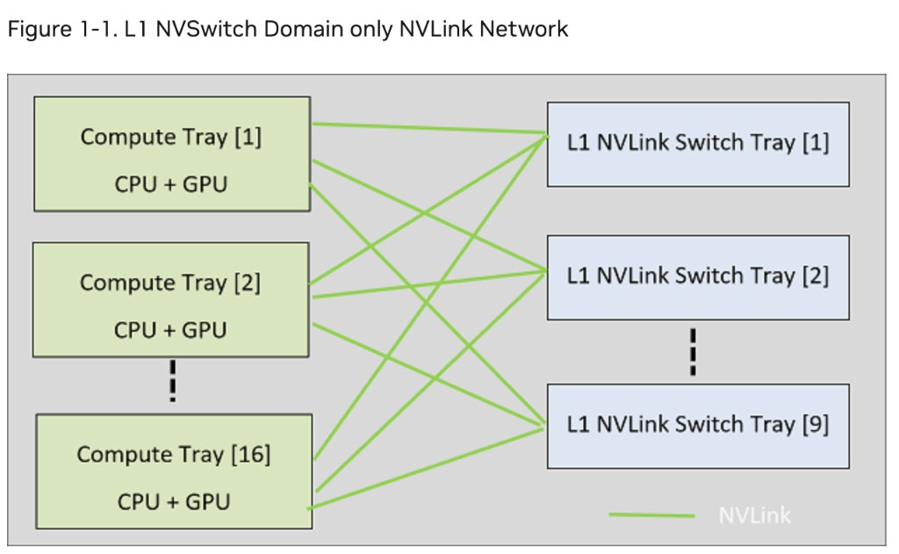
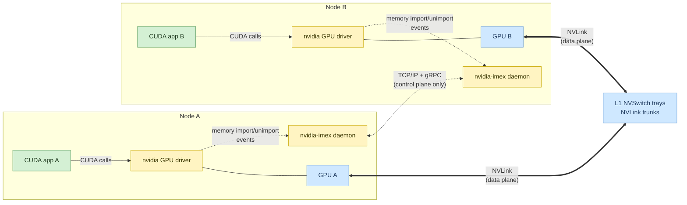
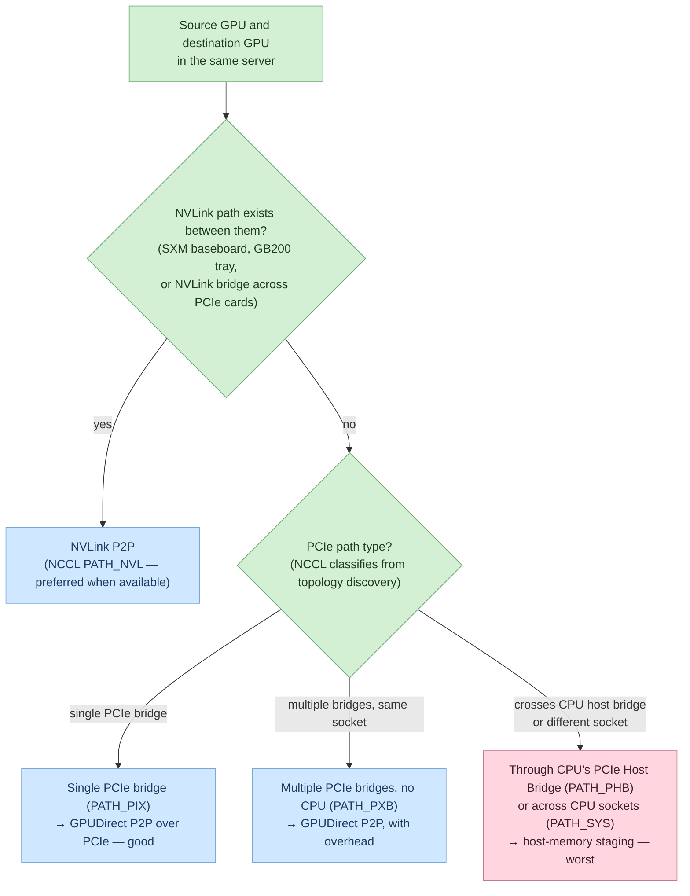
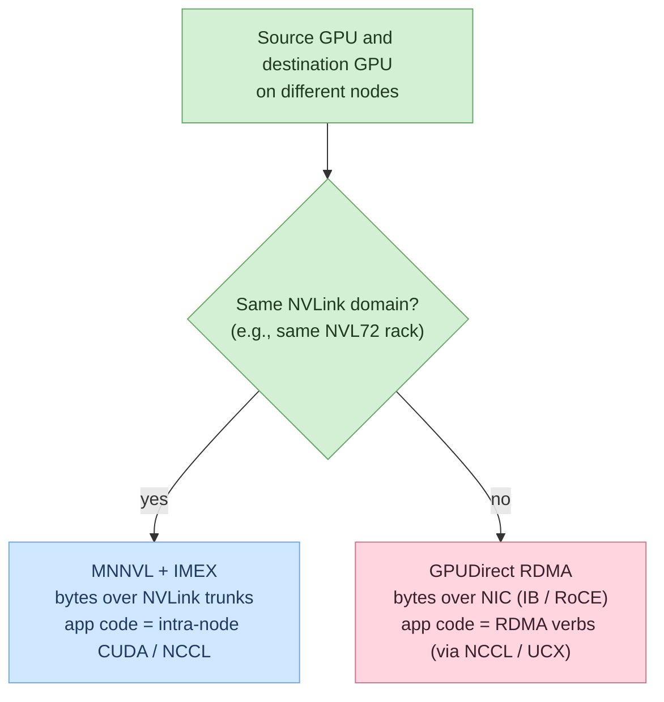
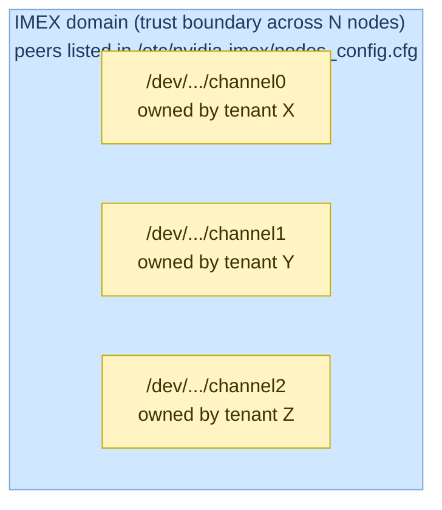

# Understanding IMEX, IMEX Channels, and ComputeDomain

A beginner-friendly walkthrough of how multi-node NVLink memory sharing actually works on NVIDIA systems like GB200 NVL72, how that maps to `/dev/nvidia-caps-imex-channels/`, and how Kubernetes hides the whole thing behind the `ComputeDomain` custom resource. Every non-obvious claim links to its source.

---

## Table of Contents

- [TL;DR](#tldr)
- [The hardware problem we're solving](#the-hardware-problem-were-solving)
- [What IMEX actually is](#what-imex-actually-is)
- [Where IMEX/MNNVL sits vs. RDMA and GPUDirect](#where-imexmnnvl-sits-vs-rdma-and-gpudirect)
- [IMEX domain vs. IMEX channel](#imex-domain-vs-imex-channel)
- [Why `/dev/nvidia-caps-imex-channels/` is empty by default](#why-devnvidia-caps-imex-channels-is-empty-by-default)
- [Where ComputeDomain comes in (Kubernetes)](#where-computedomain-comes-in-kubernetes)
- [What you actually see on the cluster](#what-you-actually-see-on-the-cluster)
- [Glossary](#glossary)
- [References](#references)

## TL;DR

In NVLink-connected multi-node systems — the prototypical example today being NVIDIA GB200 NVL72 — GPUs on different physical nodes can read and write each other's memory directly over NVLink, but only if a privileged broker has set up the cross-node memory mappings first. That broker is **IMEX**, a systemd daemon called `nvidia-imex`. An **IMEX channel** is a `/dev/nvidia-caps-imex-channels/channelN` character device that gates *which Linux user or container* is allowed to participate in that cross-node memory sharing; a fresh node deliberately ships with zero channels created because they are a security primitive, not a hardware enumeration. On Kubernetes, the **ComputeDomain** custom resource (provided by NVIDIA's DRA Driver for GPUs) is the abstraction that makes all of this happen automatically: when a user submits a workload tied to a ComputeDomain, the DRA driver spins up the IMEX daemons on the chosen nodes, creates a single IMEX channel for the job, injects it into the container as `/dev/nvidia-caps-imex-channels/channel0`, and tears the whole thing down when the job finishes.

## The hardware problem we're solving

For a long time, NVLink was a single-node concept: a high-bandwidth, low-latency interconnect that lets the GPUs *inside one server* read and write each other's memory directly. With **Multi-Node NVLink (MNNVL)**, NVLink extends across multiple compute nodes through L1 NVSwitch trays, and a set of physical servers behaves like one large accelerator with a shared memory fabric. The flagship example is the GB200 NVL72 rack, which exposes NVLink as a fabric spanning many compute trays inside one (or two) racks ([IMEX overview](https://docs.nvidia.com/multi-node-nvlink-systems/imex-guide/overview.html)).

The name "GB200 NVL72" itself bundles two layers that are easy to conflate. **GB200** alone refers to the *Grace Blackwell Superchip*: a single chip module that pairs one Grace CPU with two Blackwell GPUs, connected inside the module by **NVLink-C2C** (where *C2C* stands for *Chip-to-Chip* — a package-level die-to-die link, distinct from the board-level NVLink that connects GPUs through NVSwitches) ([NVIDIA NVLink-C2C page](https://www.nvidia.com/en-eu/data-center/nvlink-c2c/)). **NVL\<N\>** is NVIDIA's naming for Blackwell-generation rack-scale systems that bundle multiple superchips into one unified NVLink domain, where the number `<N>` is the GPU count in that domain. **GB200 NVL72** is therefore the specific rack-scale product that combines 36 GB200 superchips (= 36 Grace CPUs + 72 Blackwell GPUs) into a single 72-GPU NVLink domain; **GB200 NVL36** is its smaller half-rack sibling, and **GB300 NVL72** is the equivalent rack built from the next-generation Blackwell Ultra GPUs ([NVIDIA GB200 NVL72 page](https://www.nvidia.com/en-us/data-center/gb200-nvl72/), [NVIDIA Technical Blog](https://developer.nvidia.com/blog/nvidia-gb200-nvl72-delivers-trillion-parameter-llm-training-and-real-time-inference/)). When this document says "the GB200 NVL72 rack," it always means the rack-scale system — the NVL72 part is where the cross-node NVLink fabric (and therefore IMEX) lives, while the GB200 chip alone is just the building block that fills each compute tray.

The physical topology that makes this possible is a two-sided fabric: every compute tray's GPU NVLinks fan out to every L1 NVSwitch tray in the rack, so any GPU can reach any other GPU through exactly one switch hop. NVIDIA illustrates the arrangement in the IMEX overview:

*Figure: NVIDIA's "L1 NVSwitch Domain only NVLink Network" (Figure 1-1) — read as **"an NVLink network with only a single tier of switches (the L1 NVSwitches that GPUs plug into), no L2 tier stacked above"**. Every compute tray (CPU + GPU) is wired to every L1 NVSwitch tray via NVLink. Source: [NVIDIA IMEX overview](https://docs.nvidia.com/multi-node-nvlink-systems/imex-guide/overview.html).*

The **"L1"** in "L1 NVSwitch tray" simply means **Level 1** — the first (and, on current shipping systems, only) tier of NVSwitches, defined by NVIDIA's overview as "the NVSwitches to which the GPU NVLinks connect" ([overview](https://docs.nvidia.com/multi-node-nvlink-systems/imex-guide/overview.html)). The same overview distinguishes two flavors of link in this fabric: an **Access NVLink** connects a GPU to an NVSwitch (the green lines in the figure), while a **Trunk NVLink** connects two NVSwitches together. In a single-rack deployment, all of an L1 tray's ports are used as Access NVLinks; in a two-rack back-to-back deployment, roughly half of each L1 tray's ports become Trunk NVLinks that connect to the corresponding L1 tray in the other rack ("L1-to-L1 connections," in the overview's wording). The "L1" naming is forward-looking: it leaves room for a hypothetical L2 tier of switches above L1 in larger future fabrics, although NVL72-class systems use only L1 today.

This single-rack, single-tier fabric is what makes MNNVL feasible — every pair of GPUs in the rack has a direct NVLink path through exactly one L1 switch — but it also creates a new problem that did not exist when NVLink was confined to one server. When two GPUs share one OS image, the CUDA driver alone can set up the virtual-to-physical address mappings, because one kernel knows about both GPUs. Once the two GPUs sit in different OS instances on different physical nodes, neither kernel can see the other's memory tables, even though the NVLink fabric is physically there. Something privileged that crosses the OS boundary has to negotiate the mapping. That something is IMEX.

## What IMEX actually is

The NVIDIA Internode Memory Exchange Service, `nvidia-imex`, is a privileged systemd daemon that runs on each compute node that participates in cross-node NVLink memory sharing. Per the [official overview](https://docs.nvidia.com/multi-node-nvlink-systems/imex-guide/overview.html), it acts as the orchestrator for cross-node GPU memory export and import: when an importing process on node B asks the GPU driver to map a memory handle that was produced on node A, the importing node's `nvidia-imex` reaches over to node A's `nvidia-imex` and retrieves the metadata needed to build the Virtual Address → Physical Address → Fabric Address mapping on node B.

Two properties are easy to miss and worth pinning down up front. IMEX is **not on the data path** — the actual GPU-to-GPU loads and stores travel over NVLink and the NVSwitch trunks, and IMEX never sees the bytes. IMEX also **does not talk to CUDA or user applications directly**: per the overview, it talks only to the GPU kernel driver (to register for memory import/unimport events) and to peer `nvidia-imex` daemons on other nodes over TCP/IP and gRPC, on the compute node's normal management network. In other words, IMEX is a sideband control plane whose only job is to make the NVLink data plane usable across OS boundaries.

## Where IMEX/MNNVL sits vs. RDMA and GPUDirect

A common point of confusion is whether IMEX is "NVIDIA's version of RDMA," or whether it overlaps with the GPUDirect family of technologies. It does neither. The cleanest way to tell these technologies apart is to keep two questions separate: *which fabric do the bytes travel over?* and *what software sets up the mapping?*

### Three stacks for "let one GPU touch another GPU's memory"

The first stack is the **intra-node** one — **NVLink P2P / GPUDirect P2P**. Two GPUs in the same server share one OS, so the CUDA driver alone can set up direct peer access. The bytes ride on the local NVLink (or PCIe if no NVLink is present), and the application just uses plain CUDA pointers or `cudaMemcpyPeerAsync`. The [GPUDirect overview](https://developer.nvidia.com/gpudirect) calls this "Peer to Peer."

The second stack is the **inter-node-via-NIC** one — **RDMA + GPUDirect RDMA**. The bytes travel over an InfiniBand or RoCE NIC. RDMA on its own means "the remote CPU is bypassed on the wire." *GPUDirect RDMA* goes one step further and also bypasses host RAM: the NIC DMAs straight into GPU memory over PCIe, using the `nvidia-peermem` kernel module (legacy) or the kernel's DMA-BUF subsystem (NVIDIA's current recommendation) as the bridge that lets the NIC register GPU memory ([GPUDirect RDMA 13.2 docs](https://docs.nvidia.com/cuda/gpudirect-rdma/), [GPU Operator GPUDirect RDMA page](https://docs.nvidia.com/datacenter/cloud-native/gpu-operator/26.3/gpu-operator-rdma.html)). The application uses RDMA verbs — almost always indirectly, through a higher-level library such as NCCL, UCX, or NVIDIA's newer NIXL ([NVIDIA Inference Xfer Library](https://github.com/ai-dynamo/nixl/blob/main/docs/nixl.md)), which abstracts over the underlying transport.

The third stack is the **inter-node-via-NVLink** one — **MNNVL + IMEX**. The bytes travel over NVLink trunks between L1 NVSwitch trays, exactly as if the two GPUs were in the same server; the NIC is not in the data path at all. The application-side API is the same as intra-node NVLink P2P: plain CUDA pointers and sharable memory handles. What's new is the control-plane problem of crossing the OS boundary, and that is what IMEX solves ([IMEX overview](https://docs.nvidia.com/multi-node-nvlink-systems/imex-guide/overview.html)).

A compact side-by-side comparison:

| Stack | Physical transport for the bytes | Control plane | App-side API | Typical NCCL choice |
|---|---|---|---|---|
| GPUDirect P2P | NVLink or PCIe inside one node | CUDA driver | CUDA pointers / `cudaMemcpyPeerAsync` | Same node, multiple GPUs |
| GPUDirect RDMA | InfiniBand or RoCE over NIC | RDMA verbs + `nvidia-peermem` or DMA-BUF | RDMA verbs (via NCCL / UCX / NIXL) | Across nodes when no NVLink fabric, or across NVL domains |
| MNNVL + IMEX | NVLink trunks via L1 NVSwitch | `nvidia-imex` over TCP/gRPC | Same as intra-node NVLink P2P | Across nodes inside the same NVLink domain |

The same three stacks, expanded to show both the **data path** (thick double arrows) and the **control plane** (yellow boxes, attached by dotted lines):

```mermaid
flowchart TB
    subgraph intra["1. Inside one node — GPUDirect P2P / CUDA IPC"]
        direction LR
        iGA["GPU A<br/>HBM + Kernel"]:::hw
        iGB["GPU B<br/>HBM + Kernel"]:::hw
        intraCtrl["control plane:<br/>CUDA P2P (cudaMemcpyPeerAsync)<br/>or CUDA IPC for cross-process<br/>(cudaIpcGetMemHandle / cudaIpcOpenMemHandle)"]:::ctrl
        iGA <==>|"NVLink5 ~1.8 TB/s per GPU (Blackwell)<br/>or NVLink4 ~900 GB/s per GPU (Hopper)<br/>or PCIe Gen5 ~64 GB/s, ~1–5 μs"| iGB
        iGA -.- intraCtrl -.- iGB
    end

    subgraph mnnvl["2. Between nodes via NVLink — MNNVL + IMEX (only inside same NVL domain)"]
        direction LR
        mGE["GPU E<br/>(Node 1, HBM + Kernel)"]:::hw
        mSW["L1 NVSwitch<br/>trunks"]:::hw
        mGF["GPU F<br/>(Node 2, HBM + Kernel)"]:::hw
        mnnvlCtrl["control plane:<br/>nvidia-imex daemons over TCP / gRPC<br/>negotiate VA → PA → FA across the OS boundary<br/>and /dev/.../channel0 gates the import"]:::ctrl
        mGE <==>|"NVLink5 (same fabric as intra-node),<br/>~1.8 TB/s per GPU, ~few μs"| mSW
        mSW <==> mGF
        mGE -.- mnnvlCtrl -.- mGF
    end

    subgraph rdma["3. Between nodes via NIC — GPUDirect RDMA (across NVL domains or when no NVLink fabric exists)"]
        direction LR
        rGC["GPU C<br/>(Node 3, HBM + Kernel)"]:::hw
        rNIC1["NIC"]:::nic
        rNIC2["NIC"]:::nic
        rGD["GPU D<br/>(Node 4, HBM + Kernel)"]:::hw
        rdmaCtrl["control plane:<br/>register GPU mem with NIC<br/>(nvidia-peermem or DMA-BUF),<br/>then RDMA verbs via NCCL / UCX / NIXL"]:::ctrl
        rGC <==>|"PCIe Gen5 ~64 GB/s"| rNIC1
        rNIC1 <==>|"IB NDR ~50 GB/s per port (400 Gb/s)<br/>or RoCE Ethernet, ~5–10 μs"| rNIC2
        rNIC2 <==>|"PCIe Gen5"| rGD
        rGC -.- rdmaCtrl -.- rGD
    end

    classDef hw fill:#cfe8ff,stroke:#7aa7d9,color:#1f3a5f
    classDef nic fill:#ffd6e0,stroke:#c47a8e,color:#3a1f2c
    classDef ctrl fill:#fff4c2,stroke:#c9a900,color:#3a3500
```

A note on the bandwidth and latency numbers in the diagram: they are typical reference points for current data-center hardware and are **generation-specific**. NVLink5 per-GPU bandwidth (~1.8 TB/s) is for Blackwell with 5th-generation NVLink and matches NVIDIA's published [GB200 NVL72 specifications](https://www.nvidia.com/en-us/data-center/gb200-nvl72/); the older "~900 GB/s per GPU" figure refers to Hopper-generation NVLink4 (e.g., the H200 NVL spec brief lists 900 GB/s NVLink on the SXM variant — [H200 page](https://www.nvidia.com/en-us/data-center/h200/)). InfiniBand bandwidth is given per port at the link-rate-to-byte-rate conversion (NDR = 400 Gb/s ≈ 50 GB/s; HDR = 200 Gb/s ≈ 25 GB/s); aggregate node bandwidth scales with the number of NICs per node. Latencies are illustrative orders of magnitude, not vendor-quoted guarantees.

### Inside one node — when NVLink vs. PCIe applies

The single most common point of confusion about intra-node GPU communication is the relationship between PCIe and NVLink. They are *not* alternatives in the sense of "you pick one when wiring the server" — every GPU card has PCIe, and NVLink (when present) is a *second*, parallel set of wires that exists in addition to it. PCIe is the industry-standard interconnect that wires the card *down* to the motherboard and CPU; this is how the OS sees the GPU, how kernel launches and doorbell registers reach the device, and how a NIC reaches GPU memory via GPUDirect RDMA. NVLink is NVIDIA's proprietary GPU-to-GPU interconnect. On **PCIe form-factor cards** (H100 PCIe, H200 NVL, etc.) NVLink is exposed as connectors at the top of each card that an optional **NVLink bridge** accessory plugs into to wire two adjacent cards together — typically only 2- or 4-card groups, never a whole node ([H200 page](https://www.nvidia.com/en-us/data-center/h200/)). On **SXM form-factor cards** (HGX H100 / H200 / B200, DGX, GB200 NVL72 compute trays), both PCIe and NVLink signals are carried through the single SXM mezzanine connector to an HGX baseboard that fans them out: PCIe toward the CPU, NVLink through **NVSwitch** chips toward every other GPU on the board ([Exxact: SXM vs PCIe](https://www.exxactcorp.com/blog/deep-learning/sxm-vs-pcie-gpus-best-for-training-llms-like-gpt-4)). So the correct counterpart of NVSwitch is "PCIe switch" — a separate chip on the motherboard — *not* PCIe itself.

With the physical picture pinned down, the *when-which* question is mostly a fact about which fabric is wired between the two specific GPUs in your server, decided by two sub-questions.

The first sub-question is whether an NVLink path exists at all between the two GPUs. On SXM systems the baseboard wires every GPU pair through NVSwitch, so NVLink is always available between any two GPUs in the node. On PCIe form-factor cards, NVLink only exists between cards that have an NVLink bridge physically installed across them. On consumer or older data-center cards with no NVLink ports at all, only PCIe is available.

The second sub-question only matters when the answer to the first is "no NVLink": *what kind of PCIe path is there?* GPUDirect P2P over PCIe works well only over short topology distances. The NCCL source code enumerates the relevant path types in [`src/graph/topo.h`](https://github.com/NVIDIA/nccl/blob/49839dfd/src/graph/topo.h): `PATH_PIX` (the two GPUs share at most a single PCIe bridge — P2P works well); `PATH_PXB` (multiple PCIe bridges, but no CPU Host Bridge traversal — P2P still works, with overhead); `PATH_PHB` (traffic must cross the CPU's PCIe Host Bridge — P2P often degrades or falls back to host-memory staging); `PATH_SYS` (the two GPUs sit on different CPU sockets and traffic crosses the SMP interconnect such as QPI/UPI — practically the worst intra-node case).

When NVLink *is* available between the two GPUs, software always picks it. NCCL's path-type encoding makes the precedence explicit: `PATH_NVL = 1` while every PCIe path is value 4 or higher, and lower values are preferred during graph search (see [`src/graph/paths.cc`](https://github.com/NVIDIA/nccl/blob/master/src/graph/paths.cc)). The arXiv survey [*Demystifying NCCL*](https://arxiv.org/html/2507.04786v1) states the same plainly: *"When GPUs are interconnected via NVIDIA NVLink, NCCL gives precedence to this path, implementing GPUDirect P2P over NVLink… If NVLink is unavailable, NCCL can utilize GPUDirect P2P communication over the PCIe bus."*

One nuance is worth pinning down to round out the picture: even when NVLink is the chosen GPU-to-GPU data path, PCIe is *also* in use simultaneously — for CPU↔GPU DMA, kernel launches, doorbell registers, and (most relevantly for this document) NIC↔GPU traffic via GPUDirect RDMA. On a real GB200 NVL72 compute tray, both fabrics run side by side and carry different traffic types; they do not compete.

### Between nodes — when each path applies

The choice between "GPUDirect RDMA via NIC" and "MNNVL via IMEX" is not really a user-facing API choice; it is an architectural fact about which fabric physically connects the two GPUs. The decision criterion is simply whether the source and destination GPUs belong to the same NVLink domain.

When they do — for example, two GPUs in two compute trays inside the same GB200 NVL72 rack — the NVLink trunks via the L1 NVSwitch trays form a continuous fabric between them. The MNNVL + IMEX path is available, and (provided IMEX is set up) NCCL will use it automatically. The application code is the same as intra-node multi-GPU code; no RDMA verbs are involved. This is the only path that delivers near-intra-node bandwidth and latency across OS boundaries.

When they do not — for example, two GPUs in two different NVL72 racks of a SuperPOD, or any topology where the bytes have no continuous NVLink trunk to ride on — the NIC is the only available transport. GPUDirect RDMA is the answer, because the alternative (TCP through host RAM) would force the data to bounce through CPU memory and would underutilize the NIC. This path does not require IMEX to be installed and does not require a ComputeDomain to exist.

In practical multi-rack deployments, both stacks are loaded simultaneously. NCCL composes them hierarchically: intra-rack collectives ride the NVLink path, inter-rack collectives ride the NIC path. The [NCCL MNNVL tuning guide](https://docs.nvidia.com/multi-node-nvlink-systems/multi-node-tuning-guide/nccl.html) states that on MNNVL systems such as GB200, NCCL "will automatically detect the NVLink domains and identify which GPUs belong to them. It will then select the optimal settings and algorithms to maximize performance both within and between NVLink domains." If you set `NCCL_MNNVL_ENABLE=0` to disable the MNNVL path, the same guide notes that NCCL will "fall back to the available network configurations on the system, such as InfiniBand or Ethernet (RoCE)." That flag also doubles as a useful diagnostic: if flipping it dramatically slows your job, your inter-node traffic had been relying entirely on the NVLink path.

### Three points of confusion worth naming explicitly

People often ask whether IMEX is a replacement for RDMA. It is not — the two stacks live on different fabrics. Inside an NVL domain the NVLink path has higher bandwidth and lower latency, so NCCL prefers it whenever it can; between domains, only the NIC path exists. The two are complementary, not competing.

A second common question is whether IMEX itself is doing RDMA, since it uses TCP and gRPC under the hood. It is not. The TCP and gRPC traffic IMEX exchanges is purely control plane — memory-handle negotiation, peer liveness, lifecycle events. The actual GPU memory reads and writes happen on NVLink and never touch the NIC ([IMEX overview](https://docs.nvidia.com/multi-node-nvlink-systems/imex-guide/overview.html)).

A third confusion comes from the kernel-module landscape. `nvidia-peermem` (or DMA-BUF) registers GPU memory with the InfiniBand subsystem so the NIC can DMA into it — that is a NIC-side concern that has nothing to do with NVLink. IMEX channels, in contrast, are `/dev/nvidia-caps-imex-channels/channelN` device files created by the GPU driver to gate NVLink memory imports — an NVLink-side access-control concern. A multi-rack GB200 deployment typically has both stacks loaded simultaneously (NIC stack for inter-rack traffic, IMEX stack for intra-rack NVLink traffic) and they do not interfere ([`nvidia-peermem` README](https://download.nvidia.com/XFree86/Linux-x86_64/580.65.06/README/nvidia-peermem.html), [IMEX Channels](https://docs.nvidia.com/multi-node-nvlink-systems/imex-guide/imexchannels.html)).

## IMEX domain vs. IMEX channel

Two IMEX concepts are routinely confused, partly because they share a name, but they live at different layers.

An **IMEX domain** is a *set of nodes* whose `nvidia-imex` daemons trust each other and are allowed to share memory. Membership is statically configured by listing peer node IP addresses in a config file (`IMEX_NODE_CONFIG_FILE`, default `/etc/nvidia-imex/nodes_config.cfg`) ([config docs](https://docs.nvidia.com/multi-node-nvlink-systems/imex-guide/config.html)). All daemons in one domain form a single trust boundary.

An **IMEX channel** is a *per-tenant access primitive inside that domain*. It is a **character device** (a Linux device-file type — like `/dev/null` or `/dev/tty` — where the file itself stores no data and instead serves as a kernel-mediated capability handle that the driver controls; the leading `c` in `ls -l` output identifies it, as opposed to `b` for block devices like disks) at `/dev/nvidia-caps-imex-channels/channelN`, registered under the `nvidia-caps-imex-channels` device class. Per the [IMEX channels documentation](https://docs.nvidia.com/multi-node-nvlink-systems/imex-guide/imexchannels.html), the GPU driver uses the lowest-numbered `channelN` a given user has access to as the channel for that user's NVLink memory-sharing operations. To isolate two tenants on the same NVLink fabric, each tenant should be given access to exactly one distinct channel via filesystem ownership or cgroup device permissions; the documentation notes that misconfiguration leads to `ILLEGAL STATE` errors on multi-node memory imports.

So one IMEX domain typically contains multiple IMEX channels, one per tenant or per job:

## Why `/dev/nvidia-caps-imex-channels/` is empty by default

On a freshly booted GB200 compute node, the directory `/dev/nvidia-caps-imex-channels/` exists but contains no `channelN` inodes. This is deliberate and is documented behavior, not a bug. The [IMEX channels page](https://docs.nvidia.com/multi-node-nvlink-systems/imex-guide/imexchannels.html) states:

> The GPU driver implements the IMEX channels by registering `nvidia-caps-imex-channels`, a new character device. **Users are expected to create the IMEX channels, as they are not created by default.** Failure to do so will result in dependent CUDA APIs failing with an `insufficient permission` error.

The reasoning follows directly from what a channel actually is. A channel is not a hardware enumeration; it is an access-control primitive whose meaning depends on *who owns it* (Linux user, cgroup, container). Auto-creating channels at boot with no owner mapping yet decided would either be useless or would actively defeat the isolation model that channels exist to provide. The same page describes the single auto-create escape hatch — a module parameter `NVreg_CreateImexChannel0` that, if set when the NVIDIA Open GPU Kernel module loads, will create `channel0` automatically — and frames it explicitly as a convenience for single-user environments, not for multi-tenant clusters.

On a multi-tenant cluster, the right answer is for *some other component* to materialize a channel on demand, assign its ownership to the correct workload, and tear it down when the workload finishes. That is exactly what ComputeDomain does.

## Where ComputeDomain comes in (Kubernetes)

On a Kubernetes cluster running the [NVIDIA DRA Driver for GPUs](https://docs.nvidia.com/datacenter/cloud-native/gpu-operator/latest/dra-cds.html) (a.k.a. `k8s-dra-driver-gpu`), the user-facing primitive for "I want this set of pods to share GPU memory over NVLink" is a **ComputeDomain** custom resource. The DRA driver hides everything about IMEX behind it. The GPU Operator's own documentation describes the design goal as making IMEX "as much as possible, an implementation detail that workload authors and cluster operators do not need to be concerned with: the driver launches and/or reconfigures IMEX daemons and establishes and injects IMEX channels into containers as needed."

The maintainer comment on [`k8s-dra-driver-gpu` issue #354](https://github.com/NVIDIA/k8s-dra-driver-gpu/issues/354) makes the design choice explicit: "Currently — by design — one ComputeDomain is backed by precisely one IMEX channel (we picked channel zero for that). … the CD is formed automatically and dynamically around the job (the k8s pods). That implies forming a short-lived, single-channel IMEX domain under the hood, which is properly torn down upon job completion." So one ComputeDomain == one short-lived IMEX domain == one IMEX channel == one workload's security boundary, and the lifecycle of all three is tied to the lifecycle of the workload's pods.

Two consequences fall out of this design. First, the ComputeDomain is the security boundary for cross-node NVLink memory sharing on the cluster: a job submitted in Kubernetes namespace A cannot be part of a ComputeDomain created for namespace B, because the channel device is only ever injected into containers belonging to the same CD ([DRA CDs docs](https://docs.nvidia.com/datacenter/cloud-native/gpu-operator/latest/dra-cds.html)). Second, the appearance of `channel0` inside a container is the user-visible proof that the ComputeDomain wiring succeeded — if the directory is empty inside the container, MNNVL operations from CUDA will fail with the `insufficient permission` error mentioned earlier.

```mermaid
flowchart LR
    user["User applies<br/>ComputeDomain CR<br/>+ pod manifest"]:::app
    ctrl["ComputeDomain<br/>controller<br/>(DRA driver)"]:::driver
    nodes["DRA plugin<br/>on each selected<br/>compute node"]:::driver
    imex["per-job nvidia-imex<br/>daemons started,<br/>ephemeral IMEX domain formed"]:::driver
    chan["/dev/nvidia-caps-imex-channels/channel0<br/>created with workload ownership"]:::hw
    pod["device injected<br/>into workload container"]:::app
    job["workload runs;<br/>NVLink memory imports succeed"]:::app
    teardown["job ends;<br/>channel + IMEX daemon<br/>torn down"]:::app

    user --> ctrl --> nodes --> imex --> chan --> pod --> job --> teardown

    classDef app fill:#d4f0d4,stroke:#6aa66a,color:#1f3a1f
    classDef driver fill:#fff4c2,stroke:#c9a900,color:#3a3500
    classDef hw fill:#cfe8ff,stroke:#7aa7d9,color:#1f3a5f
```

## What you actually see on the cluster

The lifecycle diagram above describes what the driver does. From a cluster operator's perspective, the same lifecycle produces a handful of user-observable signals that are worth knowing so you can tell when things are working and where to look when they aren't.

Before any workload is running, on a freshly booted GB200 compute node, `ls /dev/nvidia-caps-imex-channels/` returns an empty directory and `systemctl status nvidia-imex` shows no per-job daemon. This is the correct default state on a DRA-driver-managed cluster — channels are not pre-created system-wide because they only become meaningful once a workload's ComputeDomain has decided who owns them.

The moment a user applies a `ComputeDomain` plus a pod manifest that references it, the DRA driver wakes up. From the cluster you can watch the CD progress with `kubectl get computedomains` (and `kubectl describe` for events); on each selected node, a per-job `nvidia-imex` process appears, and `/dev/nvidia-caps-imex-channels/channel0` is materialized with ownership scoped to the workload and injected into the workload's container. The most direct sanity check is `kubectl exec` into the pod and run `ls -l /dev/nvidia-caps-imex-channels/` — you should see `channel0` present, owned such that the workload's process can open it.

Once the container is up, the workload runs as if the GPUs across multiple nodes were one big shared-memory system. CUDA calls that perform cross-node NVLink memory imports succeed because the channel device is present and the IMEX daemons on the peer nodes are reachable, and NCCL collectives spanning those GPUs use the NVLink fabric directly (per the MNNVL behavior described earlier). If instead the channel directory in the container is empty, CUDA cross-node memory imports fail with the `insufficient permission` error mentioned earlier — that is your single most useful diagnostic signal that the ComputeDomain wiring did not complete.

When the job completes or the ComputeDomain is deleted, the DRA plugin tears the channel down and stops the per-job IMEX daemon. The node returns to the empty default state, ready for the next ComputeDomain.

## Glossary

- **NVLink** — NVIDIA's proprietary high-bandwidth, low-latency GPU-to-GPU interconnect (board-level / fabric-level, goes through NVSwitches in multi-GPU systems).
- **NVLink-C2C** — "C2C" = **Chip-to-Chip**. A package-level, die-to-die variant of NVLink used inside a multi-chip module to coherently couple heterogeneous chiplets — e.g., the Grace CPU and the two Blackwell GPUs inside one GB200 superchip. Distinct from board-level NVLink.
- **NVSwitch** — the NVIDIA switch ASIC that interconnects NVLinks; multiple NVSwitch trays form a fabric.
- **L1 NVSwitch tray** — "L1" stands for **Level 1**: the first (and, on current shipping systems, only) tier of NVSwitches; the ones GPU NVLinks connect to directly. GPU↔switch links are called *Access NVLinks*; switch↔switch links (e.g., between L1 trays in different racks) are called *Trunk NVLinks*.
- **NVLink domain** — a set of nodes connected by a continuous NVLink fabric.
- **Multi-Node NVLink (MNNVL)** — NVLink extended across compute nodes, e.g., GB200 NVL72.
- **GB200 (Grace Blackwell Superchip)** — a single chip module: 1 Grace CPU + 2 Blackwell GPUs connected internally by NVLink-C2C. Not sold standalone; deployed as the building block of NVL-class rack systems.
- **NVL\<N\> (rack family)** — NVIDIA's naming for Blackwell-generation rack-scale systems where N Blackwell GPUs are unified into one NVLink domain via the NVLink Switch System. Examples: **GB200 NVL36** (36 GPUs), **GB200 NVL72** (72 GPUs), **GB300 NVL72** (72 Blackwell Ultra GPUs). Note: the older "H100 NVL" / "H200 NVL" Hopper-era products use "NVL" *without* a number and refer to a 2-to-4-card PCIe bridge form factor, not a rack-scale unified domain.
- **GB200 NVL72** — the rack-scale system that combines 36 GB200 superchips into one 72-GPU NVLink domain (where IMEX and ComputeDomain become relevant).
- **NCCL (NVIDIA Collective Communications Library)** — pronounced "Nickel". NVIDIA's library of multi-GPU / multi-node collective communication primitives (all-reduce, all-gather, broadcast, send/recv, ...). It auto-detects topology and picks the best transport: NVLink within a node, MNNVL within an NVLink domain, GPUDirect RDMA over IB/RoCE between nodes when no NVLink path exists.
- **NIXL (NVIDIA Inference Xfer Library)** — also called "NVIDIA Inference Transfer Library" in some NVIDIA docs. An open-source NVIDIA library that provides a unified point-to-point data-movement API on top of pluggable backends (UCX, GPUDirect RDMA, GPUDirect Storage, NVMe-oF, TCP, ...). Sits *above* the transports: a NIXL caller doesn't pick "NVLink vs. IB" directly — NIXL chooses the best backend based on the source and destination memory types. Used by NVIDIA Dynamo for KV-cache movement in disaggregated LLM serving. See the [NIXL repo](https://github.com/ai-dynamo/nixl/blob/main/docs/nixl.md) and [NVIDIA blog](https://developer.nvidia.com/blog/enhancing-distributed-inference-performance-with-the-nvidia-inference-transfer-library/).
- **IMEX (Internode Memory Exchange Service)** — the `nvidia-imex` systemd daemon that orchestrates cross-node GPU memory mapping setup.
- **IMEX domain** — a set of nodes whose `nvidia-imex` daemons are configured to trust each other (peers listed in `nodes_config.cfg`).
- **Character device** — one of Linux's two main kinds of device file under `/dev/` (the other being **block device**, used for disks). A character device transfers an unstructured byte stream — each `open()` / `ioctl()` / `read()` / `write()` goes straight to a kernel driver, with no block-level addressing or page cache in between — and the file itself stores no data, so it typically serves as a capability handle controlled by Unix file permissions or cgroup device rules. Familiar examples: `/dev/null`, `/dev/urandom`, `/dev/tty*`, and NVIDIA's `/dev/nvidia*` family (including IMEX channels). Identified by a leading `c` in `ls -l` output and routed by `(major, minor)` number to the registered driver. Canonical reference: [Linux Device Drivers, 3rd ed., Ch. 3 "Char Drivers"](https://lwn.net/Kernel/LDD3/).
- **IMEX channel** — a `/dev/nvidia-caps-imex-channels/channelN` character device used to gate per-tenant access to cross-node memory sharing inside an IMEX domain.
- **ComputeDomain (CD)** — a Kubernetes custom resource provided by the NVIDIA DRA Driver for GPUs; orchestrates a short-lived IMEX domain plus a single IMEX channel for one workload.
- **DRA Driver for GPUs** — the NVIDIA `k8s-dra-driver-gpu` project that implements ComputeDomain and the GPU kubelet plugin.
- **RDMA** — Remote Direct Memory Access: a NIC capability that lets one node's NIC write directly to another node's memory without involving the remote CPU. Carried by InfiniBand or RoCE.
- **GPUDirect** — an NVIDIA umbrella term for technologies (P2P, RDMA, Storage, Video) that let third-party devices bypass host RAM when exchanging data with GPU memory.
- **PCIe P2P / GPUDirect P2P** — direct GPU-to-GPU read/write inside a single node over PCIe, without bouncing through host RAM. Requires the two GPUs to share a sufficiently short PCIe topology (ideally the same PCIe switch / `PATH_PIX`; quality degrades past `PATH_PHB`, where traffic must cross the CPU's PCIe Host Bridge). When NVLink is also available between the same two GPUs, NCCL always prefers NVLink and uses PCIe P2P only as the fallback ([NCCL `topo.h`](https://github.com/NVIDIA/nccl/blob/49839dfd/src/graph/topo.h), [*Demystifying NCCL*](https://arxiv.org/html/2507.04786v1)).
- **GPUDirect RDMA** — the specific GPUDirect technology that lets a NIC DMA directly into GPU memory over PCIe.
- **`nvidia-peermem`** — the legacy NVIDIA kernel module that registers GPU memory with the InfiniBand subsystem to enable GPUDirect RDMA. NVIDIA's currently recommended path is the kernel's DMA-BUF subsystem instead.

## References

- NVIDIA — *Overview, IMEX Service for NVLink Networks*: <https://docs.nvidia.com/multi-node-nvlink-systems/imex-guide/overview.html>
- NVIDIA — *IMEX Channels*: <https://docs.nvidia.com/multi-node-nvlink-systems/imex-guide/imexchannels.html>
- NVIDIA — *IMEX Service Config Options*: <https://docs.nvidia.com/multi-node-nvlink-systems/imex-guide/config.html>
- NVIDIA — *MNNVL User Guide, Overview*: <https://docs.nvidia.com/multi-node-nvlink-systems/mnnvl-user-guide/overview.html>
- NVIDIA GPU Operator — *DRA Driver for GPUs / ComputeDomains*: <https://docs.nvidia.com/datacenter/cloud-native/gpu-operator/latest/dra-cds.html>
- NVIDIA — *GPUDirect RDMA 13.2*: <https://docs.nvidia.com/cuda/gpudirect-rdma/>
- NVIDIA GPU Operator — *GPUDirect RDMA and GPUDirect Storage*: <https://docs.nvidia.com/datacenter/cloud-native/gpu-operator/26.3/gpu-operator-rdma.html>
- NVIDIA Developer — *GPUDirect family overview*: <https://developer.nvidia.com/gpudirect>
- NVIDIA — *NCCL on MNNVL systems tuning guide*: <https://docs.nvidia.com/multi-node-nvlink-systems/multi-node-tuning-guide/nccl.html>
- NVIDIA — *`nvidia-peermem` README (driver 580.65.06)*: <https://download.nvidia.com/XFree86/Linux-x86_64/580.65.06/README/nvidia-peermem.html>
- `NVIDIA/k8s-dra-driver-gpu` — Issue #354 (ComputeDomain ↔ channel0 design): <https://github.com/NVIDIA/k8s-dra-driver-gpu/issues/354>
- `NVIDIA/k8s-dra-driver-gpu` — Issue #468 (planned multi-channel support): <https://github.com/NVIDIA/k8s-dra-driver-gpu/issues/468>
