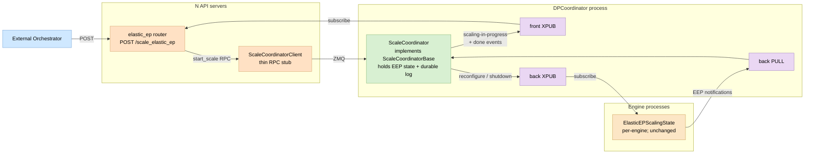

# RFC #42515 — clarifying questions and architecture proposal

Reference: [vllm-project/vllm#42515](https://github.com/vllm-project/vllm/issues/42515).

## Section 1 — Scope & compatibility

**Q1-1 (LB modes)**: The current block at [`vllm/config/parallel.py:743-748`](https://github.com/vllm-project/vllm/blob/main/vllm/config/parallel.py#L743-L748) rejects both `data_parallel_external_lb` and `data_parallel_hybrid_lb` for EEP. The RFC's Compatibility section mentions only `data_parallel_external_lb=True`. Is `data_parallel_hybrid_lb` in scope, explicitly out of scope, or deferred?

**Q1-2 (DP backend)**: The Ray-only assertion at [`vllm/v1/engine/core_client.py:1491-1493`](https://github.com/vllm-project/vllm/blob/main/vllm/v1/engine/core_client.py#L1491-L1493) blocks all non-Ray DP backends from EEP scaling. Does the new external-LB path require `data_parallel_backend == "ray"`, or does it support `"mp"`? If both, how is the assertion narrowed?

**Q1-3 (long-term support matrix)**: After the external path lands, both the Ray/internal-LB path and the external-LB path coexist. What is the official support matrix for `(enable_elastic_ep, data_parallel_backend, data_parallel_*_lb)`? Is either path planned for deprecation, or are they peers?

**Q1-4 (engine-side state)**: For confirmation: the engine-side state machine `ElasticEPScalingState` at [`vllm/distributed/elastic_ep/elastic_state.py:33-49`](https://github.com/vllm-project/vllm/blob/main/vllm/distributed/elastic_ep/elastic_state.py#L33-L49), constructed inside engine cores at [`vllm/v1/engine/core.py:1821-1830`](https://github.com/vllm-project/vllm/blob/main/vllm/v1/engine/core.py#L1821-L1830) and [`vllm/v1/engine/core.py:1890-1899`](https://github.com/vllm-project/vllm/blob/main/vllm/v1/engine/core.py#L1890-L1899), is independent of LB mode and DP backend. Both paths share it. Correct?

## Section 2 — Where the EEP coordinator lives

The RFC's diagram puts the `External EEP Scale Coordinator` inside the API server. Three options have come up in discussion:

- Option A: in the API server (RFC as drawn).
- Option B: inside the existing `DPCoordinator` process ([`vllm/v1/engine/coordinator.py:23-138`](https://github.com/vllm-project/vllm/blob/main/vllm/v1/engine/coordinator.py#L23-L138)). Picking this option also unlocks broadcasting reconfig / shutdown commands to engines via the existing back XPUB ([`vllm/v1/engine/coordinator.py:227-229`](https://github.com/vllm-project/vllm/blob/main/vllm/v1/engine/coordinator.py#L227-L229)) instead of per-API-server utility RPCs.
- Option C: in a new dedicated process.

## Section 3 — Consistency contract with the external orchestrator

The RFC's external path uses the orchestrator to (a) launch new ranks, (b) remove old ranks, and (c) trigger scale via `POST /scale_elastic_ep` on existing API servers. But it doesn't specify what consistency guarantees the orchestrator owns vs. what vLLM owns.

### Q3-1 (cross-rank fan-out and partial failure)

**Today** (Ray / internal LB, with `data_parallel_external_lb=False` enforced at [`vllm/config/parallel.py:743-748`](https://github.com/vllm-project/vllm/blob/main/vllm/config/parallel.py#L743-L748)): there is only **one** API server, so cross-rank fan-out doesn't exist at the HTTP layer. The orchestrator (or user) calls `POST /scale_elastic_ep` once on that single API server, and inside [`DPLBAsyncMPClient._scale_up_elastic_ep`](https://github.com/vllm-project/vllm/blob/main/vllm/v1/engine/core_client.py#L1542-L1633) (or [`_scale_down_elastic_ep`](https://github.com/vllm-project/vllm/blob/main/vllm/v1/engine/core_client.py#L1635-L1696)) the client itself fans out the `reinitialize_distributed` utility RPC to every engine by iterating over `self.core_engines` at [`vllm/v1/engine/core_client.py:1559-1573`](https://github.com/vllm-project/vllm/blob/main/vllm/v1/engine/core_client.py#L1559-L1573). This works because that one client has a direct ZMQ wire to every engine.

The internal fan-out uses `await asyncio.gather(*reconfig_futures)` at [`vllm/v1/engine/core_client.py:1587`](https://github.com/vllm-project/vllm/blob/main/vllm/v1/engine/core_client.py#L1587) (scale-up) and [`vllm/v1/engine/core_client.py:1679`](https://github.com/vllm-project/vllm/blob/main/vllm/v1/engine/core_client.py#L1679) (scale-down). If any one utility RPC raises, `gather` propagates and the HTTP handler's `try/except` at [`vllm/entrypoints/serve/elastic_ep/api_router.py:70-85`](https://github.com/vllm-project/vllm/blob/main/vllm/entrypoints/serve/elastic_ep/api_router.py#L70-L85) returns 500. There is **no explicit rollback** of engines that have already moved past `WAIT_NEW_CORE_ENGINES_INIT` — engines are left in whatever state they reached, and the engine-side `_staged_barrier` timeouts at [`vllm/distributed/elastic_ep/elastic_state.py:182-225`](https://github.com/vllm-project/vllm/blob/main/vllm/distributed/elastic_ep/elastic_state.py#L182-L225) are the only safety net.

**Note — that safety net is incomplete in both single- and multi-API-server topologies.** `_staged_barrier`'s timeout is designed for intra-scale skew (engines receiving the reconfig within a few seconds of each other), not for engines that fail to receive it at all. Concretely:

- The first call to `_staged_barrier` uses a 5-second timeout; on timeout it sets `sync_key` and returns False so the engine retries next busy-loop iteration.
- The second call sees `sync_key` set and uses `timeout = None`, so it waits **indefinitely** at the TCPStore barrier.
- The `WAIT_NEW_CORE_ENGINES_INIT` and `WAIT_NEW_CORE_ENGINES_WEIGHTS_INIT` states at [`vllm/distributed/elastic_ep/elastic_state.py:231-232`](https://github.com/vllm-project/vllm/blob/main/vllm/distributed/elastic_ep/elastic_state.py#L231-L232) have no timeout at all; engines park there until the coordinator's `eep_handle_engine_core_notification` utility RPC arrives.

So if one engine's `reinitialize_distributed` RPC fails or the coordinator dies mid-fan-out, every other engine that has already entered scaling state hangs forever. The HTTP 500 surfaces the failure to the operator but does not unblock the engines; the only remedy is killing them. This is workable today only because the single-API-server topology has a small failure surface — one process, one orchestrator call, Ray actor supervision. A multi-API-server external-LB topology has more failure surfaces (each API server, the orchestrator, the network between them), making the hang more likely and "kill and restart everything" a less tolerable recovery path.

**Question**: With multiple API servers and orchestrator-driven fan-out, what is the contract when some `/scale_elastic_ep` calls return 5xx and others return 200? Is the orchestrator expected to drive cluster-wide rollback, and does the RFC plan to add a coordinator-side timeout or engine-side abort-on-silence so engines can recover without operator intervention?

### Q3-2 (cross-rank consensus barrier)

**Today**: The barrier owner is `DPLBAsyncMPClient` in the single API server. Every engine pushes EEP notifications on its PUSH socket, and they all land on the single API server's PULL socket. The handler [`eep_process_engine_core_notification`](https://github.com/vllm-project/vllm/blob/main/vllm/v1/engine/core_client.py#L1399-L1458) accumulates notifications in `cache.pending_notifications` and fires the consensus fan-out only after the expected count is reached:

```python
# vllm/v1/engine/core_client.py:1430-1452
cache.pending_notifications[notification_type].add(dp_rank)
if len(cache.pending_notifications[notification_type]) >= abs(
    cache.num_new_core_engines
):
    if notification_type == EEPNotificationType.SHUTDOWN_COMPLETE:
        ...
    else:
        await asyncio.gather(
            *[
                self._call_utility_async(
                    "eep_handle_engine_core_notification",
                    notification_type,
                    engine=engine,
                )
                for engine in cache.existing_core_engines
            ]
        )
```

The engine-side wait for that consensus is the `WAIT_NEW_CORE_ENGINES_INIT` / `WAIT_NEW_CORE_ENGINES_WEIGHTS_INIT` states in [`vllm/distributed/elastic_ep/elastic_state.py:33-49`](https://github.com/vllm-project/vllm/blob/main/vllm/distributed/elastic_ep/elastic_state.py#L33-L49), released by the API server's fan-out via [`vllm/distributed/elastic_ep/elastic_state.py:438-450`](https://github.com/vllm-project/vllm/blob/main/vllm/distributed/elastic_ep/elastic_state.py#L438-L450). This works because the single client has bidirectional wires (PULL for collecting, ROUTER for fan-out) to every engine.

**Question for external LB**: Who owns this barrier?

- Q3-2a: The orchestrator (polling each API server)?
- Q3-2b: vLLM internally (DPCoordinator or equivalent)?
- Q3-2c: A hybrid?

### Q3-3 (503 gate)

**Today**: `_scaling_elastic_ep` at [`vllm/entrypoints/serve/elastic_ep/middleware.py:10`](https://github.com/vllm-project/vllm/blob/main/vllm/entrypoints/serve/elastic_ep/middleware.py#L10) is a module-level Python bool in the single API server. It is set at [`api_router.py:68`](https://github.com/vllm-project/vllm/blob/main/vllm/entrypoints/serve/elastic_ep/api_router.py#L68) and cleared at [`api_router.py:87`](https://github.com/vllm-project/vllm/blob/main/vllm/entrypoints/serve/elastic_ep/api_router.py#L87). Because the `data_parallel_external_lb` block at [`vllm/config/parallel.py:743-748`](https://github.com/vllm-project/vllm/blob/main/vllm/config/parallel.py#L743-L748) guarantees there is exactly one API server, this local flag *is* the cluster-wide state — there is no propagation problem to solve.

**Question for external LB**: In external LB with one API server per rank, how is "currently scaling" propagated to all API servers?

- Q3-3a: Orchestrator-driven (orchestrator calls all of them, accepting the consistency cost)?
- Q3-3b: vLLM-internal broadcast (e.g., DPCoordinator's front XPUB)?
- Q3-3c: Out of scope — the orchestrator must remove ranks from its external LB before scaling, so this gate is unnecessary?

## Section 4 — Cross-rank notification channels

Background: there are three different "ready" messages in the code, with different fan-out requirements:

- Ready #1: HELLO/READY on the dedicated handshake socket ([`vllm/v1/engine/core.py:990-1016`](https://github.com/vllm-project/vllm/blob/main/vllm/v1/engine/core.py#L990-L1016)). Per-engine, local to its colocated API server / launcher.
- Ready #2: First message on long-lived input DEALER, registers identity + syncs config ([`vllm/v1/engine/core.py:1406-1417`](https://github.com/vllm-project/vllm/blob/main/vllm/v1/engine/core.py#L1406-L1417), consumer at [`vllm/v1/engine/core_client.py:667-689`](https://github.com/vllm-project/vllm/blob/main/vllm/v1/engine/core_client.py#L667-L689)). Per-engine, local to its colocated API server.
- Ready #3: EEP notifications (`NEW_CORE_ENGINES_INIT_READY`, etc.) on PUSH socket ([`vllm/v1/engine/core.py:1836-1874`](https://github.com/vllm-project/vllm/blob/main/vllm/v1/engine/core.py#L1836-L1874)). Per-rank delivery to a local API server's PULL still works fine in external LB. What does **not** survive is the **cross-rank aggregation + fan-out** that happens once the notifications arrive: today a single `DPLBAsyncMPClient` (a) collects from every engine via one PULL socket and (b) broadcasts the consensus back to every engine via one ROUTER socket ([`vllm/v1/engine/core_client.py:1443-1452`](https://github.com/vllm-project/vllm/blob/main/vllm/v1/engine/core_client.py#L1443-L1452)). In external LB each `DPAsyncMPClient` only has wires to its own colocated engine, so neither half of that aggregation has a substrate. That is the part of Ready #3 that needs a new design.

**Q4-1 (Ready #3 aggregation)**: In external LB, where does each new engine's `NEW_CORE_ENGINES_INIT_READY` and `NEW_CORE_ENGINES_WEIGHTS_INIT_READY` get aggregated, and from there fanned out to existing engines?

- Q4-1a: A new dedicated channel — the RFC's "temporary handshake path" that rank 0 publishes.
- Q4-1b: Existing DPCoordinator back PULL ([`vllm/v1/engine/coordinator.py:221-223`](https://github.com/vllm-project/vllm/blob/main/vllm/v1/engine/coordinator.py#L221-L223)) for collection + back XPUB ([`vllm/v1/engine/coordinator.py:227-229`](https://github.com/vllm-project/vllm/blob/main/vllm/v1/engine/coordinator.py#L227-L229)) for fan-out, reusing the sockets that today carry `wave_complete` and `START_DP_WAVE`.
- Q4-1c: Forwarded to the orchestrator via HTTP, which then notifies existing API servers (and through them, existing engines).

*(Engine-control command transport is a downstream consequence of Section 2's location decision, not an independent open question. If the coordinator stays in the API server, per-API-server utility RPC over the input ROUTER (today's mechanism) is the obvious extension; if it moves into DPCoordinator, broadcasting on the existing back XPUB becomes natural.)*

**Q4-2 (`RECONFIGURE_FINISHED` consensus)**: Today this is emitted by engine-0 of the existing group ([`vllm/distributed/elastic_ep/elastic_state.py:531-535`](https://github.com/vllm-project/vllm/blob/main/vllm/distributed/elastic_ep/elastic_state.py#L531-L535)) and resolves a future on the leader's client ([`vllm/v1/engine/core_client.py:1412-1422`](https://github.com/vllm-project/vllm/blob/main/vllm/v1/engine/core_client.py#L1412-L1422)). In external LB, where does this signal terminate, and how is the orchestrator notified that the scale completed?

## Section 5 — State durability & failure recovery

### Q5-1 (durable transition log)

**Today**: The EEP transition state is **entirely in-memory**, inside the single API server's `DPLBAsyncMPClient`. Specifically:

- The `ElasticScalingCache` defined at [`vllm/v1/engine/core_client.py:453-457`](https://github.com/vllm-project/vllm/blob/main/vllm/v1/engine/core_client.py#L453-L457) holds `existing_core_engines`, `num_new_core_engines`, and `pending_notifications` per type.
- It's assigned to `self.eep_scaling_cache` at [`vllm/v1/engine/core_client.py:1549-1553`](https://github.com/vllm-project/vllm/blob/main/vllm/v1/engine/core_client.py#L1549-L1553) (scale-up) and [`vllm/v1/engine/core_client.py:1642-1646`](https://github.com/vllm-project/vllm/blob/main/vllm/v1/engine/core_client.py#L1642-L1646) (scale-down), and cleared on terminal notifications at [`vllm/v1/engine/core_client.py:1454-1458`](https://github.com/vllm-project/vllm/blob/main/vllm/v1/engine/core_client.py#L1454-L1458).
- The TCPStore created in [`_setup_elastic_ep_reconfig_bootstrap`](https://github.com/vllm-project/vllm/blob/main/vllm/v1/engine/core_client.py#L1520-L1540) **exists but is not used for EEP state persistence** — it's used only as the rendezvous store for the new DP group's barriers in `_staged_barrier` (writing keys like `arrival_<barrier>_<rank>` at [`vllm/distributed/elastic_ep/elastic_state.py:152-180`](https://github.com/vllm-project/vllm/blob/main/vllm/distributed/elastic_ep/elastic_state.py#L152-L180)).
- If the API server restarts during a scale, all EEP transition state is lost; nothing on disk or in the TCPStore captures "which engines have reported which notifications".

**Question**: Should EEP transition state be persisted? The bootstrap TCPStore is cluster-wide and already exists; it's the natural candidate. Is this in scope for v1?

### Q5-2 (coordinator crash recovery)

**Today**: There is **no crash-recovery mechanism**. The relevant chain:

- Engines park in `WAIT_NEW_CORE_ENGINES_INIT` or `WAIT_NEW_CORE_ENGINES_WEIGHTS_INIT` states ([`vllm/distributed/elastic_ep/elastic_state.py:33-49`](https://github.com/vllm-project/vllm/blob/main/vllm/distributed/elastic_ep/elastic_state.py#L33-L49)), and these states have **no timeout**:

```python
# vllm/distributed/elastic_ep/elastic_state.py:231-232
if state == ScaleUpExistingEngineState.WAIT_NEW_CORE_ENGINES_INIT:
    return False
```

- The engine busy loop just keeps calling `eep_scaling_state.progress()` (which returns `False`) indefinitely:

```python
# vllm/v1/engine/core.py:1732-1738
if self.eep_scaling_state is not None:
    _ = self.eep_scaling_state.progress()
    if self.eep_scaling_state.is_complete():
        if self.eep_scaling_state.worker_type == "removing":
            raise SystemExit
        self.process_input_queue_block = True
        self.eep_scaling_state = None
```

- The only way the engine advances out of `WAIT_NEW_CORE_ENGINES_INIT` is via [`ElasticEPScalingState.handle_notification`](https://github.com/vllm-project/vllm/blob/main/vllm/distributed/elastic_ep/elastic_state.py#L435-L450), which is invoked by the API server's utility RPC `eep_handle_engine_core_notification`.
- If the API server (coordinator) dies, that utility RPC is never sent, and the engine waits **forever** in the WAIT state.
- In the Ray-managed path, the API server crashing also tears down its Ray actor parent relationship; new actors may be cleaned up but the in-flight scale state is just lost. There is no defined rollback to the old setup.

**Question**: If the coordinator process dies between `CREATE_STANDBY_GROUPS` and `SWITCH_AND_PREPARE` ([`vllm/distributed/elastic_ep/elastic_state.py:33-42`](https://github.com/vllm-project/vllm/blob/main/vllm/distributed/elastic_ep/elastic_state.py#L33-L42)), engines are partway through reconfig. What is the recovery procedure?

- Q5-2a: Rollback to old setup.
- Q5-2b: Resume from the durable log (requires Q5-1).
- Q5-2c: Self-terminate engines and rely on orchestrator to restart from scratch.

### Q5-3 (engine self-defense)

**Today**: The only timeout-based safety net is `_staged_barrier` at [`vllm/distributed/elastic_ep/elastic_state.py:182-225`](https://github.com/vllm-project/vllm/blob/main/vllm/distributed/elastic_ep/elastic_state.py#L182-L225), and its docstring makes clear it's designed for **a different scenario**:

```python
# vllm/distributed/elastic_ep/elastic_state.py:183-198
"""
Execute a two-staged barrier to synchronize all engines in the DP group.

Some DP EngineCores may receive the reconfiguration notifications
later than others, and already proceed to engine step (model forward)
in the busy loop.
In this case, EngineCores that already proceed to reconfiguration
should skip reconfiguration and execute model forward for one more
step, so in the next step, all EngineCores will be synchronized.
We use a two-staged barrier to achieve this. The first time each
EngineCore executes the barrier, if a timeout is reached before the
barrier completes, that means some EngineCores have already entered
engine step. The EngineCores that timed out will then proceed to
engine step, and will synchronize with the other EngineCores in the
next step with a barrier without timeout.
"""
```

So `_staged_barrier`'s timeout addresses **intra-scale skew** between engines (engines receiving the reconfig notification at slightly different times), **not** coordinator crashes. After the first timeout, the engine actually *waits without a timeout* on the second pass, which means a coordinator crash mid-barrier would still hang.

There is **no** coordinator heartbeat, **no** engine-side watchdog for "coordinator silent for X seconds, abort", and **no** mechanism for an engine to give up and roll back independently.

**Question**: Should there be a coordinator-heartbeat or engine-side abort-on-silence mechanism? Or is "operator kills stuck engines" the documented recovery model?

## Architecture proposal (opinion)

(This section is opinion, clearly labelled. The questions above stand independently of this proposal.)

We recommend pursuing the following end-state in stages, each landable as an independent PR.



Why this shape:

- The engine-side state machine doesn't change.
- All cross-rank fan-out reuses `DPCoordinator`'s existing XPUB+PULL channels — no new "temporary handshake path" needed.
- The API server's role shrinks to a thin RPC client; there is no single API server with privileged state.
- Internal-LB and external-LB paths collapse into one implementation parameterized by `parallel_config`.

Staging:

- **Stage A** — introduce `ScaleCoordinatorBase` and migrate the current `DPLBAsyncMPClient` scale logic ([`vllm/v1/engine/core_client.py:1542-1696`](https://github.com/vllm-project/vllm/blob/main/vllm/v1/engine/core_client.py#L1542-L1696)) behind it. Pure refactor, no behavior change.
- **Stage B** — relocate the implementation into the `DPCoordinator` process. API servers communicate with it through a small RPC interface over an existing or new ZMQ channel. With the channels already in place, this is mostly a "move file + add message dispatch" change.
- **Stage C** — lift the `NotImplementedError` at [`vllm/config/parallel.py:743-748`](https://github.com/vllm-project/vllm/blob/main/vllm/config/parallel.py#L743-L748) and the Ray-only assertion at [`vllm/v1/engine/core_client.py:1491-1493`](https://github.com/vllm-project/vllm/blob/main/vllm/v1/engine/core_client.py#L1491-L1493). External-LB EEP becomes a parameterization of the existing implementation. This is the RFC's actual value, but on a much smaller footprint.
- **Stage D** (opt-in, deferred) — decouple `DPCoordinator` from API-server lifecycle (drop `daemon=True` at [`vllm/v1/engine/coordinator.py:118`](https://github.com/vllm-project/vllm/blob/main/vllm/v1/engine/coordinator.py#L118)), add state persistence to TCPStore for resume, and only then consider HA / leader election.

Open question to discuss before Stage A lands: whether to host the coordinator inside `DPCoordinator` (proposal above) vs. inside a new dedicated process. We recommend `DPCoordinator` because the channels match, with code-level isolation that keeps a future split cheap.

## Open question we explicitly punt to discussion

The deepest open question, on which everything else depends, is **Q3-2 (cross-rank consensus ownership)**: does vLLM internally guarantee EEP barriers, or does the orchestrator? Both are legitimate. The RFC should pick one and document the contract. The proposal above assumes vLLM owns the barriers; if instead the orchestrator owns them, the picture changes significantly — DPCoordinator's role for EEP shrinks, and the orchestrator becomes a first-class implementer of the state machine.

---

All factual claims grounded in the cited file paths and RFC text. All recommendations and ranked options labelled as opinion.
